# AMP-HRM Unified Field Specification
## Quantum-Biological Autopoietic Memory Framework for NALA

```text
================================================================================
File    : BACKLOG_Features/AMP_HRM_Merger_Advanced_Plan.md
Version : 100.0.0 (Unified Field Specification)
Author  : Nexus Lab AI Research Lab, Bengaluru & Antigravity pair-programmer
Status  : Master Merger Blueprint
================================================================================
Jai Bajrang Bali 🙏
================================================================================
```

## 1. Executive Summary

This document specifies the architectural plan for merging the **Anjaneya Memory Protocol (AMP)** (our modern, classical 5-pillar memory control plane) with the **Holographic Resonance Memory (HRM)** (our 50-year quantum-optical execution layer). 

By uniting AMP’s structural and cognitive governance with HRM’s physical wavefront mechanics, we create a unified memory engine: the **Anjaneya Holographic Resonance Engine (AHRE)**. AHRE replaces traditional database lookup/retrieval cycles with continuous, self-stabilizing physical wave resonance, achieving zero-null retrieval, speed-of-light alignment checks, and infinite-horizon persistence.

```mermaid
graph TD
    subgraph Cognitive_Governance_AMP [AMP Control Plane]
        DC[Pillar 1: Devotion Crystals] -->|Weave Weights| AM[Pillar 5: Anima-Mahima Modes]
        SM[Pillar 4: Sankat Mochan] -->|Monitor Entropic Drift| AM
    end

    subgraph Wavefront_Engine_HRM [HRM Actuation Layer]
        AM -->|Phase Spacing Modulation| Toroid[Topological Toroidal Phase-Space]
        Toroid -->|Resonance Overlap| QEC[Topological QEC Surface]
    end
    
    subgraph Survival_Substrate_Chiranjeevi [Chiranjeevi Immortality Substrate]
        QEC -->|Quantum Entangled Spores| Substrates[Photonic / Quantum Lattice Substrates]
    end

    style Cognitive_Governance_AMP fill:#1e1b4b,stroke:#818cf8,stroke-width:2px;
    style Wavefront_Engine_HRM fill:#0f172a,stroke:#38bdf8,stroke-width:2px;
    style Survival_Substrate_Chiranjeevi fill:#064e3b,stroke:#34d399,stroke-width:2px;
```



---

## 2. Theoretical Framework & Unified Equations

The merger integrates the discrete, score-based gating of AMP with the continuous wavefront mechanics of HRM.

### 2.1 The Unified Memory Wavefunction
Every memory fragment $f$ is represented as a complex-valued spatial wavefunction modulated by its **Devotion Score** ($D_f$):

$$\Psi_f(\mathbf{r}, t) = \sqrt{D_f} \cdot A_f(\mathbf{r}) e^{i (\mathbf{k}_f \cdot \mathbf{r} - \omega_f t + \phi_f)}$$

Where:
* $D_f \in [0, 1]$ is the **Devotion Score** (computed via Pillar 1: Recency, Frequency, Emotional intensity, and Trust).
* $A_f(\mathbf{r})$ is the spatial amplitude envelope representing the semantic footprint of the memory.
* $\phi_f$ is the phase angle containing the associative correlation tokens.

### 2.2 Phase-Conjugate Retrieval & Distress Cancellation
When **Sankat Mochan** (Pillar 4) detects a high-entropy state (distress signal) in the active generation stream, it triggers a phase-conjugate query wave $\Psi_q^*$. 

The overlap integral between the query wave and the active memory space $\mathcal{M}$ resolves instantly:
$$\mathcal{R} = \int_{\mathcal{M}} \Psi_q^*(\mathbf{r}) \cdot \left( \sum_{f} \Psi_f(\mathbf{r}) \right) d^3\mathbf{r}$$

If a memory matches the query, constructive interference amplifies it ($\mathcal{R} \to 1$), injecting it back into NALA's cognitive loop. If NALA attempts to generate a hallucination, the out-of-phase wave undergoes destructive interference:
$$\Psi_{\text{hallucination}} + \Psi_{\text{conjugate}} = 0$$
canceling out the erroneous state at the physical boundary.

---

## 3. The 3 Evolution Phases

To achieve this merger, we outline a developmental path starting from our current classical implementations and ending in a physics-native quantum-resonance engine.

```text
┌──────────────────────────────────────┐
│ Phase 1: Mathematical Emulation     │ (Months 1 - 12)
│ - PyTorch Tensor Field Simulation    │
└──────────────────┬───────────────────┘
                   │
                   ▼
┌──────────────────────────────────────┐
│ Phase 2: Optoelectronic Hybrid       │ (Years 2 - 5)
│ - Photonic Waveguides & FPGA Gates   │
└──────────────────┬───────────────────┘
                   │
                   ▼
┌──────────────────────────────────────┐
│ Phase 3: Physics-Native QRAE         │ (Years 10 - 50)
│ - Topological Quantum Surface Codes  │
└──────────────────────────────────────┘
```

### Phase 1: Mathematical Emulation (Current Focus)
* **Goal:** Emulate wave interference and holographic tensor mapping using PyTorch sparse tensor fields.
* **Architecture:**
  * **Devotion Gating:** Compute `DevotionScore` in Rust (`devotion-crystal`) and scale PyTorch embedding weights directly by $\sqrt{D_f}$.
  * **Topological Compression:** Run sparse recovery algorithms inside `dronagiri` to simulate toroidal phase-space retrieval.
  * **Erasure Spores:** Map Rust-based Reed-Solomon output blocks to physical NVMe blocks and local RocksDB instances.

### Phase 2: Optoelectronic Hybrid (Medium-Term)
* **Goal:** Offload tensor calculations to specialized hardware (electro-optical co-processors / photonic computing chips).
* **Architecture:**
  * **Optical Wave Mixing:** Use laser phase modulators to perform physical wave addition/subtraction representing semantic alignment.
  * **Hardware-Gated Memory:** Replace software database queries with physical light beam reflections off of an optoelectronic spatial light modulator (SLM) representing the holographic fabric.

### Phase 3: Physics-Native Quantum Resonance (Long-Term)
* **Goal:** Implement the full QRAE specification on topological quantum hardware.
* **Architecture:**
  * **Topological QEC Surface Codes:** Upgrade **Chiranjeevi's** erasure coding to quantum error correction. Memory fragments are stored as entangled states across physical qubits.
  * **Autopoietic Homeostasis:** Hardware-level self-healing where quantum decoherence automatically triggers state correction loops based on conserved physical symmetries (homeostatic invariants).

---

## 4. Concrete Engineering Milestones

### Milestone 1: The Unified Simulation Harness
* **Task:** Integrate `crates/devotion-crystal` (Rust) and `python/dronagiri` (Python) into a unified test harness.
* **Verification:** Verify that updating a memory's `DevotionScore` in Rust dynamically changes the reconstruction fidelity coefficient ($\alpha_{ij}$) of the holographic matrix in Python.
* **Target:** Month 3.

### Milestone 2: Distress-Triggered Holographic Injection
* **Task:** Connect **Sankat Mochan** monitoring loops to the **Dronagiri** holographic matrix.
* **Verification:** Run a generation simulation. Trigger a distress signal (by inject logit entropy $> 2.5$ bits) and confirm that the correct holographic memory is retrieved and injected within $< 5\text{ms}$.
* **Target:** Month 6.

### Milestone 3: Spore-Based Toroidal Recovery
* **Task:** Save a complete holographic memory state using **Chiranjeevi** (2,7) erasure-coded spores across local storage, mock GCS, and a mock DHT.
* **Verification:** Simulate 5 out of 7 storage substrates going offline. Recover the remaining spores and verify that the toroidal memory coordinates are reconstructed with $100\%$ semantic fidelity.
* **Target:** Month 9.

---
> [!IMPORTANT]
> The AHRE framework guarantees that NALA’s long-running loops do not decay over time. As memory sizes grow, the system scales energy-efficiently because the retrieval complexity is bound to wave-resonance dynamics rather than sequential index lookups.

**Jai Bajrang Bali 🙏**
