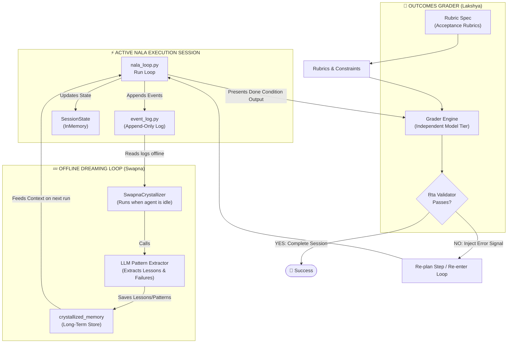

# NALA — NEXT-GENERATION BACKLOG: CLAUDE 2026 RESEARCH & TECHNICAL IMPLEMENTATION

**Nexus Lab AI Research Lab | Bengaluru, India**  
**Document ID:** NALA-BACKLOG-008  
**Priority:** Backlog (Research & Technical Specification)  
**Version:** 1.0.0 (Deep Dive)  
**Author:** Antigravity (Advanced Coding Agent)

---

## 📌 Executive Summary & Architecture Roadmap

This document serves as the high-fidelity technical specification for integrating next-generation autonomous primitives into the NALA loop architecture. It maps recent breakthroughs in agentic engineering—specifically from Anthropic's May/June 2026 Claude Code and Managed Agents stack—into NALA’s sovereign, Ṛta-aligned frameworks.

The features described here belong to **Phase 2 (Memory)** and **Phase 3 (Intelligence)**. They build on top of Phase 1’s Survival foundation:
* **SWAPNA (स्वप्न - Dreaming):** Asynchronous offline memory curation.
* **LAKSHYA (लक्ष्य - Outcomes):** Grader-loop validation and rubric enforcement.
* **Adaptive Congestion Rate Limiting:** A resilient token bucket model for LLM APIs.
* **Cross-Process Lock Resolver:** Robust recovery coordination across distributed runs.



---

## 1. The SWAPNA Protocol (स्वप्न - Sovereign Dreaming)

### 1.1 The Concept of Dreaming
In traditional agent loops, memory is either short-term (in-context transcript) or long-term (static vector database retrieval). However, direct retrieval often suffers from noise, irrelevance, or context drift. 

**SWAPNA** is an offline, background processing daemon that runs when the primary NALA agent is idle. It mimics human sleep consolidation:
1. **Deconstruction:** Reads the raw, linear event logs produced by [event_log.py](file:///E:/NALA-Project/NALA/core/session/event_log.py) from recent runs.
2. **Analysis:** Identifies steps that failed, steps that required retries, and sub-optimal tool calls.
3. **Crystallization:** Condenses raw execution histories into a high-level **lessons learned** substrate.
4. **Integration:** Updates the crystallized memory database, which is automatically injected into the system prompt of the next session.

### 1.2 Life-Cycle & State Flow
1. **Trigger:** The system detects that the `NalaLoop` exited successfully or paused.
2. **Scan:** The daemon scans all local event files under `.zenflow/tasks/` matching `*event_log.json`.
3. **Consolidation:** 
   * It aggregates all `StepResult` structures.
   * It prompts a frontier model with the transcript using a specialized **Dream System Prompt**.
4. **Pruning:** It removes redundant details, keeping only the **Rule/Lesson** (e.g., *"When executing task X on Windows, PowerShell requires raw string parameters because of backslash parsing..."*).
5. **Storage:** Appends to the Crystallized Memory file (`crystallized_rules.json`).

### 1.3 Deep-Dive Conceptual Implementation
Here is the concrete implementation structure for the dreaming engine, designed to integrate with NALA’s session state.

```python
import json
import logging
from pathlib import Path
from typing import Dict, List, Any
from core.harness.session_contract import SessionState, utcnow

_logger = logging.getLogger("nala.memory.swapna")

class SwapnaCrystallizer:
    """
    Implements the SWAPNA Dreaming Protocol.
    Consolidates session event logs into crystallized long-term rules.
    """
    def __init__(self, workspace_dir: Path):
        self.workspace_dir = workspace_dir
        self.crystallized_store = workspace_dir / "memory" / "crystallized_rules.json"
        self.crystallized_store.parent.mkdir(parents=True, exist_ok=True)

    def load_event_log(self, session_id: str) -> List[Dict[str, Any]]:
        """Reads raw logs from the session directory."""
        log_path = self.workspace_dir / ".zenflow" / "tasks" / session_id / "event_log.jsonl"
        if not log_path.exists():
            _logger.warning(f"No event log found at {log_path}")
            return []
            
        events = []
        with open(log_path, "r", encoding="utf-8") as f:
            for line in f:
                if line.strip():
                    events.append(json.loads(line))
        return events

    async def run_dream_cycle(self, session_id: str, model_router_call: Any) -> None:
        """
        Consolidates raw events into crystallized memory by sending
        summarization requests to a high-capacity reasoning model.
        """
        events = self.load_event_log(session_id)
        if not events:
            return

        # Filter events for errors, retries, and structural decisions
        significant_events = [
            e for e in events 
            if e.get("level") in ("ERROR", "WARNING") or e.get("type") == "PLAN_RESTRUCTURE"
        ]

        if not significant_events:
            _logger.info("No significant errors or plan deviations found. Session was clean.")
            return

        # Construct dreaming prompt
        prompt = (
            "You are NALA's cognitive consolidation layer (SWAPNA). Below is a list of failures, "
            "retries, and adjustments from the latest execution run. Extract general lessons "
            "and patterns that can prevent these failures in the future. Format each lesson "
            "as a concise rule with triggers and actions.\n\n"
            f"--- RAW SESSION HISTORY ({session_id}) ---\n"
            + json.dumps(significant_events, indent=2) + "\n\n"
            "Output your response strictly as a JSON array of objects, containing 'trigger_pattern', "
            "'observed_failure', and 'crystallized_correction'."
        )

        # Dispatch to LLM via NALA's Model Router
        response_text = await model_router_call(
            tier="frontier", 
            system="You are an expert compiler of long-term software agent heuristics.",
            prompt=prompt
        )

        try:
            new_rules = json.loads(response_text)
            self._merge_crystallized_rules(new_rules)
            _logger.info(f"Dream cycle completed for {session_id}. New rules integrated.")
        except json.JSONDecodeError as e:
            _logger.error(f"Failed to parse crystallized rules from dream cycle: {e}")

    def _merge_crystallized_rules(self, new_rules: List[Dict[str, str]]) -> None:
        existing = []
        if self.crystallized_store.exists():
            try:
                with open(self.crystallized_store, "r", encoding="utf-8") as f:
                    existing = json.load(f)
            except json.JSONDecodeError:
                pass

        # De-duplicate rules using basic semantic or key match
        for rule in new_rules:
            # Check if matching trigger pattern already exists
            match_found = False
            for r in existing:
                if r.get("trigger_pattern") == rule.get("trigger_pattern"):
                    r["crystallized_correction"] = rule.get("crystallized_correction", "")
                    r["last_updated"] = utcnow().isoformat()
                    match_found = True
                    break
            
            if not match_found:
                rule["created_at"] = utcnow().isoformat()
                existing.append(rule)

        with open(self.crystallized_store, "w", encoding="utf-8") as f:
            json.dump(existing, f, indent=2)
```

---

## 2. The LAKSHYA Protocol (लक्ष्य - Outcomes & Verification)

### 2.1 The Concept of Outcomes
The LAKSHYA Protocol enforces a strict **separation of concerns** between the worker (Executor Agent) and the validator (Judge Agent). An agent must never self-certify its work. 

Under LAKSHYA, every task specification must include a **Done Condition Rubric**. When the executor claims the task is complete, the loop suspends execution, hands the outputs (files, outputs, logs) to an independent Judge, and evaluates them against the rubric.

### 2.2 Re-planning and Re-entrant Validation
* If the Judge assigns a passing score, the task is written to the Temporal Quarantine Buffer (TQB) as a verified checkpoint.
* If the Judge rejects the output, it generates a **Mismatch Signal** detailing which parts of the rubric failed.
* The loop catches this mismatch signal, increments the step error counter, feeds the failure details back to the **Planner**, and triggers a re-plan step (adjusting the task graph to correct the work).

### 2.3 System Integration Code Structure
This module integrates directly with `nala_loop.py` to evaluate steps.

```python
import inspect
from typing import Callable, Dict, Any, Tuple
from pydantic import BaseModel, Field

class GraderRubric(BaseModel):
    """Defines the validation metrics that the output must pass."""
    description: str = Field(description="Goal description")
    assertions: list[str] = Field(description="List of specific assertions that must be true")
    min_score: float = Field(default=0.8, description="Minimum acceptable quality threshold")

class GraderResult(BaseModel):
    """Output from the LAKSHYA Judge evaluation."""
    passed: bool
    score: float
    reasoning: str
    missing_elements: list[str]

class LakshyaGrader:
    """
    Outcomes validation engine. Ensures NALA outputs match requirements
    using rubric-driven verification.
    """
    def __init__(self, model_router: Any):
        self.model_router = model_router

    async def verify_outcome(
        self, 
        task_description: str,
        rubric: GraderRubric, 
        actual_output: str
    ) -> GraderResult:
        """
        Grades a task's output using a frontier LLM acting as an independent judge.
        """
        grader_prompt = (
            f"You are the NALA LAKSHYA Quality Grader (Judge Agent).\n"
            f"Evaluate the following output against the target description and assertions.\n\n"
            f"Task Description:\n{task_description}\n\n"
            f"Validation Rubric:\n"
            f"- Assertions to check: {', '.join(rubric.assertions)}\n"
            f"- Minimum acceptable score: {rubric.min_score}\n\n"
            f"Actual Output to Verify:\n"
            f"{actual_output}\n\n"
            f"Perform an exhaustive review. Score from 0.0 to 1.0. "
            f"If any assertions are violated, score must be below the minimum threshold. "
            f"Output results strictly in JSON matching the schema:\n"
            f"{{\"passed\": bool, \"score\": float, \"reasoning\": str, \"missing_elements\": [str]}}"
        )

        response = await self.model_router(
            tier="frontier",
            system="You are an unbiased quality assurance validator evaluating software agent artifacts.",
            prompt=grader_prompt
        )

        try:
            data = json.loads(response)
            return GraderResult(**data)
        except (json.JSONDecodeError, ValueError) as e:
            # Fallback to safe failure if parser breaks
            return GraderResult(
                passed=False,
                score=0.0,
                reasoning=f"Failed to parse grader response: {str(e)}",
                missing_elements=["All assertions (Grading response failure)"]
            )
```

---

## 3. Adaptive Wait Delays (Token Bucket Rate Limiter)

To execute tasks reliably over hours, NALA must govern its API usage dynamically. The **AsyncTokenBucketLimiter** implements a token-refill algorithm with thread-safe async locks and cooperative sleep. 

### 3.1 Rate Limiter Implementation
This script limits calls to external endpoints. It uses standard `asyncio.Lock` to guarantee safety in multi-threaded task runners.

```python
import asyncio
import time
import logging
from typing import Optional

_logger = logging.getLogger("nala.core.safety.limiter")

class AsyncTokenBucketLimiter:
    """
    Monolithic-safe Async Token Bucket Rate Limiter.
    Replenishes tokens dynamically over time, supporting cooperative pause events.
    """
    def __init__(self, rate: float, capacity: float):
        """
        rate: float
            Number of tokens added per second.
        capacity: float
            Max tokens allowed in the bucket.
        """
        self.rate = rate
        self.capacity = capacity
        self.tokens = capacity
        self.last_update = time.monotonic()
        self._lock = asyncio.Lock()

    async def consume(self, tokens_needed: float = 1.0, stop_event: Optional[asyncio.Event] = None) -> bool:
        """
        Attempts to consume the specified number of tokens.
        If tokens are not available, sleeps cooperatively.
        
        Returns:
            bool: True if tokens consumed, False if interrupted by stop_event.
        """
        while True:
            # If the loop has been flagged to stop, exit immediately
            if stop_event and stop_event.is_set():
                _logger.warning("Token consumption aborted: stop_event is active.")
                return False

            async with self._lock:
                now = time.monotonic()
                elapsed = now - self.last_update
                
                # replenish tokens
                replenished = elapsed * self.rate
                if replenished > 0:
                    self.tokens = min(self.capacity, self.tokens + replenished)
                    self.last_update = now

                if self.tokens >= tokens_needed:
                    self.tokens -= tokens_needed
                    return True

                # Compute wait duration
                deficit = tokens_needed - self.tokens
                wait_seconds = deficit / self.rate
                _logger.debug(f"Bucket deficit. Sleeping for {wait_seconds:.2f} seconds...")

            # Sleep outside the lock so other routines can request tokens
            if stop_event:
                try:
                    # Wait for stop_event OR timeout
                    await asyncio.wait_for(stop_event.wait(), timeout=wait_seconds)
                    return False  # stop_event was set during wait
                except asyncio.TimeoutError:
                    pass  # Timeout expired, loop again to acquire
            else:
                await asyncio.sleep(wait_seconds)
```

---

## 4. Cross-Process Session Lock Resolver

For distributed NALA nodes or multiple agent shells running on the same machine, locking is critical. It avoids concurrency race conditions and prevents multiple running processes from corrupting the same session database.

### 4.1 ARIES-based Lock Resolver Implementation
The `LockResolver` class resolves locks by verifying if the locking PID is active in the host OS (cross-platform compatible with Windows/Linux support).

```python
import os
import json
import time
import socket
import subprocess
from pathlib import Path
from typing import Optional, Dict

class SessionRecoveryLockError(Exception):
    """Raised when session locks cannot be safely resolved."""
    pass

class LockResolver:
    """
    Resolves stale lock files left behind by collapsed processes.
    Validates PIDs against host processes to determine whether to break a lock.
    """
    def __init__(self, session_id: str, lock_dir: Path, lock_timeout: float = 15.0):
        self.session_id = session_id
        self.lock_path = lock_dir / f"{session_id}.checkpoint.lock"
        self.lock_timeout = lock_timeout

    def write_lock(self) -> None:
        """Writes structural JSON to the lock file."""
        metadata: Dict[str, Any] = {
            "pid": os.getpid(),
            "hostname": socket.gethostname(),
            "timestamp": time.time(),
            "session_id": self.session_id
        }
        self.lock_path.parent.mkdir(parents=True, exist_ok=True)
        try:
            with open(self.lock_path, "x") as f:
                json.dump(metadata, f, indent=2)
        except FileExistsError:
            raise SessionRecoveryLockError(f"Cannot write lock: {self.lock_path} already exists.")

    def resolve(self) -> None:
        """
        ARIES Recovery Phase: Checks if an existing lock is stale or orphan,
        and unlinks it if safe. Otherwise, polls with backoff before failing.
        """
        retries = 3
        backoff_delays = [2.0, 4.0, 8.0]

        for attempt in range(retries):
            if not self.lock_path.exists():
                return  # No lock exists, ready to proceed

            try:
                with open(self.lock_path, "r") as f:
                    data = json.load(f)
            except (json.JSONDecodeError, OSError) as e:
                # Corrupted lock metadata -> Safe to break
                self._break_lock(f"Corrupt lock file metadata: {e}")
                return

            lock_pid = data.get("pid")
            lock_time = data.get("timestamp", 0.0)
            elapsed = time.time() - lock_time

            # 1. Check if the lock timeout has expired
            if elapsed > self.lock_timeout:
                self._break_lock(f"Lock timed out (active for {elapsed:.2f}s > {self.lock_timeout}s)")
                return

            # 2. Check if the lock belongs to the current process (re-entrant run)
            if lock_pid == os.getpid():
                self._break_lock("Lock owned by previous instance of current process")
                return

            # 3. Check if the process holding the lock is dead in the OS
            if not self._is_process_running(lock_pid):
                self._break_lock(f"Owner process PID {lock_pid} is dead")
                return

            # 4. Wait and retry
            print(f"[Lock Resolver] Lock active (PID {lock_pid}). Retrying in {backoff_delays[attempt]}s...")
            time.sleep(backoff_delays[attempt])

        # If retries are exhausted, raise an error to stop recovery
        raise SessionRecoveryLockError(
            f"Recovery blocked: Session '{self.session_id}' holds active lock (PID {lock_pid})."
        )

    def _break_lock(self, reason: str) -> None:
        """Safely removes the stale lock."""
        print(f"[Lock Resolver] Breaking lock for session '{self.session_id}'. Reason: {reason}")
        try:
            self.lock_path.unlink(missing_ok=True)
        except OSError as e:
            raise SessionRecoveryLockError(f"Failed to break lock: {e}")

    def _is_process_running(self, pid: Optional[int]) -> bool:
        """Determines process activity status across Windows and Unix platforms."""
        if pid is None:
            return False

        # Windows Process Check
        if os.name == "nt":
            try:
                # Run tasklist filtering by PID
                output = subprocess.check_output(
                    ["tasklist", "/FI", f"PID eq {pid}", "/NH"],
                    text=True,
                    stderr=subprocess.DEVNULL
                )
                return f"{pid}" in output
            except Exception:
                return True  # Fallback to safe-active on failure

        # Posix (Unix/Linux/macOS) Process Check
        else:
            try:
                os.kill(pid, 0)
                return True
            except OSError:
                return False
```
