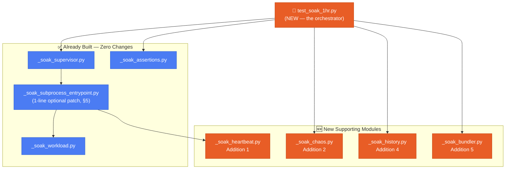
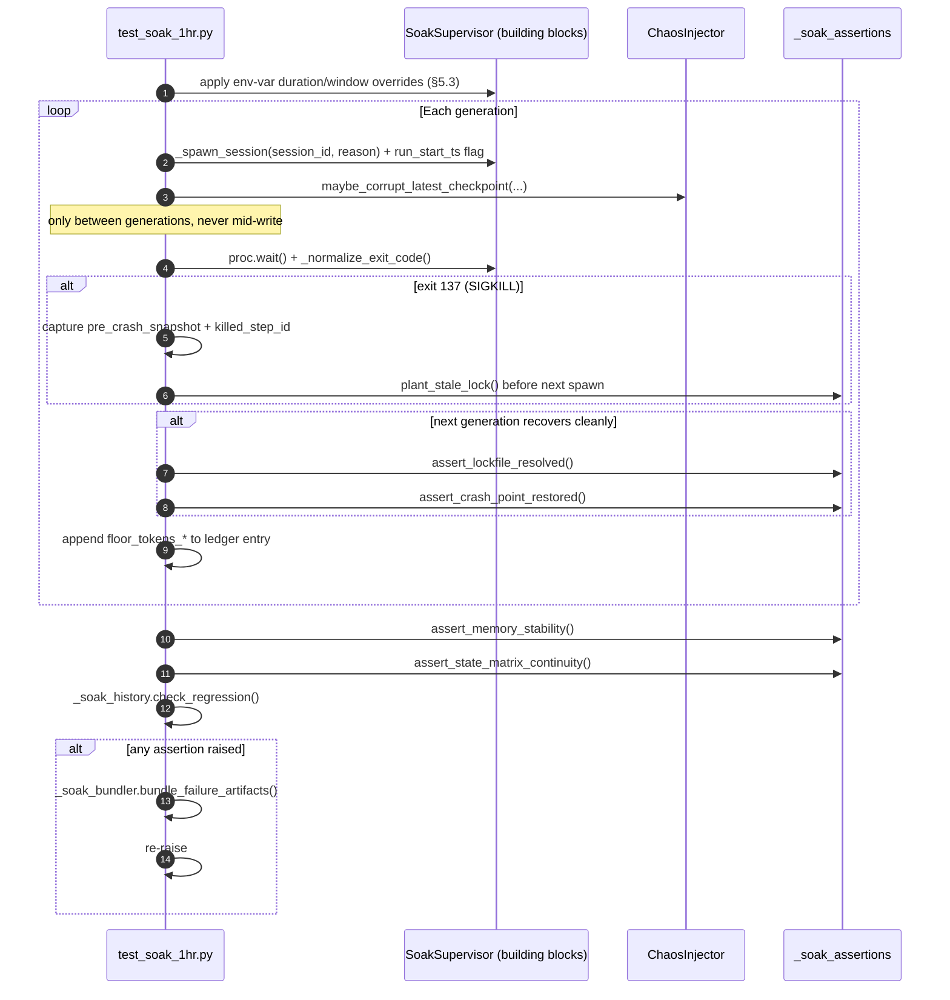

# JIRA-007-B — Advanced Soak Orchestrator
## 5 Powerful Additions to `test_soak_1hr.py`
**Nexus Lab AI Research Lab | Bengaluru, India**
**Version 1.0.0 | Builds on JIRA-007 v2.0.0**

> This document plans the final orchestrator file (`test_soak_1hr.py`) and 4 new
> supporting modules. **Zero changes** to the 4 already-completed files
> (`_soak_workload.py`, `_soak_supervisor.py`, `_soak_subprocess_entrypoint.py`,
> `_soak_assertions.py`) except one optional, backward-compatible, single-line
> patch noted explicitly in Addition 3. Everything else is additive.

---

## 1. Executive Summary

The base JIRA-007 plan proves NALA survives **one** clean 60-minute run. But
the real goal is **1-month continuous operation**. A single pass/fail number
from one run cannot tell you that: a leak is creeping in slowly across many
runs, disk corruption (not just process death) is handled correctly, or a
3am failure at 2 AM left you with 4 scattered log files to dig through by
hand. These 5 additions close that gap.

| # | Addition | Solves |
|---|---|---|
| 1 | Live Heartbeat File | "What is NALA doing *right now*?" — from your phone |
| 2 | Multi-Failure Chaos Injection | Tests disk corruption, not just process death |
| 3 | Configurable Duration | 5-minute smoke test before committing to the full hour |
| 4 | Regression History Tracking | Catches slow decay across weeks of runs |
| 5 | Auto-Bundled Failure Report | Zero manual log-hunting after an overnight failure |

---

## 2. Architecture — Where the New Pieces Sit



---

## 3. Addition 1 — Live Heartbeat File

### 3.1 Goal
Answer "what is NALA doing right now?" from your phone via Tailscale, without
tailing raw logs. A single `soak_status.json` refreshed every 30s.

### 3.2 Design — Single Writer, Zero Cross-Process Locking

The **Executor subprocess** is the sole writer (it holds the freshest live
state — current step, context status, compaction count). To let it compute
**true elapsed-since-soak-start** (not just elapsed-since-this-generation),
the supervisor passes one new CLI flag it already has the data for:

```
--run-start-ts <epoch_float>
```

Passed identically to every generation. `_soak_supervisor.py` needs **no
code change** for this — `test_soak_1hr.py`'s own orchestration loop (§9)
builds the argv list itself, appending this flag, since it already replaces
the bare `supervisor.run()` call with a thin wrapper loop for Additions 2–5.

### 3.3 Interface

```python
# tests/long_running/_soak_heartbeat.py

@dataclasses.dataclass
class HeartbeatSnapshot:
    ts:                  float
    run_start_ts:        float
    elapsed_s:            float
    elapsed_human:        str      # "14m 32s"
    session_id:           str
    generation_index:     int
    spawn_reason:         str
    phase:                int      # 1-4, resolved via PHASE_BOUNDARIES
    current_step_id:      Optional[str]
    steps_completed:      int
    steps_total:          int
    context_status:       str      # NORMAL / WARNING / COMPACTING / EXHAUSTED
    compactions_this_gen: int
    rss_mb:               float    # self-reported via psutil.Process() on own PID
    total_cost_usd:       float
    last_updated_human:   str      # ISO8601, for staleness detection by the reader

def write_heartbeat(path: Path, snapshot: HeartbeatSnapshot) -> None:
    """
    Atomic write-then-rename (write to `.tmp`, os.replace()) — guarantees a
    `cat soak_status.json` from your phone mid-write never sees a torn/
    partial JSON file (RISK-H01, §10).
    """

def read_heartbeat(path: Path) -> Optional[HeartbeatSnapshot]:
    """For a future lightweight CLI viewer — not required for JIRA-007-B itself."""
```

### 3.4 Integration Point

Wired into `_build_hooks()`'s existing `on_step_success` closure inside
`_soak_subprocess_entrypoint.py` — same wall-clock-gated pattern already used
for `check_for_leaks()`, but on a 30s cadence instead of 60s. **This requires
touching the entrypoint file** — flagged explicitly as an addition, not a
rewrite: one new gated call alongside the existing leak-check call, using the
same `_state` dict already present in that closure.

### 3.5 Phone Workflow

```bash
# From your phone, over Tailscale:
ssh sourav@nexus-macbook "cat /path/to/checkpoint_dir/soak_status.json"
```

---

## 4. Addition 2 — Multi-Failure Chaos Injection

### 4.1 Goal
The base plan only kills the process (SIGKILL). Real 1-month deployments also
face **disk corruption / bit-rot** — a checkpoint file with a flipped byte.
This exercises the SHA-256 rollback chain (JIRA-002/005) for real, under
soak conditions, not just in an isolated unit test.

### 4.2 Timing — Independent of the SIGKILL Window

```mermaid
gantt
    title 60-Minute Soak Timeline — Two Independent Chaos Windows
    dateFormat mm
    axisFormat %M min
    section Normal Workload
    Phase 1 — Normal        :done, p1, 00, 10m
    Phase 2 — Escalation     :done, p2, 10, 10m
    Phase 3 — Handoff        :done, p3, 20, 25m
    Phase 4 — Resumption     :done, p4, 45, 15m
    section Chaos Injection
    Checkpoint Corruption Window :crit, corrupt, 12, 6m
    SIGKILL Window                :crit, kill, 20, 25m
```



Corruption fires **once**, early in Phase 2 (minute 12–18) — deliberately
**before** the SIGKILL window, so if the run aborts, log analysis can tell
the two failure modes apart cleanly (no ambiguity about which chaos event
caused what).

### 4.3 Corruption Mechanic — Realistic Bit-Rot, Not Syntax Breakage

Rather than truncating or scrambling the file (which tests a *different*,
less realistic failure — a half-written file), the injector finds a numeric
value inside the raw JSON text and increments it by 1. This guarantees:
- The file remains **syntactically valid JSON** (a real bit-flip rarely lands
  exactly on a structural delimiter).
- The embedded SHA-256 hash **no longer matches** — `CheckpointManager`'s
  `verify_integrity()` must detect this and roll back to LSN-1.

### 4.4 Interface

```python
# tests/long_running/_soak_chaos.py

class ChaosInjector:
    """
    Fires AT MOST ONE checkpoint corruption per soak run, at a random point
    inside CORRUPTION_WINDOW_START_S..CORRUPTION_WINDOW_END_S — armed
    synchronously (same race-safe pattern as SoakSupervisor's SIGKILL flag)
    so a second generation boundary can never schedule a second corruption.
    """
    CORRUPTION_WINDOW_START_S: int = 720    # 12 min
    CORRUPTION_WINDOW_END_S:   int = 1080   # 18 min

    def maybe_corrupt_latest_checkpoint(
        self,
        checkpoint_base_dir: Path,
        session_id:          str,
        elapsed_s:            float,
    ) -> Optional[Path]:
        """
        Called by test_soak_1hr.py's orchestration loop BETWEEN generations
        (never while a generation is actively writing — avoids racing a live
        write). Returns the corrupted file's path if it fired, else None.
        """

    def _flip_one_numeric_value(self, raw_json_text: str) -> str:
        """Locates a `"key": <number>` pair via regex and increments it by 1."""
```

---

## 5. Addition 3 — Configurable Duration

### 5.1 Goal
A 5-minute smoke test before committing to a full hour — nobody should
discover a typo 55 minutes into a run.

### 5.2 Env Vars (all optional, all default to current 60-minute behavior)

| Variable | Default | Effect |
|---|---|---|
| `NALA_SOAK_DURATION_S` | `3600` | Overrides `SoakSupervisor.SOAK_DURATION_S` |
| `NALA_SOAK_N_STEPS` | `1200` | Overrides `build_soak_task_graph(n_steps=...)` |

### 5.3 Zero-Touch Mechanism for `SoakSupervisor`

Python attribute lookup checks the **instance** dict before the class dict.
`test_soak_1hr.py` sets this directly after construction — no source change
to `_soak_supervisor.py` needed at all:

```python
supervisor = SoakSupervisor(checkpoint_base_dir=base_dir)
duration = int(os.environ.get("NALA_SOAK_DURATION_S", "3600"))
supervisor.SOAK_DURATION_S    = duration
supervisor.KILL_WINDOW_START_S = int(duration * (1200 / 3600))   # proportional
supervisor.KILL_WINDOW_END_S   = int(duration * (2700 / 3600))   # proportional
```

### 5.4 The One Optional Patch (entrypoint only)

`_soak_subprocess_entrypoint.py`'s `_bootstrap_initial()` currently hardcodes
`build_soak_task_graph(n_steps=1200)`. Since `_soak_supervisor.py` spawns
children via bare `subprocess.Popen(argv, ...)` with no explicit `env=`, every
child **automatically inherits** `test_soak_1hr.py`'s environment — so a
**single line change**, reading the env var with the current value as
default, is the only edit required anywhere:

```python
# BEFORE:  task_graph=build_soak_task_graph(n_steps=1200)
# AFTER:
n_steps = int(os.environ.get("NALA_SOAK_N_STEPS", "1200"))
task_graph=build_soak_task_graph(n_steps=n_steps)
```

Behavior is **byte-identical** to today when the env var is unset.

---

## 6. Addition 4 — Regression History Tracking

### 6.1 Goal
A single pass is not enough for a system meant to run continuously for a
month. Catch **slow decay** — RSS creeping up 3% every run for two weeks
straight is invisible to a single-run 10% threshold, but is exactly the
pattern that eventually causes an OOM kill on day 20.

### 6.2 Storage
`tests/long_running/.soak_history/soak_history.jsonl` — outside any
per-run `checkpoint_base_dir` (which is fresh every run), so history
survives across runs. One JSON line appended per completed run.

### 6.3 Interface

```python
# tests/long_running/_soak_history.py

@dataclasses.dataclass
class SoakRunSummary:
    ts:                 float
    workload_version:   str     # hash of PHASE_BOUNDARIES + n_steps — see RISK-H04
    peak_rss_mb:         float
    total_compactions:   int
    total_cost_usd:       float
    total_generations:    int
    passed:               bool

def record_run(history_path: Path, summary: SoakRunSummary) -> None:
    """Appends one line. Rotates the file to the last 100 entries (RISK-H03)."""

def check_regression(
    history_path:     Path,
    current:          SoakRunSummary,
    lookback:         int   = 5,
    drift_threshold:  float = 0.15,
) -> List[str]:
    """
    Compares `current` against the MEDIAN of the last `lookback` runs
    sharing the SAME workload_version (RISK-H04). Returns a list of
    human-readable WARNING strings — never raises. This is an early-warning
    signal for the final report, not a hard pass/fail gate: normal run-to-
    run variance is expected and a hard assertion here would be too brittle.
    """
```

### 6.4 Example Output
```
⚠️  REGRESSION WARNING: peak_rss_mb=612.4 is 18% above the 5-run median
    of 519.1 — trending upward across recent runs.
```

---

## 7. Addition 5 — Auto-Bundled Failure Report

### 7.1 Goal
A 2 AM failure should produce ONE artifact you hand me directly the next
morning — not four scattered files you have to hunt for first.

### 7.2 Bundle Contents

| File | Source |
|---|---|
| `soak_failure_report.json` | Already written by `SoakSupervisor._dump_failure_diagnostics()` |
| `soak_metrics.jsonl` | Full run telemetry |
| `heap_leaks.jsonl` | Per-generation, if present |
| `soak_status.json` | Last known heartbeat before failure |
| Last 3 checkpoints (by LSN) | For the final `session_id` |
| `supervisor_logs/*.log` (tail 500 lines each) | Truncated to bound bundle size (RISK-H05) |

### 7.3 Interface

```python
# tests/long_running/_soak_bundler.py

def bundle_failure_artifacts(
    checkpoint_base_dir: Path,
    session_id:          Optional[str],
) -> Path:
    """
    Returns the path to soak_failure_bundle_<timestamp>.zip, written under
    checkpoint_base_dir. Called from test_soak_1hr.py's own except block —
    re-raises after bundling so pytest still reports the failure normally.
    """
```

---

## 8. Updated File Structure

```
tests/long_running/
├── _soak_workload.py               ✅ done — untouched
├── _soak_supervisor.py             ✅ done — untouched
├── _soak_subprocess_entrypoint.py  ✅ done — 2 small additive edits (§3.4, §5.4)
├── _soak_assertions.py             ✅ done — untouched
├── _soak_heartbeat.py              🆕 Addition 1
├── _soak_chaos.py                  🆕 Addition 2
├── _soak_history.py                🆕 Addition 4
├── _soak_bundler.py                🆕 Addition 5
├── .soak_history/
│   └── soak_history.jsonl          🆕 persists across runs
└── test_soak_1hr.py                🆕 the orchestrator — ties everything together
```

---

## 9. The New Orchestration Loop in `test_soak_1hr.py`

Replaces a bare `supervisor.run()` call with a thin wrapper using the
supervisor's own building blocks — required anyway for AC-7/AC-9 crash-point
verification, and the natural interception point for Additions 2, 3.



---

## 10. Risk Register (New Additions Only)

| Risk ID | Description | Mitigation |
|---|---|---|
| **RISK-H01** | Heartbeat file read mid-write (torn JSON) by a phone `cat` | Atomic write-to-`.tmp` + `os.replace()` |
| **RISK-H02** | Chaos corruption accidentally hits a checkpoint mid-write | Corruption only runs BETWEEN generations, in `test_soak_1hr.py`'s own loop, never during an active subprocess |
| **RISK-H03** | `soak_history.jsonl` grows unbounded across months of nightly runs | `record_run()` rotates to the last 100 entries |
| **RISK-H04** | Regression check false-positives after a legitimate workload change (e.g. `n_steps` edited) | Every history entry tagged with `workload_version`; comparisons only within matching tags |
| **RISK-H05** | Failure bundle balloons in size on a run with huge logs | Log tails truncated to last 500 lines per file; only last 3 checkpoints included |
| **RISK-H06** | Smoke-test duration too short for even 1 compaction cycle to fire (AC-3 becomes untestable) | `test_soak_1hr.py` warns (not fails) if `NALA_SOAK_DURATION_S < 300` |

---

## 11. Priority & Build Order

| Order | Addition | Effort | Why This Order |
|---|---|---|---|
| 1 | Addition 3 (Configurable Duration) | Low | Needed FIRST so every other addition can be smoke-tested in 5 min instead of 60 |
| 2 | Addition 1 (Heartbeat) | Low | Immediate visibility while building/debugging the rest |
| 3 | Addition 5 (Failure Bundler) | Low | Cheap insurance before chaos injection is added |
| 4 | Addition 2 (Chaos Injection) | Medium | The core orchestration loop (§9) is built here |
| 5 | Addition 4 (History Tracking) | Low | Naturally slots in at the end of the loop built in step 4 |

---

## 12. Definition of Done

- [ ] `_soak_heartbeat.py` — atomic write/read, wired into entrypoint hooks
- [ ] `_soak_chaos.py` — single-fire corruption, byte-for-byte JSON-valid
- [ ] `_soak_history.py` — rotation + workload-version-tagged regression check
- [ ] `_soak_bundler.py` — zip bundle with size-bounded contents
- [ ] `test_soak_1hr.py` — full orchestration loop replacing bare `supervisor.run()`
- [ ] Both entrypoint patches (§3.4, §5.4) applied — verified zero behavior change with env vars unset
- [ ] 5-minute smoke test passes before the full 60-minute run is attempted
- [ ] One full 60-minute run completes with AC-1 through AC-9 all green, plus a clean `soak_status.json` heartbeat trail and zero regression warnings

---

*Built at Nexus Lab AI Research Lab, Bengaluru*
*Jai Bajrang Bali 🙏*
