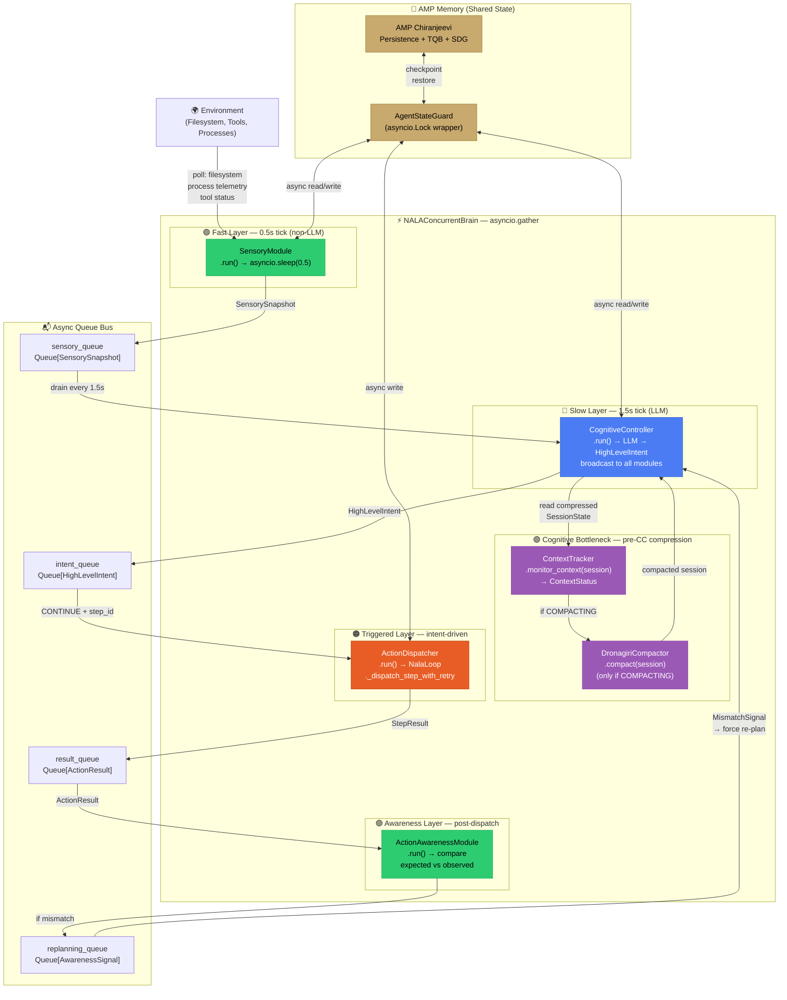
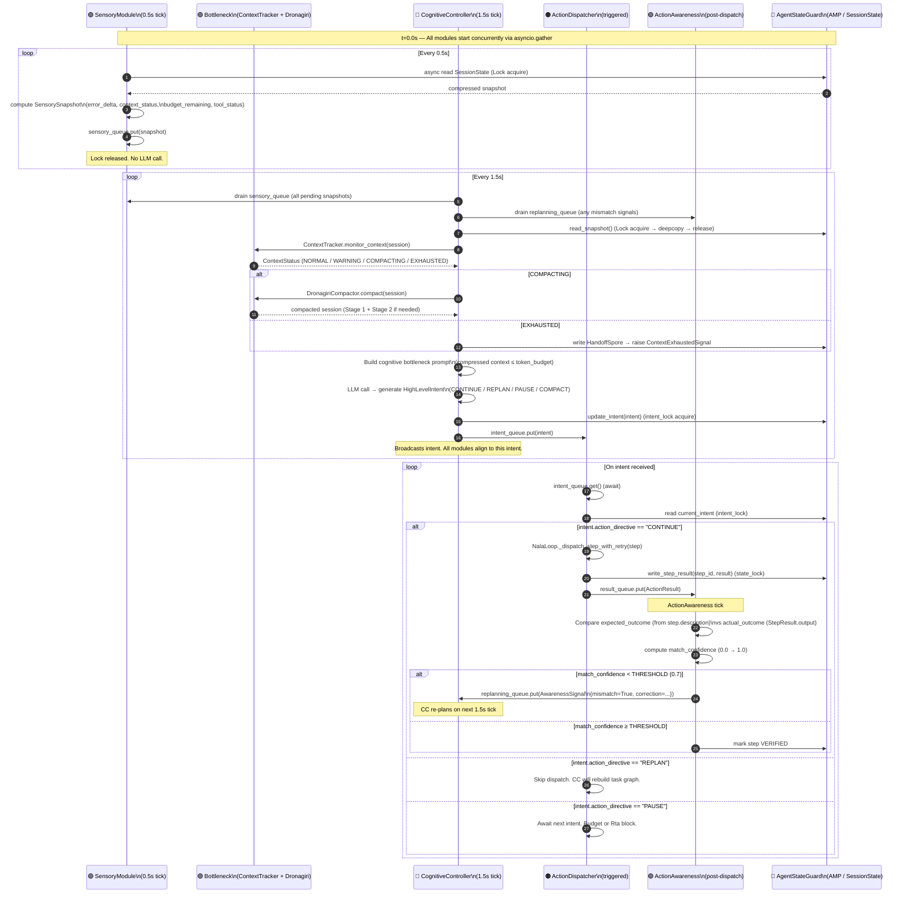

# Multi-Agent Civilization & Social Structures Plan

**Nexus Lab AI Research Lab | Bengaluru, India**
**Version: 2.0.0 | Research Source: Project Sid (Altera.AL, arXiv:2411.00114v1)**

This backlog document outlines the architectural plan for evolving NALA from a single-agent
sequential executor to a multi-agent cooperative society. The designs are inspired by the
*Project Sid* research paper (*Many-agent simulations toward AI civilization*) and adapt its
core concepts — PIANO architecture, theory of mind, social sentiment, role specialization,
governance, and meme diffusion — to the NALA core harness.

> **Build Rule:** All features in this document are BACKLOG only. Zero implementation
> begins until the current NALA Phase 1 (68 files, 7 phases) is fully complete and all
> JIRA-001 through JIRA-007 tickets pass. New ideas go to this file only.

---

## 1. Concurrent Multi-Timescale Modules (Real-time Async Loop)

> **PIANO Principle:** *"The brain solves this problem by running different modules
> concurrently and at different time scales. Reflex modules use small, fast non-LLM
> neural networks, while goal generation involves deliberate reasoning over graphs."*
> — Project Sid, Section 2.1

### 1.0 PIANO Architecture Mapping to NALA

The Project Sid paper identifies two foundational principles in the PIANO architecture
that NALA's current sequential `while True` loop violates:

**Principle 1 — Concurrency:** Fast perception and slow deliberation must run
simultaneously. NALA's current `_execute_loop()` blocks on every LLM dispatch call,
meaning the agent goes blind (cannot sense environment changes) for the entire duration
of the LLM call. In a multi-agent or long-horizon setting, this is catastrophic.

**Principle 2 — Coherence via Cognitive Bottleneck:** All concurrent output streams
must pass through a single bottlenecked decision-maker (the Cognitive Controller, CC)
before any action is taken. This prevents the incoherence failure described in the paper:
*"Abby's chat LLM may respond 'Sure thing!' while her function call chooses 'explore'."*

The following table maps each PIANO module to its NALA sovereign equivalent:

| PIANO Module | Timescale | NALA Equivalent | NALA Component |
|---|---|---|---|
| Sensory / Action Awareness | 0.5s (fast) | `SensoryModule` | Polls SessionState + tool status |
| Goal Generation | 1.5s (slow) | `CognitiveController` | Bottlenecked LLM replanner |
| Skill Execution | Triggered | `ActionDispatcher` | Calls NalaLoop._dispatch_step |
| Action Awareness Feedback | Post-dispatch | `ActionAwarenessModule` | Expected vs observed check |
| Memory (WM / STM / LTM) | Continuous | AMP (Chiranjeevi / TQB / SDG) | Session + crystallized state |
| Information Bottleneck | Pre-CC | ContextTracker + DronagiriCompactor | Compress SessionState → CC prompt |

---

### 1.1 Architectural Blueprint



---

### 1.2 Multi-Timescale Module Lifecycle Diagram



---

### 1.3 Data Flow & The Cognitive Bottleneck

The most critical design decision in the PIANO adaptation is how NALA implements the
**Information Bottleneck** that the paper describes as essential for coherence.

In Project Sid, the bottleneck is a learned compression network that reduces the Agent
State to a fixed-size vector before presenting it to the CC's LLM. In NALA, we use an
existing, already-built system for this: **ContextTracker + DronagiriCompactor**.

#### 1.3.1 Bottleneck Operation (Pre-CC Tick)

Before every CC LLM call (every 1.5s), the following compression pipeline runs:

```
Step 1: ContextTracker._project_token_count(session)
        → Compute projected prompt size (tiktoken, independent of StateMatrix)

Step 2: ContextTracker._classify(projected_tokens)
        → Return ContextStatus (NORMAL / WARNING / COMPACTING / EXHAUSTED)

Step 3 (if COMPACTING): DronagiriCompactor.compact(session)
        → Stage 1: Deterministic regex prune (zero LLM cost)
        → Stage 2: Dronagiri crystallization (LLM cost, only if S1 fails)
        → Force post-compaction checkpoint

Step 4: Build CC Bottleneck Prompt
        → objective + crystallized_history + active_errors + remaining_steps
        → MUST fit within CC_TOKEN_BUDGET (configurable, default: 4,000 tokens)
        → This is the ONLY context the CC's LLM sees — nothing more

Step 5: LLM call → HighLevelIntent
        → action_directive: CONTINUE / REPLAN / PAUSE / COMPACT
        → target_step_id: next step to dispatch
        → reasoning_summary: why this decision
        → compressed_context: what to tell downstream modules
```

#### 1.3.2 Bottleneck Prompt Template

```xml
<cognitive_controller_prompt>
<task_context>
You are NALA's Cognitive Controller. You receive a compressed snapshot of the
current session state and must produce a single high-level directive for the
next execution tick.
</task_context>

<compressed_state>
Objective: {session.objective}
Active Step: {current_step_id} — {current_step_description}
Steps Complete: {completed_count}/{total_count}
Context Status: {ctx_status.value} ({projected_tokens}/{max_tokens} tokens)
Error Count: {error_count} (ceiling: {max_errors})
Budget Used: ${estimated_cost:.4f} USD
Crystallized History (last 3 steps):
{crystallized_history_tail}
Recent Sensory Alerts: {sensory_alerts_summary}
Replanning Signals: {replan_signals_summary}
</compressed_state>

<rules>
1. Output ONLY a JSON object with keys: action_directive, target_step_id,
   reasoning_summary, compressed_context.
2. Use CONTINUE if the current step should proceed.
3. Use REPLAN if a mismatch or error requires task graph modification.
4. Use PAUSE if budget ceiling or constitutional constraint requires human review.
5. Use COMPACT if context is WARNING and you want proactive compression.
</rules>

<immediate_request>
What is your directive for this tick?
</immediate_request>
</cognitive_controller_prompt>
```

---

### 1.4 Shared State & Queue Architecture

Thread-safety is the critical correctness requirement of the concurrent brain. The
shared `SessionState` is wrapped in `AgentStateGuard`, which enforces two separate
`asyncio.Lock` instances — one for session data writes (coarse) and one for intent
reads/writes (fine-grained). This prevents priority inversion between the slow CC and
the fast SensoryModule.

#### 1.4.1 Queue Specifications

```
sensory_queue    : asyncio.Queue[SensorySnapshot]   maxsize=10
                   Writer: SensoryModule (0.5s)
                   Reader: CognitiveController (drain on each 1.5s tick)
                   Overflow policy: put_nowait() with LIFO drop (oldest discarded)

intent_queue     : asyncio.Queue[HighLevelIntent]    maxsize=1
                   Writer: CognitiveController (1.5s)
                   Reader: ActionDispatcher (immediate await)
                   Overflow policy: replace — new intent always supersedes old

result_queue     : asyncio.Queue[ActionResult]       maxsize=10
                   Writer: ActionDispatcher (per-step)
                   Reader: ActionAwarenessModule (continuous drain)
                   Overflow policy: block writer (backpressure signal to CC)

replanning_queue : asyncio.Queue[AwarenessSignal]    maxsize=5
                   Writer: ActionAwarenessModule (on mismatch)
                   Reader: CognitiveController (drain on each tick)
                   Overflow policy: put_nowait() drop oldest (prevent CC starvation)
```

#### 1.4.2 State Locking Protocol

```
state_lock   : asyncio.Lock  — Protects SessionState task graph + state matrix writes
               Held by: SensoryModule (read-only, brief), ActionDispatcher (write)
               Never held during: LLM calls (avoid deadlock on slow CC tick)
               Max hold time: 50ms (soft limit — log warning if exceeded)

intent_lock  : asyncio.Lock  — Protects current HighLevelIntent (single writer: CC)
               Held by: CognitiveController (write, ~1ms), ActionDispatcher (read)
               Never held during: LLM calls
```

---

### 1.5 Python Class Definitions & Interfaces

```python
# ── Data Structures ────────────────────────────────────────────────────────────

import asyncio
import copy
import dataclasses
import inspect
import json
import logging
import time
import uuid
from typing import Any, Callable, Dict, List, Optional

from core.harness.session_contract import SessionState, TaskStatus, TaskStep
from core.harness.context_tracker import (
    ContextStatus, ContextTracker, DronagiriCompactor
)
from core.harness.nala_loop import NalaLoop, StepResult


@dataclasses.dataclass
class SensorySnapshot:
    """
    Compressed environmental snapshot produced by SensoryModule every 0.5s.
    Contains ONLY delta information — not the full SessionState.
    This is equivalent to PIANO's fast 'Proprioception' input stream.
    """
    timestamp:            float
    snapshot_id:          str                   # UUID for tracing
    error_count_delta:    int                   # Errors since last snapshot
    pending_step_count:   int                   # Remaining PENDING steps
    context_status:       ContextStatus         # From ContextTracker
    projected_tokens:     int                   # Raw token projection
    budget_remaining_usd: float                 # Budget ceiling - current spend
    active_tool_outputs:  Dict[str, Any]        # Last tool results, if any
    environment_alerts:   List[str]             # e.g. "disk_usage_high", "rate_limit"


@dataclasses.dataclass
class HighLevelIntent:
    """
    The single coherence point produced by CognitiveController every 1.5s.
    Broadcast to ALL downstream modules. No module acts without consulting
    the current intent first. This is the PIANO Cognitive Bottleneck output.
    """
    intent_id:            str                   # UUID for tracing
    action_directive:     str                   # CONTINUE / REPLAN / PAUSE / COMPACT
    target_step_id:       Optional[str]         # Which step to dispatch (if CONTINUE)
    reasoning_summary:    str                   # Why this directive was chosen
    compressed_context:   str                   # Distilled context for downstream modules
    ctx_status_at_tick:   ContextStatus         # Context health at decision time
    generated_at:         float                 # time.monotonic() timestamp


@dataclasses.dataclass
class ActionResult:
    """Result of a dispatched TaskStep, produced by ActionDispatcher."""
    step_id:              str
    step_result:          StepResult
    expected_outcome:     str                   # Extracted from step.description
    dispatch_duration_s:  float
    intent_id:            str                   # Which intent triggered this dispatch


@dataclasses.dataclass
class AwarenessSignal:
    """
    Mismatch signal from ActionAwarenessModule → CognitiveController replanning queue.
    Equivalent to PIANO's Action Awareness module feedback (Figure 5A ablation).
    """
    signal_id:            str
    step_id:              str
    expected_outcome:     str
    actual_outcome:       str
    match_confidence:     float                 # 0.0 (total mismatch) → 1.0 (perfect match)
    mismatch_detected:    bool
    suggested_correction: Optional[str]         # CC uses this to build replan prompt
    generated_at:         float


# ── AgentStateGuard ────────────────────────────────────────────────────────────

class AgentStateGuard:
    """
    Thread-safe wrapper for the shared SessionState and current HighLevelIntent.

    Uses two independent asyncio.Lock instances to minimize contention:
      state_lock  → Protects SessionState mutations (step results, telemetry)
      intent_lock → Protects HighLevelIntent (single writer: CC; many readers)

    All state mutations go through this class. No module touches SessionState
    directly outside of this guard.
    """

    def __init__(self, session: SessionState) -> None:
        self._session     = session
        self._state_lock  = asyncio.Lock()
        self._intent_lock = asyncio.Lock()
        self._current_intent: Optional[HighLevelIntent] = None
        self._logger      = logging.getLogger("nala.piano.state_guard")

    async def read_snapshot(self) -> SessionState:
        """Return a deep copy of the session (safe for CC to read without holding lock)."""
        async with self._state_lock:
            return copy.deepcopy(self._session)

    async def write_step_result(
        self,
        step_id: str,
        result:  StepResult,
    ) -> None:
        """Update a step's status and result in the task graph."""
        async with self._state_lock:
            for step in self._session.task_graph.steps:
                if step.step_id == step_id:
                    if result.success:
                        step.mark_success(result.output or {})
                    else:
                        step.mark_failed(result.error or "unknown error")
                    break
            self._session.state_matrix.add_llm_call(
                tokens_in=result.prompt_tokens,
                tokens_out=result.completion_tokens,
                cost_usd=result.cost_usd,
            )

    async def update_intent(self, intent: HighLevelIntent) -> None:
        """CC is the single writer. Always replaces the current intent."""
        async with self._intent_lock:
            self._current_intent = intent

    async def get_intent(self) -> Optional[HighLevelIntent]:
        """Fast read for ActionDispatcher — minimal lock hold time."""
        async with self._intent_lock:
            return self._current_intent

    async def get_session_direct(self) -> SessionState:
        """
        Return a direct reference (NOT a copy) for compaction operations.
        Caller MUST hold state_lock before calling this.
        Only used internally by CognitiveController during bottleneck compression.
        """
        return self._session


# ── SensoryModule ─────────────────────────────────────────────────────────────

class SensoryModule:
    """
    PIANO Fast Sensory Layer — polls environment at INTERVAL_S (default 0.5s).

    This module is INTENTIONALLY non-LLM. It only reads SessionState via
    AgentStateGuard and computes a lightweight SensorySnapshot. The fast
    polling interval ensures the CC always has fresh environmental context
    when it wakes for its 1.5s planning tick.

    PIANO equivalent: Proprioception + Action Awareness fast streams (Figure 3).
    """

    INTERVAL_S: float = 0.5

    def __init__(
        self,
        state_guard:      AgentStateGuard,
        sensory_queue:    asyncio.Queue,
        context_tracker:  ContextTracker,
    ) -> None:
        self.state_guard     = state_guard
        self.sensory_queue   = sensory_queue
        self.context_tracker = context_tracker
        self._logger         = logging.getLogger("nala.piano.sensory")
        self._last_error_count: int = 0

    async def run(self) -> None:
        """
        Main sensory loop. Runs indefinitely until cancelled by NALAConcurrentBrain.
        Produces one SensorySnapshot per INTERVAL_S without any LLM calls.
        """
        self._logger.info("[SensoryModule] Starting. tick_interval=%.2fs", self.INTERVAL_S)
        while True:
            try:
                snapshot = await self._poll()
                # Use put_nowait + LIFO drop policy (avoid blocking sensory on CC slowness)
                try:
                    self.sensory_queue.put_nowait(snapshot)
                except asyncio.QueueFull:
                    # Discard the oldest snapshot to make room
                    try:
                        self.sensory_queue.get_nowait()
                        self.sensory_queue.put_nowait(snapshot)
                    except asyncio.QueueEmpty:
                        pass
            except asyncio.CancelledError:
                self._logger.info("[SensoryModule] Cancelled. Stopping.")
                return
            except Exception as exc:
                self._logger.error("[SensoryModule] Poll error: %s", exc)
            await asyncio.sleep(self.INTERVAL_S)

    async def _poll(self) -> SensorySnapshot:
        """
        Read current SessionState and compute a lightweight SensorySnapshot.
        Max execution time: ~5ms (no LLM calls, no disk I/O).
        """
        session = await self.state_guard.read_snapshot()

        ctx_status  = self.context_tracker.monitor_context(session)
        projected   = self.context_tracker.project_token_count(session)

        error_now   = session.state_matrix.error_count
        error_delta = max(0, error_now - self._last_error_count)
        self._last_error_count = error_now

        pending_count = sum(
            1 for s in session.task_graph.steps
            if s.status == TaskStatus.PENDING
        )

        budget_remaining = max(
            0.0,
            5.0 - session.state_matrix.estimated_cost  # Default $5 ceiling
        )

        return SensorySnapshot(
            timestamp=time.monotonic(),
            snapshot_id=str(uuid.uuid4())[:8],
            error_count_delta=error_delta,
            pending_step_count=pending_count,
            context_status=ctx_status,
            projected_tokens=projected,
            budget_remaining_usd=budget_remaining,
            active_tool_outputs={},   # Extended in production: poll tool status files
            environment_alerts=self._check_environment_alerts(session),
        )

    def _check_environment_alerts(self, session: SessionState) -> List[str]:
        """
        Non-LLM heuristic checks for environmental issues.
        Returns a list of alert strings for the CC to consider.
        """
        alerts: List[str] = []
        sm = session.state_matrix
        if sm.error_count >= 7:
            alerts.append(f"HIGH_ERROR_COUNT:{sm.error_count}")
        if sm.estimated_cost >= 4.5:
            alerts.append(f"BUDGET_NEAR_CEILING:${sm.estimated_cost:.2f}")
        if sm.elapsed_seconds > 3600:
            alerts.append(f"LONG_RUN:{sm.elapsed_seconds/3600:.1f}h")
        return alerts


# ── CognitiveController ────────────────────────────────────────────────────────

class CognitiveController:
    """
    PIANO Cognitive Controller — the bottlenecked deliberative planner.

    Wakes every INTERVAL_S (1.5s), drains the sensory and replanning queues,
    compresses the session state through the ContextTracker + Dronagiri bottleneck,
    makes a single LLM call to generate a HighLevelIntent, and broadcasts it
    to all downstream modules via intent_queue and AgentStateGuard.

    The CC is the ONLY module that makes LLM calls for planning. All other
    modules are either non-LLM (Sensory, Awareness) or LLM for execution only
    (ActionDispatcher). This ensures coherence: all decisions flow from one point.

    PIANO equivalent: Cognitive Controller + Bottleneck (Figure 3, Section 2.2).
    ContextTracker + DronagiriCompactor IS the bottleneck.
    """

    INTERVAL_S:       float = 1.5
    CC_TOKEN_BUDGET:  int   = 4_000  # Max tokens in CC's LLM prompt

    def __init__(
        self,
        state_guard:       AgentStateGuard,
        sensory_queue:     asyncio.Queue,
        replanning_queue:  asyncio.Queue,
        intent_queue:      asyncio.Queue,
        context_tracker:   ContextTracker,
        compactor:         DronagiriCompactor,
        llm_fn:            Callable[[str, str], str],
    ) -> None:
        self.state_guard      = state_guard
        self.sensory_queue    = sensory_queue
        self.replanning_queue = replanning_queue
        self.intent_queue     = intent_queue
        self.context_tracker  = context_tracker
        self.compactor        = compactor
        self.llm_fn           = llm_fn
        self._tick_count      = 0
        self._logger          = logging.getLogger("nala.piano.cc")

    async def run(self) -> None:
        """
        Main CC loop. Wakes every INTERVAL_S to produce a HighLevelIntent.
        Never holds state_lock during LLM calls to prevent deadlock.
        """
        self._logger.info("[CC] Starting. tick_interval=%.2fs", self.INTERVAL_S)
        while True:
            await asyncio.sleep(self.INTERVAL_S)
            try:
                await self._tick()
            except asyncio.CancelledError:
                self._logger.info("[CC] Cancelled. Stopping.")
                return
            except Exception as exc:
                self._logger.error("[CC] Tick error (continuing): %s", exc)

    async def _tick(self) -> None:
        """Single CC planning tick."""
        self._tick_count += 1

        # Phase 1: Drain sensory and replanning queues
        sensory_snapshots = self._drain_queue(self.sensory_queue)
        replan_signals    = self._drain_queue(self.replanning_queue)

        # Phase 2: Read session snapshot (lock → deepcopy → release)
        session = await self.state_guard.read_snapshot()

        # Phase 3: Cognitive Bottleneck — ContextTracker + Dronagiri compression
        ctx_status = self.context_tracker.monitor_context(session)

        if ctx_status == ContextStatus.COMPACTING:
            self._logger.warning("[CC] Context COMPACTING. Running Dronagiri bottleneck.")
            # Compact the LIVE session (not the copy) under state_lock
            async with self.state_guard._state_lock:
                live_session = await self.state_guard.get_session_direct()
                self.compactor.compact(live_session)
            # Re-read snapshot after compaction
            session = await self.state_guard.read_snapshot()

        elif ctx_status == ContextStatus.EXHAUSTED:
            self._logger.critical("[CC] Context EXHAUSTED. Broadcasting PAUSE intent.")
            intent = self._make_intent(
                directive="PAUSE",
                target_step_id=None,
                reasoning="Context window exhausted. HandoffSpore required.",
                ctx_status=ctx_status,
                session=session,
            )
            await self._broadcast_intent(intent)
            return

        # Phase 4: Build compressed CC prompt
        system_prompt, user_prompt = self._build_bottleneck_prompt(
            session=session,
            sensory_snapshots=sensory_snapshots,
            replan_signals=replan_signals,
            ctx_status=ctx_status,
        )

        # Phase 5: LLM call (NEVER holds state_lock here)
        try:
            raw_response = self.llm_fn(system_prompt, user_prompt)
            parsed       = json.loads(raw_response)
        except (json.JSONDecodeError, Exception) as exc:
            self._logger.error("[CC] LLM response parse error: %s. Using CONTINUE.", exc)
            parsed = {
                "action_directive":  "CONTINUE",
                "target_step_id":    self._get_next_pending_step_id(session),
                "reasoning_summary": f"Parse error fallback: {exc}",
                "compressed_context": "",
            }

        # Phase 6: Broadcast intent
        intent = HighLevelIntent(
            intent_id=str(uuid.uuid4())[:8],
            action_directive=parsed.get("action_directive", "CONTINUE"),
            target_step_id=parsed.get("target_step_id"),
            reasoning_summary=parsed.get("reasoning_summary", ""),
            compressed_context=parsed.get("compressed_context", ""),
            ctx_status_at_tick=ctx_status,
            generated_at=time.monotonic(),
        )
        await self._broadcast_intent(intent)

    def _drain_queue(self, queue: asyncio.Queue) -> list:
        """Non-blocking drain of all pending items from a queue."""
        items = []
        while True:
            try:
                items.append(queue.get_nowait())
            except asyncio.QueueEmpty:
                break
        return items

    def _build_bottleneck_prompt(
        self,
        session:            SessionState,
        sensory_snapshots:  list,
        replan_signals:     list,
        ctx_status:         ContextStatus,
    ) -> tuple[str, str]:
        """
        Build the compressed CC prompt. The bottleneck constraint:
        total prompt size MUST be ≤ CC_TOKEN_BUDGET tokens.
        Only the most critical information passes through.
        """
        completed = [s for s in session.task_graph.steps if s.status == TaskStatus.SUCCESS]
        pending   = [s for s in session.task_graph.steps if s.status == TaskStatus.PENDING]
        next_step = pending[0] if pending else None

        # Crystallized tail (last 3 completed steps)
        tail_history = " | ".join(
            f"[{s.step_id}] ✅ {s.description[:40]}"
            for s in completed[-3:]
        )

        sensory_summary = "; ".join(
            f"err_delta={sn.error_count_delta} budget=${sn.budget_remaining_usd:.2f}"
            for sn in sensory_snapshots[-3:]
        ) or "no recent sensory data"

        replan_summary = "; ".join(
            f"[{rs.step_id}] confidence={rs.match_confidence:.2f} '{rs.suggested_correction}'"
            for rs in replan_signals
        ) or "none"

        system_prompt = (
            "You are NALA's Cognitive Controller. Produce a single JSON directive object "
            "based on the compressed session state. Output only valid JSON. No preamble."
        )

        user_prompt = (
            f"Objective: {session.objective[:100]}\n"
            f"Context Status: {ctx_status.value}\n"
            f"Steps: {len(completed)}/{len(session.task_graph.steps)} complete\n"
            f"Next Pending: {next_step.step_id if next_step else 'NONE'} — "
            f"{next_step.description[:60] if next_step else 'all done'}\n"
            f"Recent History (tail 3): {tail_history or 'none'}\n"
            f"Errors: {session.state_matrix.error_count} | "
            f"Cost: ${session.state_matrix.estimated_cost:.4f}\n"
            f"Sensory Alerts: {sensory_summary}\n"
            f"Mismatch Signals: {replan_summary}\n\n"
            f"Return JSON: {{\"action_directive\": \"CONTINUE|REPLAN|PAUSE|COMPACT\", "
            f"\"target_step_id\": \"step_id_or_null\", "
            f"\"reasoning_summary\": \"1 sentence\", "
            f"\"compressed_context\": \"key context for executor\"}}"
        )
        return system_prompt, user_prompt

    async def _broadcast_intent(self, intent: HighLevelIntent) -> None:
        """Write intent to state guard and push to intent_queue (replace old)."""
        await self.state_guard.update_intent(intent)
        # Replace policy: drain old intent before pushing new
        try:
            self.intent_queue.get_nowait()
        except asyncio.QueueEmpty:
            pass
        await self.intent_queue.put(intent)
        self._logger.info(
            "[CC] Tick #%d | intent=%s | directive=%s | target=%s",
            self._tick_count,
            intent.intent_id,
            intent.action_directive,
            intent.target_step_id,
        )

    def _get_next_pending_step_id(self, session: SessionState) -> Optional[str]:
        for step in session.task_graph.steps:
            if step.status == TaskStatus.PENDING:
                return step.step_id
        return None

    def _make_intent(
        self,
        directive:     str,
        target_step_id: Optional[str],
        reasoning:     str,
        ctx_status:    ContextStatus,
        session:       SessionState,
    ) -> HighLevelIntent:
        return HighLevelIntent(
            intent_id=str(uuid.uuid4())[:8],
            action_directive=directive,
            target_step_id=target_step_id,
            reasoning_summary=reasoning,
            compressed_context="",
            ctx_status_at_tick=ctx_status,
            generated_at=time.monotonic(),
        )


# ── ActionDispatcher ───────────────────────────────────────────────────────────

class ActionDispatcher:
    """
    PIANO Skill Execution Layer — triggered by CC HighLevelIntent.

    Awaits intent from intent_queue. On CONTINUE directive, dispatches the
    target TaskStep via NalaLoop._dispatch_step_with_retry and writes the
    StepResult to AgentStateGuard. Pushes ActionResult to result_queue for
    ActionAwarenessModule evaluation.

    PIANO equivalent: Skill Execution + Motor modules (Figure 3, bottom right).
    """

    def __init__(
        self,
        state_guard:   AgentStateGuard,
        intent_queue:  asyncio.Queue,
        result_queue:  asyncio.Queue,
        nala_loop:     NalaLoop,
    ) -> None:
        self.state_guard  = state_guard
        self.intent_queue = intent_queue
        self.result_queue = result_queue
        self.nala_loop    = nala_loop
        self._logger      = logging.getLogger("nala.piano.dispatcher")

    async def run(self) -> None:
        """Await intents and dispatch steps. One dispatch per intent."""
        self._logger.info("[ActionDispatcher] Starting.")
        while True:
            try:
                intent = await self.intent_queue.get()
                await self._handle_intent(intent)
                self.intent_queue.task_done()
            except asyncio.CancelledError:
                self._logger.info("[ActionDispatcher] Cancelled. Stopping.")
                return
            except Exception as exc:
                self._logger.error("[ActionDispatcher] Error: %s", exc)

    async def _handle_intent(self, intent: HighLevelIntent) -> None:
        """Process a single HighLevelIntent from the CC."""
        if intent.action_directive == "CONTINUE" and intent.target_step_id:
            await self._dispatch_step(intent)

        elif intent.action_directive == "REPLAN":
            self._logger.info(
                "[ActionDispatcher] REPLAN received. Skipping dispatch. "
                "CC will rebuild task graph on next tick."
            )

        elif intent.action_directive == "PAUSE":
            self._logger.warning(
                "[ActionDispatcher] PAUSE received: %s. Halting dispatch.",
                intent.reasoning_summary,
            )

        elif intent.action_directive == "COMPACT":
            self._logger.info(
                "[ActionDispatcher] COMPACT received. Skipping this tick."
            )

    async def _dispatch_step(self, intent: HighLevelIntent) -> None:
        """Dispatch the target step and record the result."""
        session = await self.state_guard.read_snapshot()
        target_step: Optional[TaskStep] = None
        for step in session.task_graph.steps:
            if step.step_id == intent.target_step_id:
                target_step = step
                break

        if target_step is None:
            self._logger.error(
                "[ActionDispatcher] Step '%s' not found in TaskGraph.",
                intent.target_step_id,
            )
            return

        # Extract expected outcome from step description (for ActionAwareness)
        expected_outcome = target_step.description

        t0 = time.monotonic()
        step_result, _error = self.nala_loop._dispatch_step_with_retry(target_step)
        elapsed = time.monotonic() - t0

        # Write result to shared state
        await self.state_guard.write_step_result(intent.target_step_id, step_result)

        # Push to result_queue for ActionAwarenessModule
        action_result = ActionResult(
            step_id=intent.target_step_id,
            step_result=step_result,
            expected_outcome=expected_outcome,
            dispatch_duration_s=elapsed,
            intent_id=intent.intent_id,
        )
        await self.result_queue.put(action_result)

        self._logger.info(
            "[ActionDispatcher] Step '%s' dispatched. success=%s elapsed=%.2fs",
            intent.target_step_id,
            step_result.success,
            elapsed,
        )


# ── ActionAwarenessModule ──────────────────────────────────────────────────────

class ActionAwarenessModule:
    """
    PIANO Action Awareness Layer — grounding feedback loop.

    Consumes ActionResults from result_queue. For each result, compares the
    expected outcome (from step.description) against the actual outcome
    (StepResult.output) using an injected awareness_fn (lightweight LLM or
    heuristic comparison). If match_confidence < CONFIDENCE_THRESHOLD,
    a mismatch AwarenessSignal is pushed to the CC's replanning_queue.

    This is the SINGLE MOST IMPACTFUL module in Project Sid's ablation study
    (Figure 5A): removing Action Awareness cut individual agent progression
    nearly in half. In NALA, it prevents hallucinated "step complete" outputs
    from propagating to the task graph.

    PIANO equivalent: Action Awareness module (Figure 3, middle stream).
    """

    CONFIDENCE_THRESHOLD: float = 0.70

    def __init__(
        self,
        state_guard:       AgentStateGuard,
        result_queue:      asyncio.Queue,
        replanning_queue:  asyncio.Queue,
        awareness_fn:      Callable[[str, str], float],
    ) -> None:
        self.state_guard      = state_guard
        self.result_queue     = result_queue
        self.replanning_queue = replanning_queue
        self.awareness_fn     = awareness_fn
        self._logger          = logging.getLogger("nala.piano.awareness")

    async def run(self) -> None:
        """Continuously evaluate dispatched step results for grounding."""
        self._logger.info("[ActionAwareness] Starting.")
        while True:
            try:
                action_result = await self.result_queue.get()
                signal = await self._evaluate(action_result)

                if signal.mismatch_detected:
                    self._logger.warning(
                        "[ActionAwareness] MISMATCH detected for step '%s'. "
                        "confidence=%.2f. Pushing ReplanSignal to CC.",
                        signal.step_id,
                        signal.match_confidence,
                    )
                    try:
                        self.replanning_queue.put_nowait(signal)
                    except asyncio.QueueFull:
                        # Drop oldest to prevent CC starvation
                        try:
                            self.replanning_queue.get_nowait()
                            self.replanning_queue.put_nowait(signal)
                        except asyncio.QueueEmpty:
                            pass
                else:
                    self._logger.debug(
                        "[ActionAwareness] Step '%s' verified. confidence=%.2f.",
                        signal.step_id,
                        signal.match_confidence,
                    )

                self.result_queue.task_done()

            except asyncio.CancelledError:
                self._logger.info("[ActionAwareness] Cancelled. Stopping.")
                return
            except Exception as exc:
                self._logger.error("[ActionAwareness] Evaluation error: %s", exc)

    async def _evaluate(self, action_result: ActionResult) -> AwarenessSignal:
        """
        Compare expected vs actual outcome.

        awareness_fn(expected: str, actual: str) → float (0.0–1.0)
        Can be a lightweight LLM call, a cosine similarity check, or a
        structural diff (e.g. checking if expected file exists on disk).
        """
        actual_str = json.dumps(
            action_result.step_result.output or {},
            ensure_ascii=False,
            default=str,
        )[:500]  # Truncate to prevent awareness_fn context bloat

        try:
            confidence = await asyncio.get_event_loop().run_in_executor(
                None,
                self.awareness_fn,
                action_result.expected_outcome,
                actual_str,
            )
        except Exception as exc:
            self._logger.warning("[ActionAwareness] awareness_fn error: %s", exc)
            confidence = 1.0  # Conservative: assume match on evaluation failure

        mismatch = confidence < self.CONFIDENCE_THRESHOLD

        return AwarenessSignal(
            signal_id=str(uuid.uuid4())[:8],
            step_id=action_result.step_id,
            expected_outcome=action_result.expected_outcome,
            actual_outcome=actual_str,
            match_confidence=round(confidence, 3),
            mismatch_detected=mismatch,
            suggested_correction=(
                f"Step '{action_result.step_id}' produced low-confidence output "
                f"(confidence={confidence:.2f}). Consider replanning with more "
                f"specific step description."
            ) if mismatch else None,
            generated_at=time.monotonic(),
        )


# ── NALAConcurrentBrain ────────────────────────────────────────────────────────

class NALAConcurrentBrain:
    """
    Top-level PIANO-inspired concurrent orchestrator for NALA.

    Manages all four async modules (Sensory, CC, Dispatcher, Awareness)
    and their shared queues via asyncio.gather. Wraps the existing NalaLoop
    infrastructure — NalaLoop is still used for step dispatch and checkpoint
    management; NALAConcurrentBrain adds the concurrent cognitive architecture
    on top.

    Usage:
        brain = NALAConcurrentBrain(session, cm, context_tracker, compactor,
                                    nala_loop, llm_fn, awareness_fn)
        asyncio.run(brain.run())
    """

    def __init__(
        self,
        session:         SessionState,
        context_tracker: ContextTracker,
        compactor:       DronagiriCompactor,
        nala_loop:       NalaLoop,
        llm_fn:          Callable[[str, str], str],
        awareness_fn:    Callable[[str, str], float],
    ) -> None:
        self.state_guard = AgentStateGuard(session)

        # Async queue bus
        self.sensory_queue    : asyncio.Queue[SensorySnapshot]  = asyncio.Queue(maxsize=10)
        self.intent_queue     : asyncio.Queue[HighLevelIntent]  = asyncio.Queue(maxsize=1)
        self.result_queue     : asyncio.Queue[ActionResult]     = asyncio.Queue(maxsize=10)
        self.replanning_queue : asyncio.Queue[AwarenessSignal]  = asyncio.Queue(maxsize=5)

        # Initialize modules
        self.sensory = SensoryModule(
            state_guard=self.state_guard,
            sensory_queue=self.sensory_queue,
            context_tracker=context_tracker,
        )
        self.cc = CognitiveController(
            state_guard=self.state_guard,
            sensory_queue=self.sensory_queue,
            replanning_queue=self.replanning_queue,
            intent_queue=self.intent_queue,
            context_tracker=context_tracker,
            compactor=compactor,
            llm_fn=llm_fn,
        )
        self.dispatcher = ActionDispatcher(
            state_guard=self.state_guard,
            intent_queue=self.intent_queue,
            result_queue=self.result_queue,
            nala_loop=nala_loop,
        )
        self.awareness = ActionAwarenessModule(
            state_guard=self.state_guard,
            result_queue=self.result_queue,
            replanning_queue=self.replanning_queue,
            awareness_fn=awareness_fn,
        )
        self._logger = logging.getLogger("nala.piano.brain")

    async def run(self) -> None:
        """
        Launch all modules concurrently. Any module crash is caught via
        return_exceptions=True and logged — the brain does not halt on a
        single module failure.
        """
        self._logger.info("[NALAConcurrentBrain] Starting all modules via asyncio.gather.")
        results = await asyncio.gather(
            self.sensory.run(),
            self.cc.run(),
            self.dispatcher.run(),
            self.awareness.run(),
            return_exceptions=True,
        )
        for i, result in enumerate(results):
            module_name = ["sensory", "cc", "dispatcher", "awareness"][i]
            if isinstance(result, Exception):
                self._logger.critical(
                    "[NALAConcurrentBrain] Module '%s' crashed: %s",
                    module_name, result,
                )
```

---

### 1.6 Action Awareness Grounding Loop — Design Detail

Project Sid's ablation study (Figure 5A) shows Action Awareness was the single
biggest contributor to individual agent progression — removing it cut item acquisition
nearly in half. In NALA, the `ActionAwarenessModule` implements this as follows:

**What it checks (in priority order):**

1. **Output Structure Validity** — Does `StepResult.output` have the expected keys?
   If the step description says "write `config.py`", does `step.result["file_path"]`
   exist and point to a real file?

2. **Semantic Confidence** — `awareness_fn(expected, actual) → float`. Default
   implementation: lightweight LLM call using a cheap model (Claude Haiku) with a
   structured comparison prompt. Confidence 0.0 = total mismatch, 1.0 = perfect match.

3. **Error Signal Propagation** — If `StepResult.success == False`, confidence is
   automatically set to 0.0 and a mismatch signal is forced.

**What happens on mismatch:**
- `AwarenessSignal` pushed to `replanning_queue`
- CC receives signal on next 1.5s tick
- CC includes mismatch context in its bottleneck prompt
- CC generates a REPLAN directive with correction context
- ActionDispatcher skips the next dispatch, CC rebuilds task graph

This closes the **grounding feedback loop**: the environment's actual response
corrects the agent's beliefs before the next action, preventing hallucination cascade.

---

### 1.7 Concurrency Risk Register

| Risk ID | Severity | Description | Mitigation |
|---|---|---|---|
| **PIANO-R01** | CRITICAL | Race condition on `SessionState` — two modules write simultaneously (e.g. SensoryModule + ActionDispatcher) | `AgentStateGuard` enforces single-writer via `asyncio.Lock`. `state_lock` acquired before every write. SensoryModule is READ-ONLY (never writes). |
| **PIANO-R02** | HIGH | Stale intent — ActionDispatcher dispatches a step based on a CC intent that CC has already superseded | `intent_queue` maxsize=1 with REPLACE policy (drain old before push new). Dispatcher always awaits fresh intent. Never caches intent locally. |
| **PIANO-R03** | HIGH | CC holds `state_lock` during LLM call — blocks SensoryModule and ActionDispatcher for 1-30s | CC reads session via `read_snapshot()` (deepcopy + immediate lock release). LLM call runs WITHOUT holding any lock. State mutations only on write methods. |
| **PIANO-R04** | HIGH | `sensory_queue` overflow — SensoryModule produces 3x faster than CC consumes | `sensory_queue` maxsize=10. On full: LIFO drop (oldest discarded). CC always gets the MOST RECENT sensory data, not stale data. |
| **PIANO-R05** | MEDIUM | `replanning_queue` flood — ActionAwareness generates mismatch signals faster than CC can process | `replanning_queue` maxsize=5 with LIFO drop. CC drains ALL pending signals in one batch per tick. |
| **PIANO-R06** | MEDIUM | OOM during `read_snapshot()` deep copy — SessionState grows too large for deepcopy | DronagiriCompactor pre-compacts before CC tick. `read_snapshot()` is only called after bottleneck compression (COMPACTING state triggers compaction first). |
| **PIANO-R07** | MEDIUM | Async task cancellation leaves `state_lock` held — deadlock on restart | All lock acquisitions use `async with` (guarantees release on CancelledError via `__aexit__`). Never use manual `acquire()` + `release()`. |
| **PIANO-R08** | MEDIUM | ActionDispatcher calls `_dispatch_step_with_retry()` which is synchronous — blocks the event loop | Wrap synchronous NalaLoop dispatch in `asyncio.get_event_loop().run_in_executor(None, ...)` to run in a thread pool without blocking the asyncio event loop. |
| **PIANO-R09** | LOW | CC tick drift — 1.5s interval accumulates drift over many hours | Use `asyncio.sleep` with a correction term: `sleep_duration = INTERVAL_S - (time.monotonic() - tick_start)`. Maintains consistent tick cadence. |
| **PIANO-R10** | LOW | Module crash silently kills `asyncio.gather` — other modules continue but CC is dead | `return_exceptions=True` in `asyncio.gather`. NALAConcurrentBrain logs all module crashes and can restart individual modules via `asyncio.ensure_future`. |

---

## 2. Social Sentiment & Theory of Mind

### Goal
Allow NALA agents to interact with other agents and human users with an awareness of
relationships, trust, and historical cooperation.

### Technical Design
* **Theory of Mind Database:** Maintain a relational graph in `SessionState` tracking:
  * `social_sentiments`: Dict mapping `agent_id/user_id -> affinity_score (0.0 to 10.0)`.
  * `cooperation_history`: Transaction log of shared task execution and success/failure ratios.
* **Dynamic Prompts Conditioning:** Inject relationship summaries into the Cognitive
  Controller's planning prompts. Agents will prioritize tasks from high-trust peers and
  apply stricter validations/checks to low-trust entities.
* **Sentiment Mutators:** Create utility hooks that increase affinity when tasks are
  completed successfully and decrease affinity on uncooperative events.

---

## 3. Role Specialization & Agent Economy

### Goal
Organize multi-agent NALA fleets into specialized task workers who trade tasks and
resource tokens on a local computational marketplace.

### Technical Design
* **Agent Archetypes:** Define class structures for specialized sub-agents:
  * `CoderAgent`: Specializes in writing python files and tests.
  * `ResearchAgent`: Specializes in web search and literature retrieval.
  * `QualityJudgeAgent`: Specializes in linting, debugging, and code reviews.
* **Decentralized Task Bidding:**
  * A planning agent publishes unresolved task steps as "Contracts".
  * Specialized agents compute bids based on current load.
  * The planning agent selects the best bid and delegates.
* **Shared Ledger (Computational Credits):** Track token consumption with SQLite-backed
  ledger. Agents charge for task completion, ensuring optimal resource utilization.

---

## 4. Governance, Laws & Democracy

### Goal
Implement democratic decision-making and law enforcement within NALA multi-agent
fleets to resolve conflicts, prioritize tasks, and establish consensus.

### Technical Design
* **Consensus Engine:** Voting mechanisms (majority, weighted, or quadratic) for task
  graph decisions. When a plan change occurs, agents vote on whether to adopt it.
* **Constitutional Constraints (Laws):** Registry of invariant laws
  (e.g., "Never delete files in `/core` without code review approval").
* **Judicial Review Loop:** A `JudgeAgent` audits execution traces. Constitutional
  violations trigger trust score penalties and recovery actions.

---

## 5. Cultural Transmission & Knowledge Sharing (Meme Diffusion)

### Goal
Allow agents to share successful prompts, execution patterns, and tool-use scripts
dynamically to improve collective performance over time.

### Technical Design
* **Community Memory (Vector DB):** Shared semantic memory store for all active loops.
* **Diffusion Mechanism:** When an agent successfully completes a complex step
  (judged as high-quality), it generates a "meme card" (structured summary of the
  prompt, parameters, and successful tool output) and flushes it to shared memory.
* **Context Ingestion:** Prior to starting a task, the planner searches community
  memory for similar task descriptions to extract proven prompt strategies.

---

**Jai Bajrang Bali 🙏**
