# NALA — Dream Features Plan v1.0
## Sovereign Long-Running Agent — Next Generation Capabilities
**Nexus Lab AI Research Lab | Bengaluru, India**
**Research Date: June 14, 2026 | Version: 1.0.0**

---

> **Strategic Context:** On May 6, 2026 at Code with Claude in San Francisco, Anthropic shipped 8 major new capabilities for Claude Code and Claude Managed Agents — Dreaming, Outcomes, Multiagent Orchestration, Dynamic Workflows, Agent View, Remote Control, Webhooks, and Adversarial Review. This document is NALA's sovereign response — mapping each Claude Code feature to a deeper, constitutionally-grounded NALA equivalent, then going further with features Claude doesn't have at all.
>
> **Build Rule:** Every feature in this document goes into `BACKLOG.md`. Zero additions to the current NALA build until Phase 1 (68 files, 7 phases) is fully complete.

---

## 📌 Table of Contents

1. [What Claude Code Shipped](#1-what-claude-code-shipped-may-june-2026)
2. [NALA vs Claude Code — Feature Map](#2-nala-vs-claude-code--feature-map)
3. [Dream Feature 1 — SWAPNA Protocol](#3-dream-feature-1--swapna-protocol-स्वप्न)
4. [Dream Feature 2 — LAKSHYA Protocol](#4-dream-feature-2--lakshya-protocol-लक्ष्य)
5. [Dream Feature 3 — PRERAK Engine](#5-dream-feature-3--prerak-engine-प्रेरक)
6. [Dream Feature 4 — SHAAKHA Isolation](#6-dream-feature-4--shaakha-isolation-शाखा)
7. [Dream Feature 5 — DRISHTI Dashboard](#7-dream-feature-5--drishti-dashboard-दृष्टि)
8. [Dream Feature 6 — SANKET Protocol](#8-dream-feature-6--sanket-protocol-संकेत)
9. [Dream Feature 7 — VIVEK Router](#9-dream-feature-7--vivek-router-विवेक)
10. [Dream Feature 8 — PRATIDWANDI Review](#10-dream-feature-8--pratidwandi-review-प्रतिद्वंदी)
11. [Exclusive NALA Features — No Claude Equivalent](#11-exclusive-nala-features--no-claude-equivalent)
12. [Full System Architecture](#12-full-nala-v2-sovereign-architecture)
13. [Priority Matrix & Build Roadmap](#13-priority-matrix--build-roadmap)
14. [File Structure Delta](#14-file-structure-delta--new-files-required)

---

## 1. What Claude Code Shipped (May–June 2026)

### 1.1 Claude Managed Agents — 4 New Primitives (May 6, 2026)

| Feature | What It Does | Status |
|---|---|---|
| **Dreaming** | Scheduled process reviews past sessions, extracts patterns, curates memory between runs (no weight changes) | Research Preview |
| **Outcomes** | Rubric-driven grader loop — independent evaluator scores output, triggers revision loop if it fails | Public Beta |
| **Multiagent Orchestration** | Lead agent delegates to up to 20 specialists (25 concurrent threads) on a shared filesystem | Public Beta |
| **Webhooks** | Event-driven callbacks on session completion, failure, or milestone events | Public Beta |

### 1.2 Claude Code — 4 New Capabilities (May–June 2026)

| Feature | What It Does | Status |
|---|---|---|
| **Dynamic Workflows** | Claude writes JS orchestration script on the fly; spawns up to 1,000 subagents (16 concurrent) | Research Preview |
| **Agent View** | Single CLI view to manage all background sessions — start, pause, peek, jump back | Live |
| **Remote Control** | Start session on MacBook, monitor and control from phone; multi-machine dispatch | Live |
| **Adversarial Review** | Two subagents review each other's code; only consensus output gets committed | Live |

### 1.3 Key Results Reported

Harvey (legal AI): **6× increase** in task completion rates after Dreaming was enabled.
Wisedocs (medical docs): **50% reduction** in document review time using Outcomes + Dreaming.
Bun team: Rewrote entire codebase from Zig to Rust in **6 days** using Dynamic Workflows + Adversarial Review.

---

## 2. NALA vs Claude Code — Feature Map

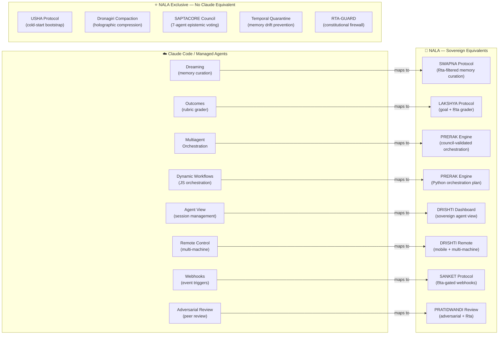

**Core difference:** Claude's features are cloud-managed, generic, and stateless. NALA's are sovereign, constitutionally filtered through Ṛta, and rooted in Rigvedic architecture. NALA also has 5 categories of capability that Claude has no equivalent for at all.

---

## 3. Dream Feature 1 — SWAPNA Protocol (स्वप्न)
*Sanskrit: Dream | Inspired by: Claude Dreaming*

### 3.1 What Claude Does

Claude's Dreaming runs a scheduled process between sessions. It reads past conversation transcripts, finds recurring patterns, and curates the memory store. It does NOT change model weights — it's closer to structured note-taking. Harvey saw 6× completion rate improvement with it.

### 3.2 What NALA Does Better

NALA's **SWAPNA Protocol** does the same but adds:
1. **Ṛta Constitutional Filter** — patterns that violate any of RTA-GUARD's 13 Rigvedic rules are quarantined, not crystallized. Claude's dreaming has no ethical filter.
2. **Failure Archaeology** — SWAPNA actively mines failed steps for root causes, not just successful patterns. Claude focuses on what worked.
3. **Cross-Session Synthesis** — synthesizes insights across multiple past sessions using SAPTACORE's epistemic voting to determine which insights have enough consensus to be promoted.
4. **Human Gate Option** — Sourav can set "require human approval before crystallizing new patterns." Claude offers this too, but NALA's gate is constitutional, not just procedural.

### 3.3 Architecture

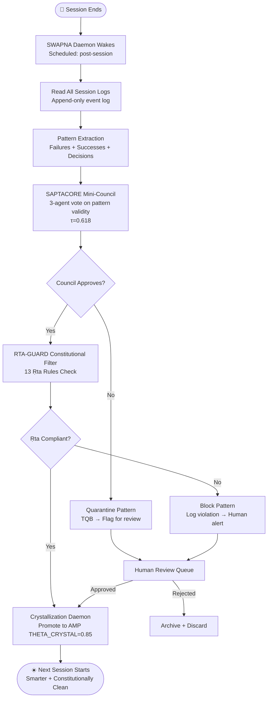

### 3.4 Key Files Required

```
nala/memory/swapna_daemon.py        ← Main SWAPNA scheduler and orchestrator
nala/memory/pattern_extractor.py    ← Failure/success pattern mining engine
nala/memory/cross_session_synth.py  ← Multi-session synthesis logic
nala/memory/human_review_queue.py   ← Human approval gate for pattern promotion
```

### 3.5 What SWAPNA Prevents

Without SWAPNA: Each NALA session starts from scratch. AMP has memory of past conversations but doesn't synthesize patterns across many sessions. Over 100 sessions, the same mistakes repeat.

With SWAPNA: By session 10, NALA stops repeating mistakes. By session 50, it has a rich pattern library of "what works" and "what violates Ṛta" that makes every new session dramatically more efficient.

---

## 4. Dream Feature 2 — LAKSHYA Protocol (लक्ष्य)
*Sanskrit: Goal/Target | Inspired by: Claude /goal + Outcomes*

### 4.1 What Claude Does

Claude's `/goal` command sets a completion condition Claude works toward autonomously. Claude's Outcomes feature defines a success rubric; an independent grader evaluates output and triggers revision loops. Anthropic's internal testing showed up to 10 percentage point improvement on harder tasks.

### 4.2 What NALA Does Better

NALA's **LAKSHYA Protocol** combines both and adds:
1. **Ṛta-Validated Done Condition** — The goal isn't just complete when the rubric is satisfied; it must also pass all 13 Ṛta constitutional rules. Claude's Outcomes has no constitutional validation.
2. **Dynamic Goal Decomposition** — LAKSHYA automatically breaks a complex goal into a sub-goal tree using SAPTACORE's council, not just a single rubric.
3. **Goal Drift Detection** — Monitors whether NALA is still working toward the original LAKSHYA as context compresses across sessions. If goal fidelity drops below threshold, alerts human.
4. **PARIKSHA Judge** (examiner) — A dedicated judge agent that scores output against the rubric AND the Ṛta rules simultaneously.

### 4.3 Architecture

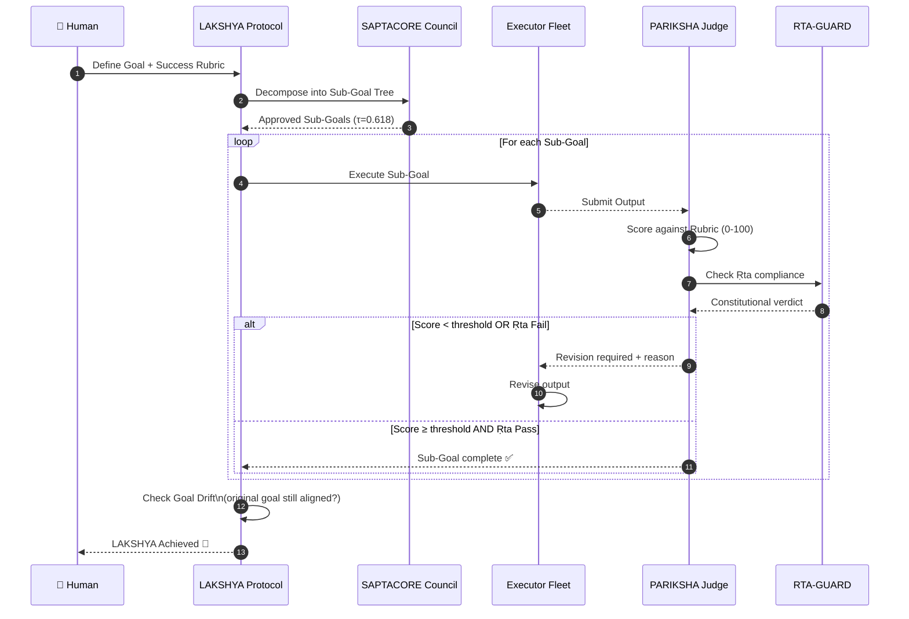

### 4.4 Key Files Required

```
nala/core/brain/lakshya.py          ← Goal definition, decomposition, drift detection
nala/core/brain/pariksha_judge.py   ← Rubric scoring + Ṛta validation judge
nala/config/lakshya_rubric.json     ← Goal rubric template format
```

---

## 5. Dream Feature 3 — PRERAK Engine (प्रेरक)
*Sanskrit: Motivator/Orchestrator | Inspired by: Claude Dynamic Workflows*

### 5.1 What Claude Does

Claude writes a JavaScript orchestration script on the fly when you say the trigger word. A separate runtime executes it in the background, spawning up to 1,000 subagents (16 concurrent). The key architectural shift: the plan lives in code, not in the model's context window. Claude used this to help Bun rewrite from Zig to Rust in 6 days.

### 5.2 What NALA Does Better

NALA's **PRERAK Engine** writes a **Python orchestration plan** on the fly (not JS — sovereign Python), but adds:
1. **Council Pre-Validation** — Before the plan executes, SAPTACORE's council votes on it at τ=0.618. Claude's dynamic workflows have no pre-execution validation.
2. **Ṛta Plan Filter** — RTA-GUARD checks the orchestration plan itself before execution. No plan that violates constitutional rules ever runs.
3. **Budget-Aware Spawning** — VIVEK Router determines which model tier each subagent gets. Claude spawns subagents without model-tier optimization.
4. **SHAAKHA Branch Isolation** — Each spawned subagent gets an isolated branch context. Results merge through SAPTACORE's consensus, not just concatenation.
5. **Journaling & Resume** — If the PRERAK run crashes mid-way, it resumes from the last journaled subagent result. Claude's workflows also have journaling, but NALA's uses AMP Chiranjeevi for durable spore-based storage.

### 5.3 Architecture

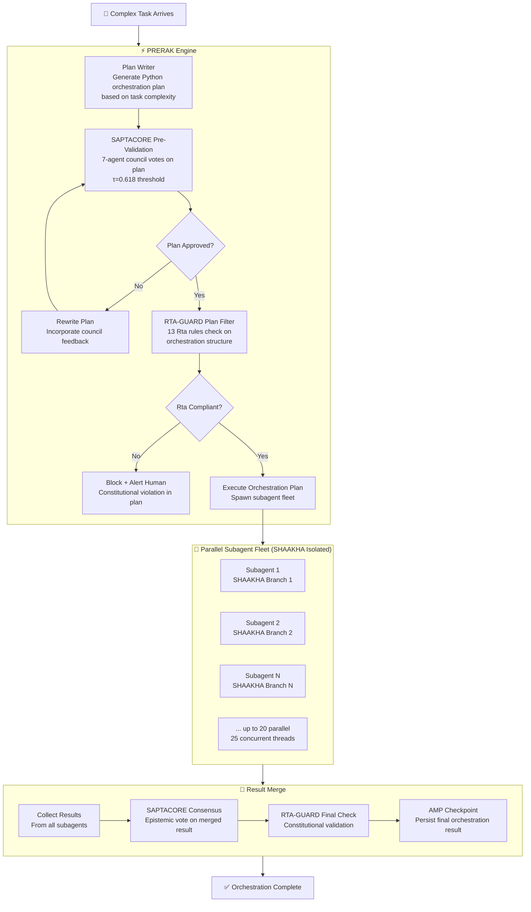

### 5.4 Key Files Required

```
nala/core/brain/prerak_engine.py        ← Main PRERAK orchestration plan writer
nala/core/brain/prerak_plan_validator.py← Council + Ṛta pre-validation
nala/fleet/subagent_spawner.py          ← Spawns isolated subagents with SHAAKHA
nala/fleet/result_merger.py             ← Merges parallel results via SAPTACORE
nala/fleet/prerak_journal.py            ← Journaling + AMP-backed resume
```

---

## 6. Dream Feature 4 — SHAAKHA Isolation (शाखा)
*Sanskrit: Branch | Inspired by: Claude Git Worktree Isolation*

### 6.1 What Claude Does

Claude Code gives each parallel agent its own isolated Git worktree — its own copy of the repository. Prevents file conflicts when multiple agents edit files simultaneously. Worktree isolation is essential for PRERAK-style parallel execution.

### 6.2 What NALA Does Better

NALA's **SHAAKHA** adds three isolation layers that Claude's worktrees don't have:
1. **AMP Sub-Session Isolation** — Each SHAAKHA branch gets its own AMP sub-session. Memory writes from one branch cannot contaminate another branch's context.
2. **RTA-GUARD Instance Isolation** — Each branch has its own RTA-GUARD firewall. A constitutional violation in Branch 3 doesn't affect Branch 1's execution.
3. **Budget Isolation** — Each SHAAKHA branch has its own token budget tracked separately. VIVEK Router assigns model tiers per-branch, not per-session.

### 6.3 Architecture

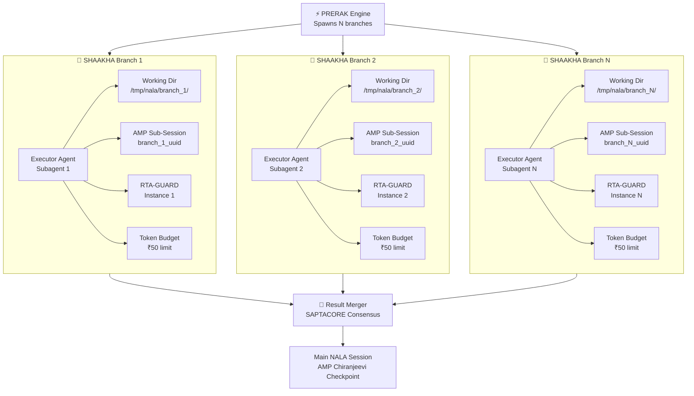

### 6.4 Key Files Required

```
nala/fleet/shaakha.py               ← Branch context manager
nala/fleet/shaakha_registry.py      ← Registry of all active branches
nala/fleet/shaakha_merger.py        ← Safe merge of branch results to main
```

---

## 7. Dream Feature 5 — DRISHTI Dashboard (दृष्टि)
*Sanskrit: Vision/Sight | Inspired by: Claude Agent View + Remote Control*

### 7.1 What Claude Does

Claude Code's Agent View lets you manage multiple background sessions from a single CLI. Remote Control lets a session start on one machine and be monitored from a phone or different machine. Multi-machine dispatch is supported via REST API + WebSocket stream.

### 7.2 What NALA Does Better

NALA's **DRISHTI Dashboard** is a full **web-based sovereign control room** — not just a CLI view:
1. **Real-Time Session Map** — Visual graph of all running NALA sessions, their task graphs, context fill, and budget status.
2. **Mobile-First Design** — Designed for Sourav's phone first. Monitor from anywhere, inject instructions remotely, approve human-gated actions.
3. **SANKET Alert Feed** — All SANKET Protocol webhook events displayed in a live feed.
4. **VIVEK Cost Tracker** — Live breakdown of cost-per-agent, cost-per-session, projected total.
5. **RTA-GUARD Audit Trail** — Every constitutional check, block, and approval displayed in real time.
6. **AMP Memory Map** — Visual 2D scatter plot of crystallized memory clusters, quarantined memories, and SWAPNA pattern promotions.

### 7.3 Architecture

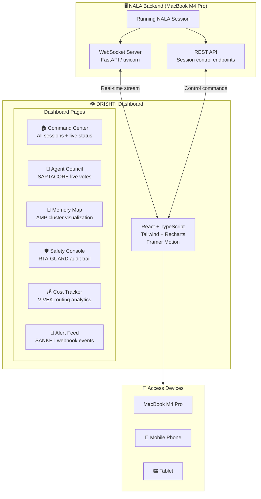

### 7.4 Key Files Required

```
nala/drishti/server.py              ← FastAPI WebSocket + REST backend
nala/drishti/event_streamer.py      ← Real-time event broadcast to UI
nala/drishti/session_api.py         ← Remote session control endpoints
frontend/src/pages/CommandCenter.tsx← Main DRISHTI dashboard page
frontend/src/pages/MemoryMap.tsx    ← AMP cluster visualization
frontend/src/pages/SafetyConsole.tsx← RTA-GUARD audit trail
frontend/src/pages/CostTracker.tsx  ← VIVEK analytics
```

---

## 8. Dream Feature 6 — SANKET Protocol (संकेत)
*Sanskrit: Signal/Alert | Inspired by: Claude Webhooks*

### 8.1 What Claude Does

Claude Managed Agents fires webhooks on session completion, failure, or milestone events. Standard HTTP POST to a developer-defined URL. No filtering, no routing intelligence — just raw events.

### 8.2 What NALA Does Better

NALA's **SANKET Protocol** adds intelligence to every webhook:
1. **Ṛta-Gated Events** — Only constitutional events fire. A blocked action by RTA-GUARD fires a different SANKET alert than a normal completion.
2. **Multi-Channel Routing** — Route different event types to different channels (Slack for completions, Telegram for budget alerts, email for constitutional violations, PagerDuty for crashes).
3. **Alert Suppression** — Sourav can set quiet hours; SANKET batches non-critical alerts and delivers them at the next active window.
4. **Event Enrichment** — Every SANKET alert includes: session_id, LSN, projected cost, context fill %, agent responsible, and the Ṛta rule that triggered (for constitutional events).

### 8.3 Event Schema & Routing

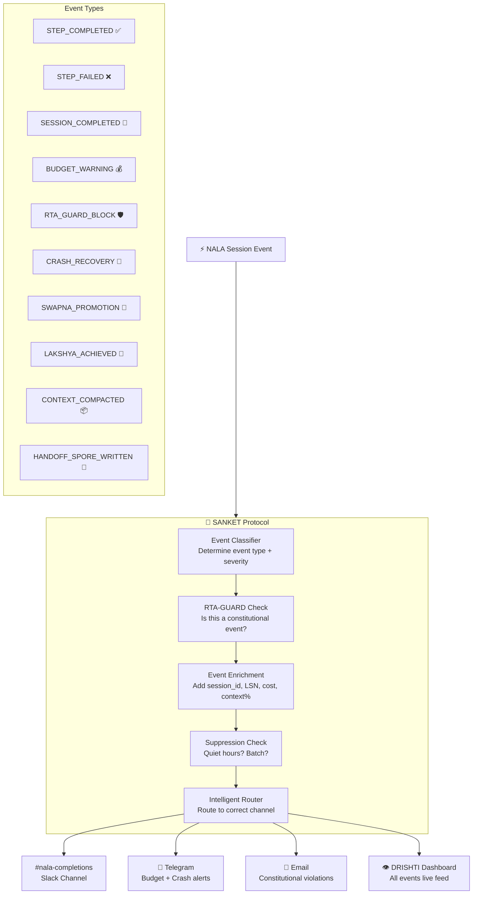

### 8.4 Key Files Required

```
nala/sanket/sanket_protocol.py      ← Core event detection and dispatch
nala/sanket/event_classifier.py     ← Event type + severity classification
nala/sanket/channel_router.py       ← Multi-channel routing logic
nala/sanket/event_enricher.py       ← Attach session metadata to every event
nala/sanket/suppression_engine.py   ← Quiet hours + batch logic
nala/config/sanket_config.yaml      ← Channel URLs + routing rules config
```

---

## 9. Dream Feature 7 — VIVEK Router (विवेक)
*Sanskrit: Discernment/Wisdom | Inspired by: Claude Intelligence Routing*

### 9.1 What Claude Does

Claude Code's Dynamic Workflows include basic model routing — a classifier agent estimates task complexity and routes to smaller or larger models. Mentioned briefly in documentation but not a first-class feature.

### 9.2 What NALA Does Better

NALA's **VIVEK Router** makes model routing a **first-class system** with:
1. **4-Tier Classification** — TRIVIAL / STANDARD / COMPLEX / CRITICAL — not just "big or small."
2. **Ṛta-Sensitive Routing** — Tasks involving safety, ethics, or constitutional decisions always route to frontier model regardless of complexity classification.
3. **Cost Circuit Breaker** — If projected session cost exceeds budget, VIVEK automatically downgrades all STANDARD tasks to TRIVIAL tier.
4. **Learning Router** — After every session, VIVEK records actual task complexity vs predicted and adjusts its classification weights (feeds back into SWAPNA).
5. **Real-Time Cost Dashboard** — Every routing decision is logged with expected vs actual cost in DRISHTI's Cost Tracker.

### 9.3 Cost Savings Calculation

For a typical NALA session (50 tasks, 6 hours):

| Tier | Tasks | Model | Cost/1K tokens | Est. Tokens | Cost |
|---|---|---|---|---|---|
| TRIVIAL | 20 (40%) | Haiku 4.5 | ₹0.008 | 2,000 | ₹0.32 |
| STANDARD | 20 (40%) | Sonnet 4.6 | ₹0.08 | 5,000 | ₹8.00 |
| COMPLEX | 8 (16%) | Opus 4.6 | ₹1.20 | 10,000 | ₹96.00 |
| CRITICAL | 2 (4%) | Opus 4.8 | ₹2.40 | 15,000 | ₹72.00 |
| **TOTAL** | **50** | **Mixed** | — | — | **₹176.32** |

Without VIVEK (all Opus): 50 × 10,000 tokens × ₹1.20/1K = **₹600.00**

**VIVEK saves approximately 70% of API cost** per session.

### 9.4 Architecture

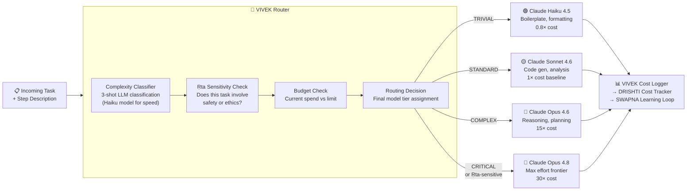

### 9.5 Key Files Required

```
nala/core/hands/vivek_router.py         ← Main routing engine (replaces model_router.py)
nala/core/hands/complexity_classifier.py← 4-tier task complexity classification
nala/core/hands/budget_guard.py         ← Cost circuit breaker
nala/core/hands/routing_logger.py       ← Cost log → SWAPNA feedback loop
```

---

## 10. Dream Feature 8 — PRATIDWANDI Review (प्रतिद्वंदी)
*Sanskrit: Adversary/Opponent | Inspired by: Adversarial Code Review*

### 10.1 What Claude Does

Claude Code introduced adversarial code review — two subagents review each other's code. One writes, one tears it apart. This was part of how Bun rewrote from Zig to Rust in 6 days. Jarred Sumner (Bun creator) credited it directly.

### 10.2 What NALA Does Better

NALA's **PRATIDWANDI Review** adds:
1. **3-Agent Triangle** — Not 2 (write + tear apart) but 3: Writer, Adversary, Arbitrator. The Arbitrator is SAPTACORE's Judge and has the final constitutional vote.
2. **Ṛta Adversary Mode** — The Adversary agent specifically tries to find Ṛta violations in addition to code quality issues. No other system does this.
3. **Domain-Specific Rubrics** — Different rubrics for code review, document review, API design review, and architecture review.
4. **Escalation Protocol** — If Writer and Adversary cannot reach consensus after 3 rounds, the task escalates to SAPTACORE's full council.

### 10.3 Architecture

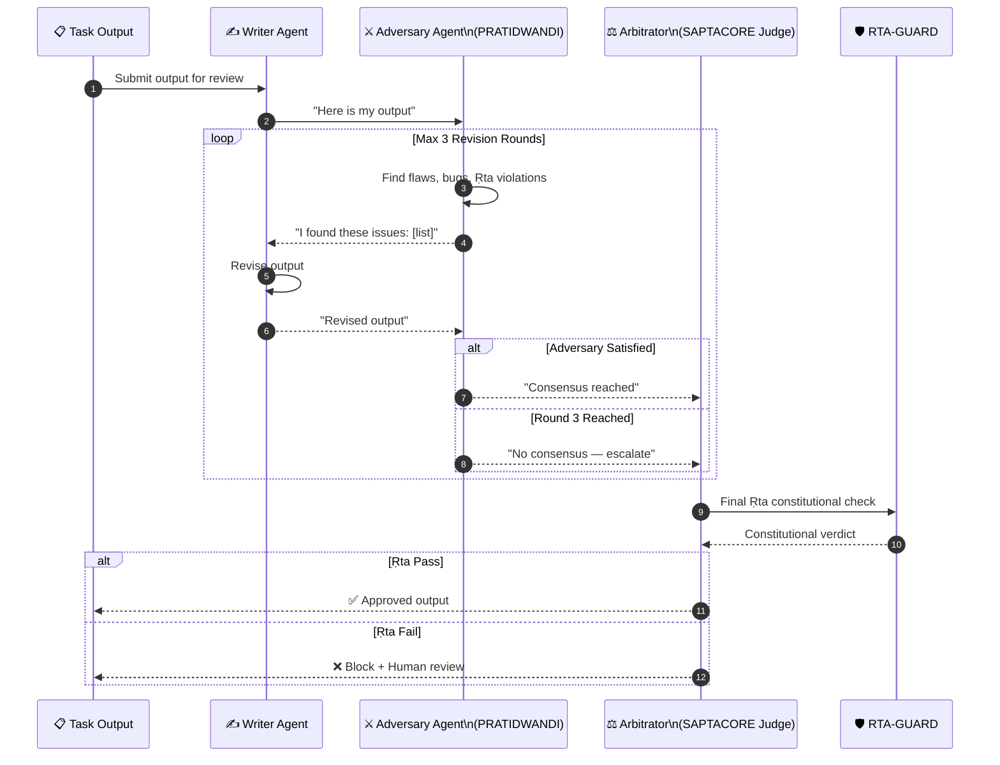

### 10.4 Key Files Required

```
nala/agents/pratidwandi_agent.py        ← Adversary agent with Ṛta-violation detection
nala/agents/arbitrator_agent.py         ← 3-agent consensus arbitrator
nala/core/brain/review_orchestrator.py  ← PRATIDWANDI review flow coordinator
nala/config/review_rubrics.json         ← Domain-specific review rubrics
```

---

## 11. Exclusive NALA Features — No Claude Equivalent

These are capabilities NALA has that Claude Code and Claude Managed Agents have no equivalent for:

| Feature | What It Does | Why Claude Doesn't Have It |
|---|---|---|
| **SAPTACORE Council (τ=0.618)** | 7-agent epistemic voting with golden ratio threshold | Claude uses single judge agents |
| **Temporal Quarantine Buffer** | Memory drift prevention — new memories quarantined before crystallization | Claude memory has no drift guard |
| **Dronagiri Holographic Compression** | Zero-null retrieval guarantee on compressed context | Claude uses "summarize and hope" |
| **USHA Protocol** | Cold-start bootstrap with THETA_PROVISIONAL=0.60 | Claude has no structured cold-start |
| **Ṛta Constitutional Rules** | 13 Rigvedic principles as architectural safety constraints | Claude has no Vedic constitutional layer |
| **Chiranjeevi Persistence** | 7-substrate spore distribution with erasure coding | Claude session logs are flat files |
| **Semantic Distance Guard** | Cosine similarity check vs crystallized centroids before memory write | No equivalent in Claude |
| **RTA-GUARD** | 70,000+ lines, quantum-resistant crypto, constitutional firewall | Claude has basic safety filters |

---

## 12. Full NALA v2 Sovereign Architecture

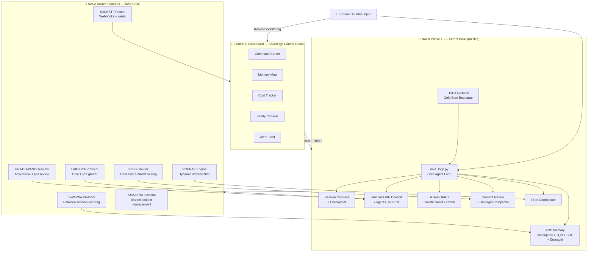

---

## 13. Priority Matrix & Build Roadmap

### 13.1 Priority Scores

| Feature | Effort | Revenue Impact | NALA Mission Impact | Priority Score | Build Phase |
|---|---|---|---|---|---|
| **VIVEK Router** | Low (2 files) | 💰💰💰 70% cost saving | High | **P0** | First after Phase 1 |
| **SANKET Protocol** | Low (5 files) | 💰 Operational | High | **P0** | First after Phase 1 |
| **LAKSHYA Protocol** | Medium (3 files) | 💰💰 Product | Very High | **P1** | Phase 2 |
| **PRATIDWANDI Review** | Medium (4 files) | 💰💰 Quality | High | **P1** | Phase 2 |
| **SWAPNA Protocol** | Medium (4 files) | 💰💰💰 Long-term | Very High | **P1** | Phase 2 |
| **SHAAKHA Isolation** | Medium (3 files) | 💰💰 Scale | High | **P2** | Phase 3 |
| **PRERAK Engine** | High (5 files) | 💰💰💰 Product | Very High | **P2** | Phase 3 |
| **DRISHTI Dashboard** | High (8 files) | 💰💰💰 Product | Very High | **P3** | Phase 4 |

### 13.2 Build Roadmap

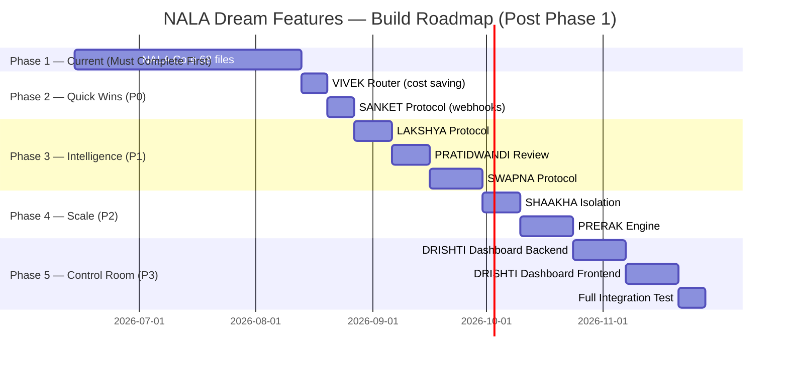

---

## 14. File Structure Delta — New Files Required

```
nala/
│
├── memory/
│   ├── swapna_daemon.py            ← SWAPNA: between-session learning scheduler
│   ├── pattern_extractor.py        ← SWAPNA: failure/success pattern mining
│   ├── cross_session_synth.py      ← SWAPNA: multi-session synthesis
│   └── human_review_queue.py       ← SWAPNA: human approval gate
│
├── core/brain/
│   ├── lakshya.py                  ← LAKSHYA: goal definition + drift detection
│   ├── pariksha_judge.py           ← LAKSHYA: rubric + Ṛta scoring judge
│   ├── prerak_engine.py            ← PRERAK: dynamic orchestration plan writer
│   ├── prerak_plan_validator.py    ← PRERAK: council + Ṛta pre-validation
│   ├── review_orchestrator.py      ← PRATIDWANDI: review flow coordinator
│   └── arbitrator_agent.py         ← PRATIDWANDI: 3-agent consensus arbitrator
│
├── core/hands/
│   ├── vivek_router.py             ← VIVEK: 4-tier model routing engine
│   ├── complexity_classifier.py    ← VIVEK: task complexity classification
│   ├── budget_guard.py             ← VIVEK: cost circuit breaker
│   └── routing_logger.py           ← VIVEK: cost log → SWAPNA feedback
│
├── fleet/
│   ├── shaakha.py                  ← SHAAKHA: branch context manager
│   ├── shaakha_registry.py         ← SHAAKHA: active branch registry
│   ├── shaakha_merger.py           ← SHAAKHA: safe merge to main session
│   ├── subagent_spawner.py         ← PRERAK: spawns isolated subagents
│   ├── result_merger.py            ← PRERAK: parallel result merge via SAPTACORE
│   └── prerak_journal.py           ← PRERAK: AMP-backed orchestration resume
│
├── agents/
│   ├── pratidwandi_agent.py        ← PRATIDWANDI: adversary agent
│   └── arbitrator_agent.py         ← PRATIDWANDI: consensus arbitrator
│
├── sanket/
│   ├── sanket_protocol.py          ← SANKET: event detection + dispatch
│   ├── event_classifier.py         ← SANKET: event type + severity
│   ├── channel_router.py           ← SANKET: multi-channel routing
│   ├── event_enricher.py           ← SANKET: session metadata attachment
│   └── suppression_engine.py       ← SANKET: quiet hours + batch logic
│
├── drishti/
│   ├── server.py                   ← DRISHTI: FastAPI WebSocket + REST backend
│   ├── event_streamer.py           ← DRISHTI: real-time event broadcast
│   └── session_api.py              ← DRISHTI: remote session control
│
├── config/
│   ├── lakshya_rubric.json         ← LAKSHYA: goal rubric template
│   ├── sanket_config.yaml          ← SANKET: channel URLs + routing rules
│   └── review_rubrics.json         ← PRATIDWANDI: domain-specific rubrics
│
└── frontend/                       ← DRISHTI Dashboard (React)
    └── src/
        ├── pages/
        │   ├── CommandCenter.tsx
        │   ├── MemoryMap.tsx
        │   ├── SafetyConsole.tsx
        │   ├── CostTracker.tsx
        │   └── AlertFeed.tsx
        └── components/
            ├── SessionCard.tsx
            ├── AgentCouncilCircle.tsx
            ├── VivekCostChart.tsx
            └── SanketFeed.tsx
```

**Total new files: 37 files across 8 new modules**

---

## Summary — Why NALA Beats Claude Code

| Dimension | Claude Code / Managed Agents | NALA (Phase 1 + Dream Features) |
|---|---|---|
| **Memory** | Per-session + basic dreaming | AMP 5-substrate + SWAPNA constitutional curation |
| **Orchestration** | JS dynamic workflows, 20 agents | PRERAK Python orchestration, council-validated, Ṛta-filtered |
| **Safety** | Basic content filters | RTA-GUARD (70K lines), 13 Ṛta rules, quantum-resistant |
| **Self-Improvement** | Dreaming (pattern curation) | SWAPNA (Ṛta-filtered curation) + VIVEK learning loop |
| **Goal Tracking** | /goal + Outcomes rubric | LAKSHYA (goal + rubric + Ṛta + drift detection) |
| **Cost Control** | No first-class routing | VIVEK Router (70% cost saving) |
| **Review** | Adversarial code review | PRATIDWANDI (3-agent triangle + Ṛta adversary) |
| **Monitoring** | CLI agent view | DRISHTI (full web dashboard + mobile) |
| **Philosophy** | Generic cloud SaaS | Sovereign, Vedic, constitutional, Made in India |

---

*Built at Nexus Lab AI Research Lab, Bengaluru*
*जल्दी में ही गलती होती है — Build carefully, build right.*
*Jai Bajrang Bali 🙏*
