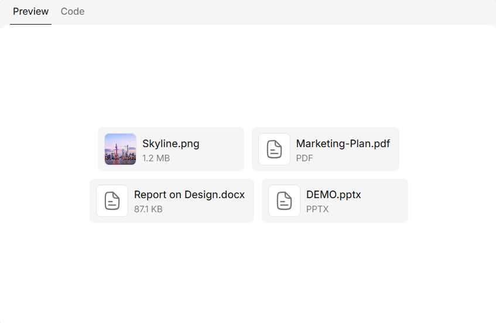

<https://nexus-ui.dev/docs/components/attachments#detailed-variant>

Wider tile with thumbnail, file name, and a second line: formatted **size** when **`attachment.size`** is set, otherwise a **kind** label from the file extension (uppercased, e.g. **PDF**, **XLSX**).

import {
Attachment,
AttachmentList,
type AttachmentMeta,
} from "@/components/nexus-ui/attachments";

const imgSrc =
"<https://images.unsplash.com/photo-1538428494232-9c0d8a3ab403?q=80&w=1740&auto=format&fit=crop&ixlib=rb-4.1.0&ixid=M3wxMjA3fDB8MHxwaG90by1wYWdlfHx8fGVufDB8fHx8fA%3D%3D>";

const items: AttachmentMeta[] = [
{
type: "image",
name: "Skyline.png",
url: imgSrc,
mimeType: "image/png",
size: 1_240_000,
},
{
type: "file",
name: "Marketing-Plan.pdf",
mimeType: "application/pdf",
},
{
type: "file",
name: "Report on Design.docx",
mimeType:
"application/vnd.openxmlformats-officedocument.wordprocessingml.document",
size: 89_200,
},
{
type: "file",
name: "DEMO.pptx",
mimeType:
"application/vnd.openxmlformats-officedocument.presentationml.presentation",
},
];

function AttachmentsVariantDetailed() {
return (

<AttachmentList>
{items.map((item) => (
<Attachment
key={`${item.name}-${item.mimeType}`}
variant="detailed"
attachment={item}
/>
))}
</AttachmentList>

);
}

export default AttachmentsVariantDetailed;

!image.png

"use client";

import * as React from "react";

import {
Attachment,
AttachmentList,
type AttachmentMeta,
} from "@/components/nexus-ui/attachments";

const SAMPLE_TEXT = [
"Lorem ipsum dolor sit amet, consectetur adipiscing elit. Nunc vulputate libero et velit interdum, ac aliquet odio mattis.",
"Class aptent taciti sociosqu ad litora torquent per conubia nostra, per inceptos himenaeos. Curabitur tempus urna at turpis condimentum lobortis.",
"Ut commodo efficitur neque. Ut diam quam, semper iaculis condimentum ac, vestibulum eu nisl. Integer ac erat auctor, faucibus magna sed, tempus metus.",
].join(" ");

function AttachmentsVariantPasted() {
const [items, setItems] = React.useState<AttachmentMeta[]>(() => {
const blob = new Blob([SAMPLE_TEXT], { type: "text/plain" });
const url = URL.createObjectURL(blob);
return [
{
type: "file",
name: "pasted-text.txt",
url,
mimeType: "text/plain",
size: blob.size,
source: "paste",
},
];
});
const itemsRef = React.useRef(items);

React.useEffect(() => {
itemsRef.current = items;
}, [items]);

React.useEffect(
() => () => {
for (const item of itemsRef.current) {
if (item.url?.startsWith("blob:")) {
URL.revokeObjectURL(item.url);
}
}
},
[],
);

const remove = React.useCallback(() => {
for (const item of items) {
if (item.url?.startsWith("blob:")) {
URL.revokeObjectURL(item.url);
}
}
setItems([]);
}, [items]);

return (

<AttachmentList>
{items.map((item) => (
<Attachment
key={`${item.url ?? ""}-${item.name}`}
variant="pasted"
attachment={item}
onRemove={remove}
/>
))}
</AttachmentList>

);
}

export default AttachmentsVariantPasted;

!image.png

import {
Attachment,
AttachmentList,
type AttachmentMeta,
} from "@/components/nexus-ui/attachments";

const item: AttachmentMeta = {
type: "file",
name: "dataset.csv",
mimeType: "text/csv",
size: 2_400_000,
};

function AttachmentsWithProgress() {
return (

<AttachmentList>
<Attachment variant="detailed" attachment={item} progress={62} />
</AttachmentList>

);
}

export default AttachmentsWithProgress;
