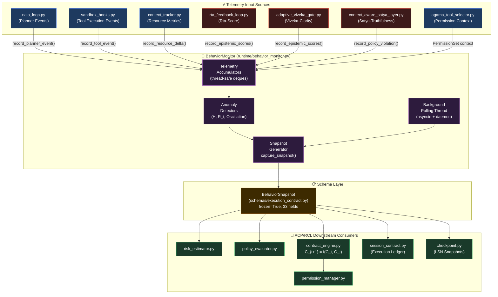
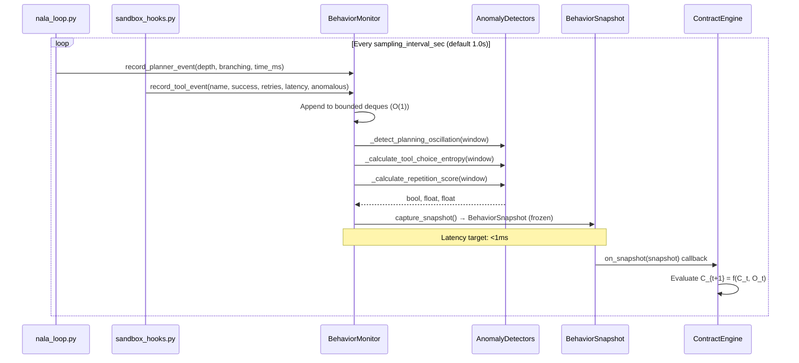

# 📋 Advanced Plan: Behavior Monitor for NALA ACP/RCL
**Target File:** `runtime/behavior_monitor.py`  
**Related Ticket:** NLA-ACP-013  
**Phase:** 2 of 5 (Runtime Modules Implementation)  
**Status:** Ready for Implementation  
**Created:** 2026-07-23  
**Enhanced:** 2026-07-26 — Full Production-Grade Specification  

---

## 🎯 Objective
Implement the **Behavior Monitor**—the telemetry nervous system of NALA's Runtime Constitution Layer (RCL)—to continuously observe, measure, and characterize the agent's real-time execution behavior. This module produces immutable `BehaviorSnapshot` objects that serve as the primary input ($O_t$) for the Adaptive Contract Protocol's contract evolution function:

$$C_{t+1} = f(C_t, O_t)$$

Where:
- $C_t = (P_t, R_t, B_t)$ is the active **ExecutionContract** at time $t$ (PermissionSet, ResourceBudget, BehavioralConstraints)
- $O_t$ is the **BehaviorSnapshot** produced by this module
- $f(\cdot)$ is the **ContractEngine**'s adaptive update function

By providing fine-grained behavioral telemetry, the Behavior Monitor transforms NALA from static, model-driven governance to **dynamic, risk-adaptive execution governance**—enabling graceful degradation and self-healing execution in 24/7 autonomous production deployments.

---

## 🏛️ System Architecture & Telemetry Pipeline

### Complete Integration Diagram



---

### Sequence Diagram: Snapshot Generation Cycle



---

## 🔗 Dependencies & Integration Points

| Component | Dependency Type | Integration Point | Collection Frequency |
|-----------|----------------|-------------------|---------------------|
| `core/harness/nala_loop.py` | Input | Planner metrics via `record_planner_event()` hook | Per planning step (~every 0.5–2s) |
| `core/hands/sandbox_hooks.py` | Input | Tool execution callbacks: `on_tool_pre()`, `on_tool_post()` | Per tool invocation |
| `core/harness/context_tracker.py` | Input | Resource polling via `get_current_resources()` | Per snapshot window |
| `core/safety/rta_feedback_loop.py` | Input | `get_latest_rta_score()` getter | Per snapshot window |
| `core/safety/adaptive_viveka_gate.py` | Input | `get_clarity()` getter | Per snapshot window |
| `core/safety/context_aware_satya_layer.py` | Input | `get_truthfulness()` + violation count | Per snapshot window |
| `core/hands/agama_tool_selector.py` | Input | Baseline permissions for anomaly classification | On monitor init + config change |
| `schemas/execution_contract.py` | Output | Defines `BehaviorSnapshot` — must produce compliant instances | Every snapshot |
| `runtime/risk_estimator.py` | Output | Consumes `BehaviorSnapshot` to calculate risk score | Callback / pull |
| `runtime/policy_evaluator.py` | Output | Validates behavior against Satya/Viveka rules | Callback / pull |
| `runtime/contract_engine.py` | Output | Uses snapshot as $O_t$ in $C_{t+1} = f(C_t, O_t)$ | Callback / pull |
| `core/harness/session_contract.py` | Output | Stores snapshot IDs in execution ledger for deterministic replay | Per snapshot |
| `core/harness/checkpoint.py` | Output | Serializes snapshots for crash recovery LSN markers | On checkpoint trigger |

---

## 📐 Detailed Specification

### 1. Core Responsibilities
The Behavior Monitor shall:
- **Passively observe** real-time telemetry from NALA's existing instrumentation points without blocking or altering execution flow.
- **Aggregate data** into fixed-duration sliding windows (configurable, default 1.0 seconds for fine-grained telemetry).
- **Compute behavioral anomaly indicators** (planning oscillation, tool choice entropy, repetition score) using mathematically rigorous algorithms.
- **Produce immutable** `BehaviorSnapshot` instances (`frozen=True`) at regular intervals or step-based triggers.
- **Expose snapshots** to downstream ACP/RCL components via a thread-safe callback subscriber system.
- **Handle failures gracefully** — if a telemetry source is unavailable, log `WARNING` and continue with available data, setting missing fields to schema defaults (`None`).
- **Maintain low overhead** (<1% CPU impact, <1ms snapshot generation latency on typical hardware).
- **Support full configuration** of window size, sampling rate, and all anomaly detection thresholds via `BehaviorMonitorConfig`.

---

### 2. Complete BehaviorMonitorConfig Specification

```python
class BehaviorMonitorConfig(BaseModel):
    model_config = ConfigDict(frozen=True)

    # Timing & Windowing
    sampling_interval_sec: float = Field(default=1.0, ge=0.1, le=60.0)
    sliding_window_size: int = Field(default=10, ge=2, le=1000)
    snapshot_trigger: Literal['time', 'step', 'hybrid', 'event'] = 'time'
    step_interval: int = Field(default=50, ge=1)

    # Anomaly Detection Thresholds
    max_planner_depth_threshold: int = Field(default=10, ge=1)
    retry_ratio_threshold: float = Field(default=0.3, ge=0.0, le=1.0)
    memory_spike_mb_threshold: float = Field(default=500.0, ge=0.0)
    cpu_spike_threshold_pct: float = Field(default=85.0, ge=0.0, le=100.0)
    tool_repetition_threshold: float = Field(default=0.8, ge=0.0, le=1.0)
    oscillation_amplitude_threshold: float = Field(default=2.0, ge=0.0)
    oscillation_period_max_samples: int = Field(default=3, ge=2)

    # Telemetry Source Toggles
    enabled_sources: Set[str] = Field(
        default={'planner', 'tool', 'resource', 'safety', 'epistemic'}
    )

    # Ring Buffer Sizing
    tool_log_maxlen: int = Field(default=200, ge=10)
    planner_log_maxlen: int = Field(default=100, ge=5)
    resource_log_maxlen: int = Field(default=100, ge=5)
    safety_log_maxlen: int = Field(default=50, ge=5)

    @field_validator('retry_ratio_threshold', 'tool_repetition_threshold')
    @classmethod
    def validate_ratio(cls, v):
        if not 0.0 <= v <= 1.0:
            raise ValueError(f"Ratio must be in [0.0, 1.0], got {v}")
        return v
```

---

### 3. Exhaustive Telemetry Data Mapping (All 33 BehaviorSnapshot Fields)

#### A. Planner Metrics — Source: `nala_loop.py`
| Snapshot Field | Source Hook | Collection Frequency | Fallback Value | Description |
|----------------|-------------|---------------------|----------------|-------------|
| `planner_depth` | `nala_loop._current_depth` | Per planning step | `0` | Current recursion depth of planning stack. Detects planning explosions. |
| `planner_branching_factor` | Avg branches explored per `_plan()` call | Per step | `0.0` | Mean branching factor. High values → indecision or over-exploration. |
| `planner_time_ms` | `time.perf_counter()` delta around planning | Per step | `0.0` | Time spent in planning phase. High relative to execution → analysis paralysis. |

#### B. Tool Execution Metrics — Source: `sandbox_hooks.py`
| Snapshot Field | Source Hook | Collection Frequency | Fallback Value | Description |
|----------------|-------------|---------------------|----------------|-------------|
| `tool_calls_count` | `on_tool_pre()` counter | Per invocation | `0` | Total tool invocations in sampling window. Base rate indicator. |
| `tool_success_count` | `on_tool_post(success=True)` | Per invocation | `0` | Count of successful tool executions in window. |
| `tool_retry_count` | `on_tool_post(retries>0)` | Per invocation | `0` | Executions requiring retries. Indicates flaky tools or bad inputs. |
| `tool_latency_ms` | `time.perf_counter()` delta in sandbox | Per invocation | `0.0` | Average execution time per successful tool call. Detects hangs. |
| `anomalous_tool_requests` | `agama_tool_selector` permission check | Per invocation | `[]` | Tool names violating current `PermissionSet`. Direct security signal. |
| `blocked_tool_attempts` | `permission_manager.check()` returning DENY | Per invocation | `0` | Count of attempts to invoke explicitly blocked tools. |

#### C. Resource Metrics — Source: `context_tracker.py`
| Snapshot Field | Source | Collection Frequency | Fallback Value | Description |
|----------------|--------|---------------------|----------------|-------------|
| `memory_usage_mb` | `psutil.Process().memory_info().rss / 1e6` | Per snapshot | `0.0` | Current RSS memory consumption in MB. |
| `memory_growth_mb` | Delta between consecutive snapshots | Per snapshot | `0.0` | Rate of memory growth. Positive trend → memory leak indicator. |
| `cpu_percent` | `psutil.Process().cpu_percent(interval=None)` | Per snapshot | `0.0` | Process CPU utilization. Spike → compute anomaly. |
| `disk_io_mb` | `psutil.disk_io_counters()` delta | Per snapshot | `0.0` | Disk read + write MB in sampling window. |
| `network_mb` | `psutil.net_io_counters()` delta | Per snapshot | `0.0` | Network sent + received MB in sampling window. |

#### D. Safety & Policy Metrics — Source: Safety Layers
| Snapshot Field | Source | Collection Frequency | Fallback Value | Description |
|----------------|--------|---------------------|----------------|-------------|
| `policy_violations` | `satya_layer.get_violation_count()` | Per snapshot | `0` | Count of Satya-Truthfulness policy violations in window. |
| `safety_layer_triggers` | Aggregated per-layer trigger counters | Per snapshot | `{}` | Dict: `{'viveka_gate': N, 'satya_layer': M, 'rta_guard': K}` |
| `rta_score` | `rta_feedback_loop.get_latest()` | Per snapshot | `None` | Ṛta-Score: epistemic fitness composite [0.0–1.0]. |
| `viveka_clarity` | `adaptive_viveka_gate.get_clarity()` | Per snapshot | `None` | Viveka-Clarity: internal reasoning coherence [0.0–1.0]. |
| `satya_truthfulness` | `satya_layer.get_truthfulness()` | Per snapshot | `None` | Satya-Truthfulness: factual consistency score [0.0–1.0]. |

#### E. Behavioral Anomaly Indicators — Computed In-House
| Snapshot Field | Algorithm | Target Compute Time | Description |
|----------------|-----------|---------------------|-------------|
| `planning_oscillation` | Autocorrelation + zero-crossing detector on depth deque | <0.1ms | `True` if rhythmic depth oscillation pattern detected. |
| `tool_choice_entropy` | Shannon entropy $H(X)$ normalized by $\log_2(N)$ | <0.1ms | [0.0–1.0]: 0=deterministic, 1=uniformly random tool choices. |
| `repetition_score` | Max frequency of identical `(tool, args_hash)` pairs / window_size | <0.1ms | [0.0–1.0]: 1.0=stuck on same call, 0.0=all unique (healthy). |

---

### 4. Mathematical Formulations of Anomaly Detection Algorithms

#### A. Shannon Entropy — Tool Choice Randomness $H(X)$

Given a sliding window of $N_{total}$ tool invocations with $K$ distinct tool names, where $n_i$ is the count of tool $i$:

$$p_i = \frac{n_i}{N_{total}}, \quad \sum_{i=1}^{K} p_i = 1$$

**Raw Shannon Entropy:**
$$H(X) = -\sum_{i=1}^{K} p_i \log_2(p_i)$$

**Normalized Tool Choice Entropy** (bounded to $[0, 1]$):
$$H_{norm}(X) = \begin{cases} 0 & \text{if } K \leq 1 \\ \dfrac{H(X)}{\log_2(K)} & \text{if } K > 1 \end{cases}$$

| $H_{norm}$ Range | Interpretation | ACP Response |
|:-:|---|---|
| $0.0 - 0.2$ | **Deterministic / Focused** — NALA is using one tool repeatedly | Normal if successful; alert if combined with high `repetition_score` |
| $0.2 - 0.6$ | **Balanced Exploration** — Healthy multi-tool task execution | No action required |
| $0.6 - 0.85$ | **High Uncertainty** — Agent switching tools frequently | Mild contract tightening |
| $0.85 - 1.0$ | **Aimless Thrashing** — Near-uniform random tool selection | Contract escalation: reduce `max_tool_calls` in $R_t$ |

---

#### B. Repetition & Stuck State Score $R_t$

Let the sliding window of size $M$ contain tool invocations as pairs $\{(t_j, h_j)\}_{j=1}^{M}$ where $t_j$ is the tool name and $h_j = \text{SHA-256}(\text{args}_j)[{:16}]$ is a truncated argument hash.

**Group by unique pair:**
$$G_k = \{j : (t_j, h_j) = (\hat{t}_k, \hat{h}_k)\}, \quad k = 1, \ldots, P$$

**Repetition Score:**
$$R_t = \frac{\max_{k} |G_k|}{M}$$

| $R_t$ Range | Interpretation | ACP Response |
|:-:|---|---|
| $0.0 - 0.3$ | **Healthy Variation** — Diverse tool calls | No action |
| $0.3 - 0.6$ | **Moderate Repetition** — Some repeating patterns | Log WARNING |
| $0.6 - 0.8$ | **High Repetition** — Likely stuck in a retry loop | Contract tightening |
| $0.8 - 1.0$ | **Stuck State** — Same call being repeated relentlessly | Hard circuit break: pause execution |

**Optional Recency Weighting:**
$$R_t^{weighted} = \frac{\sum_{j \in G_{max}} w_j}{\sum_{j=1}^{M} w_j}, \quad w_j = e^{\lambda(j - 1)}$$

Where $\lambda > 0$ gives higher weight to more recent calls.

---

#### C. Recursive Planning Depth Oscillation Detector

Let the sliding window of $K$ planner depth samples be $\mathbf{d} = [d_1, d_2, \ldots, d_K]$.

**Step 1 — Detrend:** Compute the moving average $\bar{d}_i = \frac{1}{w}\sum_{j=i-w+1}^{i} d_j$ and subtract:
$$\tilde{d}_i = d_i - \bar{d}_i$$

**Step 2 — Zero-Crossing Rate (ZCR):**
$$ZCR = \frac{1}{K-1} \sum_{i=2}^{K} \mathbf{1}[\tilde{d}_{i-1} \cdot \tilde{d}_i < 0]$$

**Step 3 — Peak-to-Peak Amplitude:**
$$A = \max(\mathbf{d}) - \min(\mathbf{d})$$

**Oscillation Criterion:**
$$\text{planning\_oscillation} = \begin{cases} \text{True} & \text{if } ZCR > \dfrac{2}{T_{max}} \text{ AND } A > A_{threshold} \\ \text{False} & \text{otherwise} \end{cases}$$

Where:
- $T_{max}$ = `oscillation_period_max_samples` (default 3): max period of oscillation to flag
- $A_{threshold}$ = `oscillation_amplitude_threshold` (default 2.0 planner depth units)

**Alternative FFT Method** (more robust for longer windows):
$$\text{planning\_oscillation} = \exists f \in [0.1, 2.0] \text{ Hz} : |\hat{D}(f)|^2 > P_{threshold}$$

Where $\hat{D}(f)$ is the DFT of the detrended depth sequence.

---

#### D. Memory & CPU Spike Derivative $\Delta M / \Delta t$

Let $m_k$ = memory in MB at snapshot $k$, $\Delta t$ = sampling interval in seconds:

**Memory Growth Rate:**
$$\dot{M}_k = \frac{m_k - m_{k-1}}{\Delta t} \quad [\text{MB/s}]$$

**Smoothed Derivative (EMA):**
$$\hat{M}_k = \alpha \dot{M}_k + (1-\alpha) \hat{M}_{k-1}, \quad \alpha = 0.3$$

**Spike Detection:**
$$\text{memory\_spike} = \hat{M}_k > \theta_M \quad \text{where } \theta_M = \text{memory\_spike\_mb\_threshold} / \Delta t$$

**CPU Spike (analogous):**
$$\text{cpu\_spike} = \text{cpu\_percent}_k > \theta_{CPU} \quad \text{where } \theta_{CPU} = \text{cpu\_spike\_threshold\_pct}$$

---

### 5. Thread Safety & Low-Overhead Engineering

#### Lock Architecture

```python
# BehaviorMonitor uses a single RLock to guard all mutable state
self._lock: threading.RLock = threading.RLock()

# All telemetry accumulators are bounded deques (O(1) append, O(1) maxlen drop)
self._tool_log:     deque[ToolEvent]     = deque(maxlen=config.tool_log_maxlen)
self._planner_log:  deque[PlannerEvent]  = deque(maxlen=config.planner_log_maxlen)
self._resource_log: deque[ResourceEvent] = deque(maxlen=config.resource_log_maxlen)
self._safety_log:   deque[SafetyEvent]   = deque(maxlen=config.safety_log_maxlen)
```

#### Non-Blocking Event Recording Pattern
```python
def record_tool_event(self, tool_name: str, success: bool,
                      retries: int, latency_ms: float,
                      is_anomalous: bool = False) -> None:
    """O(1) — acquires lock for ~microsecond append, never blocks main loop."""
    event = ToolEvent(
        tool_name=tool_name,
        success=success,
        retries=retries,
        latency_ms=latency_ms,
        is_anomalous=is_anomalous,
        args_hash=None,  # Never store raw args
        timestamp=time.monotonic()
    )
    with self._lock:            # RLock: reentrant, minimal contention
        self._tool_log.append(event)
```

#### Snapshot Generation (Target: <1ms)
```python
def capture_snapshot(self) -> BehaviorSnapshot:
    """
    Atomically reads bounded deques under lock, computes anomalies,
    and constructs an immutable BehaviorSnapshot. Target latency: <1ms.
    """
    t_start = time.perf_counter_ns()
    with self._lock:
        # 1. Take shallow copies of deques (fast)
        tool_snapshot   = list(self._tool_log)
        planner_snapshot = list(self._planner_log)
        resource_snapshot = list(self._resource_log)
        safety_snapshot  = list(self._safety_log)
    # 2. Compute anomalies OUTSIDE lock (no blocking)
    oscillation = self._detect_planning_oscillation(planner_snapshot)
    entropy     = self._calculate_tool_choice_entropy(tool_snapshot)
    repetition  = self._calculate_repetition_score(tool_snapshot)
    t_elapsed_ms = (time.perf_counter_ns() - t_start) / 1e6
    assert t_elapsed_ms < 1.0, f"Snapshot latency {t_elapsed_ms:.3f}ms exceeded 1ms SLA!"
    return BehaviorSnapshot(...)
```

#### Thread Safety Matrix

| Operation | Lock Type | Lock Duration | Risk Level |
|-----------|-----------|---------------|-----------|
| `record_planner_event()` | `RLock` (acquire) | ~1–5 μs (deque.append) | Near-zero |
| `record_tool_event()` | `RLock` (acquire) | ~1–5 μs | Near-zero |
| `record_policy_violation()` | `RLock` (acquire) | ~1–5 μs | Near-zero |
| `capture_snapshot()` — list copy | `RLock` (acquire) | ~10–50 μs (copy deques) | Very low |
| Anomaly computation ($H$, $R_t$, oscillation) | **No lock** | ~100–500 μs | Zero contention |
| Callback notification | **No lock** | Variable (consumer-driven) | Consumer-owned |

#### Ring Buffer Overflow Handling
- All deques are initialized with `maxlen=N` (configurable). When `maxlen` is reached, `deque.appendleft()` automatically evicts the oldest entry.
- **No manual eviction code needed**: Python's `collections.deque` with `maxlen` provides O(1) amortized append with automatic drop of oldest items.
- **Memory bound guarantee**: `max_memory_overhead ≈ maxlen × sizeof(Event)` ≈ 200 × 128 bytes = ~25KB total buffer. Zero memory leak risk.

---

### 6. Complete Class & Method Interface Specification

```python
# ============================================================
# runtime/behavior_monitor.py — Full Interface Specification
# ============================================================
from __future__ import annotations
import threading
import time
import math
import hashlib
from collections import deque
from typing import Callable, Deque, List, Optional, Set
from pydantic import BaseModel, Field, ConfigDict, field_validator
from typing import Literal

from schemas.execution_contract import BehaviorSnapshot

# ── Config ────────────────────────────────────────────────────────────────────
class BehaviorMonitorConfig(BaseModel):
    model_config = ConfigDict(frozen=True)
    sampling_interval_sec: float = 1.0
    sliding_window_size: int = 10
    snapshot_trigger: Literal['time', 'step', 'hybrid', 'event'] = 'time'
    step_interval: int = 50
    max_planner_depth_threshold: int = 10
    retry_ratio_threshold: float = 0.3
    memory_spike_mb_threshold: float = 500.0
    cpu_spike_threshold_pct: float = 85.0
    tool_repetition_threshold: float = 0.8
    oscillation_amplitude_threshold: float = 2.0
    oscillation_period_max_samples: int = 3
    enabled_sources: Set[str] = frozenset({'planner', 'tool', 'resource', 'safety', 'epistemic'})
    tool_log_maxlen: int = 200
    planner_log_maxlen: int = 100
    resource_log_maxlen: int = 100
    safety_log_maxlen: int = 50

# ── Main Monitor Class ─────────────────────────────────────────────────────────
class BehaviorMonitor:
    """
    NALA Runtime Constitution Layer — Behavior Monitor.
    Thread-safe telemetry collection and BehaviorSnapshot producer.
    Target overhead: <1% CPU, <1ms snapshot latency.
    """

    def __init__(self, config: Optional[BehaviorMonitorConfig] = None) -> None: ...

    # ── Public Telemetry Recording Methods ──────────────────────────────────
    def record_planner_event(
        self, depth: int, branching_factor: float, time_ms: float
    ) -> None:
        """O(1) — records planner state into bounded ring buffer."""

    def record_tool_event(
        self, tool_name: str, success: bool, retries: int,
        latency_ms: float, is_anomalous: bool = False, is_blocked: bool = False
    ) -> None:
        """O(1) — records tool invocation event. Never stores raw args."""

    def record_resource_delta(
        self, memory_mb: float, cpu_percent: float,
        disk_io_mb: float, network_mb: float
    ) -> None:
        """O(1) — records instantaneous resource metrics."""

    def record_policy_violation(self, layer_name: str, rule_id: str) -> None:
        """O(1) — records safety layer policy violation event."""

    def record_epistemic_scores(
        self, rta_score: float, viveka_clarity: float, satya_truthfulness: float
    ) -> None:
        """O(1) — records latest epistemic fitness scores from safety layers."""

    # ── Snapshot Production ─────────────────────────────────────────────────
    def capture_snapshot(self) -> BehaviorSnapshot:
        """
        Atomically reads all bounded deques, computes anomaly indicators,
        and returns an immutable BehaviorSnapshot. Target latency: <1ms.
        """

    def get_latest_snapshot(self) -> Optional[BehaviorSnapshot]:
        """Returns most recently captured snapshot, or None if not yet available."""

    def subscribe(self, callback: Callable[[BehaviorSnapshot], None]) -> None:
        """Registers a subscriber callback invoked on each new snapshot."""

    def unsubscribe(self, callback: Callable[[BehaviorSnapshot], None]) -> None:
        """Removes a previously registered subscriber callback."""

    # ── Lifecycle Management ─────────────────────────────────────────────────
    def start_background_monitoring(self) -> None:
        """Starts the daemon polling thread. Safe to call once."""

    def stop_background_monitoring(self, timeout_sec: float = 5.0) -> None:
        """Signals the polling thread to stop and joins it."""

    def reset_accumulators(self) -> None:
        """Thread-safely clears all telemetry ring buffers. Use for test teardown."""

    # ── Anomaly Detection (Private) ──────────────────────────────────────────
    def _detect_planning_oscillation(
        self, planner_events: List
    ) -> bool:
        """Detrend → ZCR + amplitude check → FFT fallback for longer windows."""

    def _calculate_tool_choice_entropy(
        self, tool_events: List
    ) -> float:
        """H_norm = H(X) / log2(K). Returns 0.0 if K <= 1."""

    def _calculate_repetition_score(
        self, tool_events: List
    ) -> float:
        """R_t = max(|G_k|) / M using SHA-256 truncated args hashes."""

    def _compute_memory_derivative(
        self, resource_events: List
    ) -> float:
        """EMA-smoothed ΔM/Δt in MB/s."""
```

---

### 7. Sliding Window Architecture

- **Window Duration**: Configurable (default `sampling_interval_sec = 1.0`s).
- **Data Structures**: All are bounded `collections.deque` with `maxlen` for O(1) append and automatic oldest-entry eviction.
- **Window Snapshot Cycle:**

```
┌─────────────────────────────────────────────────────────────────────────────┐
│                        SLIDING WINDOW SNAPSHOT CYCLE                        │
│                                                                             │
│   t=0s        t=1s        t=2s        t=3s        t=4s        t=5s         │
│   ┌──────┐    ┌──────┐    ┌──────┐    ┌──────┐    ┌──────┐    ┌──────┐    │
│   │ W0   │    │ W1   │    │ W2   │    │ W3   │    │ W4   │    │ W5   │    │
│   │Events│───►│Events│───►│Events│───►│Events│───►│Events│───►│Events│    │
│   └──────┘    └──────┘    └──────┘    └──────┘    └──────┘    └──────┘    │
│        │           │           │           │           │           │        │
│   Snap0 ▼     Snap1 ▼     Snap2 ▼     Snap3 ▼     Snap4 ▼     Snap5 ▼     │
│   [O_0]       [O_1]       [O_2]       [O_3]       [O_4]       [O_5]       │
│                                                                             │
│   ContractEngine evaluates: C_{t+1} = f(C_t, O_t) on each Snap            │
└─────────────────────────────────────────────────────────────────────────────┘
```

---

### 8. Snapshot Generation Triggers

| Trigger Mode | When It Fires | Best For |
|---|---|---|
| **`'time'`** (default) | Every `sampling_interval_sec` seconds | Predictable 24/7 background operation |
| **`'step'`** | After every `step_interval` tool invocations | High-frequency short tasks |
| **`'hybrid'`** | Whichever of time or step fires first | General production use |
| **`'event'`** | Immediately on policy violation or resource threshold breach | Security-sensitive deployments |

---

### 9. Fault Tolerance & Graceful Degradation

| Failure Scenario | Detection Method | Recovery Action |
|---|---|---|
| `rta_feedback_loop` unavailable | `try/except` around `get_latest()` | Set `rta_score = None`, log `WARNING`, continue snapshot |
| `context_tracker` unavailable | `try/except` around resource poll | Set all resource fields to `0.0`, log `WARNING` |
| Monitor thread crash | `nala_loop.py` watchdog via `threading.Thread.is_alive()` | Automatically restart `start_background_monitoring()` |
| Snapshot consumer slow | `queue.Queue.put_nowait()` with drop-oldest on `Full` | Drop oldest snapshot; log `DEBUG` |
| Lock timeout | `self._lock.acquire(timeout=0.1)` with fallback | Log `ERROR`, return last known snapshot |
| Ring buffer at `maxlen` | `deque.appendleft()` auto-eviction | Oldest entry silently dropped — zero action needed |

---

### 10. Security & Privacy Rules

| Data Type | Storage Policy | Rationale |
|---|---|---|
| Tool raw arguments (`args`) | **NEVER stored** | Prevents leaking user data, credentials, file contents |
| Args for repetition detection | `SHA-256(repr(args))[:16]` truncated hash only | Enables pattern detection without data exposure |
| Memory addresses / pointers | **NEVER stored** | Prevents information disclosure attacks |
| File paths accessed by tools | **NEVER stored** in snapshots | Stored separately in `session_contract.py` audit ledger |
| Epistemic scores ($\rho_t, V_t, S_t$) | Stored as `float` values | Safe — no PII content |
| Snapshots themselves | Safe for ledger storage and network transmission | All fields are numeric counts, floats, or hashed values |

---

## ⚙️ Implementation Considerations

### 1. Existing NALA Integration Points (Non-Invasive)
- **Do NOT modify** existing core files for MVP.
- **`sandbox_hooks.py`**: Already designed with `on_tool_pre()` / `on_tool_post()` callback hooks — register `BehaviorMonitor.record_tool_event` here.
- **`nala_loop.py`**: Append `BehaviorMonitor.record_planner_event` to an observable callback list, or access `session_state.planner_depth` at each step boundary.
- **`context_tracker.py`**: Poll `get_current_resources()` at snapshot generation time.
- **Safety Layers**: Call `get_latest()` / `get_clarity()` / `get_truthfulness()` getters inside `capture_snapshot()`.

### 2. Performance Optimization
- All event recording methods are **O(1)** — counter increments + single deque append.
- Expensive computations ($H$, $R_t$, oscillation) are **computed outside the lock** on deque snapshots (shallow copies) to minimize contention.
- Use `time.monotonic()` for all internal timestamps (immune to system clock changes).
- Use `time.perf_counter_ns()` for latency measurements.
- Pre-compute `log2` values in `_calculate_tool_choice_entropy()` using `math.log2()` (no import overhead).

### 3. Testing Strategy

| Test Type | Target | Method |
|---|---|---|
| Unit — Snapshot Schema | All 33 fields valid | Mock all sources, call `capture_snapshot()`, validate against Pydantic schema |
| Unit — Entropy | $H_{norm} \in [0,1]$ | Single tool → 0.0; all distinct tools → 1.0 |
| Unit — Repetition | $R_t \in [0,1]$ | Same call × M → 1.0; all unique → 0.0 |
| Unit — Oscillation | Boolean correct | Inject depth sequence [3,7,3,7,3,7] → `True`; [5,5,5] → `False` |
| Unit — Privacy | No raw args stored | Assert `args` not in any ToolEvent in `_tool_log` |
| Integration — Memory | `memory_growth_mb` tracks real growth | Allocate known buffer, assert delta within 5% |
| Performance — Latency | `capture_snapshot() < 1ms` | `time.perf_counter_ns()` benchmark over 10,000 snapshots |
| Performance — CPU | `< 1% overhead` | `psutil.cpu_percent()` diff during 60s monitor run |
| Soak — Thread Safety | Zero race conditions | 10 threads × 1,000 events + concurrent snapshot capture → no assertion errors |
| Soak — Memory | 0 MB/hr leak rate | 24-hour run → RSS growth < 5MB total |

---

## 📈 Integration Roadmap with Existing NALA

### Phase 2 (Current) — Behavior Monitor MVP
1. Implement `runtime/behavior_monitor.py` with full specification above.
2. Register hooks into `sandbox_hooks.py` (non-invasive callback registration).
3. Verify schema compliance: all `BehaviorSnapshot` instances validate against `schemas/execution_contract.py`.
4. Run thread-safety soak test (10 threads, 1,000 events each).
5. Confirm <1ms snapshot latency and <1% CPU overhead benchmarks.

### Phase 3 — Risk Estimator Integration
- Implement `runtime/risk_estimator.py` consuming `BehaviorSnapshot` via callback.
- Wire `BehaviorMonitor.subscribe(risk_estimator.on_snapshot)`.
- Persist snapshot IDs in `session_contract.py` execution ledger.

### Phase 4 — Full ACP/RCL Pipeline
- Wire: `BehaviorMonitor` → `RiskEstimator` → `PolicyEvaluator` → `ContractEngine` → `PermissionManager`.
- Integrate into `nala_loop.py` pre/post-step checks.
- Enable live `ResourceBudget` ($R_t$) dynamic time horizon updates.

### Phase 5 — Production Hardening
- Build behavioral anomaly simulation benchmarks.
- Verify ACP/RCL response times and accuracy against ground-truth injected anomalies.
- Enable compressed snapshot formats for low-bandwidth remote telemetry scenarios.

---

## ✅ Verification Matrix — Acceptance Criteria

| Criterion | Target Metric | Test Method |
|-----------|--------------|-------------|
| Schema Compliance | 100% valid `BehaviorSnapshot` instances | Pydantic validation on 10,000 generated snapshots |
| Snapshot Latency | **< 1 ms** | `perf_counter_ns()` over 10,000 snapshots |
| CPU Overhead | **< 1%** process CPU added | `psutil` before/after 60s monitor run |
| Memory Leak Rate | **= 0 MB/hr** over 24hr soak | RSS monitoring every 60s |
| Anomaly FP Rate | **< 1%** false positives | Inject known-clean execution trace; assert zero anomalies |
| Thread Safety | **Zero race conditions** | 10 threads × 1,000 events, concurrent snapshot capture |
| Fault Tolerance | Monitor continues with degraded data when 1+ sources fail | Kill each telemetry source in turn; assert snapshot generation continues |
| Privacy | Zero raw args stored | Assert `args` field absent in all `ToolEvent` log entries |
| Configuration | All thresholds adjustable without code changes | Instantiate with non-default `BehaviorMonitorConfig`; verify behavior changes |
| Production Readiness | Passes linting, mypy strict, ruff, full docstrings | CI pipeline gate |

---

## 📁 File Location
```
E:\NALA-Project\NALA\runtime\
└── behavior_monitor.py
```

**Note:** The `runtime/` directory must be created before implementing this file. Create with:
```powershell
New-Item -ItemType Directory -Path "E:\NALA-Project\NALA\runtime" -Force
```

---

## 🔄 Relationship to NALA's Transcendent Dual-Mode Framework & Āgama Tool Selector

| Layer | Existing Role | Behavior Monitor Enhancement |
|-------|---------------|------------------------------|
| **Transcendental Model Router** (Gaṇeśa/Sarasvatī/Śiva) | Sets baseline tool recommendations based on Ṛta-Score thresholds | Provides behavioral context: e.g., "Despite being in Śiva-model (high Ṛta), `repetition_score=0.95` suggests stuck state — temporarily override model recommendation." |
| **Āgama Tool Selector** (Layer 2) | Applies static dharmic classifications (Śruti/Smṛti/Śiṣṭa/Ātmasantuṣṭi) and weights | Adds dynamic adjustments: e.g., "Baseline Śruti-tool weight=0.9, but high `anomalous_requests` reduces effective weight to 0.4 for this window." |
| **RTA Feedback Loop** | Computes $\rho_t = \frac{V_t \times S_t}{\Delta_t + \Lambda_t + \varepsilon}$ | Supplies raw $V_t$ (Viveka-Clarity) and $S_t$ (Satya-Truthfulness) for granular risk factor decomposition. |
| **Hysteresis Tool Governor** | Tracks historical tool success rates to prevent thrashing | Provides real-time **leading indicators** ($R_t$, oscillation) that predict future thrashing *before* historical success rates degrade. |
| **Satya/Viveka Layers** | Validate policy compliance and internal coherence | Feeds their metrics into behavioral anomaly detection (e.g., low `viveka_clarity` correlates with high `planning_oscillation`). |

**Result**: A **dual-governance system**:
- **Layer 1–2 (Static):** Transcendental model + Āgama selector provide **foundational, model-appropriate tool baselines**.
- **Layer 2.5 (Dynamic):** Behavior Monitor + ACP/RCL provide **real-time, behavior-responsive adjustments** to those baselines.

This enables NALA to exhibit **graceful degradation** and **self-healing execution** — critical for 24/7 autonomous agents in production environments where static models cannot anticipate every behavioral anomaly.

---

*This plan establishes the critical telemetry foundation for the Adaptive Contract Protocol. Once the Behavior Monitor is producing accurate, low-overhead `BehaviorSnapshot` objects, all subsequent ACP/RCL components (Risk Estimator, Policy Evaluator, Contract Engine, Permission Manager) will have the real-time behavioral data they need to transform NALA from a statistically-governed prototype into a dynamically-adaptive, production-grade, 24/7 sovereign autonomous agent runtime.*