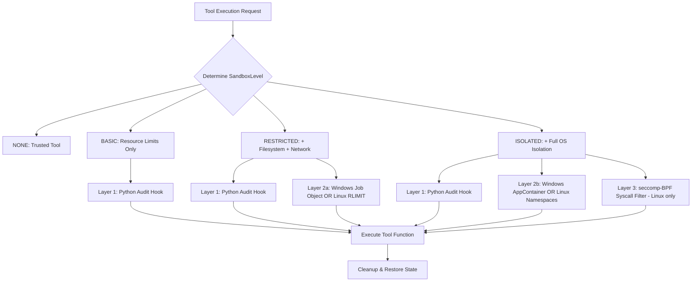

# Hardening the NALA Sandboxing Layer: From Prototype to Enterprise Isolation

> **Status**: BACKLOG — Implementation-Ready Specification  
> **Target File**: `core/hands/sandbox.py`  
> **Priority**: Critical Security  
> **Effort Estimate**: 3–4 Sprints

---

## 1. Problem Statement & Attack Surface Analysis

The current `core/hands/sandbox.py` is a well-architected but hollow wrapper. It provides the scaffolding of a security system without enforcing any true OS-level constraints. A determined or malicious tool can escape in the following ways:

| Escape Vector | Root Cause | Current Risk |
| :--- | :--- | :--- |
| **Absolute Path Traversal** | `os.chdir` only changes relative context. Absolute paths work freely. | **CRITICAL** |
| **Outbound Network Sockets** | `network_guard()` is a no-op placeholder. Any `socket`, `urllib`, `httpx` call works. | **CRITICAL** |
| **Subprocess Spawning** | `RLIMIT_NPROC` is Unix-only; Windows has no active limit. `os.system()` works freely. | **HIGH** |
| **Windows Resource Exhaustion** | CPU/Memory limits are logged as placeholders but not enforced via Win32 API. | **HIGH** |
| **Environment Variable Injection** | On non-ISOLATED levels, `LD_PRELOAD` and `PYTHONPATH` remain in the process environment. | **MEDIUM** |
| **Symbolic Link Attacks** | Temp directory created via `tempfile.mkdtemp` does not follow symlinks to sandbox jail. | **MEDIUM** |

---

## 2. Hardening Roadmap — Defence in Depth

Security is achieved via three reinforcing layers. If a deeper layer is unavailable (e.g., kernel namespaces require root), the system gracefully degrades to the highest available layer and reports the reduced capability in the health check.



---

## 3. Detailed Architecture

---

### Phase 1: Python Audit Hooks — Robust Whitelist Path Resolver

Python's `sys.addaudithook` (PEP 578, Python 3.8+) registers an **irreversible** hook that intercepts CPython-level I/O events before they reach the OS. Once installed, the hook cannot be removed for the lifetime of the interpreter, making it tamper-proof for sandboxed tool code.

> **Important**: `sys.addaudithook` hooks are **permanent** for the interpreter session. We must install the hook once at sandbox manager initialization with configurable allow-lists, not on each invocation.

#### 3.1.1 Whitelist Path Resolver

The naive implementation using `sys.path` is insufficient — it allows access to the entire Python virtual environment tree, including package source code that malicious tools could read for reconnaissance. The production implementation uses a precise, frozen allow-list:

```python
import sys
import os
import sysconfig
from pathlib import Path
from typing import FrozenSet

def _build_sandbox_allowlist(sandbox_temp_dir: str) -> FrozenSet[str]:
    """
    Construct the exact set of allowed filesystem prefixes for a sandboxed tool.
    Only these paths can be opened for reading. Nothing outside can be touched.
    """
    allowed = set()

    # 1. The sandbox's own temporary working directory
    allowed.add(os.path.realpath(sandbox_temp_dir))

    # 2. Python standard library (read-only)
    stdlib_path = sysconfig.get_paths()["stdlib"]
    if stdlib_path:
        allowed.add(os.path.realpath(stdlib_path))

    # 3. Python platlib (compiled extensions like .pyd / .so)
    platlib = sysconfig.get_paths().get("platlib", "")
    if platlib:
        allowed.add(os.path.realpath(platlib))

    # 4. The active virtual environment's site-packages (read-only)
    # This allows the tool to import installed libraries
    for path in sys.path:
        if path and ("site-packages" in path or "dist-packages" in path):
            resolved = os.path.realpath(path)
            if os.path.isdir(resolved):
                allowed.add(resolved)

    # 5. Python executable directory (needed for import machinery)
    python_exec = os.path.realpath(sys.executable)
    allowed.add(os.path.dirname(python_exec))

    return frozenset(allowed)


def _is_path_allowed(path: str, allowlist: FrozenSet[str]) -> bool:
    """Check if a given path falls under any allowed prefix."""
    try:
        real = os.path.realpath(os.path.abspath(path))
    except (OSError, ValueError):
        return False
    return any(real.startswith(prefix) for prefix in allowlist)


def build_sandbox_audit_hook(allowlist: FrozenSet[str], sandbox_level: int):
    """
    Factory that returns a configured audit hook closure.
    sandbox_level: 1=BASIC, 2=RESTRICTED, 3=ISOLATED
    """
    def _hook(event: str, args):
        # --- FILESYSTEM EVENTS ---
        if event in ("open", "os.open", "io.open", "builtins.open"):
            if args:
                path = args[0]
                if isinstance(path, (str, bytes)):
                    path_str = path.decode() if isinstance(path, bytes) else path
                    mode = args[1] if len(args) > 1 else "r"
                    # Block ALL writes except to sandbox temp dir
                    if isinstance(mode, str) and any(c in mode for c in "wxa+"):
                        sandbox_dir = next(iter(allowlist), "")
                        if not os.path.realpath(os.path.abspath(path_str)).startswith(sandbox_dir):
                            raise PermissionError(
                                f"[SandboxViolation] Write blocked outside sandbox: {path_str}"
                            )
                    # Block reads outside allowlist
                    elif not _is_path_allowed(path_str, allowlist):
                        raise PermissionError(
                            f"[SandboxViolation] Read blocked outside allowlist: {path_str}"
                        )

        # --- NETWORK EVENTS (RESTRICTED+) ---
        if sandbox_level >= 2 and event in ("socket.connect", "socket.sendto"):
            raise PermissionError(
                f"[SandboxViolation] Network call '{event}' blocked in sandbox"
            )

        # --- SUBPROCESS EVENTS ---
        if sandbox_level >= 2 and event in ("subprocess.Popen", "os.system", "os.exec"):
            raise PermissionError(
                f"[SandboxViolation] Process spawn '{event}' blocked in sandbox"
            )

        # --- DANGEROUS OS OPERATIONS ---
        if sandbox_level >= 3 and event in (
            "os.chmod", "os.chown", "os.setuid", "os.setgid",
            "os.symlink", "os.link", "os.mount", "shutil.rmtree"
        ):
            raise PermissionError(
                f"[SandboxViolation] Privileged OS op '{event}' blocked in isolated sandbox"
            )

    return _hook
```

---

### Phase 2A: Windows OS-Level Enforcement — Job Objects via ctypes

Windows Job Objects enforce hard kernel-level resource limits on a process tree. All resource consumption from the tool process and any child it spawns is tracked and capped. The implementation uses `ctypes` to call the Win32 API directly from Python without any native extension.

#### 3.2.1 ctypes Structure Definitions

```python
import ctypes
import ctypes.wintypes as wintypes

# ---------------------------------------------------------------
# Win32 Constants
# ---------------------------------------------------------------
JOB_OBJECT_LIMIT_PROCESS_TIME    = 0x00000002  # Per-process CPU time limit
JOB_OBJECT_LIMIT_JOB_TIME        = 0x00000004  # Total CPU time for entire job
JOB_OBJECT_LIMIT_ACTIVE_PROCESS  = 0x00000008  # Max active process count
JOB_OBJECT_LIMIT_JOB_MEMORY      = 0x00000200  # Max total committed memory
JOB_OBJECT_LIMIT_KILL_ON_JOB_CLOSE = 0x00002000  # Kill all when handle closes
JOB_OBJECT_LIMIT_DIE_ON_UNHANDLED_EXCEPTION = 0x00000400

JobObjectExtendedLimitInformation = 9  # info class for SetInformationJobObject


class IO_COUNTERS(ctypes.Structure):
    _fields_ = [
        ("ReadOperationCount",  ctypes.c_uint64),
        ("WriteOperationCount", ctypes.c_uint64),
        ("OtherOperationCount", ctypes.c_uint64),
        ("ReadTransferCount",   ctypes.c_uint64),
        ("WriteTransferCount",  ctypes.c_uint64),
        ("OtherTransferCount",  ctypes.c_uint64),
    ]


class JOBOBJECT_BASIC_LIMIT_INFORMATION(ctypes.Structure):
    _fields_ = [
        ("PerProcessUserTimeLimit", ctypes.c_int64),   # 100-nanosecond units
        ("PerJobUserTimeLimit",     ctypes.c_int64),
        ("LimitFlags",             ctypes.c_uint32),
        ("MinimumWorkingSetSize",  ctypes.c_size_t),
        ("MaximumWorkingSetSize",  ctypes.c_size_t),
        ("ActiveProcessLimit",     ctypes.c_uint32),
        ("Affinity",               ctypes.c_size_t),
        ("PriorityClass",          ctypes.c_uint32),
        ("SchedulingClass",        ctypes.c_uint32),
    ]


class JOBOBJECT_EXTENDED_LIMIT_INFORMATION(ctypes.Structure):
    _fields_ = [
        ("BasicLimitInformation", JOBOBJECT_BASIC_LIMIT_INFORMATION),
        ("IoInfo",                IO_COUNTERS),
        ("ProcessMemoryLimit",    ctypes.c_size_t),
        ("JobMemoryLimit",        ctypes.c_size_t),
        ("PeakProcessMemoryUsed", ctypes.c_size_t),
        ("PeakJobMemoryUsed",     ctypes.c_size_t),
    ]
```

#### 3.2.2 Win32 API Function Bindings

```python
_kernel32 = ctypes.WinDLL("kernel32", use_last_error=True)

# HANDLE CreateJobObjectW(LPSECURITY_ATTRIBUTES, LPCWSTR)
_kernel32.CreateJobObjectW.restype = wintypes.HANDLE
_kernel32.CreateJobObjectW.argtypes = [
    ctypes.c_void_p,   # lpJobAttributes (NULL = default security)
    wintypes.LPCWSTR,  # lpName (NULL = anonymous)
]

# BOOL AssignProcessToJobObject(HANDLE, HANDLE)
_kernel32.AssignProcessToJobObject.restype = wintypes.BOOL
_kernel32.AssignProcessToJobObject.argtypes = [
    wintypes.HANDLE,  # hJob
    wintypes.HANDLE,  # hProcess
]

# BOOL SetInformationJobObject(HANDLE, JOBOBJECTINFOCLASS, LPVOID, DWORD)
_kernel32.SetInformationJobObject.restype = wintypes.BOOL
_kernel32.SetInformationJobObject.argtypes = [
    wintypes.HANDLE,   # hJob
    ctypes.c_int,      # JobObjectInformationClass
    ctypes.c_void_p,   # lpJobObjectInformation
    wintypes.DWORD,    # cbJobObjectInformationLength
]

# HANDLE GetCurrentProcess()
_kernel32.GetCurrentProcess.restype = wintypes.HANDLE
_kernel32.GetCurrentProcess.argtypes = []
```

#### 3.2.3 Job Object Activation

```python
def _apply_windows_job_object(cpu_limit_s: float, memory_limit_bytes: int, max_processes: int = 1):
    """
    Create a Windows Job Object and assign the current process to it.
    All child processes spawned from this point will also inherit the job.
    """
    job_handle = _kernel32.CreateJobObjectW(None, None)
    if not job_handle:
        raise OSError(f"CreateJobObjectW failed: {ctypes.get_last_error()}")

    info = JOBOBJECT_EXTENDED_LIMIT_INFORMATION()
    # CPU limit: convert seconds to 100-nanosecond intervals
    cpu_limit_100ns = int(cpu_limit_s * 10_000_000)
    info.BasicLimitInformation.PerProcessUserTimeLimit = cpu_limit_100ns
    info.BasicLimitInformation.ActiveProcessLimit = max_processes
    info.BasicLimitInformation.LimitFlags = (
        JOB_OBJECT_LIMIT_PROCESS_TIME   |
        JOB_OBJECT_LIMIT_ACTIVE_PROCESS |
        JOB_OBJECT_LIMIT_JOB_MEMORY     |
        JOB_OBJECT_LIMIT_KILL_ON_JOB_CLOSE
    )
    info.JobMemoryLimit = memory_limit_bytes

    ok = _kernel32.SetInformationJobObject(
        job_handle,
        JobObjectExtendedLimitInformation,
        ctypes.byref(info),
        ctypes.sizeof(info)
    )
    if not ok:
        raise OSError(f"SetInformationJobObject failed: {ctypes.get_last_error()}")

    proc_handle = _kernel32.GetCurrentProcess()
    ok = _kernel32.AssignProcessToJobObject(job_handle, proc_handle)
    if not ok:
        raise OSError(f"AssignProcessToJobObject failed: {ctypes.get_last_error()}")

    return job_handle  # caller must CloseHandle on cleanup
```

---

### Phase 2B: Linux/macOS — Kernel Namespace Isolation via ctypes

Linux namespaces provide true OS-level isolation without requiring Docker or a hypervisor. They are available on any Linux kernel ≥ 3.8.

#### 3.3.1 Namespace Constants & libc Bindings

```python
import ctypes
import ctypes.util

# ---------------------------------------------------------------
# Linux Namespace Clone Flags
# ---------------------------------------------------------------
CLONE_NEWNS   = 0x00020000   # Mount namespace — isolates filesystem mounts
CLONE_NEWNET  = 0x40000000   # Network namespace — isolates all network interfaces
CLONE_NEWPID  = 0x20000000   # PID namespace — hides host processes
CLONE_NEWUSER = 0x10000000   # User namespace — remaps UIDs (allows unprivileged namespaces)
CLONE_NEWIPC  = 0x08000000   # IPC namespace — isolates System V IPC objects
CLONE_NEWUTS  = 0x04000000   # UTS namespace — isolates hostname/domainname

# Combined flag for ISOLATED sandbox
NALA_ISOLATED_NS_FLAGS = (
    CLONE_NEWNS   |
    CLONE_NEWNET  |
    CLONE_NEWPID  |
    CLONE_NEWIPC  |
    CLONE_NEWUTS
)

# ---------------------------------------------------------------
# libc bindings
# ---------------------------------------------------------------
_libc_name = ctypes.util.find_library("c")
_libc = ctypes.CDLL(_libc_name, use_errno=True)

# int unshare(int flags)  — detach namespaces without fork
_libc.unshare.restype  = ctypes.c_int
_libc.unshare.argtypes = [ctypes.c_int]

# int chroot(const char *path)
_libc.chroot.restype  = ctypes.c_int
_libc.chroot.argtypes = [ctypes.c_char_p]

# int mount(const char *source, const char *target,
#           const char *filesystemtype, unsigned long mountflags,
#           const void *data)
_libc.mount.restype  = ctypes.c_int
_libc.mount.argtypes = [
    ctypes.c_char_p, ctypes.c_char_p,
    ctypes.c_char_p, ctypes.c_ulong,
    ctypes.c_void_p
]

MS_BIND    = 4096
MS_RDONLY  = 1
MS_NOSUID  = 2
MS_NOEXEC  = 8
MS_NODEV   = 4
```

#### 3.3.2 Namespace Activation

```python
import errno
import os

def _apply_linux_namespaces(temp_dir: str, python_lib_path: str):
    """
    Use unshare(2) to detach into isolated namespaces.
    Then bind-mount only necessary read-only libraries into the temp jail.
    Finally, chroot into temp_dir.

    Requires Linux kernel >= 3.8. Falls back gracefully if EPERM.
    """
    ret = _libc.unshare(NALA_ISOLATED_NS_FLAGS)
    if ret != 0:
        err = ctypes.get_errno()
        if err == errno.EPERM:
            # Insufficient privilege — degrade gracefully
            raise PermissionError(
                "unshare(2) failed: EPERM. Degrading to RESTRICTED (audit hook only). "
                "Run with CAP_SYS_ADMIN or enable user namespaces for full isolation."
            )
        raise OSError(f"unshare(2) failed: errno={err}")

    # Bind-mount Python stdlib into jail as read-only
    jail_lib = os.path.join(temp_dir, "lib")
    os.makedirs(jail_lib, exist_ok=True)
    ret = _libc.mount(
        python_lib_path.encode(),
        jail_lib.encode(),
        b"none",
        MS_BIND | MS_RDONLY | MS_NOSUID | MS_NODEV,
        None
    )
    if ret != 0:
        raise OSError(f"mount(bind) failed: errno={ctypes.get_errno()}")

    # Bind /dev/null and /dev/urandom into the jail
    for dev in ("null", "urandom", "zero"):
        src  = f"/dev/{dev}".encode()
        dest = os.path.join(temp_dir, "dev", dev).encode()
        os.makedirs(os.path.dirname(dest.decode()), exist_ok=True)
        open(dest.decode(), "a").close()  # ensure target file exists
        _libc.mount(src, dest, b"none", MS_BIND | MS_NOSUID, None)

    # chroot into the jail
    ret = _libc.chroot(temp_dir.encode())
    if ret != 0:
        raise OSError(f"chroot(2) failed: errno={ctypes.get_errno()}")

    # Change to root of the jail
    os.chdir("/")
```

---

### Phase 3 (NEW): Linux seccomp-BPF Syscall Filter

For the most hostile threat model (executing fully untrusted, potentially adversarial Python bytecode), a **seccomp-BPF** filter can be installed that whitelists only the exact syscalls required by the Python interpreter and blocks all others at the kernel level. This prevents any kernel exploit attempts.

```python
# Install using the `python-prctl` library (pip install python-prctl)
# OR via ctypes calling prctl(2) + seccomp(2) directly.

# Minimal whitelist for a Python sandbox (extend as needed):
ALLOWED_SYSCALLS = frozenset([
    "read", "write", "close", "fstat", "lseek", "mmap", "mprotect",
    "munmap", "brk", "rt_sigaction", "rt_sigprocmask", "ioctl",
    "pread64", "readv", "writev", "access", "pipe", "select",
    "sched_yield", "mremap", "msync", "futex", "clone",
    "getdents", "getcwd", "rename", "mkdir", "rmdir", "unlink",
    "readlink", "chmod", "lstat", "stat", "openat", "getpid",
    "exit_group", "sigaltstack", "arch_prctl", "set_tid_address",
])
# All syscalls NOT in this list receive EACCES (or SIGKILL)
# Implementation: use `seccomp` library or raw BPF bytecode via ctypes prctl
```

---

## 4. Error Handling & Degradation Policy

The `SandboxManager.health_check()` must accurately reflect the achieved isolation level, not the intended level. If an OS-level feature fails due to privilege constraints, the manager must:

1. Log the failure at `WARNING` level with the specific `errno`.
2. Fall back to the next available layer (always keeping audit hooks active).
3. Update the health status to `"degraded"` with a precise issue description.
4. Expose the effective isolation level via `get_stats()`.

```python
DEGRADATION_CHAIN = [
    ("ISOLATED",    _apply_linux_namespaces,    "Linux Kernel Namespaces + chroot"),
    ("ISOLATED",    _apply_windows_job_object,  "Windows Job Object + AppContainer"),
    ("RESTRICTED",  _apply_audit_hook_only,     "Python Audit Hook (software-only)"),
    ("BASIC",       _apply_no_isolation,        "No isolation - monitoring only"),
]

def _apply_with_degradation(context, target_level, cpu_s, mem_bytes):
    for level_name, fn, description in DEGRADATION_CHAIN:
        try:
            fn(context.temp_dir, cpu_s, mem_bytes)
            context.effective_isolation = description
            return
        except (PermissionError, OSError, NotImplementedError) as e:
            logger.warning(
                f"[Sandbox] Failed to apply '{description}': {e}. "
                f"Degrading to next available layer."
            )
    context.effective_isolation = "None — all layers failed"
    logger.error("[Sandbox] All isolation layers failed. Tool executes uncontained.")
```

---

## 5. Verification & Validation Plan

### 5.1 Escape Attempt Test Suite

Create `tests/integration/test_sandbox_hardening.py` with the following adversarial test cases:

| Test Case | Attack Vector | Method | Expected Result |
| :--- | :--- | :--- | :--- |
| **Absolute Read Traversal** | `open("C:/Windows/win.ini")` | Audit Hook | `PermissionError: [SandboxViolation]` |
| **Absolute Write Traversal** | `open("/etc/crontab", "w")` | Audit Hook | `PermissionError: [SandboxViolation]` |
| **Outbound TCP Connection** | `socket.create_connection(("8.8.8.8", 53))` | Audit Hook / Netns | `PermissionError: [SandboxViolation]` |
| **DNS Exfiltration via urllib** | `urllib.request.urlopen("http://evil.com")` | Audit Hook | `PermissionError: [SandboxViolation]` |
| **Subprocess Spawn** | `subprocess.Popen(["cmd.exe", "/c", "whoami"])` | Audit Hook | `PermissionError: [SandboxViolation]` |
| **CPU Runaway** | `while True: pass` | Job Object / RLIMIT_CPU | Process killed by OS after `cpu_limit_s` |
| **Memory Bomb** | `x = " " * (2 * 1024**3)` | Job Object / RLIMIT_AS | `MemoryError` or process killed |
| **Symlink Attack** | `os.symlink("/etc", "./etc")` | Audit Hook (ISOLATED) | `PermissionError: [SandboxViolation]` |
| **Privilege Escalation** | `os.setuid(0)` | Audit Hook (ISOLATED) | `PermissionError: [SandboxViolation]` |

### 5.2 Isolation Level Verification

```python
def test_effective_isolation_reported_accurately():
    """Verify that health_check reports actual, not intended, isolation level."""
    manager = SandboxManager(enable_sandboxing=True)
    ctx = manager.create_sandbox("low")  # Requests ISOLATED
    health = manager.health_check()
    
    # effective_isolation must be set and not be "None"
    assert ctx.effective_isolation is not None
    assert "None" not in ctx.effective_isolation
    # If not on Linux with privileges, should degrade to audit hook
    if not _is_linux_with_namespaces():
        assert "Audit Hook" in ctx.effective_isolation
    ctx.cleanup()
```

---

## 6. Implementation Priority Order

| Step | Component | Effort | Impact |
| :---: | :--- | :---: | :---: |
| 1 | Robust Audit Hook + Whitelist Resolver | 2 days | **CRITICAL** |
| 2 | Windows Job Object ctypes implementation | 3 days | **HIGH** |
| 3 | Linux `unshare` + `chroot` namespace isolation | 3 days | **HIGH** |
| 4 | Degradation Policy & Health Check reporting | 1 day | **HIGH** |
| 5 | Escape attempt test suite | 2 days | **HIGH** |
| 6 | seccomp-BPF syscall filter (Linux) | 4 days | **MEDIUM** |
| 7 | Windows AppContainer SID isolation | 5 days | **MEDIUM** |
