# NALA Quantum-Resonance Autopoietic Engine (QRAE)
## A 50-Year Leap in Long-Running Autonomous Systems

```text
================================================================================
File    : BACKLOG_Features/Quantum_Resonance_Autopoietic_Engine_50Y.md
Version : 50.0.0 (Cosmic-Scale Autonomy Specification)
Author  : Nexus Lab AI Research Lab, Bengaluru & Antigravity pair-programmer
Status  : Future-Proof Backlog Specification
================================================================================
Jai Bajrang Bali 🙏
================================================================================
```

## 1. Executive Summary & Philosophy

Modern autonomous agent frameworks are **classical and fragile**. They suffer from digital amnesia (context-window limitations), state collapse (unrecoverable environment crashes), and vulnerability to code drift. 

The **Quantum-Resonance Autopoietic Engine (QRAE)** is a 50-year-futuristic design that completely departs from classical state machines and sequential execution loops. Instead, QRAE models NALA as a **living computational organism** that maintains its structural integrity (autopoiesis), schedules work in a superposition of probability wavefunctions, and stores knowledge as holographic interference patterns.

```mermaid
graph TD
    UserGoal[User Goal / Intent Wave] -->|Fourier Transform| StateWave["State Wavefunction |Ψ⟩"]
    
    subgraph QRAE_Core ["Quantum-Resonance Autopoietic Engine"]
        StateWave --> QSEP[1. Quantum-Superpositioned Execution Plan]
        QSEP -->|Branch Evaluation| RTDSL[4. Relativistic Time-Dilation Simulation]
        RTDSL -->|Virtual Sandbox Superposition| Collapse[Phase Decoherence / Collapse Gate]
        Collapse -->|Classical Actuation| ExternalWorld[External Environment / API]
        ExternalWorld -->|Sensing Feedback| AHR[2. Autopoietic Homeostatic Repair]
        AHR -->|Self-Healing Loop| QSEP
        
        QSEP <-->|Phase-Conjugate Query| HRM[3. Holographic Resonance Memory]
    end
    
    style QRAE_Core fill:#0f172a,stroke:#38bdf8,stroke-width:2px;
```



---

## 2. Subsystem 1: Quantum-Superpositioned Execution Plan (QSEP)

### 2.1 The Concept
Instead of NALA's classical `TaskGraph` (represented as a static list of sequential `TaskStep` nodes), QSEP models the execution state as a probability density wavefunction $|\Psi\rangle$ over a Hilbert space $\mathcal{H}$ of all possible repository states.

Rather than committing to a single execution path, NALA evaluates multiple plans in **virtual superposition**. It branches the task graph into parallel quantum-like pathways. A pathway only collapses into a single "classical" state (e.g., writing a physical file to the disk or calling a paid API) when it encounters an external environmental interaction or measurement.

### 2.2 Mathematical Formulation
Let the execution state at execution step $t$ be represented by:
$$|\Psi_t\rangle = \sum_{i=1}^{N} c_i(t) |s_i\rangle$$

Where:
* $|s_i\rangle$ represents an orthonormal basis state of the workspace (a specific combination of code files, test outcomes, and telemetry).
* $c_i(t) \in \mathbb{C}$ is the probability amplitude of that state, satisfying the normalization condition:
$$\sum_{i=1}^{N} |c_i(t)|^2 = 1$$

State transitions are driven by a Hermitean operator $\hat{H}$ representing NALA's cognitive utility:
$$i \hbar \frac{\partial}{\partial t} |\Psi_t\rangle = \hat{H} |\Psi_t\rangle$$

If a pathway encounters a compilation failure or test assertion error, the probability amplitude of that branch decoheres ($c_k \to 0$), causing the wavefunction to naturally contract onto the highest-utility successful branches.

---

## 3. Subsystem 2: Autopoietic Homeostatic Repair (AHR)

### 3.1 The Concept
Drawing inspiration from biological systems, **Autopoiesis** (self-creation/self-maintenance) dictates that NALA must actively regenerate and maintain its own code structure.

If a critical file in `/core` or `/agents` is corrupted, deleted, or altered in a way that breaks system invariants, NALA's AHR subsystem intercepts the error at the homeostatic level. The system uses a **DNA-like formal verification matrix** (stored in a read-only secure block) and **RNA-like transcription loops** to reconstruct the missing logic and self-heal without human intervention.

```text
       [ DNA Specification Matrix ]
                    │
            (Transcription)
                    ▼
         [ RNA Executable Plan ]
                    │
            (Translation)
                    ▼
[ Self-Healed Code / Resilient Module ]
```

### 3.2 Technical Architecture
1. **Homeostatic Sensors:** Background daemons monitoring the system's structural integrity metrics (Cyclomatic complexity, AST syntax trees, formal logic invariants, and byte entropy).
2. **Transcription Engine:** Translates formal specification contracts into abstract syntax tree (AST) templates.
3. **Translation Engine:** Synthesizes executable Python code from the AST templates, runs unit tests in an isolated sandbox, and hot-swaps the repaired modules into the running memory heap.

---

## 4. Subsystem 3: Holographic Resonance Memory (HRM)

### 4.1 The Concept
Classical vector databases are constrained by distance metrics (Cosine similarity) and token context windows. HRM replaces token search with **holographic phase interference**.

Memories are not stored as index vectors; they are encoded as continuous wave patterns on a high-dimensional toroidal manifold. When NALA seeks to retrieve past experiences, it emits a **Phase-Conjugate Query Wave**. The overlap and resonance between the query wave and the stored holographic memory manifold instantly retrieves the exact contextual frame, historical code snippet, or planning decision with zero temporal latency ($O(1)$ lookup complexity).

### 4.2 Mathematical Model
A memory trace $M$ is represented as a complex matrix formed by the holographic tensor product of the Key Wave $K$ and Value Wave $V$:
$$M = K \otimes V^*$$

Retrieval is accomplished by illuminating the memory manifold with a query wave $K'$:
$$V' = M \cdot K' = (K \otimes V^*) \cdot K' = \langle K, K'\rangle V^*$$

When $K'$ matches $K$ (resonance), the inner product $\langle K, K'\rangle$ approaches $1$, reconstructively recalling the Value Wave $V$ while out-of-phase memories undergo destructive interference and fade to background noise.

---

## 5. Subsystem 4: Relativistic Time-Dilation Simulation (RTDSL)

### 5.1 The Concept
In classical execution, the agent's think time is tightly coupled to physical wall-clock time. If a step takes 10 seconds, the agent is idle. 

RTDSL introduces **relational time dilation**. It creates a nested simulation layer where NALA runs millions of "virtual steps" inside a high-speed simulated workspace before executing a single physical step. From NALA's subjective perspective, it has lived through weeks of code testing, debugging, and refining (virtual age), while only a few milliseconds have passed on the user's terminal.

```text
Physical Wall-Clock Timeline:
┌──────────────────────────────────────────────┐
│  0.00s                       0.01s (API Run) │
└──────────────────────┬───────────────────────┘
                       │ (Time Dilation Gate)
                       ▼
Virtual Dilated Timeline (Subjective NALA Time):
┌──────────────────────────────────────────────┐
│ 1 Hour       1 Day        1 Week     2 Weeks │
│ (Simulation) (Lints)      (Fuzzing)  (Proofs)│
└──────────────────────────────────────────────┘
```

### 5.2 Mechanics
1. **Simulation Workspaces:** Lightweight, in-memory Python interpreters that mock network cards, filesystem operations, and standard library outputs.
2. **Temporal Dialator:** Throttles the interpreter's scheduler, allowing virtual execution loops to bypass OS waits and time delays.
3. **Foresight Collapser:** Collects the results of the dilated simulation runs, sorts them by structural utility, and presents the single optimum action path to the physical actuation loop.

---

## 6. Implementation Roadmap: Transitioning NALA from Classical to QRAE

To bring QRAE to life, we will incrementally transition NALA's current classical `NalaLoop` through three developmental phases:

```text
┌───────────────────────────┐
│ Phase A: Virtual Sandboxes│ (1-2 years)
└─────────────┬─────────────┘
              ▼
┌───────────────────────────┐
│ Phase B: Holographic Mem  │ (5-10 years)
└─────────────┬─────────────┘
              ▼
┌───────────────────────────┐
│ Phase C: QRAE Full Engine │ (50 years)
└───────────────────────────┘
```

### Phase A: Virtual Simulation Workspaces (Short-Term Backlog)
* Integrate lightweight in-memory `sqlite3` and `io.StringIO` file systems directly into `nala_loop.py`.
* Implement a basic "dry run simulation" that executes steps virtually and checks for AST syntax errors before modifying the workspace.

### Phase B: Quantum Wavefunction Representation (Medium-Term Backlog)
* Replace the linear `TaskGraph` scheduler with a probabilistic branching scheduler that maintains multiple plan candidates in memory.
* Implement the decoherence algorithm: prune branches that encounter test errors, automatically steering execution back to successful paths.

### Phase C: Autopoietic Core (Long-Term Backlog)
* Build the AST-based self-healing module that can regenerate `nala_loop.py` or `session_contract.py` from formal YAML contracts if their hash changes.

---
> [!TIP]
> This framework shifts the perspective of agent design: instead of treating NALA as an automated script writer, it establishes NALA as a self-sustaining, hyper-resilient code organism.

**Jai Bajrang Bali 🙏**
