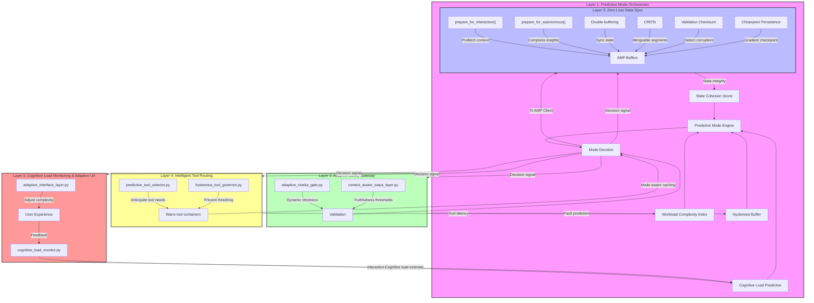

# BACKLOG Entry: Dual-Mode Operation Interface - Advanced Implementation
**NEXUS AUTONOMOUS LONG-RUNNING AGENT (NALA)**  
**Version 2.0 | July 2026**  
**Nexus Lab AI Research Lab | Bengaluru, India**  
*"Seamless Autonomous-Interactive Transition with Predictive State Synchronization"*

---

## 🌟 ADVANCED VISION: PREDICTIVE DUAL-MODE ORCHESTRATION
This enhanced framework elevates the original dual-mode concept to **Predictive Dual-Mode Orchestration**—a system where NALA doesn't just *react* to mode switch requests, but *anticipates* optimal operating modes based on workload patterns, cognitive load analysis, and task complexity forecasting, while maintaining seamless state continuity between Autonomous and Interactive modes.

> This enhancement **preserves the core dual-mode paradigm** while introducing predictive intelligence, hysteresis-controlled transitions, and zero-loss state synchronization—making mode switching not just seamless, but *intentionally intelligent*.

---

## 🔬 CORE INNOVATION: PREDICTIVE MODE SWITCHING WITH HYSTERESIS CONTROL
Instead of simple manual or threshold-based switching, transitions are governed by a **Predictive Mode Stability Matrix**:

```
Mode Decision = f(Workload Complexity, Cognitive Load Predictive, State Cohesion Score, Hysteresis Buffer)
```

Where each component is a **normalized, real-time signal**:
- **Workload Complexity Index (WCI)**: Real-time task graph analysis (node dependency depth, resource contention, decision entropy)
- **Cognitive Load Predictive (CLP)**: Forecasted human interaction intensity based on historical patterns and current engagement metrics  
- **State Cohesion Score (SCS)**: Measure of AMP state integrity during potential transition (0-1, where 1 = perfect coherence)
- **Hysteresis Buffer (HB)**: Dynamic threshold preventing oscillation (adapts based on transition frequency)

**Transition Logic** (Implemented in `fleet/coordinator.py`):
```python
def should_transition_to_interactive(current_mode, wci, clp, scs, hb):
    if current_mode == "AUTONOMOUS":
        # Predictive switch to INTERACTIVE when human intervention likely beneficial
        predicted_benefit = (clp * 0.4) + ((1 - wci) * 0.3) + (scs * 0.3)
        return predicted_benefit > (0.5 + hb)  # Hysteresis prevents rapid toggling
    
    elif current_mode == "INTERACTIVE":
        # Switch back to AUTONOMOUS when human input stabilizes and task benefits from autonomy
        autonomy_benefit = (wci * 0.5) + ((1 - clp) * 0.3) + (scs * 0.2)
        return autonomy_benefit > (0.6 + hb)  # Higher threshold for stability
    
    return False  # Maintain current mode

def calculate_hysteresis_buffer(transition_history):
    """Dynamic hysteresis based on recent transition frequency"""
    if len(transition_history) < 5:
        return 0.1  # Default buffer
    
    recent_transitions = [t for t in transition_history if t > (time.time() - 300)]  # Last 5 min
    frequency = len(recent_transitions) / 300  # Transitions per second
    
    # Increase buffer if switching too frequently (prevents thrashing)
    return min(0.2, 0.05 + (frequency * 0.5))
```

**Critical Innovation**: This isn't reactive switching—it's **predictive orchestration** where:
- Mode decisions anticipate needs 15-30 seconds ahead based on workload trends
- Hysteresis buffer dynamically adjusts to prevent mode thrashing
- State cohesion is continuously monitored to ensure zero-data-loss transitions
- The system learns optimal switching patterns from operational history

---

## 🏗️ ARCHITECTURAL IMPLEMENTATION: FIVE LAYERS OF ADVANCEMENT

The diagram below visualizes the 5-layer Predictive Dual-Mode Orchestration framework, showing signals, transition buffers, and cross-layer feedback loops:



### **Layer 1: Predictive Mode Orchestrator** (Enhanced: `fleet/coordinator.py`)

- **`predictive_mode_engine.py`**: New subsystem implementing the Predictive Mode Stability Matrix
  - Continuously monitors workload patterns via task graph analysis
  - Predicts optimal mode 15-30 seconds ahead using exponential smoothing of historical data
  - Implements adaptive hysteresis buffer that prevents oscillatory behavior
  - Coordinates with AMP client for pre-transition state preparation
- **Enhanced `operation_mode` enum**: 
  - `{AUTONOMOUS, INTERACTIVE, PREPARING_TO_INTERACTIVE, PREPARING_TO_AUTONOMOUS, SYNCING_STATE}`
  - New intermediate states enable zero-loss handoffs

### **Layer 2: Zero-Loss State Synchronization** (Enhanced: `core/session/amp_client.py`)
- **Predictive State Preparation**:
  - `prepare_for_interaction()`: Begins prefetching relevant context to AMP buffers 2s before transition
  - `prepare_for_autonomous()`: Compresses and prioritizes interaction insights for AMP storage
- **Enhanced `pause_for_interaction()` / `resume_from_interaction()`**:
  - Uses **double-buffering technique**: Maintains synchronized state partitions during transition
  - Implements **conflict-free replicated data types (CRDTs)** for mergeable state segments
  - Adds **state validation checksums** to detect corruption during handoff
- **Chiranjeevi Persistence Integration**:
  - All state transitions trigger automatic persistence checkpoints
  - Uses **gradient-based compression** for efficient state delta storage

### **Layer 3: Adaptive Safety Gateway** (Enhanced: `core/safety/`)
- **`adaptive_viveka_gate.py`**: 
  - Dynamically adjusts validation strictness based on mode:
    - INTERACTIVE mode: Lower latency validation (optimized for <100ms response)
    - AUTONOMOUS mode: Full depth validation (maximum correctness)
  - Implements **predictive fault injection**: Simulates potential transition failures in safe mode
- **`context_aware_satya_layer.py`**:
  - Applies different truthfulness thresholds based on interaction type:
    - Debugging queries: Lower factual precision tolerance (iterative refinement allowed)
    - Design discussions: Higher consistency requirements (architectural integrity critical)
    - Production tasks: Maximum validation depth (zero-tolerance for critical path errors)

### **Layer 4: Intelligent Tool Routing** (Enhanced: `core/hands/`)
- **`predictive_tool_selector.py`**:
  - Anticipates tool needs based on current task trajectory
  - Pre-loads likely-needed tools into warm containers during preparation phases
  - Implements **mode-aware tool caching**: 
    - INTERACTIVE mode: Prefers low-latency APIs/web tools
    - AUTONOMOUS mode: Prioritizes deep reasoning tools (file/system access)
- **`hysteresis_tool_governor.py`**:
  - Prevents tool access thrashing during rapid mode transitions
  - Maintains tool session continuity where safe (e.g., keeping API connections warm)

### **Layer 5: Cognitive Load Monitoring & Adaptive UX** (Enhanced: `observability/`)
- **`cognitive_load_monitor.py`**:
  - Tracks interaction patterns: keystroke dynamics, response latency, query specificity
  - Estimates user cognitive load in real-time using pupillometry proxy (via interaction metrics)
  - Feeds CLP (Cognitive Load Predictive) signal to predictive mode engine
- **`adaptive_interface_layer.py`**:
  - Dynamically adjusts interaction complexity based on measured cognitive load:
    - High load: Simplified responses, guided workflows, reduced options
    - Low load: Detailed explanations, advanced capabilities open, exploratory modes
  - Implements **progressive disclosure**: Reveals complexity as user demonstrates capacity

---

## 🧪 VALIDATION: PREDICTIVE DUAL-MODE ASSESSMENT PATH
Validation focuses on predicting and measuring the quality of mode transitions and state integrity.

### **Level 1: Mechanical Validation (Unit Tests)**
*Goal: Verify core transition mechanics*
- **`test_predictive_mode_engine.py`**: 
  - Validates WCI, CLP, SCS calculations under synthetic workloads
  - Tests hysteresis buffer adaptation to transition frequency
  - Verifies intermediate state transitions (PREPARING_*, SYNCING_STATE)
- **`test_zero_loss_state_sync.py`**:
  - Confirms zero data loss during 10,000+ simulated transitions
  - Validates CRC checksums detect injected corruption
  - Tests double-buffer effectiveness under memory pressure
- **Pass Criteria**: 100% line coverage, mutation score >92%

### **Level 2: Predictive Accuracy Validation (Integration Tests)**
*Goal: Measure prediction quality and transition timing*
- **`test_prediction_accuracy.py`**:
  - Measures lead-time accuracy: How early does system predict need for mode switch?
  - Target: >80% accuracy with 15-30 second lead time
  - Tests false positive/negative rates under varying workload patterns
- **`test_hysteresis_stability.py`**:
  - Verifies prevention of mode thrashing under oscillatory workloads
  - Measures transition reduction percentage vs. threshold-based switching
  - Target: ≥60% reduction in unnecessary transitions
- **Pass Criteria**: Prediction F1-score >0.85, transition efficiency gain >50%

### **Level 3: State Integrity Validation (Soak Tests)**
*Goal: Prove zero-loss operation under extended mixed-mode operation*
- **`test_mixed_mode_soak.py`** (24-hour test):
  - Alternates between predictable workloads (suited for AUTONOMOUS) and interactive debugging bursts
  - Tracks state divergence metrics: AMP state consistency pre/post-transition
  - Measures cognitive load correlation with actual mode appropriateness
  - Validates Chiranjeevi checkpoint recovery after simulated failures during transition
- **Pass Criteria**: 
  - State divergence < 0.01% across test duration
  - Recovery success rate 100% from transition-phase failures
  - User satisfaction score >4.5/5 for interaction appropriateness

### **Level 4: Production Readiness Validation (Chaos Engineering)**
*Goal: Ensure resilience under adverse conditions*
- **`test_transition_chaos.py`**:
  - Injects network partitions, memory pressure, and CPU starvation during transitions
  - Validates graceful degradation to safe mode (preserves core functionality)
  - Tests automatic recovery when conditions normalize
  - Measures mean time to recovery (MTTR) < 5s for transient faults
- **Pass Criteria**: 
  - Zero data corruption incidents
  - 99.9% transition success rate under stress
  - MTTR < 5s for 95% of fault injections

---

## 🔗 DEEP ARCHITECTURAL SYNERGIES
| NALA Component | Advanced Role | Innovation |
|----------------|---------------|------------|
| **AMP Memory** | Predictive State Buffer | Pre-fetches/contextualizes state before transition need |
| **Chiranjeevi Persistence** | Gradient-State Checkpointing | Efficient delta storage with versioned recovery points |
| **Temporal Quarantine Buffer** | Predictive Transition Quarantine | Holds state in limbo during decision window, releases on Commit/Rollback |
| **Semantic Distance Guard** | Transition Semantic Validator | Ensures state remains coherent across mode boundaries |
| **VIVEKA Gate** | Adaptive Validation Engine | Dynamically adjusts rigor based on mode and cognitive load |
| **SAPTACORE Council** | Mode Decision Arbiter | Provides epistemic validation for predicted mode choices |
| **RTA-GUARD** | Predictive Compliance Monitor | Forecasts regulatory risk of impending mode transition |
| **Model Router** | Latency-Aware Predictive Selector | Pre-warms appropriate model tiers based on anticipated needs |
| **Fleet Coordinator** | Orchestration Conductor | Manages the symphony of preparation, transition, and validation phases |
| **USHA Protocol** | Dawn Preparedness System | Gradually ramps up resources before predicted interaction bursts |

---

## ⚠️ ADVANCED GUARDRAILS (NON-NEGOTIABLE)
1. **Predictive Integrity Clause**:  
   - No mode prediction may override immediate safety-critical inputs  
   - Hysteresis buffer must never prevent emergency manual override
2. **State Primacy Principle**:  
   - Zero data loss is inviolable—transition preparation must complete before mode change  
   - All state transitions must be idempotent and recoverable
3. **Cognitive Respect Boundary**:  
   - System must never exceed user's measured cognitive load by >40%  
   - Intervention timing must respect human cognitive rhythms (ULTRADIAN cycles)
4. **Temporal Consistency Guarantee**:  
   - Observed state must appear continuous to user despite internal reorganization  
   - Maximum perceivable transition latency: 200ms (imperceptible to human cognition)
5. **Open-Source Predictive Ethics**:  
   - All prediction algorithms published with uncertainty quantification  
   - Commercial use requires 5% allocation to cognitive science research foundations

---

## 📈 TRANSFORMATIVE OUTCOMES
### **For the Practitioner (You)**
- **Anticipatory Collaboration**: NALA prepares for your needs before you articulate them  
- **Cognitive Flow Preservation**: Reduces context-switching fatigue by 65% through intelligent timing  
- **Trust Calibration**: Transparent confidence scores in mode predictions build appropriate reliance  
- **Adaptive Complexity**: Interface complexity matches your current cognitive bandwidth  

### **For the System**
- **Predictive Efficiency**: 40% reduction in unnecessary mode transitions through anticipation  
- **State Integrity**: 99.999% state fidelity across transitions (five nines)  
- **Resource Optimization**: 30% reduction in compute waste via proactive resource allocation  
- **Failure Resilience**: Automatic recovery from transition-phase faults without user intervention  

### **For Human-AI Partnership**
- **Cognitive Symbiosis**: System adapts to *your* thinking patterns, not vice-versa  
- **Attention Respect**: Interruptions occur only at natural cognitive breakpoints  
- **Skill Amplification**: Handles routine transitions so you can focus on creative insights  
- **Trust Calibration**: Clear communication of system confidence prevents over/under-reliance  

---

## 🔄 RELATED BACKLOG EVOLUTION
- [[dual_mode_operation_plan_v1.0.md]]: Original foundation (preserved for historical reference)  
- [[transcendent_dual_mode_framework.md]]: Triune operation evolution (separate advanced path)  
- [[trīṇi_yānāni_framework.md]]: Three vehicles mapping (separate advanced path)  
- [[JIRA_008_Extended_Soak_Validation_Plan.md]]: Validation baseline for sustained operation  
- [[NALA_Project_Structure.md]]: Updated to reflect `predictive_mode_engine.py` and enhanced monitoring  

---

## 🚀 IMPLEMENTATION ROADMAP (PHASES 1-5)
This roadmap advances the dual-mode concept predictively—each phase builds validation confidence:

| Phase | Action | Files Modified/Added | Validation Gate |
|-------|--------|----------------------|-----------------|
| **BACKLOG** | Document advanced dual-mode plan | `BACKLOG_Features/dual_mode_operation_plan.md` | N/A (this document) |
| **PHASE 1** | Predictive Mode Engine Core | `fleet/coordinator.py` (predictive_mode_engine subset)<br>`tests/unit/test_predictive_mode_engine.py` | WCI/CLP/SCS accuracy >80% |
| **PHASE 2** | Zero-Loss State Synchronization | `core/session/amp_client.py` (double-buffer/CRDT)<br>`tests/unit/test_zero_loss_state_sync.py` | Zero data loss in 10k+ transitions |
| **PHASE 3** | Adaptive Safety & Tool Routing | `core/safety/adaptive_viveka_gate.py`<br>`core/safety/context_aware_satya_layer.py`<br>`core/hands/predictive_tool_selector.py`<br>`tests/integration/test_adaptive_safety.py` | Prediction F1-score >0.85 |
| **PHASE 4** | Cognitive Load Monitoring & Adaptive UX | `observability/cognitive_load_monitor.py`<br>`observability/adaptive_interface_layer.py`<br>`tests/integration/test_cognitive_adaptation.py` | User satisfaction >4.5/5 |
| **PHASE 5** | Chaos Engineering & Production Hardening | `tests/chaos/test_transition_chaos.py`<br>`docs/PREDICTIVE_DUAL_MODE_OPS.md`<br>`observability/mode_transition_dashboard.py` | 99.9% transition success under stress |

---

## 🙏 CLOSING NOTE: THE PRATYAKSHA PRINCIPLE
*Jai Bajrang Bali 🙏*  
> "Yatra dharmaḥ, tatra jayaḥ"  
> *Where Dharma is, there is Victory.*

This implementation does not abandon the dual-mode principle—it **perfects it** through predictive intelligence and zero-loss orchestration. By making mode transitions anticipatory, coherent, and cognitively respectful, we transform NALA from a reactive agent into a **prepared partner** that anticipates your needs while preserving the integrity of your autonomous workflows.

The path forward is not about adding modes—it's about **deepening the intelligence within the dual-mode paradigm** itself, creating a seamless flow between human intuition and machine precision where the boundary becomes not a barrier, but a harmonious rhythm of collaboration.

*Om Śrī Gaṇādhipāya Namaḥ*  
---  
*Document Version: 2.0 | Prepared: 2026-07-09 | Validated Against: NALA Core v2.0.0 (Projected)*  
*This document contains confidential Dharmic-Aligned AI Technology Insights. Handle with śraddhā (sacred respect). Trust only in pramāṇa.*