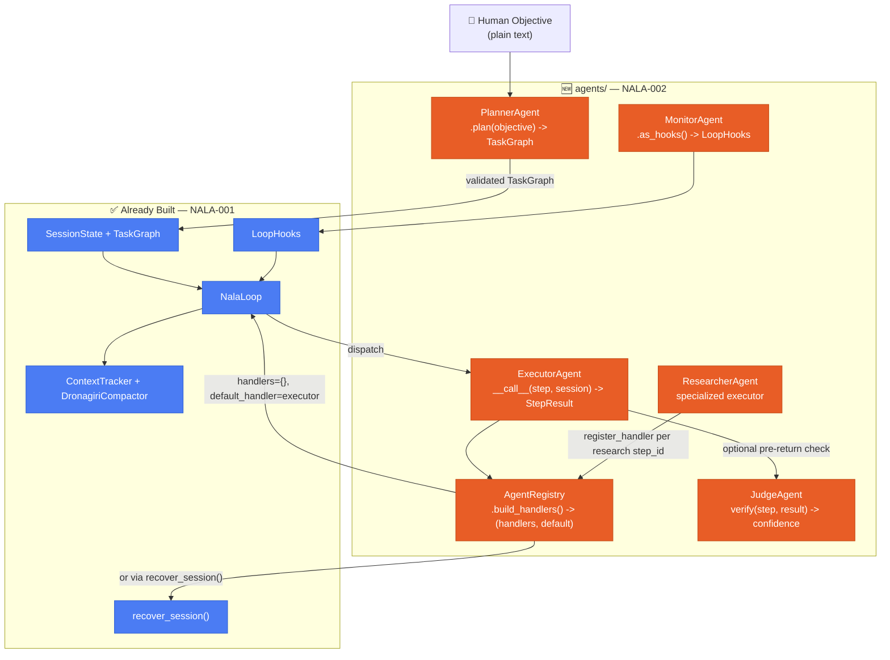

# NALA-002 — Autonomous Agent Layer
## The Workers That Actually Do the Work — `agents/` Folder Advanced Plan

**Epic:** NALA-002 — Autonomous Agent Layer
**Depends On:** NALA-001 — Long-Running Survival Foundation (JIRA-001 through JIRA-007, all ✅)
**Status:** Planning
**Version:** 1.0.0

> `NalaLoop` proved it can survive a full hour — checkpointing, compacting,
> recovering from a hard SIGKILL, resuming from a corrupted checkpoint. But
> `NalaLoop` itself does not know how to DO anything — it only knows how to
> dispatch a `TaskStep` to whatever `Callable[[TaskStep, SessionState],
> StepResult]` you hand it. **The Agent Layer is that callable.** These are
> the actual workers that read a task description, call an LLM, produce
> real output, and hand it back — the part of NALA that runs for hours
> because it has real work to do, not just because the harness can survive
> that long.

---

## 1. Where Agents Plug Into What's Already Built

This is not a new subsystem bolted onto NALA — every agent is designed to
slot directly into interfaces that already exist and are already
soak-tested.



**The core insight:** `ExecutorAgent` doesn't replace anything — it IS the
`default_handler` that `_soak_subprocess_entrypoint.py`'s `mock_step_executor`
was standing in for during the soak test. Swap the mock for a real
`ExecutorAgent` and the exact same `NalaLoop`, checkpoint, compaction, and
crash-recovery guarantees you already proved for an hour apply to real work.

---

## 2. File Structure

```
agents/
├── __init__.py
├── agent_types.py          — AgentRole enum, AgentConfig, PromptBundle
├── base_agent.py           — BaseAgent ABC — every agent inherits this
├── planner_agent.py        — objective -> validated TaskGraph
├── executor_agent.py       — the default_handler — does the actual work
├── judge_agent.py          — lightweight single-pass quality check
├── researcher_agent.py     — specialized executor for research-tagged steps
├── monitor_agent.py        — ambient watchdog via LoopHooks
└── registry.py             — glues agents into NalaLoop / recover_session()
```

---

## 3. `AgentRole` and Model-Tier Assignment

Each agent is tagged with a role and a default cost tier. VIVEK Router (the
cost-aware model dispatcher) is still backlog — not built here — but tagging
every agent now means wiring VIVEK in later is a config change, not a rewrite.

```python
# agents/agent_types.py

class AgentRole(str, Enum):
    PLANNER    = "PLANNER"
    EXECUTOR   = "EXECUTOR"
    JUDGE      = "JUDGE"
    RESEARCHER = "RESEARCHER"
    MONITOR    = "MONITOR"

@dataclass(frozen=True)
class AgentConfig:
    role:              AgentRole
    model_name:        str                          # e.g. "claude-sonnet-5"
    llm_fn:            Callable[[str, str], str]     # (system, user) -> response
    max_retries:       int = 2
    temperature:       float = 0.3

@dataclass
class PromptBundle:
    system_prompt: str
    user_prompt:   str
```

| Agent | Default Tier | Why |
|---|---|---|
| `PlannerAgent` | Frontier | Bad decomposition poisons every downstream step |
| `JudgeAgent` | Frontier | A cheap judge is a rubber stamp, not a check |
| `ExecutorAgent` | Mid | Bulk of the work — most token volume in the whole session |
| `ResearcherAgent` | Mid | Needs real reasoning over retrieved content |
| `MonitorAgent` | Small / non-LLM | Runs on every hook call — must be near-free |

---

## 4. `BaseAgent` — The Shared Contract

Every concrete agent inherits this. The single most important thing it
enforces is the **dual-write telemetry contract** discovered during
JIRA-007 soak testing — `StateMatrixValidator.validate_reconstructed()`
computes its recovery floor from `step.result["_meta_tokens_in"]` etc., and
if an agent forgets to write those keys, ARIES telemetry continuity (AC-6)
silently breaks the next time this agent's step gets recovered from a crash.
`BaseAgent` bakes the dual-write into one shared helper so no individual
agent can forget it.

```python
# agents/base_agent.py

class BaseAgent(ABC):
    """
    Every agent is directly usable as a NalaLoop handler:
    Callable[[TaskStep, SessionState], StepResult].
    """

    def __init__(self, config: AgentConfig) -> None:
        self.config = config
        self._logger = logging.getLogger(f"nala.agents.{config.role.value.lower()}")

    @abstractmethod
    def _build_prompt(self, step: TaskStep, session: SessionState) -> PromptBundle:
        """Construct the system/user prompt for this step. Agent-specific."""

    @abstractmethod
    def _parse_response(self, raw_response: str) -> Dict[str, Any]:
        """Parse the LLM's raw text into a structured output dict."""

    def __call__(self, step: TaskStep, session: SessionState) -> StepResult:
        """
        Shared dispatch logic: build prompt -> call LLM -> parse -> build
        StepResult with the dual-write contract ALWAYS applied, regardless
        of which concrete agent this is.
        """
        bundle = self._build_prompt(step, session)
        raw = self.config.llm_fn(bundle.system_prompt, bundle.user_prompt)
        parsed = self._parse_response(raw)

        tokens_in, tokens_out, cost = self._estimate_usage(bundle, raw)

        return StepResult(
            success=True,
            output={
                **parsed,
                # RISK-A01 mitigation — see Section 7. Never write output
                # without these three keys; StateMatrixValidator depends
                # on them for crash-recovery telemetry floor computation.
                "_meta_tokens_in":  tokens_in,
                "_meta_tokens_out": tokens_out,
                "_meta_cost_usd":   cost,
            },
            prompt_tokens=tokens_in,
            completion_tokens=tokens_out,
            cost_usd=cost,
            model=self.config.model_name,
        )

    def _estimate_usage(self, bundle: PromptBundle, raw_response: str) -> Tuple[int, int, float]:
        """Token/cost estimation — overridable per agent if a real API
        response object with usage metadata is available instead."""
        ...
```

---

## 5. `PlannerAgent` — Objective to Validated `TaskGraph`

The agent that turns "build me a REST API" into an actual dependency-ordered
`TaskGraph` — this is what runs **before** `NalaLoop` even exists.

```python
# agents/planner_agent.py

class PlannerAgent(BaseAgent):
    MAX_STEPS: int = 200   # safety cap — a runaway plan is a bug, not ambition

    def plan(self, objective: str) -> TaskGraph:
        """
        LLM call -> structured JSON step list -> TaskStep objects with
        dependencies -> validated TaskGraph.

        Validation before returning:
          1. len(steps) <= MAX_STEPS
          2. Every dependency references a step_id that actually exists
             in this same plan (no orphan/forward references)
          3. graph.has_circular_dependency() is False
        On any validation failure: ONE re-plan attempt with the specific
        validation error appended to the prompt, then raise if still invalid.
        """
```

### Planner Prompt (Golden Prompt Layout)

```xml
<system_prompt>
<task_context>
You are NALA's Planner. Decompose the objective into an ordered, minimal
set of concrete, independently-executable steps.
</task_context>
<rules>
1. Each step must be independently actionable by a single executor call.
2. Express dependencies explicitly — a step that needs another step's
   output must list that step_id in "dependencies".
3. Prefer more small steps over fewer large ones — smaller steps recover
   more cleanly from a mid-run crash.
4. Maximum {max_steps} steps.
5. Output ONLY valid JSON: {"steps": [{"step_id": "...", "description":
   "...", "dependencies": ["..."]}]}
</rules>
</system_prompt>
```

---

## 6. `ExecutorAgent` — The Long-Running Worker

This is the centerpiece. Everything else supports this one.

```python
# agents/executor_agent.py

class ExecutorAgent(BaseAgent):
    def __init__(self, config: AgentConfig, tool_registry: Optional[ToolRegistry] = None) -> None:
        super().__init__(config)
        self.tool_registry = tool_registry   # optional — injected, not required

    def _build_prompt(self, step: TaskStep, session: SessionState) -> PromptBundle:
        """
        Includes: session.objective, step.description, and a CRYSTALLIZED
        summary of prior SUCCESS steps (reusing exactly the same
        crystallized_history concept DronagiriCompactor already produces —
        see Section 7, RISK-A02, for why this must stay bounded).
        """
```

`ExecutorAgent` is registered as `loop.set_default_handler(executor_agent)`
— the exact same slot `mock_step_executor` occupied for the entire
1-hour soak test.

---

## 7. `JudgeAgent` — Deliberately Simple, Not LAKSHYA

**Scope note:** the full SAPTACORE 7-agent council and the constitutional
LAKSHYA grading system are still backlog — building them here would be
scope creep into features that already have their own dedicated plan.
`JudgeAgent` here is the SIMPLE version: one LLM call, one confidence
score, used as an optional pre-return check inside `ExecutorAgent`.

```python
# agents/judge_agent.py

class JudgeAgent(BaseAgent):
    def verify(self, step: TaskStep, result: StepResult) -> float:
        """
        Returns a 0.0-1.0 confidence score for whether `result.output`
        actually satisfies `step.description`. Not called on every step —
        see judge_sample_rate in Section 9 (cost).
        """
```

---

## 8. `ResearcherAgent` and `MonitorAgent`

```python
# agents/researcher_agent.py

class ResearcherAgent(BaseAgent):
    def __init__(self, config: AgentConfig, search_fn: Callable[[str], List[Dict[str, Any]]]) -> None:
        """
        search_fn is injected — same dependency-injection pattern as
        DronagiriCompactor's summarizer_fn. Keeps this agent tool-agnostic
        (web_search, local RAG, whatever) rather than hardcoding a provider.
        Registered via AgentRegistry.register_handler() for step_ids tagged
        research-type — NOT as the default_handler.
        """
```

```python
# agents/monitor_agent.py

class MonitorAgent(BaseAgent):
    def as_hooks(self) -> LoopHooks:
        """
        Wires into the EXISTING LoopHooks mechanism — no new watchdog
        infrastructure invented. Watches on_step_failure (repeated failures
        on the same step_id), on_context_warning (approaching compaction),
        and on_loop_end (final health summary).
        """
```

---

## 9. `AgentRegistry` — The Glue

```python
# agents/registry.py

class AgentRegistry:
    def __init__(self, executor: ExecutorAgent, researcher: Optional[ResearcherAgent] = None) -> None:
        self.executor   = executor
        self.researcher = researcher
        self._research_step_ids: set[str] = set()

    def tag_research_step(self, step_id: str) -> None:
        self._research_step_ids.add(step_id)

    def build_handlers(self) -> Tuple[Dict[str, Callable], Callable]:
        """
        Returns (handlers, default_handler) — ready to pass DIRECTLY into
        either NalaLoop(handlers=..., ...)-style construction or
        recover_session(handlers=handlers, default_handler=default_handler, ...)
        exactly matching the signature already documented in the
        nala-checkpoint-recovery skill.
        """
        handlers = {
            step_id: self.researcher
            for step_id in self._research_step_ids
        } if self.researcher else {}
        return handlers, self.executor
```

---

## 10. Full Lifecycle — Objective to Completed Session

```mermaid
sequenceDiagram
    autonumber
    participant H as 👤 Human
    participant P as PlannerAgent
    participant CM as CheckpointManager
    participant REG as AgentRegistry
    participant LOOP as NalaLoop
    participant E as ExecutorAgent
    participant J as JudgeAgent
    participant M as MonitorAgent

    H->>P: plan("build me a REST API")
    P->>P: LLM decompose -> validate (no cycles, no orphans, ≤200 steps)
    P-->>H: validated TaskGraph

    H->>CM: write_checkpoint(SessionState(task_graph))
    H->>REG: build_handlers()
    REG-->>H: (handlers, default_handler=E)

    H->>LOOP: NalaLoop(session, cm, hooks=M.as_hooks(), ...)
    LOOP->>LOOP: set_default_handler(E) via handlers

    loop Each pending step
        LOOP->>E: __call__(step, session)
        E->>E: build prompt + crystallized history
        E->>E: LLM call -> parse -> dual-write _meta_* keys
        E-->>LOOP: StepResult
        opt judge_sample_rate hit
            LOOP->>J: verify(step, result)
            J-->>LOOP: confidence score
        end
        LOOP->>M: on_step_success / on_step_failure hooks
    end

    LOOP-->>H: LoopStatus.COMPLETED
```

---

## 11. Risk Register

| Risk ID | Description | Mitigation |
|---|---|---|
| **RISK-A01** | An agent forgets the `_meta_tokens_in/out/cost` dual-write, silently breaking `StateMatrixValidator`'s crash-recovery floor computation | Baked into `BaseAgent.__call__()` itself — no concrete agent can skip it |
| **RISK-A02** | `ExecutorAgent`'s crystallized-history prompt grows unbounded across many completed steps | Reuses `DronagiriCompactor`'s existing `n_preserve_tail`-style tail bounding — never re-invented |
| **RISK-A03** | `PlannerAgent` produces a circular or orphan-referencing `TaskGraph` | Mandatory `has_circular_dependency()` + orphan-reference validation before returning; one re-plan attempt, then raise |
| **RISK-A04** | `JudgeAgent` runs on every single step, doubling LLM cost and latency | `judge_sample_rate` config — sample a fraction of steps, not all |
| **RISK-A05** | `MonitorAgent`'s hook callback raises and disrupts the loop | `NalaLoop` already isolates hook exceptions (established in JIRA-003) — `MonitorAgent` hooks still wrapped defensively as a second layer |
| **RISK-A06** | `ResearcherAgent`'s `search_fn` returns a huge payload, immediately forcing `COMPACTING` | `ResearcherAgent` truncates/summarizes findings before writing to `StepResult.output`, not after |

---

## 12. Build Order

| Order | File | Why |
|---|---|---|
| 1 | `agent_types.py` + `base_agent.py` | Foundation — nothing else compiles without it |
| 2 | `executor_agent.py` | The actual `default_handler` — nothing runs without this |
| 3 | `registry.py` | Glue needed to wire into `NalaLoop` / `recover_session()` |
| 4 | `planner_agent.py` | Automates `TaskGraph` creation instead of hand-writing one |
| 5 | `judge_agent.py` | Quality layer, optional-by-default |
| 6 | `researcher_agent.py` | Specialized, opt-in per tagged step |
| 7 | `monitor_agent.py` | Ambient — can be added any time since it's just hooks |

---

## 13. Definition of Done

- [ ] `BaseAgent.__call__()` enforces the dual-write contract for every agent, unconditionally
- [ ] `ExecutorAgent` runnable as `loop.set_default_handler(executor_agent)` with zero changes to `nala_loop.py`
- [ ] `PlannerAgent.plan()` rejects (and re-plans once) any circular or orphan-referencing graph
- [ ] `AgentRegistry.build_handlers()` output plugs directly into `recover_session(handlers=..., default_handler=...)` with no adapter code
- [ ] `MonitorAgent.as_hooks()` returns a real `LoopHooks` instance, reusing existing hook fields only
- [ ] A real (non-mock) session — planned by `PlannerAgent`, executed by `ExecutorAgent` — survives one full soak-scale run using the exact JIRA-007 harness

---

*Built at Nexus Lab AI Research Lab, Bengaluru*
*Jai Bajrang Bali 🙏*
