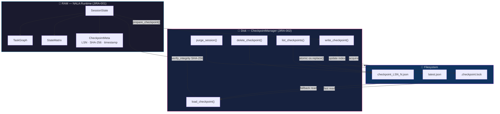
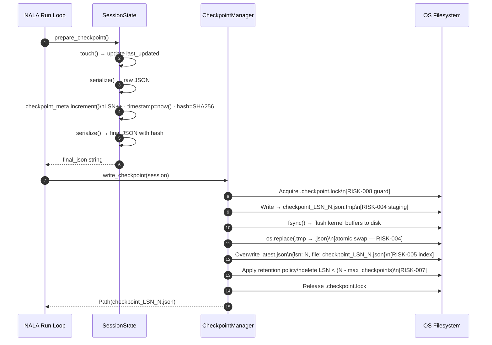
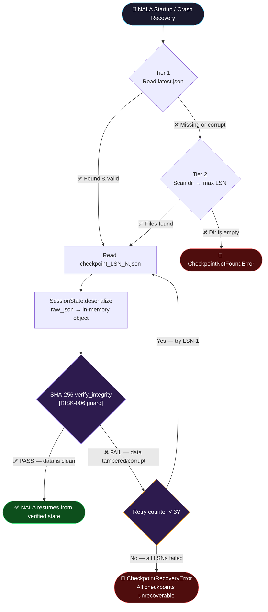
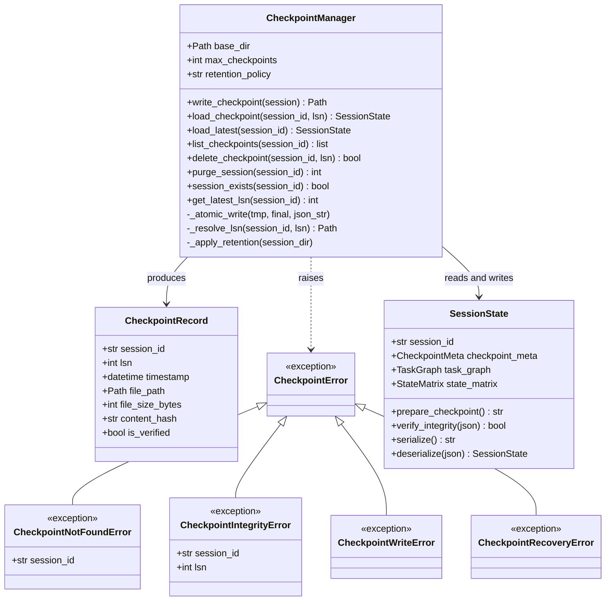

# JIRA-002 — Build Checkpoint System
**Nexus Lab AI Research Lab, Bengaluru**
**Phase 1: Core Harness (Survival Foundation) | Version: 2.0 Advanced**

> *"An agent that cannot survive a crash is not an agent — it is a script. JIRA-002 is the line between a toy and a system."*

---

## Technical Blueprint


---

## 1. Mission Statement

JIRA-001 produced `SessionState` — NALA's complete in-memory contract. It lives only in RAM. If the process crashes, the context window overflows, or the server restarts, all state is lost forever.

**JIRA-002 answers one question: How does NALA survive death and come back?**

The answer is `CheckpointManager` — an enterprise-grade, atomic disk-persistence engine that writes sessions to disk with cryptographic integrity guarantees, recovers from any failure mode, and provides NALA with a full audit trail of every state transition it has ever made.

This is the equivalent of what PostgreSQL's Write-Ahead Log (WAL) does for databases — applied to an autonomous AI agent.

---

## 2. Architecture Overview



---

## 3. The Five Risks — Advanced Risk Engineering

### RISK-004 — Half-Written File Corruption (P=High, Severity=Critical)

**Scenario:** Python writes `checkpoint.json` and the power cuts at byte 3,842 of 8,000. The file on disk is now partial JSON. `json.loads()` will raise `JSONDecodeError`. NALA cannot recover.

**Mitigation: Atomic Write-and-Rename Pattern**
```python
# Step 1: Write to a .tmp staging file (never the real checkpoint)
tmp_path = checkpoint_dir / f"checkpoint_LSN_{lsn}.json.tmp"
with open(tmp_path, "w", encoding="utf-8") as f:
    f.write(json_str)
    f.flush()
    os.fsync(f.fileno())   # Force OS to flush kernel buffers to physical disk

# Step 2: Atomic OS-level rename. This is instantaneous at the filesystem level.
# The final file is EITHER fully present or absent. Never partial.
os.replace(tmp_path, final_path)
```
`os.replace()` maps to `rename()` on Linux/macOS (atomic) and `MoveFileExW(MOVEFILE_REPLACE_EXISTING)` on Windows (effectively atomic on the same volume).

**Risk Level After Mitigation:** ✅ Negligible

---

### RISK-005 — latest.json Pointer Corruption (P=Medium, Severity=High)

**Scenario:** `latest.json` itself is corrupt or missing because the crash happened during its write phase.

**Mitigation: Three-Tier Fallback Recovery Chain**
```text
Tier 1: Read latest.json                         → Happy path, fast
Tier 2: Scan directory, pick max LSN file        → Fallback if latest.json is gone
Tier 3: Scan all .tmp files, pick highest LSN    → Ultra-fallback if rename never completed
```
Each tier is tried in sequence. NALA reports which recovery tier was used in the logger.

**Risk Level After Mitigation:** ✅ Low

---

### RISK-006 — Silent Data Corruption (P=Low, Severity=Critical)

**Scenario:** Disk sector failure, filesystem bug, or manual edit silently corrupts a checkpoint byte without Python knowing. `json.loads()` succeeds but the data is wrong. NALA resumes with corrupted task history.

**Mitigation: SHA-256 Integrity Guard at Load Time**

Every loaded checkpoint is cryptographically verified:
```python
loaded_session = SessionState.deserialize(raw_json)
if not loaded_session.verify_integrity(raw_json):
    raise CheckpointIntegrityError(
        f"SHA-256 mismatch at LSN={loaded_session.checkpoint_meta.lsn}. "
        f"Checkpoint is corrupted. Falling back to previous LSN."
    )
```
On failure, `CheckpointManager` **automatically attempts to load LSN-1**, then LSN-2, walking backwards until it finds a verified checkpoint.

**Risk Level After Mitigation:** ✅ Low

---

### RISK-007 — Unbounded Disk Growth (P=Medium, Severity=Medium)

**Scenario:** NALA runs for 7 days producing a checkpoint every 30 seconds. The `data/checkpoints/` directory grows to gigabytes.

**Mitigation: Automatic Retention Policy with `max_checkpoints` parameter**
```python
manager = CheckpointManager(
    base_dir=Path("data/checkpoints"),
    max_checkpoints=10,        # Keep only last 10 per session
    retention_policy="sliding_window"   # Options: "sliding_window" | "all"
)
```
After every write, the manager:
1. Lists all checkpoint files sorted by LSN.
2. Deletes everything outside the `max_checkpoints` window, oldest first.
3. Always keeps LSN=1 (the genesis checkpoint) regardless of policy.

**Risk Level After Mitigation:** ✅ Managed

---

### RISK-008 — Thread/Async Safety (P=Medium, Severity=High)

**Scenario:** NALA's future multi-agent fleet (JIRA-003+) has two agents simultaneously trying to write a checkpoint for the same session. File corruption or duplicate LSN race conditions occur.

**Mitigation: Per-Session File Locking via `filelock`**
```python
from filelock import FileLock

lock_path = session_dir / ".checkpoint.lock"
with FileLock(str(lock_path), timeout=5):
    # All write_checkpoint and load_checkpoint operations are serialized
    # per-session. Parallel writes to different sessions are unaffected.
    _atomic_write(tmp_path, final_path, json_str)
```
`filelock` uses OS-native advisory locks (`flock` on Linux, `LockFileEx` on Windows). This makes `CheckpointManager` safe for multi-threaded and asyncio-concurrent environments.

**Risk Level After Mitigation:** ✅ Low

---

## 4. Advanced API Design

### 4.1 Custom Exception Hierarchy

```python
class CheckpointError(Exception):
    """Base exception for all checkpoint system failures."""

class CheckpointNotFoundError(CheckpointError):
    """Raised when session_id or LSN does not exist on disk."""

class CheckpointIntegrityError(CheckpointError):
    """Raised when SHA-256 hash verification fails at load time."""
    def __init__(self, session_id: str, lsn: int, message: str):
        self.session_id = session_id
        self.lsn = lsn
        super().__init__(f"[LSN={lsn}][session={session_id[:8]}...] {message}")

class CheckpointWriteError(CheckpointError):
    """Raised when atomic write fails due to disk/OS errors."""

class CheckpointRecoveryError(CheckpointError):
    """Raised when all recovery tiers are exhausted with no valid checkpoint."""
```

---

### 4.2 Full CheckpointManager API Contract

```python
class CheckpointManager:
    """
    Enterprise-grade, atomic, integrity-verified disk persistence engine
    for NALA SessionState objects.

    Responsibilities
    ----------------
    - Atomic checkpoint writes with OS-level rename swap
    - Three-tier resilient loading with fallback chain
    - SHA-256 integrity verification on every load
    - Per-session file locking for concurrent safety
    - Configurable retention policy to prevent disk exhaustion
    - Full audit trail with session-level checkpoint index
    """

    def __init__(
        self,
        base_dir: Path,
        max_checkpoints: int = 20,
        retention_policy: Literal["sliding_window", "all"] = "sliding_window",
    ) -> None: ...

    def write_checkpoint(self, session: SessionState) -> Path:
        """
        Atomically persist a SessionState snapshot to disk.

        Flow
        ----
        1. Call session.prepare_checkpoint() → increments LSN, computes hash
        2. Build target path: base_dir/<session_id>/checkpoint_LSN_<n>.json
        3. Write JSON to .tmp staging file with fsync()
        4. os.replace(.tmp → .json) for atomic swap
        5. Write latest.json with LSN pointer for fast recovery
        6. Apply retention policy (delete old checkpoints beyond max_checkpoints)

        Returns
        -------
        Path
            Absolute path to the written checkpoint file.
        """

    def load_checkpoint(
        self,
        session_id: str,
        lsn: Optional[int] = None,
    ) -> SessionState:
        """
        Load and verify a checkpoint, with three-tier fallback recovery.

        Flow
        ----
        Tier 1: If lsn is specified → load checkpoint_LSN_<lsn>.json directly
        Tier 2: If lsn=None → read latest.json to find LSN, then load
        Tier 3: If latest.json is missing/corrupt → scan dir, pick max LSN
        Final: SHA-256 integrity check → raise CheckpointIntegrityError if failed
               (auto-retry with LSN-1 up to 3 times before CheckpointRecoveryError)

        Returns
        -------
        SessionState
            A fully reconstructed, cryptographically verified SessionState.
        """

    def load_latest(self, session_id: str) -> SessionState:
        """Shorthand for load_checkpoint(session_id, lsn=None)."""

    def list_checkpoints(self, session_id: str) -> list[CheckpointRecord]:
        """
        Return chronological list of all checkpoint records for a session.
        Each record contains: lsn, timestamp, file_size_bytes, sha256_hash.
        """

    def delete_checkpoint(self, session_id: str, lsn: int) -> bool:
        """Delete a specific LSN checkpoint. Returns True if deleted."""

    def purge_session(self, session_id: str) -> int:
        """Delete ALL checkpoints for a session. Returns count of deleted files."""

    def session_exists(self, session_id: str) -> bool:
        """Return True if any checkpoint exists for the given session_id."""

    def get_latest_lsn(self, session_id: str) -> Optional[int]:
        """Return the latest LSN for a session, or None if no checkpoints exist."""
```

---

### 4.3 CheckpointRecord Data Model

```python
@dataclass(frozen=True)
class CheckpointRecord:
    """Lightweight metadata record for a single checkpoint file on disk."""
    session_id:      str
    lsn:             int
    timestamp:       datetime       # UTC-aware, parsed from checkpoint JSON
    file_path:       Path           # Absolute path to .json file
    file_size_bytes: int            # For disk usage monitoring
    content_hash:    str            # SHA-256 for quick integrity preview
    is_verified:     bool           # Whether this record passed a hash check
```

---

## 5. On-Disk Directory Structure

After JIRA-002 is running, NALA's checkpoint tree on disk will look like:

```text
E:\NALA-Project\NALA\
└── data\
    └── checkpoints\
        └── 7b15d2eb-0530-42c0-a1d3-f2e22cdcf314\   ← session UUID
              ├── checkpoint_LSN_1.json               ← Genesis (always kept)
              ├── checkpoint_LSN_2.json
              ├── checkpoint_LSN_3.json
              ├── ...
              ├── checkpoint_LSN_N.json               ← Latest
              ├── latest.json                         ← Fast index: {"lsn": N, "file": "checkpoint_LSN_N.json"}
              └── .checkpoint.lock                    ← OS advisory lock (auto-deleted on exit)
```

**Filename contract:**
- `checkpoint_LSN_{N}.json` — N is zero-padded to 6 digits (e.g., `checkpoint_LSN_000042.json`) for correct lexicographic ordering.
- `latest.json` — JSON with `{"lsn": N, "file": "checkpoint_LSN_000042.json", "timestamp": "..."}`.

---

## 6. Sequence Diagrams

### 6.1 Write Path (Happy Path)



### 6.2 Load Path (Three-Tier Fallback Chain)



---

## 6.3 Class Structure



---

## 7. New Files & Changed Files

| File | Action | Description |
|---|---|---|
| [checkpoint.py](file:///E:/NALA-Project/NALA/core/harness/checkpoint.py) | **MODIFY** | Full `CheckpointManager` implementation |
| [test_checkpoint.py](file:///E:/NALA-Project/NALA/tests/unit/test_checkpoint.py) | **NEW** | 12 interactive tests covering all paths |
| `core/harness/__init__.py` | **MODIFY** | Export `CheckpointManager`, all exceptions |
| `data/checkpoints/` | **NEW DIR** | Auto-created by `CheckpointManager.__init__` |

---

## 8. Unit Test Plan (12 Tests)

All tests use Python's `tempfile.TemporaryDirectory` for fully isolated, auto-cleaned disk I/O.

| # | Test Name | What It Proves |
|---|---|---|
| T1 | `test_write_creates_correct_files` | `write_checkpoint()` produces `.json` + `latest.json` at correct paths |
| T2 | `test_round_trip_identity` | Load after save returns byte-identical SessionState |
| T3 | `test_atomic_no_tmp_on_success` | No `.tmp` file remains after a successful write |
| T4 | `test_lsn_increments_each_write` | 5 consecutive writes produce LSN 1 through 5 |
| T5 | `test_load_by_lsn` | `load_checkpoint(session_id, lsn=3)` loads correct version |
| T6 | `test_load_latest_uses_index` | `load_latest()` reads `latest.json` and loads LSN=N |
| T7 | `test_load_fallback_without_latest` | Deleting `latest.json` triggers dir scan fallback correctly |
| T8 | `test_integrity_failure_raises` | Manually tampered file raises `CheckpointIntegrityError` |
| T9 | `test_integrity_auto_rollback` | Tampered LSN=N causes auto-load of LSN=N-1 |
| T10 | `test_retention_policy_enforced` | With `max_checkpoints=3`, only last 3 (+ genesis) are kept |
| T11 | `test_list_checkpoints_ordered` | `list_checkpoints()` returns records sorted by LSN ascending |
| T12 | `test_concurrent_write_safety` | Two `ThreadPoolExecutor` workers writing simultaneously produce valid, non-overlapping LSNs |

---

## 9. Advanced Risk Summary Matrix

| Risk | Description | Probability | Severity | Mitigation | Status |
|---|---|---|---|---|---|
| RISK-004 | Half-written file on crash | High | Critical | Atomic `.tmp` + `os.replace()` + `fsync()` | ✅ Mitigated |
| RISK-005 | `latest.json` corruption | Medium | High | Three-tier fallback chain | ✅ Mitigated |
| RISK-006 | Silent disk data corruption | Low | Critical | SHA-256 guard + auto-rollback to LSN-1 | ✅ Mitigated |
| RISK-007 | Unbounded disk growth | Medium | Medium | `max_checkpoints` sliding window retention | ✅ Mitigated |
| RISK-008 | Concurrent write race condition | Medium | High | Per-session `filelock` OS advisory locking | ✅ Mitigated |


---

## 10. Acceptance Criteria (Definition of Done)

- `[AC-1]` `CheckpointManager` is importable from `core.harness.checkpoint`
- `[AC-2]` `write_checkpoint(session)` produces a valid, loadable `.json` file
- `[AC-3]` `load_checkpoint(session_id)` reconstructs an identical `SessionState` to what was saved
- `[AC-4]` Tampered checkpoint JSON raises `CheckpointIntegrityError` on load
- `[AC-5]` Deleting `latest.json` does NOT prevent recovery (fallback scan works)
- `[AC-6]` `max_checkpoints=3` correctly purges old files after the 4th write
- `[AC-7]` All 12 unit tests in `test_checkpoint.py` pass under both `python` and `pytest` modes
- `[AC-8]` No `.tmp` files remain on disk after a normal write
- `[AC-9]` `list_checkpoints()` returns a chronologically ordered list of `CheckpointRecord` objects
- `[AC-10]` Concurrent write test (T12) produces correct, non-duplicated LSN numbers

---

## 11. Verification Plan

### Automated Tests
```powershell
# From E:\NALA-Project — run interactive colored output
python NALA/tests/unit/test_checkpoint.py

# From E:\NALA-Project — run full pytest suite
pytest NALA/tests/unit/test_checkpoint.py -v -s
```

### Manual Verification
After running the tests, inspect the auto-created directory:
```powershell
# View checkpoint folder structure
Get-ChildItem -Recurse NALA\data\checkpoints\

# Inspect latest.json
Get-Content NALA\data\checkpoints\<session_id>\latest.json | ConvertFrom-Json

# Inspect a specific checkpoint
Get-Content NALA\data\checkpoints\<session_id>\checkpoint_LSN_000001.json | ConvertFrom-Json
```

---

## 12. Estimate

| Phase | Task | Hours |
|---|---|---|
| Phase 1 | Implement `CheckpointManager` core + exceptions | 3h |
| Phase 2 | Implement fallback chain + retention policy | 2h |
| Phase 3 | Implement `filelock` concurrent safety | 1h |
| Phase 4 | Write 12 unit tests + interactive output | 3h |
| Phase 5 | Integration verification + documentation | 1h |
| **Total** | | **~10h (1.5 days)** |

---

*Jai Bajrang Bali 🙏*
*Nexus Lab AI Research Lab, Bengaluru*
