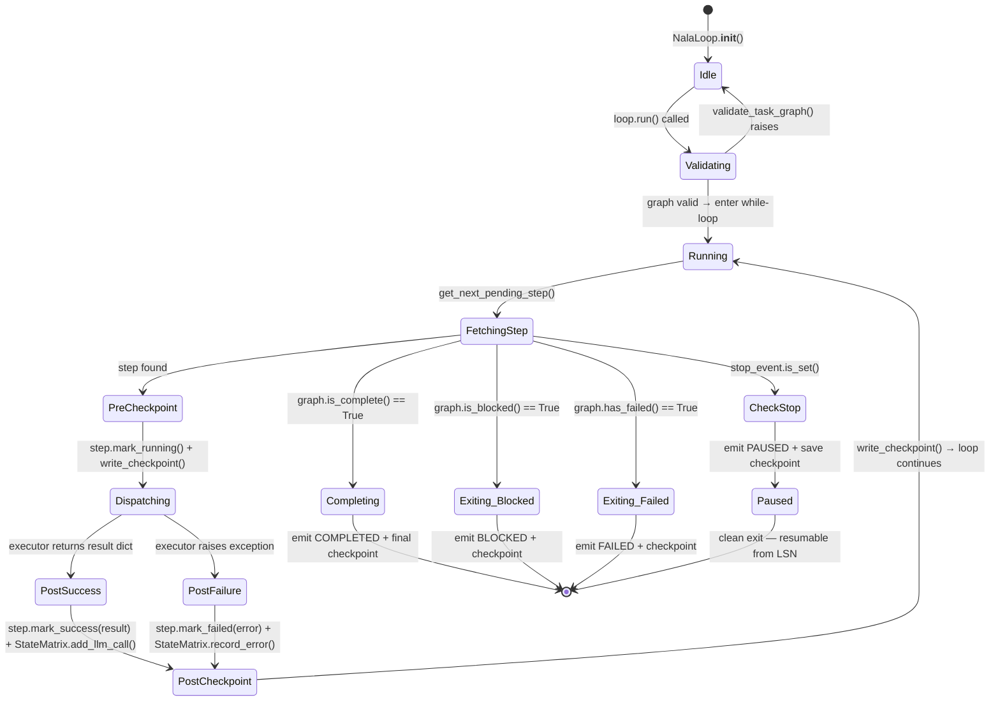
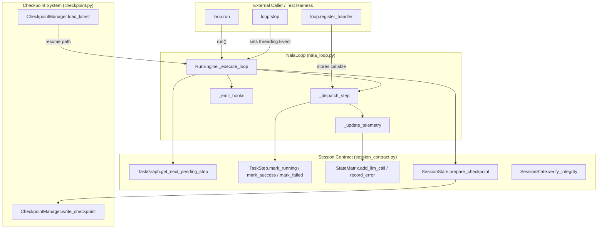

# JIRA-003 — Build Task Loop Skeleton (`nala_loop.py`)

**Epic:** NALA-001 — Long-Running Survival Foundation  
**Priority:** P0 — Critical Path  
**Estimate:** 2 days  
**Depends On:** JIRA-001 (Session Contract ✅), JIRA-002 (Checkpoint System ✅)  
**Blocks:** JIRA-004 (Context Window Tracker), JIRA-005 (Crash Recovery), JIRA-007 (1-Hour Soak Test)

> Define and build NALA's **core run-loop orchestrator** (`nala_loop.py`), which drives the agent's
> task execution sequence step-by-step using the `TaskGraph` scheduler, persists every state
> transition via `CheckpointManager`, emits structured telemetry, and supports cooperative
> pause/resume without data loss.

---

## 1. Architectural Blueprint

### 1.1 Full State Machine — Step Execution Lifecycle



### 1.2 Component Interaction Diagram



### 1.3 Sci-Fi Internal Loop Architecture Schematic


---

## 2. Risk Register & Mitigations

| Risk ID | Description | Severity | Mitigation Strategy |
|---------|-------------|----------|---------------------|
| **RISK-009** | Executor raises unhandled exception causing state corruption | HIGH | `try/except` wraps `_dispatch_step`; step marked `FAILED`; checkpoint written before loop continues |
| **RISK-010** | `stop()` called mid-executor — step left in `RUNNING` forever | HIGH | Cooperative stop: stop_event checked **only** between steps; current step always completes |
| **RISK-011** | Checkpoint write fails during step transition | HIGH | `write_checkpoint` raises → caught → loop records `CheckpointWriteError` in telemetry, retries once, then exits FAILED |
| **RISK-012** | Handler not registered for step type → silent skip | MEDIUM | `_dispatch_step` raises `MissingHandlerError`; step marked `FAILED` with descriptive message |
| **RISK-013** | StateMatrix tokens/cost never updated → telemetry drift | MEDIUM | `_update_telemetry()` is mandatory call inside `_dispatch_step`, even on exception paths |
| **RISK-014** | Infinite loop if `get_next_pending_step()` returns same step | HIGH | Loop tracks last-dispatched step ID; if same ID returned twice in a row → `BLOCKED` exit |
| **RISK-015** | Resume on corrupted LSN loads wrong state | HIGH | `load_latest()` uses JIRA-002 rollback chain; loop calls `verify_integrity()` after load |

---

## 3. Technical Design & Core Capabilities

### A. `LoopStatus` Enum — Exit Codes

```python
class LoopStatus(str, Enum):
    READY     = "READY"      # Loop initialized, not yet started
    RUNNING   = "RUNNING"    # Loop currently executing steps
    COMPLETED = "COMPLETED"  # All steps succeeded
    PAUSED    = "PAUSED"     # Cooperative stop — resumable
    BLOCKED   = "BLOCKED"    # Dependency deadlock — non-resumable
    FAILED    = "FAILED"     # Unrecoverable executor failure
```

### B. `StepResult` — Executor Contract

Every registered handler **must** return a `StepResult`-compatible dict:

```python
@dataclass
class StepResult:
    success: bool
    output: Dict[str, Any]           # arbitrary executor payload
    prompt_tokens: int = 0           # LLM prompt token count
    completion_tokens: int = 0       # LLM completion token count
    cost_usd: float = 0.0            # estimated cost this step
    elapsed_seconds: float = 0.0     # wall-clock time for this step
```

Executors that raise **any** exception are caught; the exception message is stored in `TaskStep.error_log` and the step is marked `FAILED`.

### C. `NalaLoop` Class — Full API Surface

```python
class NalaLoop:
    def __init__(
        self,
        session: SessionState,
        checkpoint_manager: CheckpointManager,
        *,
        max_retries_per_step: int = 0,      # retry failed steps N times before marking FAILED
        checkpoint_on_success_only: bool = False,  # skip pre-step checkpoint (faster, less safe)
        hooks: Optional["LoopHooks"] = None,
    ) -> None: ...

    def register_handler(
        self,
        step_id_or_type: str,
        handler: Callable[[TaskStep, SessionState], Dict[str, Any]],
    ) -> None: ...

    def set_default_handler(
        self,
        handler: Callable[[TaskStep, SessionState], Dict[str, Any]],
    ) -> None: ...

    def run(self) -> LoopStatus: ...     # blocking — runs until terminal state

    def stop(self) -> None: ...          # thread-safe cooperative stop signal
```

### D. `LoopHooks` — Observability Protocol

A lightweight hook system so callers can observe every lifecycle event:

```python
@dataclass
class LoopHooks:
    on_loop_start:   Optional[Callable[[SessionState], None]] = None
    on_step_start:   Optional[Callable[[TaskStep, SessionState], None]] = None
    on_step_success: Optional[Callable[[TaskStep, StepResult, SessionState], None]] = None
    on_step_failure: Optional[Callable[[TaskStep, str, SessionState], None]] = None
    on_checkpoint:   Optional[Callable[[Path, SessionState], None]] = None
    on_loop_end:     Optional[Callable[[LoopStatus, SessionState], None]] = None
```

Used by JIRA-007 soak test to stream live progress to stdout/log without modifying the loop core.

### E. Cooperative Stop Control

```
Thread A (main):   loop.run()  ──────────── [step 1] ──── [step 2] ──── stops after step 2
Thread B (signal): loop.stop() ─ sets Event ──────────────────────────────────────────────▶
```
- `threading.Event` is checked **only** at the top of the while-loop
- Current executing step is **never** interrupted
- Final checkpoint written before returning `PAUSED`

### F. Node-by-Node Topological Execution

```
Graph: A → B → C
              ↘ D
```
1. `get_next_pending_step()` → returns `A` (no dependencies)
2. `A` executes → `mark_success()` → checkpoint
3. `get_next_pending_step()` → returns `B` (A done)
4. `B` executes → `mark_success()` → checkpoint
5. Next: `C` or `D` (whichever `TaskGraph` yields first — they are both unblocked)

**Deadlock guard (RISK-014):** After each step dispatch, the loop records `last_step_id`. If `get_next_pending_step()` returns the same ID two consecutive iterations (e.g., executor succeeded but status didn't flip), the loop exits as `BLOCKED` and writes a diagnostic message.

### G. StateMatrix Telemetry Integration

After every step (success **or** failure), `_update_telemetry()` calls:

```python
# On success with LLM token counts returned:
session.metrics.add_llm_call(
    prompt_tokens=result.prompt_tokens,
    completion_tokens=result.completion_tokens,
    cost_usd=result.cost_usd,
    model=result.get("model", "unknown"),
)

# On failure:
session.metrics.record_error()
```

`elapsed_seconds` on the `StateMatrix` is accumulated across all steps using `time.perf_counter()` deltas.

---

## 4. File Structure & Proposed Changes

### 4.1 New Files

#### [NEW] [`nala_loop.py`](file:///E:/NALA-Project/NALA/core/harness/nala_loop.py)

```
e:/NALA-Project/NALA/core/harness/nala_loop.py
```

**Sections:**
1. Module-level docstring & imports (`threading`, `time`, `enum`, `dataclasses`, `logging`, `typing`)
2. `LoopStatus(str, Enum)` — 6 states
3. `StepResult` dataclass — executor return contract
4. `LoopHooks` dataclass — observability callbacks
5. `MissingHandlerError(RuntimeError)` — raised when no handler registered
6. `CheckpointWriteFailure(RuntimeError)` — raised on persistent CP write error
7. `NalaLoop` class:
   - `__init__` — stores session, CM, config, handler registry, stop event, hooks
   - `register_handler` / `set_default_handler`
   - `run()` → calls `_execute_loop()`, returns `LoopStatus`
   - `stop()` → sets `threading.Event`
   - `_execute_loop()` → main while-loop
   - `_dispatch_step(step)` → calls registered handler with try/except
   - `_update_telemetry(step, result, elapsed)` → updates StateMatrix
   - `_save_checkpoint(label)` → wraps CM write with retry (RISK-011)
   - `_emit(hook_fn, *args)` → safe hook invocation (never crashes loop)
8. Module-level `__all__`

#### [NEW] [`test_nala_loop.py`](file:///E:/NALA-Project/NALA/tests/unit/test_nala_loop.py)

```
e:/NALA-Project/NALA/tests/unit/test_nala_loop.py
```

### 4.2 Modified Files

#### [MODIFY] [`__init__.py`](file:///E:/NALA-Project/NALA/core/harness/__init__.py)

Add `NalaLoop`, `LoopStatus`, `StepResult`, `LoopHooks` to public exports.

---

## 5. Test Harness — 15 Unit Tests

All tests use an in-memory `CheckpointManager` (temp dir fixture) and factory-built `SessionState`.

| # | Test Name | Validates | Risk Covered |
|---|-----------|-----------|--------------|
| T01 | `test_simple_sequential_3_steps` | 3 steps complete → `COMPLETED` status | Core happy path |
| T02 | `test_cooperative_stop_mid_run` | `stop()` called from thread → `PAUSED`, checkpoint saved | RISK-010 |
| T03 | `test_resume_from_paused_checkpoint` | Load LSN from pause → run → `COMPLETED` | JIRA-005 preview |
| T04 | `test_executor_exception_marks_step_failed` | Handler raises → step `FAILED`, loop continues | RISK-009 |
| T05 | `test_all_steps_failed_exits_failed` | All steps fail → loop exits `FAILED` | RISK-009 |
| T06 | `test_blocked_graph_exits_blocked` | Circular dependency in graph → exits `BLOCKED` | RISK-014 |
| T07 | `test_custom_handlers_dispatched_correctly` | 3 step types → 3 separate handlers called | Handler registry |
| T08 | `test_default_handler_fallback` | No specific handler → default handler invoked | RISK-012 |
| T09 | `test_missing_handler_marks_step_failed` | No handler + no default → step `FAILED` with `MissingHandlerError` | RISK-012 |
| T10 | `test_telemetry_tokens_accumulated` | 3 steps each return 100 tokens → `total_tokens == 300` | RISK-013 |
| T11 | `test_telemetry_error_count_incremented` | 2 failing steps → `metrics.error_count == 2` | RISK-013 |
| T12 | `test_checkpoint_written_pre_and_post_step` | CP manager called twice per step (pre + post) | RISK-011 |
| T13 | `test_checkpoint_write_failure_exits_failed` | CM raises on write → loop exits `FAILED` cleanly | RISK-011 |
| T14 | `test_hooks_fire_at_correct_lifecycle_points` | All 6 hooks fire in correct order and with correct args | Observability |
| T15 | `test_deadlock_guard_same_step_id_twice` | Mock graph returns same step twice → exits `BLOCKED` | RISK-014 |

---

## 6. Execution Phases & Acceptance Criteria

### Phase 1 — Scaffold & Enum (0.5 hrs)
- [ ] Create `nala_loop.py` with `LoopStatus`, `StepResult`, `LoopHooks`, custom exceptions
- [ ] Stub `NalaLoop` class with `__init__`, `register_handler`, `stop`, `run` (raise NotImplemented)
- [ ] Add to `__init__.py` exports

### Phase 2 — Core Loop Engine (2 hrs)
- [ ] Implement `_execute_loop()` with full state machine
- [ ] Implement `_dispatch_step()` with try/except + retry logic
- [ ] Implement `_update_telemetry()` using `StateMatrix` API
- [ ] Implement `_save_checkpoint()` with single retry on `CheckpointWriteError`
- [ ] Implement `_emit()` safe hook caller

### Phase 3 — Test Harness (2 hrs)
- [ ] Write all 15 tests in `test_nala_loop.py`
- [ ] `make_session()` helper — builds a valid `SessionState` with N steps
- [ ] `make_cm()` fixture — temp-dir `CheckpointManager`
- [ ] Run full test suite: `pytest NALA/tests/unit/test_nala_loop.py -v`

### Phase 4 — Integration & Smoke (0.5 hrs)
- [ ] Run full project test suite (40 existing + 15 new = **55 passed, 0 failed**)
- [ ] Manually run loop with 5-step dummy session, inspect terminal output

---

## 7. Internal Loop Pseudocode (Implementation Reference)

```python
def _execute_loop(self) -> LoopStatus:
    t_session_start = time.perf_counter()
    self._emit(self.hooks.on_loop_start, self.session)

    last_step_id: Optional[str] = None

    while not self._stop_event.is_set():
        graph = self.session.graph

        # ── Terminal state checks ──────────────────────────────────
        if graph.is_complete():
            self._save_checkpoint("completing")
            self._emit(self.hooks.on_loop_end, LoopStatus.COMPLETED, self.session)
            return LoopStatus.COMPLETED

        if graph.has_failed():
            self._save_checkpoint("failed")
            self._emit(self.hooks.on_loop_end, LoopStatus.FAILED, self.session)
            return LoopStatus.FAILED

        if graph.is_blocked():
            self._save_checkpoint("blocked")
            self._emit(self.hooks.on_loop_end, LoopStatus.BLOCKED, self.session)
            return LoopStatus.BLOCKED

        # ── Fetch next step ────────────────────────────────────────
        step = graph.get_next_pending_step()
        if step is None:
            # Nothing runnable but not complete/blocked — transient wait
            continue

        # ── RISK-014: Deadlock guard ───────────────────────────────
        if step.step_id == last_step_id:
            log.error("DEADLOCK: same step_id returned twice: %s", step.step_id)
            self._save_checkpoint("blocked-deadlock")
            return LoopStatus.BLOCKED

        # ── Pre-execution checkpoint ───────────────────────────────
        step.mark_running()
        self._save_checkpoint(f"pre-step-{step.step_id}")
        self._emit(self.hooks.on_step_start, step, self.session)

        # ── Dispatch ───────────────────────────────────────────────
        t0 = time.perf_counter()
        result, error_msg = self._dispatch_step(step)
        elapsed = time.perf_counter() - t0

        # ── Post-execution state ───────────────────────────────────
        if result is not None:
            step.mark_success(result.output)
            self._update_telemetry(step, result, elapsed)
            self._emit(self.hooks.on_step_success, step, result, self.session)
        else:
            step.mark_failed(error_msg)
            self.session.metrics.record_error()
            self._emit(self.hooks.on_step_failure, step, error_msg, self.session)

        # ── Post-execution checkpoint ──────────────────────────────
        cp_path = self._save_checkpoint(f"post-step-{step.step_id}")
        self._emit(self.hooks.on_checkpoint, cp_path, self.session)

        last_step_id = step.step_id

    # ── Cooperative stop ───────────────────────────────────────────
    self._save_checkpoint("paused")
    self._emit(self.hooks.on_loop_end, LoopStatus.PAUSED, self.session)
    return LoopStatus.PAUSED
```

---

## 8. Verification Plan

### 8.1 Automated Tests

```powershell
# Run new loop tests only
.\.venv\Scripts\python.exe -X utf8 -m pytest NALA/tests/unit/test_nala_loop.py -v

# Run full regression suite (must stay 55 passed, 0 failed)
.\.venv\Scripts\python.exe -X utf8 -m pytest NALA/tests/unit/ -v

# Run with coverage
.\.venv\Scripts\python.exe -X utf8 -m pytest NALA/tests/unit/ --cov=NALA/core/harness --cov-report=term-missing
```

**Target:** `55 passed, 0 failed` — 40 existing + 15 new tests.

### 8.2 Manual Smoke Test

```python
# Quick smoke script — run directly:
# python NALA/scripts/smoke_loop.py
from NALA.core.harness.session_contract import SessionState, TaskGraph, TaskStep
from NALA.core.harness.checkpoint import CheckpointManager
from NALA.core.harness.nala_loop import NalaLoop, LoopStatus

session = ...   # build 5-step dummy session
cm      = CheckpointManager(base_dir=Path("./data/checkpoints"))
loop    = NalaLoop(session, cm)
loop.set_default_handler(lambda step, s: {"output": f"done:{step.step_id}"})

status  = loop.run()
assert status == LoopStatus.COMPLETED
print("✅ Smoke test passed")
```

### 8.3 Thread Safety Test

```powershell
# Run stop-event test 50x in parallel to catch race conditions
.\.venv\Scripts\python.exe -X utf8 -m pytest NALA/tests/unit/test_nala_loop.py::test_cooperative_stop_mid_run -v --count=50
```

---

## 9. Dependencies & Integration Map

```
JIRA-001 (SessionState, TaskGraph, TaskStep, StateMatrix, CheckpointMeta) ──┐
                                                                              ├──▶ JIRA-003 (NalaLoop)
JIRA-002 (CheckpointManager, write_checkpoint, load_latest, rollback) ───────┘
                                                                                        │
                                              ┌─────────────────────────────────────────┤
                                              ▼                                         ▼
                                    JIRA-004                                      JIRA-005
                               (Context Window Tracker)                      (Crash Recovery)
                                   hooks into StateMatrix                   resumes from LSN
                                              │                                         │
                                              └────────────────┬────────────────────────┘
                                                               ▼
                                                         JIRA-007
                                                      (1-Hour Soak Test)
```

---

## 10. Definition of Done

- [ ] `nala_loop.py` implemented with all 8 internal methods
- [ ] `LoopStatus`, `StepResult`, `LoopHooks` exported from `core/harness/__init__.py`
- [ ] 15 unit tests written in `test_nala_loop.py`
- [ ] **55 passed, 0 failed** on `pytest NALA/tests/unit/ -v`
- [ ] No regressions on `test_checkpoint.py` (13 tests) or `test_session_contract.py` (27 tests)
- [ ] `RISK-009` through `RISK-015` all have passing test coverage
- [ ] `walkthrough.md` updated with JIRA-003 section

---

**Jai Bajrang Bali 🙏**
