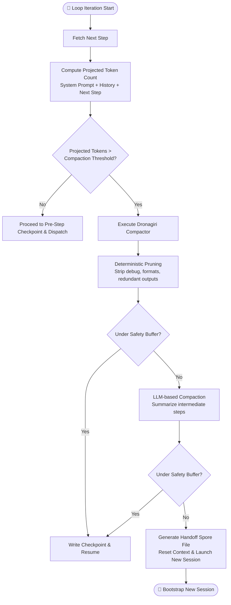
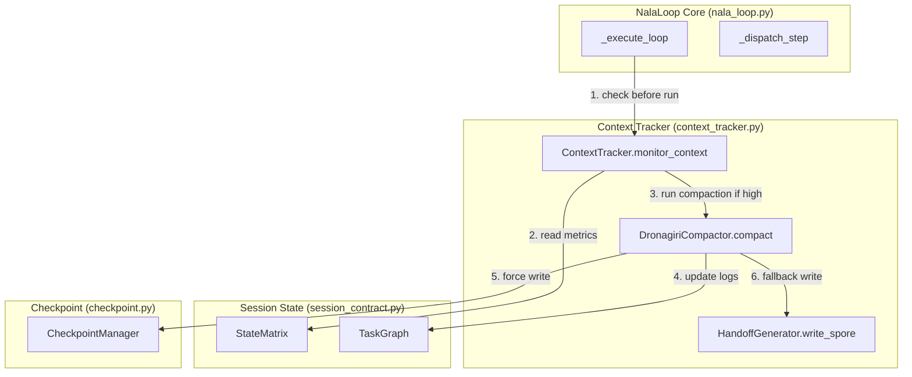

# JIRA-004 — Context Window Tracker & Compactor

**Epic:** NALA-001 — Long-Running Survival Foundation  
**Priority:** P0 — Critical Path  
**Estimate:** 3 days  
**Depends On:** JIRA-003 (Task Loop Skeleton ✅)  
**Blocks:** JIRA-005 (Crash Recovery), JIRA-007 (1-Hour Soak Test)

> Establish NALA's **Context Window Tracker and Dynamic Compactor** (`context_tracker.py`), which monitors active token usage within `StateMatrix`, implements configurable warning and compaction thresholds, and executes automated history pruning and LLM-based summarization (Dronagiri Compactor) to ensure the long-running loop never crashes due to context limit exhaustion.

---

## 1. Architectural Blueprint

### 1.1 Context Management Flow during Task Loop



### 1.2 Component Integration Map



---

## 2. Risk Register & Mitigations

| Risk ID | Description | Severity | Mitigation Strategy |
|---------|-------------|----------|---------------------|
| **RISK-016** | Token count desync (local vs. remote LLM tokenizer) | HIGH | Apply a fixed padding factor (+20 tokens per message) and a 10% safety buffer window. |
| **RISK-017** | "Lost in the Middle" effect (model forgets intermediate steps) | MEDIUM | The Dronagiri Compactor strictly preserves the System Prompt at the top and the most recent 3 steps at the bottom of the prompt context. |
| **RISK-018** | Orphaned tool calls (deleting call context but keeping results) | HIGH | Track and prune step messages as atomic pairs (Tool Call + Tool Response). Never prune one without the other. |
| **RISK-019** | Runaway summarization API costs | MEDIUM | Implement deterministic text-pruning first (regex strip logs). Only call LLM-based summarization if token count remains above threshold. |
| **RISK-020** | Loss of state during session handoff | CRITICAL | The handoff file (spore) must use a strict, schema-validated JSON format containing full TaskGraph, telemetry history, and active variables. |

---

## 3. Technical Design & Core Capabilities

### A. `ContextTracker` Config & Status

```python
class ContextStatus(str, Enum):
    NORMAL     = "NORMAL"      # Usage safely under threshold
    WARNING    = "WARNING"     # Token usage exceeds warning threshold (e.g. 70%)
    COMPACTING = "COMPACTING"  # Token usage exceeds compaction threshold (e.g. 85%)
    EXHAUSTED  = "EXHAUSTED"   # Context full; requires handoff reset
```

```python
@dataclass
class TrackerConfig:
    max_context_tokens: int = 128000
    warning_percent: float = 0.70
    compaction_percent: float = 0.85
    safety_buffer_tokens: int = 2000
    model_encoding: str = "cl100k_base"
```

### B. `ContextTracker` API Surface

```python
class ContextTracker:
    def __init__(self, config: TrackerConfig) -> None:
        self.config = config
        self.encoding = tiktoken.get_encoding(config.model_encoding)

    def calculate_tokens(self, messages: List[Dict[str, str]]) -> int:
        """Precision token counting for chat messages (including role overhead)."""
        ...

    def evaluate(self, session: SessionState) -> ContextStatus:
        """Compare session state tokens against safety limits."""
        ...
```

### C. `DronagiriCompactor` API Surface

```python
class DronagiriCompactor:
    def __init__(self, tracker: ContextTracker, summarizer_fn: Callable[[str], str]) -> None:
        self.tracker = tracker
        self.summarizer_fn = summarizer_fn

    def compact(self, session: SessionState) -> bool:
        """
        Executes a 2-stage compaction:
        1. Deterministic pruning of historical step results (removing logs/debug outputs).
        2. LLM-based recursive summarization of the oldest completed steps.
        Returns True if context was successfully reduced under warning_percent.
        """
        ...
```

### D. Session Handoff Spore Structure

If compaction fails to bring the token usage under the threshold, a handoff spore file is created:

```json
{
  "spore_version": "1.0.0",
  "original_session_id": "965b4af4-42f9-44...",
  "objective": "Complete full code harness refactoring",
  "handoff_timestamp": "2026-06-12T13:34:47Z",
  "crystallized_history": "Steps 1-25 completed. Found bug in DB layer. Solved via PR-12.",
  "task_graph_state": {
    "steps": [...]
  },
  "telemetry_state": {
    "total_tokens": 128400,
    "cost_usd": 1.45,
    "error_count": 2
  }
}
```

---

## 4. File Structure & Proposed Changes

### 4.1 New Files

#### [NEW] [`context_tracker.py`](file:///E:/NALA-Project/NALA/core/harness/context_tracker.py)
* Contains `ContextStatus`, `TrackerConfig`, `ContextTracker`, and `DronagiriCompactor`.
* Implements token estimation using `tiktoken`.

#### [NEW] [`test_context_tracker.py`](file:///E:/NALA-Project/NALA/tests/unit/test_context_tracker.py)
* Unit tests for token calculations, compaction triggers, pruning safety, and handoff formatting.

### 4.2 Modified Files

#### [MODIFY] [`nala_loop.py`](file:///E:/NALA-Project/NALA/core/harness/nala_loop.py)
* Inject `ContextTracker` check inside the main execution loop `_execute_loop`.
* Trigger compaction flow before fetching the next step.

#### [MODIFY] [`__init__.py`](file:///E:/NALA-Project/NALA/core/harness/__init__.py)
* Add `ContextTracker`, `ContextStatus`, and `DronagiriCompactor` to exports.

---

## 5. Test Harness — 10 Unit Tests

| # | Test Name | Validates | Risk Covered |
|---|-----------|-----------|--------------|
| T01 | `test_token_counting_precision` | Tiktoken counts match exactly for various prompt formats | RISK-016 |
| T02 | `test_warning_trigger` | Crossing 70% threshold transitions status to `WARNING` | Safety limits |
| T03 | `test_compaction_trigger` | Crossing 85% threshold calls Dronagiri compactor | Compaction flow |
| T04 | `test_deterministic_pruning` | Pruner strips whitespace, tracebacks, and large tool outputs | RISK-019 |
| T05 | `test_system_prompt_preservation` | System prompts and active steps are never modified during compaction | RISK-017 |
| T06 | `test_llm_summarization_integration` | Mock summarizer is called and reduces step history to brief logs | RISK-019 |
| T07 | `test_tool_call_atomicity` | Tool call requests and responses are pruned as atomic pairs | RISK-018 |
| T08 | `test_handoff_spore_generation` | Full context writes valid handoff file and raises terminal signal | RISK-020 |
| T09 | `test_checkpoint_post_compaction` | Compaction successfully commits a state checkpoint to disk | Persistence sync |
| T10 | `test_loop_integration_soak` | Run loop with a small context window limit, validating auto-compaction | E2E integration |

---

## 6. Execution Phases & Acceptance Criteria

### Phase 1 — Token Tracker (1 day)
- [ ] Implement `ContextTracker` with `tiktoken` counting.
- [ ] Verify message role token overhead math against OpenAI guidelines.
- [ ] Implement `ContextStatus` state evaluation.

### Phase 2 — Dronagiri Compactor (1 day)
- [ ] Implement `DronagiriCompactor` stage 1 (regex/text pruning).
- [ ] Implement `DronagiriCompactor` stage 2 (LLM summary integration).
- [ ] Bind compactor execution within `NalaLoop._execute_loop`.

### Phase 3 — Verification (1 day)
- [ ] Write all 10 tests in `test_context_tracker.py`.
- [ ] Run test suite verifying compatibility (expect **68 passed, 0 failed**).
- [ ] Document test output and update the walkthrough log.

---

## 7. Definition of Done

- [ ] `context_tracker.py` is fully implemented and exported in `core/harness/__init__.py`.
- [ ] Integration with `nala_loop.py` completed without regressions.
- [ ] All 10 context tracker unit tests pass.
- [ ] Regression testing shows **68 passed, 0 failed** across all tests.
- [ ] Walkthrough documentation updated with context tracking metrics.

---

**Jai Bajrang Bali 🙏**
