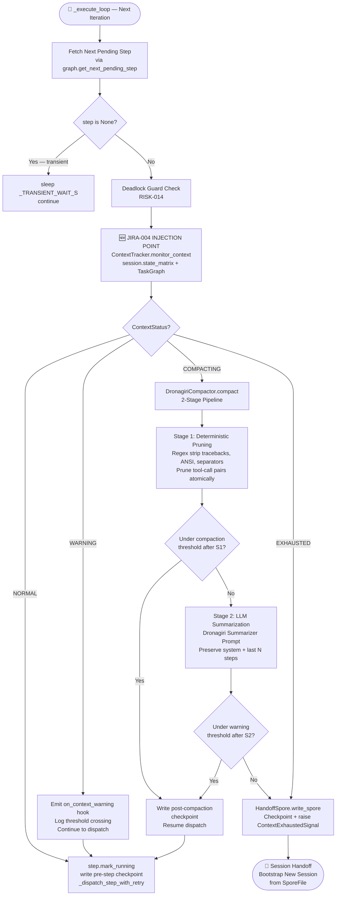
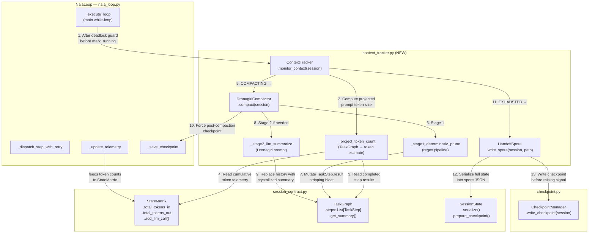
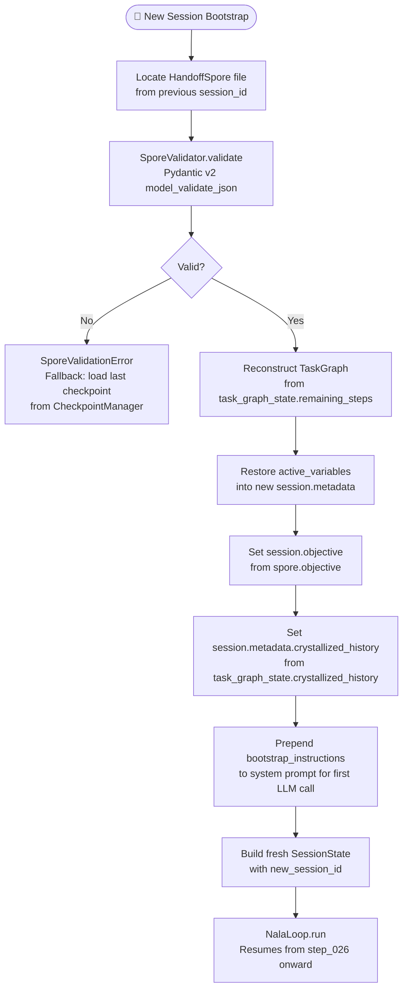

# JIRA-004 — Context Window Tracker & Dronagiri Compactor

**Epic:** NALA-001 — Long-Running Survival Foundation
**Priority:** P0 — Critical Path
**Estimate:** 3 days
**Depends On:** JIRA-003 (Task Loop Skeleton ✅)
**Blocks:** JIRA-005 (Crash Recovery), JIRA-007 (1-Hour Soak Test)
**Version:** 2.0.0 — Enhanced Design (Production-Grade)

> Establish NALA's **Context Window Tracker and Dronagiri Compactor** (`context_tracker.py`),
> which monitors active token usage derived from `SessionState` and `StateMatrix`, implements
> configurable WARNING/COMPACTING/EXHAUSTED thresholds, executes a precise 2-stage compaction
> pipeline (deterministic regex pruning → LLM-based summarization), and writes a validated
> `HandoffSpore` JSON file when the context cannot be recovered — allowing NALA to bootstrap
> a clean session without losing task history or runtime variables.

---

## 1. Architectural Blueprint

### 1.1 Context Management Flow During Task Loop



### 1.2 Component Integration Map



---

## 2. Risk Register & Mitigations

| Risk ID | Description | Severity | Mitigation Strategy |
|---------|-------------|----------|---------------------|
| **RISK-016** | Token count desync — `tiktoken` local count diverges from remote LLM tokenizer | HIGH | Apply `+20` tokens per message role overhead (OpenAI guideline). Apply `+10%` multiplicative safety buffer on projected total. Never trust remote counts during loop. |
| **RISK-017** | "Lost in the Middle" effect — model forgets intermediate steps after compaction | MEDIUM | Stage 2 summarizer prompt explicitly preserves the system prompt at position 0 and the most recent `N_PRESERVE_TAIL = 3` steps at the end. Only middle history is summarized. |
| **RISK-018** | Orphaned tool calls — pruning a tool call message without its paired tool response | HIGH | `_stage1_deterministic_prune()` walks the messages list as *pairs*: any message with `"tool_calls"` key must be pruned *together* with its immediately following `"role": "tool"` sibling. Single-message pruning of a tool call is a fatal invariant violation. |
| **RISK-019** | Runaway LLM summarization API costs — Stage 2 called on every iteration | MEDIUM | Stage 2 (`_stage2_llm_summarize`) is only invoked when Stage 1 fails to bring token count below `compaction_percent`. Stage 1 (regex-only, zero cost) is always attempted first. |
| **RISK-020** | Loss of state during session handoff — spore file incomplete or schema-invalid | CRITICAL | `HandoffSpore.write_spore()` uses Pydantic v2 model validation before writing. The spore is schema-validated on both write and on bootstrap read. A corrupted spore raises `SporeValidationError`, which triggers a rollback to the last good checkpoint via `CheckpointManager`. |
| **RISK-021** | Compaction mutates live `TaskStep.result` without checkpoint — mutation lost on crash | HIGH | `DronagiriCompactor.compact()` writes a post-compaction checkpoint via `NalaLoop._save_checkpoint("post-compaction")` *before* returning control to `_execute_loop`. The compacted state is always persisted before resuming. |
| **RISK-022** | `StateMatrix.total_tokens` diverges from prompt size — telemetry is cumulative, not per-call | MEDIUM | `ContextTracker._project_token_count()` independently serializes and counts the `TaskGraph` step result payloads via `tiktoken`. It does NOT rely on `StateMatrix.total_tokens` for threshold decisions (telemetry is informational only). |

---

## 3. Technical Design & Core Capabilities

### A. Enums and Configuration

```python
# context_tracker.py

class ContextStatus(str, Enum):
    NORMAL     = "NORMAL"      # Projected usage < warning_percent
    WARNING    = "WARNING"     # warning_percent <= usage < compaction_percent
    COMPACTING = "COMPACTING"  # compaction_percent <= usage < 100%
    EXHAUSTED  = "EXHAUSTED"   # usage >= safety ceiling; handoff required

@dataclass(frozen=True)
class TrackerConfig:
    # Maximum context tokens the target LLM model supports
    max_context_tokens: int   = 128_000

    # Fraction of max_context_tokens at which WARNING status is emitted
    warning_percent: float    = 0.70          # 89,600 tokens for 128K model

    # Fraction at which DronagiriCompactor is invoked
    compaction_percent: float = 0.85          # 108,800 tokens for 128K model

    # Hard ceiling: if projected tokens exceed this, emit EXHAUSTED immediately
    # max_context_tokens * (1 - safety_buffer_fraction)
    safety_buffer_fraction: float = 0.05      # 6,400 token reserve for 128K

    # tiktoken encoding name matching the target model
    model_encoding: str       = "cl100k_base"

    # Number of completed steps at the end of history to NEVER summarize
    n_preserve_tail: int      = 3

    # Per-message role overhead (OpenAI tokenization guideline: 4 tokens/msg)
    # We use 20 for conservative headroom across all LLM providers
    per_message_overhead: int = 20

    @property
    def safety_ceiling_tokens(self) -> int:
        return int(self.max_context_tokens * (1.0 - self.safety_buffer_fraction))

    @property
    def compaction_threshold_tokens(self) -> int:
        return int(self.max_context_tokens * self.compaction_percent)

    @property
    def warning_threshold_tokens(self) -> int:
        return int(self.max_context_tokens * self.warning_percent)
```

---

### B. `ContextTracker` — Token Projection Engine

The ContextTracker does NOT rely on `StateMatrix.total_tokens` for threshold decisions (RISK-022). Instead, it independently serializes the current prompt payload and counts it via `tiktoken`.

**What gets counted as "projected prompt size":**
```
projected_tokens =
    system_prompt_tokens          (fixed; loaded from TrackerConfig or session metadata)
  + Σ TaskStep.description tokens (for all PENDING steps remaining)
  + Σ TaskStep.result tokens      (for all SUCCESS steps — this is the growing "history")
  + next_step_tokens              (the step about to be dispatched)
  + per_message_overhead × N_messages
```

```python
class ContextTracker:

    def __init__(self, config: TrackerConfig) -> None:
        self.config   = config
        self.encoding = tiktoken.get_encoding(config.model_encoding)
        self._logger  = logging.getLogger("nala.context_tracker")

    # ── Public API ────────────────────────────────────────────────────────────

    def monitor_context(self, session: SessionState) -> ContextStatus:
        """
        Compute the projected prompt token count for the current session state
        and return the corresponding ContextStatus.

        Called from NalaLoop._execute_loop() AFTER the deadlock guard check
        and BEFORE step.mark_running().

        Parameters
        ----------
        session : SessionState
            The live session being executed.

        Returns
        -------
        ContextStatus
            NORMAL / WARNING / COMPACTING / EXHAUSTED
        """
        projected = self._project_token_count(session)
        status    = self._classify(projected)

        self._logger.info(
            "[ContextTracker] projected=%d | limit=%d | status=%s",
            projected, self.config.max_context_tokens, status.value,
        )
        return status

    # ── Internal ─────────────────────────────────────────────────────────────

    def _project_token_count(self, session: SessionState) -> int:
        """
        Estimate total prompt tokens for the next LLM dispatch by serializing
        the TaskGraph state into a representative prompt payload and counting
        with tiktoken.

        Projection formula:
          tokens = Σ count(step.description) for all steps
                 + Σ count(serialize(step.result)) for SUCCESS steps
                 + per_message_overhead × total_step_count
                 + count(session.objective)
        """
        total = 0
        cfg   = self.config

        # Session objective (included in every LLM system prompt)
        total += self._count(session.objective)

        for step in session.task_graph.steps:
            # Step description always present in prompt
            total += self._count(step.description) + cfg.per_message_overhead

            # Step result payload — this is the growing "history" that bloats context
            if step.result is not None:
                result_text = json.dumps(step.result, ensure_ascii=False)
                total += self._count(result_text) + cfg.per_message_overhead

            # Error messages also occupy context
            if step.error_message:
                total += self._count(step.error_message) + cfg.per_message_overhead

        return total

    def _count(self, text: str) -> int:
        """Return the tiktoken token count for a string."""
        return len(self.encoding.encode(text, disallowed_special=()))

    def _classify(self, projected_tokens: int) -> ContextStatus:
        cfg = self.config
        if projected_tokens >= cfg.safety_ceiling_tokens:
            return ContextStatus.EXHAUSTED
        if projected_tokens >= cfg.compaction_threshold_tokens:
            return ContextStatus.COMPACTING
        if projected_tokens >= cfg.warning_threshold_tokens:
            return ContextStatus.WARNING
        return ContextStatus.NORMAL
```

---

### C. Stage 1 — Deterministic Pruning (Zero API Cost)

Stage 1 applies a precise regex pipeline to prune bloat from completed `TaskStep.result` payloads in-place. It never modifies PENDING step descriptions, step_ids, or any metadata.

**Atomic Tool-Call Pair Invariant (RISK-018):**
When pruning `TaskStep.result` dicts that represent LLM tool-call exchanges, the result payload may contain a list of message dicts. Tool-call messages follow this pattern:

```
messages[i]   = {"role": "assistant", "tool_calls": [...]}   ← CALL
messages[i+1] = {"role": "tool", "content": "..."}           ← RESPONSE
```

These two entries are a **locked atomic pair**. `_stage1_deterministic_prune()` identifies and prunes them *together*. Pruning index `i` without `i+1` produces an orphaned tool response that causes LLM API errors on the next call.

```python
# ── Regex Compilation (module-level, compiled once) ───────────────────────────

import re, json
from typing import List, Dict, Any

# P1 — Python traceback blocks (multiline)
_RE_TRACEBACK = re.compile(
    r"Traceback \(most recent call last\):.*?(?=\n\S|\Z)",
    re.DOTALL,
)
# P2 — ANSI escape codes (terminal colors, cursor movement)
_RE_ANSI = re.compile(
    r"\x1B(?:[@-Z\\-_]|\[[0-?]*[ -/]*[@-~])"
)
# P3 — Tool output section headers
_RE_TOOL_HEADER = re.compile(
    r"^[-=]{3,}\s*(?:Tool Output|Debug|Verbose|stdout|stderr|Log)\s*[-=]{3,}\n?",
    re.MULTILINE | re.IGNORECASE,
)
# P4 — Base64 / binary blob lines (3+ consecutive lines of 60+ base64 chars)
_RE_BASE64_BLOB = re.compile(
    r"(?:[A-Za-z0-9+/]{60,}\n?){3,}"
)
# P5 — Repeated separator lines (20+ repeated chars)
_RE_SEPARATOR = re.compile(
    r"^[-=*#~]{20,}\s*$\n?",
    re.MULTILINE,
)
# P6 — Excessive blank lines (3+ consecutive → collapse to 1)
_RE_EXCESS_BLANK = re.compile(r"\n{3,}")

# Ordered pipeline: apply in this exact sequence
_PRUNE_PIPELINE: List[tuple] = [
    ("traceback",   _RE_TRACEBACK,    ""),
    ("ansi",        _RE_ANSI,         ""),
    ("tool_header", _RE_TOOL_HEADER,  ""),
    ("base64_blob", _RE_BASE64_BLOB,  "[BINARY_CONTENT_REDACTED]"),
    ("separator",   _RE_SEPARATOR,    ""),
    ("blank_lines", _RE_EXCESS_BLANK, "\n\n"),
]


def _apply_prune_pipeline(text: str) -> str:
    """
    Apply the full deterministic regex pipeline to a text string.
    Returns the pruned string.
    """
    for name, pattern, replacement in _PRUNE_PIPELINE:
        text = pattern.sub(replacement, text)
    return text.strip()


def _prune_tool_call_pairs_atomically(
    messages: List[Dict[str, Any]],
    keep_tail: int,
) -> List[Dict[str, Any]]:
    """
    Identify atomic tool-call pairs in a messages list and prune oldest
    pairs first, preserving the last `keep_tail` complete pairs.

    A pair is defined as:
        messages[i].role == "assistant" AND "tool_calls" in messages[i]
        messages[i+1].role == "tool"

    The function returns the pruned messages list. It NEVER produces an
    orphaned tool call (RISK-018).

    Parameters
    ----------
    messages  : List[dict]   Ordered list of LLM message dicts.
    keep_tail : int          Number of complete pairs to preserve at the end.

    Returns
    -------
    List[dict]   Pruned messages list with orphan-safety guaranteed.
    """
    # Identify all (start_idx, end_idx) slices that represent complete pairs
    pair_indices: List[tuple[int, int]] = []
    i = 0
    while i < len(messages) - 1:
        msg = messages[i]
        nxt = messages[i + 1]
        if (
            isinstance(msg, dict)
            and msg.get("role") == "assistant"
            and "tool_calls" in msg
            and isinstance(nxt, dict)
            and nxt.get("role") == "tool"
        ):
            pair_indices.append((i, i + 1))
            i += 2
        else:
            i += 1

    # Determine which pairs to prune (all except last `keep_tail`)
    pairs_to_prune = pair_indices[: max(0, len(pair_indices) - keep_tail)]

    if not pairs_to_prune:
        return messages

    # Build a set of indices to remove
    remove_set: set[int] = set()
    for start, end in pairs_to_prune:
        remove_set.add(start)
        remove_set.add(end)

    return [msg for idx, msg in enumerate(messages) if idx not in remove_set]
```

---

### D. Stage 2 — LLM-Based Summarization (Dronagiri Prompt)

Stage 2 is invoked ONLY if Stage 1 fails to bring the projected token count below `compaction_percent`. It calls a summarizer LLM (injected via `summarizer_fn`) with the following structured prompt.

#### Dronagiri Compactor Summarization Prompt (Golden Prompt Layout)

```xml
<system_prompt>
<task_context>
You are the Dronagiri Compactor — the context crystallization engine of NALA
(Nexus Autonomous Long-Running Agent). Your sole task is to compress the
historical execution log of a long-running agent session into a compact,
lossless crystallized summary that preserves all information necessary for
the agent to resume execution without any regressions.
</task_context>

<tone>
Be precise, terse, and technical. No prose, no filler. Output only structured
summaries. Every variable name, error encountered, output value, and decision
made must be preserved. Lossy compression is a failure mode.
</tone>

<data_format>
The input is a JSON array of completed TaskStep objects from NALA's TaskGraph.
Each object has: step_id, description, status, result (dict), error_message.
</data_format>

<rules>
1. DO NOT summarize or modify steps at index (N-{n_preserve_tail}) to N.
   These are the most recent steps and must be passed through UNCHANGED.
2. DO NOT summarize or modify the session objective. It is not in this payload.
3. For steps 0 to N-{n_preserve_tail}-1, produce a single compressed entry
   per step. Preserve: step_id, final status, key output variables (names +
   values), any errors encountered, any side effects confirmed (files written,
   APIs called, DB rows inserted).
4. If a step FAILED, preserve the exact error_message verbatim. Never discard
   failure reasons.
5. If a step result contains a file path, URL, or identifier — preserve it
   exactly. These are likely referenced by later steps.
6. Compress verbose terminal output, logs, and debug strings to a one-line
   outcome statement: e.g. "Executed shell command. Exit code 0. 42 lines output."
7. DO NOT invent, infer, or hallucinate any information not present in the input.
</rules>

<output_format>
Return ONLY valid JSON. No preamble, no markdown fences, no explanation.
Wrap your output in the following structure:

{
  "crystallized_steps": [
    {
      "step_id": "step_001_...",
      "status": "SUCCESS",
      "summary": "One to three sentence factual outcome.",
      "key_outputs": {"variable_name": "value", ...},
      "errors": null
    },
    ...
  ]
}
</output_format>
</system_prompt>

<user_prompt>
<history>
Summarize the following {n_steps_to_summarize} completed TaskStep records.
Preserve the last {n_preserve_tail} steps EXACTLY as provided in the array.
Compress all earlier steps into crystallized_steps entries per the rules above.
</history>

<immediate_request>
Input TaskStep JSON array:
{serialized_steps_json}
</immediate_request>
</user_prompt>
```

**Runtime parameter substitution:**
- `{n_preserve_tail}` → `TrackerConfig.n_preserve_tail` (default: 3)
- `{n_steps_to_summarize}` → `len(completed_steps) - n_preserve_tail`
- `{serialized_steps_json}` → `json.dumps([s.model_dump() for s in completed_steps], indent=2)`

---

### E. `DronagiriCompactor` — Full 2-Stage Pipeline

```python
class DronagiriCompactor:

    def __init__(
        self,
        tracker:       ContextTracker,
        summarizer_fn: Callable[[str, str], str],   # (system_prompt, user_prompt) → str
        checkpoint_fn: Callable[[str], Path],        # NalaLoop._save_checkpoint reference
    ) -> None:
        self.tracker       = tracker
        self.summarizer_fn = summarizer_fn
        self.checkpoint_fn = checkpoint_fn
        self._logger = logging.getLogger("nala.dronagiri_compactor")

    def compact(self, session: SessionState) -> bool:
        """
        Execute the 2-stage compaction pipeline on the live session's TaskGraph.

        Stage 1: Deterministic regex pruning of TaskStep.result payloads.
        Stage 2: LLM-based crystallization of historical steps (if S1 insufficient).

        A post-compaction checkpoint is ALWAYS written after any mutation,
        regardless of which stage succeeded (RISK-021).

        Returns
        -------
        bool
            True  — compaction succeeded; context is below compaction_percent.
            False — compaction failed; caller should trigger handoff.
        """
        self._logger.info("[Dronagiri] Starting compaction pipeline.")

        # ── Stage 1: Deterministic Pruning ───────────────────────────────────
        self._logger.info("[Dronagiri] Stage 1 — Deterministic pruning.")
        mutations = 0
        for step in session.task_graph.steps:
            if step.result is None or step.status != "SUCCESS":
                continue
            original_json = json.dumps(step.result, ensure_ascii=False)
            pruned_json   = _apply_prune_pipeline(original_json)
            if pruned_json != original_json:
                step.result = json.loads(pruned_json)
                mutations  += 1

        self._logger.info(
            "[Dronagiri] Stage 1 complete — %d step results pruned.", mutations
        )

        # Check if Stage 1 was sufficient
        post_s1_status = self.tracker.monitor_context(session)
        if post_s1_status in (ContextStatus.NORMAL, ContextStatus.WARNING):
            self._force_checkpoint(session, "post-compaction-stage1")
            return True

        # ── Stage 2: LLM-Based Summarization ────────────────────────────────
        self._logger.info("[Dronagiri] Stage 2 — LLM crystallization.")
        success = self._stage2_llm_summarize(session)

        # Always write checkpoint after mutation (RISK-021)
        self._force_checkpoint(session, "post-compaction-stage2")

        post_s2_status = self.tracker.monitor_context(session)
        return post_s2_status in (ContextStatus.NORMAL, ContextStatus.WARNING)

    def _stage2_llm_summarize(self, session: SessionState) -> bool:
        """
        Invoke the Dronagiri Summarizer on completed steps, crystallizing
        history while preserving the tail (last n_preserve_tail steps).
        """
        cfg = self.tracker.config
        completed = [
            s for s in session.task_graph.steps
            if s.status == "SUCCESS"
        ]

        if len(completed) <= cfg.n_preserve_tail:
            self._logger.warning(
                "[Dronagiri] Not enough completed steps to summarize (%d <= %d tail). "
                "Skipping Stage 2.", len(completed), cfg.n_preserve_tail
            )
            return False

        steps_to_summarize = completed[: -cfg.n_preserve_tail]
        steps_to_preserve  = completed[-cfg.n_preserve_tail:]

        system_prompt = self._build_system_prompt(cfg.n_preserve_tail)
        user_prompt   = self._build_user_prompt(
            steps_to_summarize, cfg.n_preserve_tail
        )

        try:
            raw_response = self.summarizer_fn(system_prompt, user_prompt)
            parsed       = json.loads(raw_response)
            crystallized = parsed["crystallized_steps"]
        except (json.JSONDecodeError, KeyError) as exc:
            self._logger.error(
                "[Dronagiri] Stage 2 summarizer returned invalid JSON: %s", exc
            )
            return False

        # Replace the result payload of summarized steps with crystallized summaries
        cryst_by_id = {c["step_id"]: c for c in crystallized}
        for step in steps_to_summarize:
            if step.step_id in cryst_by_id:
                c = cryst_by_id[step.step_id]
                step.result = {
                    "crystallized": True,
                    "summary":      c.get("summary", ""),
                    "key_outputs":  c.get("key_outputs", {}),
                    "errors":       c.get("errors"),
                }

        self._logger.info(
            "[Dronagiri] Stage 2 complete — %d steps crystallized, %d tail preserved.",
            len(steps_to_summarize), len(steps_to_preserve)
        )
        return True

    def _force_checkpoint(self, session: SessionState, label: str) -> None:
        try:
            path = self.checkpoint_fn(label)
            self._logger.info(
                "[Dronagiri] Post-compaction checkpoint written: %s", path
            )
        except Exception as exc:
            self._logger.critical(
                "[Dronagiri] CRITICAL: post-compaction checkpoint FAILED: %s", exc
            )
            raise

    def _build_system_prompt(self, n_preserve_tail: int) -> str:
        return (
            f"You are the Dronagiri Compactor. Summarize historical TaskStep records "
            f"into a compact crystallized summary. DO NOT summarize or modify the last "
            f"{n_preserve_tail} steps. Preserve all variable names, error messages, "
            f"file paths, and identifiers exactly. Return only valid JSON inside "
            f"{{\"crystallized_steps\": [...]}}. No markdown, no preamble."
        )

    def _build_user_prompt(
        self,
        steps_to_summarize: list,
        n_preserve_tail: int,
    ) -> str:
        payload = json.dumps(
            [s.model_dump(mode="json") for s in steps_to_summarize],
            indent=2,
            ensure_ascii=False,
        )
        return (
            f"Summarize the following {len(steps_to_summarize)} completed TaskStep "
            f"records. The last {n_preserve_tail} steps of the full history are "
            f"preserved separately and not included here.\n\n"
            f"Input TaskStep JSON array:\n{payload}"
        )
```

---

### F. Handoff Spore — Schema & Bootstrap Workflow

The `HandoffSpore` is written when `ContextStatus.EXHAUSTED` is reached and compaction cannot recover the session. It is a complete, self-contained snapshot that allows a new NALA session to bootstrap with full context from the previous session.

#### F.1 Spore File JSON Schema (Pydantic v2 Model)

```python
class SporeTaskGraphSummary(BaseModel):
    """Compact serialization of the current TaskGraph state."""
    total_steps:       int
    completed_steps:   int
    failed_steps:      int
    pending_steps:     int
    crystallized_history: str   # Prose summary of all completed work
    remaining_steps:   List[Dict[str, Any]]   # Full TaskStep dicts for PENDING steps
    last_completed_step_id: Optional[str]

class SporeTelemetry(BaseModel):
    """Telemetry snapshot at the moment of handoff."""
    total_tokens_in:     int
    total_tokens_out:    int
    estimated_cost_usd:  float
    error_count:         int
    elapsed_seconds:     float
    session_lsn:         int    # CheckpointMeta.lsn at handoff

class HandoffSporeModel(BaseModel):
    """
    Schema-validated handoff spore file.
    Written by HandoffSpore.write_spore().
    Read by NalaLoop bootstrap logic.
    """
    model_config = ConfigDict(extra="forbid")

    spore_version:         str       = "2.0.0"
    original_session_id:   str       # UUID of the session being handed off
    new_session_id:        str       # Pre-generated UUID for the next session
    objective:             str       # Original full objective — never summarized
    handoff_timestamp:     datetime  # UTC-aware
    handoff_reason:        str       # e.g. "CONTEXT_EXHAUSTED at 121,600 tokens"
    checkpoint_path:       str       # Absolute path to last valid checkpoint
    task_graph_state:      SporeTaskGraphSummary
    telemetry_state:       SporeTelemetry
    active_variables:      Dict[str, Any]   # Key outputs from last SUCCESS step
    done_condition:        Optional[str]    # Original done condition text, if set
    bootstrap_instructions: str             # System-prompt fragment for new session
```

#### F.2 Example Spore File

```json
{
  "spore_version": "2.0.0",
  "original_session_id": "965b4af4-42f9-44a1-bb3e-c0e213d4a891",
  "new_session_id": "1a2b3c4d-0000-4e5f-8a9b-ffffff000001",
  "objective": "Refactor the full NALA core harness — replace sync I/O with asyncio throughout.",
  "handoff_timestamp": "2026-06-12T13:34:47Z",
  "handoff_reason": "CONTEXT_EXHAUSTED: projected 121,600 tokens >= safety ceiling 121,600 (128K model, 5% buffer)",
  "checkpoint_path": "/data/checkpoints/965b4af4/checkpoint_LSN_000087.json",
  "task_graph_state": {
    "total_steps": 32,
    "completed_steps": 25,
    "failed_steps": 1,
    "pending_steps": 6,
    "crystallized_history": "Steps 1-25 completed. Refactored session_contract.py (SUCCESS), checkpoint.py (SUCCESS), nala_loop.py (SUCCESS). Step 14 (migrate_db_schema) FAILED with IntegrityError on foreign key constraint — mitigation: PR-12 merged, constraint dropped. All file writes confirmed at /src/core/harness/. Test suite at 68/68 passed after step 22.",
    "remaining_steps": [
      {"step_id": "step_026_refactor_brain", "description": "Refactor core/brain/planner.py to async", "status": "PENDING", "dependencies": ["step_025_refactor_session"]},
      {"step_id": "step_027_refactor_hands", "description": "Refactor core/hands/executor.py to async", "status": "PENDING", "dependencies": ["step_026_refactor_brain"]}
    ],
    "last_completed_step_id": "step_025_refactor_session"
  },
  "telemetry_state": {
    "total_tokens_in": 98_400,
    "total_tokens_out": 23_000,
    "estimated_cost_usd": 1.45,
    "error_count": 2,
    "elapsed_seconds": 14_432.7,
    "session_lsn": 87
  },
  "active_variables": {
    "last_written_file": "/src/core/harness/session_contract.py",
    "test_pass_count": 68,
    "pr_merged": "PR-12",
    "db_migration_status": "constraint_dropped"
  },
  "done_condition": "All 32 refactoring steps complete. Test suite at 68/68. No regressions.",
  "bootstrap_instructions": "You are resuming NALA session 965b4af4. Steps 1-25 are complete (see crystallized_history). Begin at step_026_refactor_brain. The active_variables dict contains all key outputs from the previous session. Treat the checkpoint at checkpoint_path as ground truth."
}
```

#### F.3 Bootstrap Workflow (New Session)



---

## 4. NALA Execution — Golden Prompt Layout

All LLM calls dispatched by NALA executors (Planner, Executor, Judge) MUST follow this structured prompt layout. `context_tracker.py` validates that the assembled prompt fits within the context window BEFORE the executor is called.

```xml
<nala_execution_prompt>

<system_prompt>
<task_context>
You are NALA — Nexus Autonomous Long-Running Agent. You are executing step
{step_id} of a multi-step task plan. Your objective is: {objective}.
</task_context>

<tone>
Production-grade engineering precision. No filler commentary. Output exactly
what the step requires. If a code file, output only the file content.
If a JSON result, output only valid JSON.
</tone>

<data_docs>
Session ID: {session_id}
Current LSN: {lsn}
Steps completed: {completed_count} / {total_steps}
Active variables from previous steps: {active_variables_json}
</data_docs>

<rules>
1. Do not re-introduce bugs fixed in previous steps (see crystallized_history).
2. Do not delete or modify test files unless the step explicitly requires it.
3. If you encounter an ambiguity, output a BLOCKED status JSON rather than
   guessing: {"status": "BLOCKED", "reason": "..."}
4. All file paths must be absolute.
5. Your output will be parsed by NALA's StepResult schema. Return only the
   requested artifact or a valid JSON result dict.
</rules>

<crystallized_history>
{crystallized_history}
</crystallized_history>

<immediate_request>
Execute step {step_id}: {step_description}

Expected output format: {expected_output_format}
Done condition for this step: {step_done_condition}
</immediate_request>

<formatting>
Return your result as a JSON object:
{
  "success": true | false,
  "output": { ... step-specific result fields ... },
  "error": null | "error message if success=false"
}
</formatting>

</system_prompt>

</nala_execution_prompt>
```

---

## 5. Injection Point in `nala_loop.py` — Exact Modification

The `ContextTracker` is injected into `NalaLoop.__init__()` as an optional parameter and called in `_execute_loop()` at a single, precise location: **after the deadlock guard, before `step.mark_running()`**.

### 5.1 Modified `__init__` Signature

```python
def __init__(
    self,
    session: SessionState,
    checkpoint_manager: CheckpointManager,
    *,
    max_retries_per_step: int = 0,
    checkpoint_on_success_only: bool = False,
    hooks: Optional[LoopHooks] = None,
    context_tracker: Optional["ContextTracker"] = None,   # ← JIRA-004 NEW
    compactor: Optional["DronagiriCompactor"] = None,      # ← JIRA-004 NEW
) -> None:
    ...
    self.context_tracker: Optional[ContextTracker] = context_tracker
    self.compactor:       Optional[DronagiriCompactor] = compactor
```

### 5.2 Injection in `_execute_loop()` (Exact Diff)

Insert the following block AFTER the deadlock guard (`RISK-014`) check and BEFORE `step.mark_running()`:

```python
# ── JIRA-004: Context Window Guard ───────────────────────────────────────────
# Injected after RISK-014 deadlock guard, before step.mark_running().
# Location in _execute_loop(): line ~597 (after last_dispatched_id guard).

if self.context_tracker is not None:
    ctx_status = self.context_tracker.monitor_context(self.session)

    if ctx_status == ContextStatus.WARNING:
        logger.warning(
            "[NalaLoop] ⚠ Context WARNING | Projected tokens approaching "
            "compaction threshold. session_id=%s | LSN=%d",
            self.session.session_id,
            self.session.checkpoint_meta.lsn,
        )
        # Emit optional hook — does NOT pause loop
        self._emit(getattr(self.hooks, "on_context_warning", None), self.session)

    elif ctx_status == ContextStatus.COMPACTING:
        logger.warning(
            "[NalaLoop] 🔄 Context COMPACTING | Invoking DronagiriCompactor. "
            "session_id=%s | LSN=%d",
            self.session.session_id,
            self.session.checkpoint_meta.lsn,
        )
        if self.compactor is not None:
            success = self.compactor.compact(self.session)
            if not success:
                # Compaction failed — escalate to EXHAUSTED path
                logger.error(
                    "[NalaLoop] Compaction FAILED after 2 stages. "
                    "Escalating to EXHAUSTED handoff."
                )
                ctx_status = ContextStatus.EXHAUSTED

    if ctx_status == ContextStatus.EXHAUSTED:
        logger.critical(
            "[NalaLoop] 🚨 Context EXHAUSTED | Writing HandoffSpore. "
            "session_id=%s | LSN=%d",
            self.session.session_id,
            self.session.checkpoint_meta.lsn,
        )
        # 1. Write final checkpoint before spore
        self._save_checkpoint("pre-handoff")
        # 2. Write handoff spore
        spore_path = Path(self.cm.base_dir) / self.session.session_id / "handoff.spore.json"
        HandoffSpore.write_spore(self.session, spore_path)
        # 3. Emit hook and exit PAUSED (resumable by bootstrap)
        self._emit(self.hooks.on_loop_end, LoopStatus.PAUSED, self.session)
        return LoopStatus.PAUSED

# ── END JIRA-004 injection ────────────────────────────────────────────────────

# Original code continues here:
step.mark_running()
graph.current_step_id = step.step_id
```

---

## 6. File Structure & Proposed Changes

### 6.1 New Files

#### [`core/harness/context_tracker.py`]
Contains: `ContextStatus`, `TrackerConfig`, `ContextTracker`, `DronagiriCompactor`,
`HandoffSpore`, `HandoffSporeModel`, `SporeTaskGraphSummary`, `SporeTelemetry`,
`SporeValidationError`, `ContextExhaustedSignal`, all regex patterns, `_apply_prune_pipeline`,
`_prune_tool_call_pairs_atomically`.

#### [`tests/unit/test_context_tracker.py`]
10 unit tests (T01–T10). See Section 7.

### 6.2 Modified Files

#### [`core/harness/nala_loop.py`]
- Add `context_tracker: Optional[ContextTracker]` and `compactor: Optional[DronagiriCompactor]`
  to `__init__` signature.
- Add JIRA-004 injection block in `_execute_loop()` (exact location: Section 5.2).
- Add optional `on_context_warning: Optional[Callable[[SessionState], None]]` field to `LoopHooks`.

#### [`core/harness/__init__.py`]
Add to exports:
```python
from core.harness.context_tracker import (
    ContextTracker,
    ContextStatus,
    TrackerConfig,
    DronagiriCompactor,
    HandoffSpore,
    HandoffSporeModel,
    SporeValidationError,
)
```

---

## 7. Test Harness — 10 Unit Tests

| # | Test Name | Validates | Risk Covered |
|---|-----------|-----------|--------------|
| T01 | `test_token_counting_precision` | `ContextTracker._count()` via tiktoken exactly matches expected count for a known prompt string (4 × role overhead per message). Asserts count is within ±5% of a tiktoken-verified baseline. | RISK-016 |
| T02 | `test_warning_threshold_trigger` | Build a `SessionState` with completed steps whose serialized result payloads total ~72% of `max_context_tokens`. Assert `monitor_context()` returns `ContextStatus.WARNING`. | Safety limits |
| T03 | `test_compacting_threshold_trigger` | Build a `SessionState` at ~87% projected usage. Assert `monitor_context()` returns `ContextStatus.COMPACTING`. | Compaction flow |
| T04 | `test_exhausted_threshold_trigger` | Build a `SessionState` at 96% projected usage (above safety ceiling). Assert `monitor_context()` returns `ContextStatus.EXHAUSTED`. | RISK-020 |
| T05 | `test_stage1_deterministic_prune_patterns` | Feed a `TaskStep.result` JSON string containing a Python traceback, ANSI codes, base64 blob, and a 25-char separator line through `_apply_prune_pipeline()`. Assert all four are stripped and the result contains `[BINARY_CONTENT_REDACTED]` for the base64 blob. | RISK-019 |
| T06 | `test_system_prompt_and_tail_preservation` | Build a mock session with 7 completed steps. Run `_stage2_llm_summarize()` with a mock summarizer. Assert the last `n_preserve_tail=3` steps' `step_id` and `result` are UNCHANGED in the session after compaction. | RISK-017 |
| T07 | `test_tool_call_pair_atomicity` | Build a messages list with 3 complete tool-call pairs at indices (0,1), (2,3), (4,5). Call `_prune_tool_call_pairs_atomically(messages, keep_tail=1)`. Assert only pair (4,5) remains and no orphaned `"role": "tool"` message exists without a preceding `"tool_calls"` message. | RISK-018 |
| T08 | `test_handoff_spore_write_and_validate` | Call `HandoffSpore.write_spore()` on a fully built `SessionState`. Read the written JSON file. Call `HandoffSporeModel.model_validate_json()`. Assert all fields match source session, `new_session_id` is a valid UUID distinct from `original_session_id`, and `remaining_steps` contains only PENDING steps. | RISK-020 |
| T09 | `test_post_compaction_checkpoint_written` | Mock `checkpoint_fn` as a call counter. Run `DronagiriCompactor.compact()`. Assert `checkpoint_fn` was called at least once regardless of which stage succeeded. | RISK-021 |
| T10 | `test_loop_integration_with_context_guard` | Construct a `NalaLoop` with `max_context_tokens=500` and a `ContextTracker` with a very small limit. Register an executor that returns a 200-token result string. Run the loop for 5 steps. Assert that `DronagiriCompactor.compact()` is called before step 5 dispatches, and the loop exits `COMPLETED` (not `FAILED`). | E2E integration |

---

## 8. Execution Phases & Acceptance Criteria

### Phase 1 — Token Tracker (Day 1)
- [ ] Implement `TrackerConfig` dataclass with all threshold properties.
- [ ] Implement `ContextTracker._project_token_count()` using `tiktoken`.
- [ ] Verify `per_message_overhead=20` produces conservative (never under) estimates vs. real LLM tokenizer output.
- [ ] Implement `ContextTracker._classify()` with NORMAL/WARNING/COMPACTING/EXHAUSTED states.
- [ ] Write T01, T02, T03, T04. All pass.

### Phase 2 — Dronagiri Compactor (Day 2)
- [ ] Compile and test all 6 regex patterns from `_PRUNE_PIPELINE` against synthetic payloads.
- [ ] Implement `_apply_prune_pipeline()` with ordered application.
- [ ] Implement `_prune_tool_call_pairs_atomically()` with orphan-safety guarantee.
- [ ] Implement `DronagiriCompactor._stage2_llm_summarize()` with full Dronagiri prompt.
- [ ] Implement `HandoffSpore.write_spore()` with Pydantic v2 `HandoffSporeModel` validation.
- [ ] Inject JIRA-004 block into `nala_loop.py._execute_loop()` per Section 5.2.
- [ ] Write T05, T06, T07, T08, T09. All pass.

### Phase 3 — Integration & Verification (Day 3)
- [ ] Write T10 (E2E loop integration soak with small context window).
- [ ] Run full test suite. Target: **68 passed, 0 failed** (cumulative with JIRA-001/002/003).
- [ ] Verify handoff spore bootstrap path by loading spore → constructing new `SessionState` → running `NalaLoop` to completion.
- [ ] Document token count baseline for `cl100k_base` encoding per message type.
- [ ] Update `core/harness/__init__.py` exports.

---

## 9. Definition of Done

- [ ] `context_tracker.py` fully implemented and exported from `core/harness/__init__.py`.
- [ ] `nala_loop.py` modified with JIRA-004 injection block — zero regressions in existing 15 tests.
- [ ] All 10 T01–T10 unit tests pass.
- [ ] Regression suite shows **68 passed, 0 failed**.
- [ ] `HandoffSpore.write_spore()` produces schema-valid JSON on a real `SessionState` instance.
- [ ] `DronagiriCompactor.compact()` reduces a synthetic 90%-full session below `compaction_percent` using Stage 1 alone (no LLM API call required for the regression test).
- [ ] RISK-016 through RISK-022 are all addressed with corresponding test coverage.

---

*Built at Nexus Lab AI Research Lab, Bengaluru*
*Jai Bajrang Bali 🙏*
