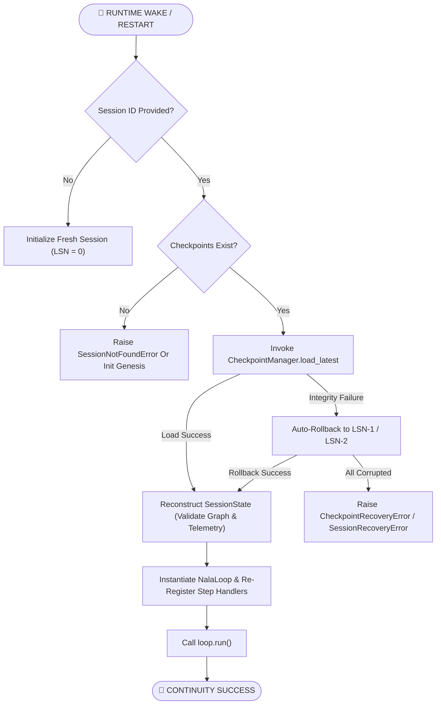
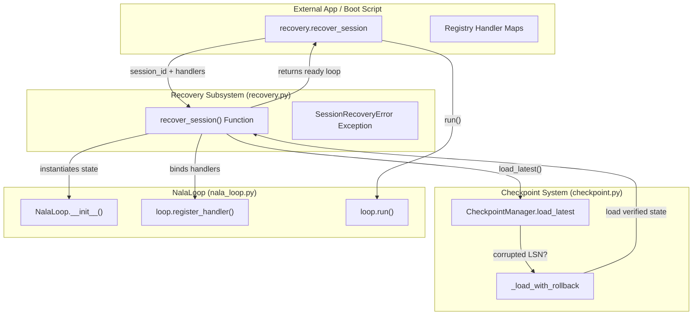

# JIRA-005 — Add Crash Recovery Plan (`recovery.py`)

**Epic:** NALA-001 — Long-Running Survival Foundation  
**Priority:** P0 — Critical Path  
**Estimate:** 1 day  
**Depends On:** JIRA-001 (Session Contract ✅), JIRA-002 (Checkpoint System ✅), JIRA-003 (Task Loop Skeleton ✅), JIRA-004 (Context Window Tracker ✅)  
**Blocks:** JIRA-007 (1-Hour Soak Test)

> Provide NALA with a standardized session recovery and process-crash resumption harness. If a NALA agent process is terminated mid-execution (due to host reboot, power loss, OOM, or sigkill), it must be fully restorable from its last valid Checkpoint LSN and able to resume task execution without duplicating steps or losing telemetry.

---

## 1. Architectural Blueprint

### 1.1 Recovery Flow Lifecycle



### 1.2 Component Interaction Diagram



---

## 2. Risk Register & Mitigations

| Risk ID | Description | Severity | Mitigation Strategy |
|---------|-------------|----------|---------------------|
| **RISK-015** | Corrupted LSN on resume loads wrong state | HIGH | `load_latest()` uses JIRA-002 rollback chain; recovery validates schema and calls `verify_integrity()` |
| **RISK-023** | Missing handlers after restore leads to loop failure | HIGH | Handler registry map must be explicitly re-registered during recovery initialization in `recover_session()` |
| **RISK-024** | Telemetry values (tokens/costs/errors) reset on crash | MEDIUM | State matrix accumulator is preserved in the checkpoint and loaded verbatim, preventing loss of audit data |
| **RISK-025** | Infinite reboot loops on persistent executor exceptions | HIGH | Error counts are stored in the state matrix and checked against execution limits to halt runaway loops |

---

## 3. Technical Design & Core Capabilities

### A. `SessionRecoveryError` Exception
```python
class SessionRecoveryError(NalaLoopError):
    """
    Raised when the recovery orchestrator cannot restore a loop
    due to missing directories, corrupt checkpoints, or validation desync.
    """
```

### B. `recover_session` Function Interface
A clean wrapper utility designed to bootstrap a loop from disk or exit gracefully if no checkpoint is available:

```python
def recover_session(
    session_id: str,
    checkpoint_manager: CheckpointManager,
    handlers: Dict[str, Callable],
    default_handler: Optional[Callable] = None,
    context_tracker: Optional[ContextTracker] = None,
    compactor: Optional[DronagiriCompactor] = None,
    **loop_kwargs,
) -> NalaLoop:
    """
    Recover a crashed or paused session from its latest valid checkpoint on disk.

    Parameters
    ----------
    session_id : str
        UUID of the crashed session to recover.
    checkpoint_manager : CheckpointManager
        The persistence engine to query.
    handlers : Dict[str, Callable]
        Executor callback map to re-register.
    default_handler : Optional[Callable]
        Fallback handler to register.
    context_tracker : Optional[ContextTracker]
        Active context tracker to bind.
    compactor : Optional[DronagiriCompactor]
        Active compactor to bind.
    loop_kwargs : Dict[str, Any]
        Additional configuration parameters for the loop.

    Returns
    -------
    NalaLoop
        A configured run loop initialized with the recovered session state.

    Raises
    ------
    SessionRecoveryError
        If checkpoints exist but are all unreadable, corrupt, or invalid.
    CheckpointNotFoundError
        If no checkpoint directories or files exist for the session_id.
    """
```

---

## 4. Test Inventory (6 tests)

* **T01 — `test_recovery_from_simulated_sigkill`:** Runs a loop, pauses it midway (simulating process death), loads state via `recover_session`, and completes the remaining steps successfully.
* **T02 — `test_recovery_preserves_telemetry`:** Verifies that the restored session's `StateMatrix` has the correct cumulative tokens/costs/errors before running remainder steps.
* **T03 — `test_recovery_swallows_transient_failures_via_rollback`:** Integrates with corrupted checkpoints to verify that `CheckpointManager`'s rollback (LSN-1) enables successful recovery.
* **T04 — `test_recovery_fails_permanently_on_full_corruption`:** Asserts that `SessionRecoveryError` or `CheckpointRecoveryError` is thrown when no valid LSN checkpoints are left.
* **T05 — `test_recovery_with_new_handlers`:** Verifies that step handlers can be replaced or updated during the recovery invocation.
* **T06 — Interactive output runner:** Adds a colored console dashboard and ASCII banner for direct execution: `python tests/unit/test_crash_recovery.py`.

---

## 5. Verification Plan

### Automated Tests
Run the recovery tests to verify execution:
```powershell
python tests/unit/test_crash_recovery.py
pytest tests/unit/test_crash_recovery.py -v
```

### Manual Verification
* Run the interactive runner directly in the terminal to inspect the step-by-step restoration of LSN states and logs.
