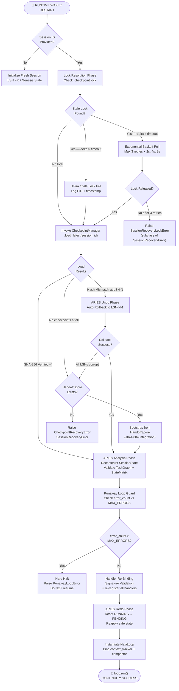
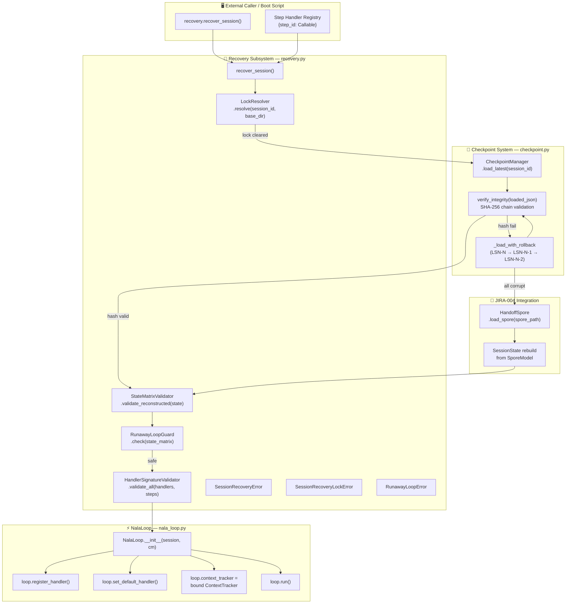
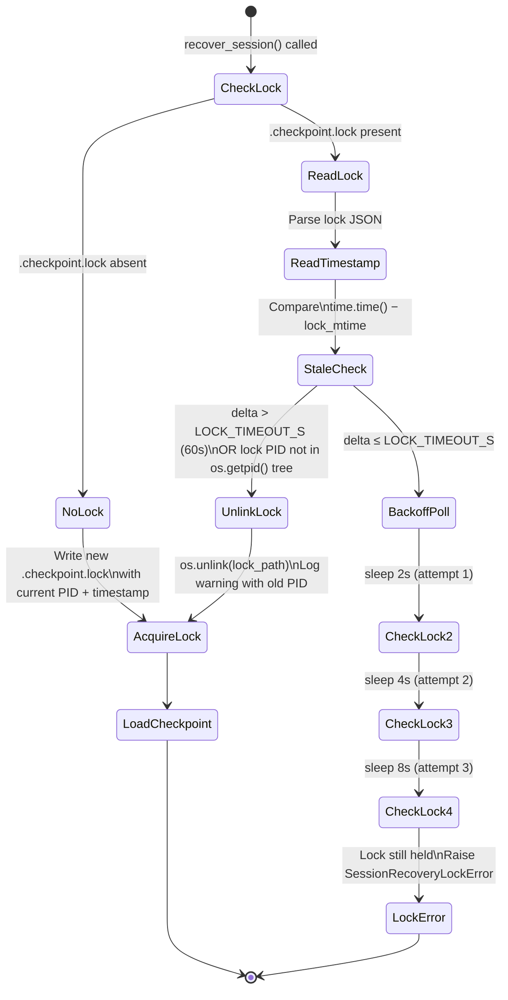
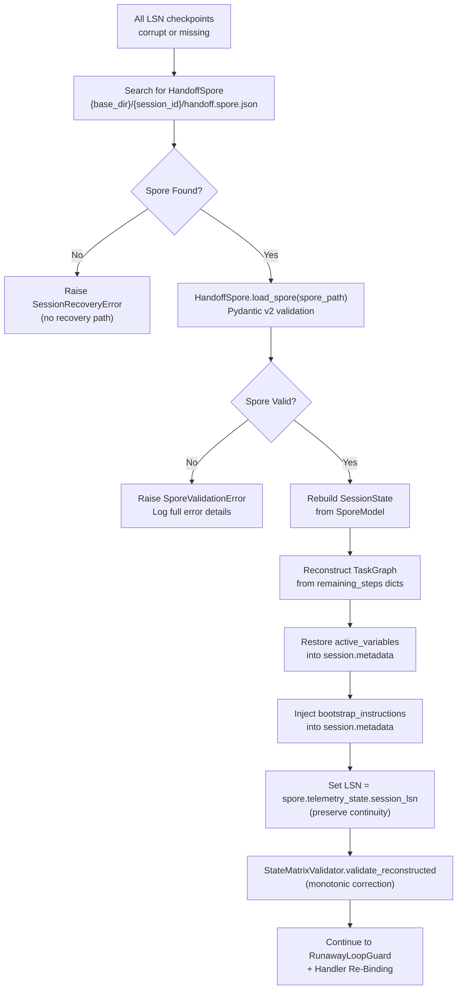

# JIRA-005 — Crash Recovery System (`recovery.py`)

**Epic:** NALA-001 — Long-Running Survival Foundation
**Priority:** P0 — Critical Path
**Estimate:** 2 days
**Depends On:** JIRA-001 ✅ · JIRA-002 ✅ · JIRA-003 ✅ · JIRA-004 ✅
**Blocks:** JIRA-007 (1-Hour Soak Test)
**Version:** 2.0.0 — Enterprise-Grade Recovery Design

> Provide NALA with a bulletproof session recovery and process-crash resumption
> harness. If a NALA agent process is terminated mid-execution — due to host
> reboot, power loss, OOM kill, or SIGKILL — it must be fully restorable from
> its last valid Checkpoint LSN and able to resume task execution without
> duplicating completed steps, double-counting telemetry, or corrupting
> StateMatrix accumulators.
>
> The design follows **ARIES (Algorithm for Recovery and Isolation Exploiting
> Semantics)** protocol principles — specifically the Analysis, Redo, and Undo
> phases — adapted for NALA's Python + Pydantic + AMP stack. Every design
> decision maps to a named risk in the register below.

---

## 1. Architectural Blueprint

### 1.1 Recovery Flow Lifecycle



### 1.2 Component Interaction Diagram



### 1.3 ARIES Protocol Mapping to NALA Recovery

| ARIES Phase | ARIES Meaning | NALA Implementation |
|---|---|---|
| **Analysis** | Scan WAL from last checkpoint to determine dirty pages | Load SessionState from latest valid LSN. Identify all RUNNING steps (interrupted mid-execution). Reconstruct StateMatrix from persisted accumulators. |
| **Redo** | Re-apply all changes recorded in WAL since last checkpoint | Reset all RUNNING → PENDING (idempotent; not yet SUCCESS). Validate TaskGraph topology. Re-bind step handlers. |
| **Undo** | Roll back changes of uncommitted transactions | If an error count ceiling is crossed, abort the restarted session. If spore bootstrap: treat crystallized_history as committed and remaining_steps as the undo boundary. |

---

## 2. Risk Register & Mitigations

| Risk ID | Description | Severity | Mitigation |
|---------|-------------|----------|------------|
| **RISK-015** | Corrupted LSN on resume loads wrong state | HIGH | SHA-256 hash chain validation. `verify_integrity()` called on every loaded JSON. Auto-rollback to LSN-1, LSN-2 in order. |
| **RISK-023** | Missing handlers after restore → TypeError at dispatch | HIGH | `HandlerSignatureValidator` inspects `inspect.signature()` of each handler against expected `(TaskStep, SessionState) → StepResult` before loop starts. |
| **RISK-024** | StateMatrix accumulators reset or double-counted on crash | MEDIUM | Mathematical invariant check: `total_tokens_in + total_tokens_out` from loaded checkpoint must equal sum of all SUCCESS step token contributions. See Section 3.2. |
| **RISK-025** | Infinite reboot loops on persistent executor exceptions | HIGH | `RunawayLoopGuard` checks `state_matrix.error_count >= MAX_CONSECUTIVE_ERRORS` (default 10). If triggered, raises `RunawayLoopError` before starting loop. |
| **RISK-026** | Stale `.checkpoint.lock` file blocks recovery forever | HIGH | `LockResolver` reads lock file PID + timestamp. If `time.time() - lock_mtime > LOCK_TIMEOUT_S` (default 60s), unlinks the file. If recent, exponential backoff (2s, 4s, 8s) before `SessionRecoveryLockError`. |
| **RISK-027** | Handler signature mismatch causes silent wrong output | HIGH | `HandlerSignatureValidator.validate_all()` uses `inspect.signature()` to confirm every registered callable has exactly `(step: TaskStep, session: SessionState) -> StepResult` or compatible signature before loop starts. |
| **RISK-028** | OOM kill leaves RUNNING step in permanent RUNNING state | CRITICAL | ARIES Redo Phase: every step in RUNNING status at recovery time is reset to PENDING unconditionally. RUNNING is not a stable terminal state — it must never survive a checkpoint. |
| **RISK-029** | All checkpoints corrupt AND no HandoffSpore exists | CRITICAL | `SessionRecoveryError` raised with full diagnostic: last LSN attempted, hash mismatches found, session_id, spore path searched. Caller must inspect and decide. |
| **RISK-030** | OOM during recovery itself (loading large checkpoint JSON) | MEDIUM | `recover_session()` uses streaming JSON parse via `SessionState.deserialize()` which is Pydantic v2 `model_validate_json()`. Falls back to smaller LSN-1 if memory allocation fails during load. |

---

## 3. Technical Design & Core Capabilities

### 3.1 Exception Hierarchy

```python
# All recovery exceptions inherit from NalaLoopError (nala_loop.py)
# so they can be caught by a single except clause at the caller level.

class SessionRecoveryError(NalaLoopError):
    """
    Root exception for all recovery failures.
    Raised when recover_session() cannot restore a valid runnable state.

    Attributes
    ----------
    session_id     : The UUID of the session recovery was attempted for.
    last_lsn_tried : The highest LSN that was attempted (and failed).
    reason         : Human-readable description of the failure.
    """
    def __init__(self, session_id: str, last_lsn_tried: int, reason: str) -> None:
        self.session_id      = session_id
        self.last_lsn_tried  = last_lsn_tried
        self.reason          = reason
        super().__init__(
            f"[NALA Recovery] FAILED for session '{session_id}' "
            f"(last LSN tried: {last_lsn_tried}): {reason}"
        )


class SessionRecoveryLockError(SessionRecoveryError):
    """
    Raised when a .checkpoint.lock file cannot be resolved within the
    configured backoff window, indicating another process may still be running.

    Attributes
    ----------
    lock_path   : Absolute path to the unresolvable lock file.
    lock_age_s  : Age of the lock file in seconds at the time of failure.
    """
    def __init__(self, session_id: str, lock_path: Path, lock_age_s: float) -> None:
        self.lock_path  = lock_path
        self.lock_age_s = lock_age_s
        super().__init__(
            session_id=session_id,
            last_lsn_tried=-1,
            reason=(
                f"Lock file unresolved after backoff: {lock_path} "
                f"(age={lock_age_s:.1f}s). "
                f"Another process may still hold the session."
            ),
        )


class RunawayLoopError(SessionRecoveryError):
    """
    Raised when StateMatrix.error_count meets or exceeds MAX_CONSECUTIVE_ERRORS
    at recovery time, indicating the session is in a persistent crash loop.

    Halting instead of resuming prevents unbounded API spend and runaway cost.

    Attributes
    ----------
    error_count : The error count found in the restored StateMatrix.
    max_errors  : The configured maximum error ceiling.
    """
    def __init__(
        self,
        session_id:  str,
        error_count: int,
        max_errors:  int,
        last_lsn:    int,
    ) -> None:
        self.error_count = error_count
        self.max_errors  = max_errors
        super().__init__(
            session_id=session_id,
            last_lsn_tried=last_lsn,
            reason=(
                f"Runaway loop detected: error_count={error_count} >= "
                f"MAX_CONSECUTIVE_ERRORS={max_errors}. "
                f"Hard halt triggered. Manual inspection required."
            ),
        )
```

---

### 3.2 StateMatrix Telemetry Invariant Validation

**The problem:** After a crash, `StateMatrix.total_tokens_in` and `total_tokens_out` are loaded verbatim from the checkpoint. Without validation, it is impossible to know whether these accumulators are accurate (the crash happened between step completion and checkpoint write) or whether a partial write corrupted them.

**The ARIES solution:** NALA applies a **StateMatrix Reconstruction Invariant** during recovery. This is a mathematical lower-bound check (not a recomputation, since we don't have the original LLM billing receipts on disk).

#### 3.2.1 Invariant Definition

Let:
- `S` = set of all `TaskStep` objects in the recovered `TaskGraph` with `status == SUCCESS`
- `tokens_in_from_steps` = sum of `step.result.get("_meta_tokens_in", 0)` for all `s ∈ S`
- `tokens_out_from_steps` = sum of `step.result.get("_meta_tokens_out", 0)` for all `s ∈ S`
- `SM.total_tokens_in` = loaded value from `StateMatrix`

**Invariant (lower bound):**
```
SM.total_tokens_in  ≥ tokens_in_from_steps
SM.total_tokens_out ≥ tokens_out_from_steps
SM.error_count      ≥ failed_count(TaskGraph)
SM.estimated_cost   ≥ 0.0
```

**If invariant is violated:**

`SM.total_tokens_in < tokens_in_from_steps` — the StateMatrix is **behind** the TaskGraph (checkpoint was written before StateMatrix was flushed). This is safe to correct by setting:

```python
SM.total_tokens_in  = max(SM.total_tokens_in,  tokens_in_from_steps)
SM.total_tokens_out = max(SM.total_tokens_out, tokens_out_from_steps)
```

This is a **monotonic correction** — it only increases, never decreases, preventing double-counting.

#### 3.2.2 StateMatrixValidator Class

```python
class StateMatrixValidator:
    """
    Validates and corrects StateMatrix telemetry accumulators after checkpoint
    recovery, applying the ARIES lower-bound monotonic correction.

    Implements the StateMatrix Reconstruction Invariant to guarantee that
    total_tokens_in, total_tokens_out, estimated_cost, and error_count are
    never lower than what the SUCCESS step results on disk imply.

    Risk mitigated: RISK-024 — Telemetry reset or double-counting on crash.
    """

    # Key injected into TaskStep.result by the executor at step SUCCESS time
    # to record per-step LLM token consumption.
    _TOKENS_IN_KEY  : str = "_meta_tokens_in"
    _TOKENS_OUT_KEY : str = "_meta_tokens_out"
    _COST_KEY       : str = "_meta_cost_usd"

    @classmethod
    def validate_reconstructed(cls, session: SessionState) -> Dict[str, Any]:
        """
        Validate and monotonically correct the StateMatrix accumulators against
        per-step result metadata from the TaskGraph.

        Parameters
        ----------
        session : SessionState
            The recovered session. Mutates session.state_matrix in-place if
            any accumulators are found to be below their lower bound.

        Returns
        -------
        Dict[str, Any]
            Diagnostic report of corrections applied. Empty dict if no
            corrections were needed.
        """
        sm     = session.state_matrix
        graph  = session.task_graph
        report: Dict[str, Any] = {}

        # Compute lower bounds from SUCCESS step result metadata
        floor_tokens_in  = sum(
            s.result.get(cls._TOKENS_IN_KEY, 0)
            for s in graph.steps
            if s.status == TaskStatus.SUCCESS and s.result
        )
        floor_tokens_out = sum(
            s.result.get(cls._TOKENS_OUT_KEY, 0)
            for s in graph.steps
            if s.status == TaskStatus.SUCCESS and s.result
        )
        floor_cost = sum(
            s.result.get(cls._COST_KEY, 0.0)
            for s in graph.steps
            if s.status == TaskStatus.SUCCESS and s.result
        )
        floor_errors = graph.failed_count()

        # Apply monotonic corrections (only upward — never reduce a value)
        if sm.total_tokens_in < floor_tokens_in:
            report["tokens_in_corrected"] = {
                "before": sm.total_tokens_in,
                "after":  floor_tokens_in,
            }
            sm.total_tokens_in = floor_tokens_in

        if sm.total_tokens_out < floor_tokens_out:
            report["tokens_out_corrected"] = {
                "before": sm.total_tokens_out,
                "after":  floor_tokens_out,
            }
            sm.total_tokens_out = floor_tokens_out

        if sm.estimated_cost < floor_cost:
            report["cost_corrected"] = {
                "before": round(sm.estimated_cost, 6),
                "after":  round(floor_cost, 6),
            }
            sm.estimated_cost = floor_cost

        if sm.error_count < floor_errors:
            report["error_count_corrected"] = {
                "before": sm.error_count,
                "after":  floor_errors,
            }
            sm.error_count = floor_errors

        if report:
            _logger.warning(
                "[StateMatrixValidator] Monotonic corrections applied for "
                "session '%s' at LSN=%d: %s",
                session.session_id,
                session.checkpoint_meta.lsn,
                report,
            )
        else:
            _logger.info(
                "[StateMatrixValidator] StateMatrix invariant holds for "
                "session '%s' at LSN=%d. No corrections needed.",
                session.session_id,
                session.checkpoint_meta.lsn,
            )

        return report
```

---

### 3.3 Lock Resolution Protocol

If a crash occurs while the checkpoint write lock was held, a `.checkpoint.lock` file may remain on disk. If a new process attempts recovery without clearing this lock, it either (a) incorrectly assumes another process is still running, or (b) reads a partially-written checkpoint file.

#### 3.3.1 Lock File Format

The lock file lives at:
```
{base_dir}/{session_id}/.checkpoint.lock
```

Content (JSON, written atomically with `O_EXCL`):
```json
{
  "pid":          12345,
  "hostname":     "nexus-macbook-m4",
  "acquired_at":  "2026-06-10T14:32:07.123456+00:00",
  "lsn_at_lock":  42
}
```

#### 3.3.2 LockResolver State Machine



#### 3.3.3 LockResolver Implementation

```python
class LockResolver:
    """
    Implements the .checkpoint.lock acquisition, resolution, and release
    protocol for NALA's recovery subsystem.

    A lock file is created atomically using O_CREAT | O_EXCL to prevent
    two recovery processes from loading the same checkpoint simultaneously.
    Stale locks (from crashed processes) are detected by PID existence check
    and mtime delta, then unlinked safely.

    Risk mitigated: RISK-026 — Stale lock file blocks recovery.
    """

    LOCK_TIMEOUT_S:   int   = 60      # Seconds before a lock is considered stale
    BACKOFF_DELAYS_S: tuple = (2, 4, 8)  # Exponential backoff delays

    @classmethod
    def resolve(cls, session_id: str, base_dir: Path) -> Path:
        """
        Acquire the checkpoint lock for the given session, clearing any stale
        lock if found. Returns the path to the acquired lock file.

        Parameters
        ----------
        session_id : str  UUID of the session to lock.
        base_dir   : Path Base directory for checkpoint storage.

        Returns
        -------
        Path : Path to the acquired .checkpoint.lock file.

        Raises
        ------
        SessionRecoveryLockError
            If the lock cannot be acquired after all backoff attempts.
        """
        lock_path = base_dir / session_id / ".checkpoint.lock"

        for attempt, delay in enumerate([-1] + list(cls.BACKOFF_DELAYS_S)):
            if attempt > 0:
                _logger.warning(
                    "[LockResolver] Lock still held. Backoff attempt %d — sleeping %ds.",
                    attempt, delay,
                )
                time.sleep(delay)

            if not lock_path.exists():
                cls._write_lock(lock_path)
                return lock_path

            # Lock exists — inspect it
            lock_age_s = time.time() - lock_path.stat().st_mtime
            try:
                lock_data = json.loads(lock_path.read_text(encoding="utf-8"))
                held_pid  = lock_data.get("pid", -1)
                is_alive  = cls._pid_is_alive(held_pid)
            except (json.JSONDecodeError, OSError):
                # Corrupt lock file — unlink and re-acquire
                _logger.warning("[LockResolver] Corrupt lock file at %s. Unlinking.", lock_path)
                lock_path.unlink(missing_ok=True)
                cls._write_lock(lock_path)
                return lock_path

            if lock_age_s > cls.LOCK_TIMEOUT_S or not is_alive:
                _logger.warning(
                    "[LockResolver] Stale lock detected. "
                    "held_pid=%d alive=%s age=%.1fs. Unlinking.",
                    held_pid, is_alive, lock_age_s,
                )
                lock_path.unlink(missing_ok=True)
                cls._write_lock(lock_path)
                return lock_path

        # All backoff attempts exhausted
        final_age = time.time() - lock_path.stat().st_mtime
        raise SessionRecoveryLockError(
            session_id=session_id,
            lock_path=lock_path,
            lock_age_s=final_age,
        )

    @classmethod
    def release(cls, lock_path: Path) -> None:
        """Safely release the lock file on loop completion or exception."""
        try:
            lock_path.unlink(missing_ok=True)
        except OSError as exc:
            _logger.warning("[LockResolver] Failed to release lock at %s: %s", lock_path, exc)

    @staticmethod
    def _write_lock(lock_path: Path) -> None:
        """Write a new lock file atomically with O_CREAT | O_EXCL."""
        import os
        lock_path.parent.mkdir(parents=True, exist_ok=True)
        content = json.dumps({
            "pid":         os.getpid(),
            "hostname":    socket.gethostname(),
            "acquired_at": utcnow().isoformat(),
            "lsn_at_lock": -1,  # Updated after checkpoint load
        })
        # O_EXCL ensures atomic creation — raises FileExistsError on race condition
        try:
            fd = os.open(str(lock_path), os.O_CREAT | os.O_EXCL | os.O_WRONLY, 0o644)
            os.write(fd, content.encode("utf-8"))
            os.fsync(fd)   # fsync the lock file — durability guarantee
            os.close(fd)
        except FileExistsError:
            pass  # Another process won the race — will be handled in next poll cycle

    @staticmethod
    def _pid_is_alive(pid: int) -> bool:
        """Check if a PID is still running without sending a signal."""
        import os
        if pid <= 0:
            return False
        try:
            os.kill(pid, 0)  # Signal 0 = existence check only, no actual signal
            return True
        except ProcessLookupError:
            return False
        except PermissionError:
            return True  # Process exists but we lack permission to signal it
```

---

### 3.4 Step Handler Re-Binding & Signature Validation

**The problem:** After a crash, the handlers (executor callbacks) that were registered in the previous process are gone — they were in memory only. The recovery system must re-register them from the caller's handler registry map. If a handler has the wrong signature (e.g. missing `session` parameter), it will raise `TypeError` at dispatch time, mid-run.

**The solution:** `HandlerSignatureValidator` uses `inspect.signature()` to validate every registered handler's parameter list before the loop starts. Incompatible signatures are rejected at recovery time, not at dispatch time.

#### 3.4.1 Expected Handler Signature

```python
# The only valid executor callback signature accepted by NalaLoop:
def my_handler(step: TaskStep, session: SessionState) -> StepResult:
    ...

# Also accepted (without type annotations — checked by parameter count/names):
def my_handler(step, session):
    ...
```

#### 3.4.2 HandlerSignatureValidator

```python
class HandlerSignatureValidator:
    """
    Validates that all registered step handler callables have a signature
    compatible with NalaLoop's dispatch protocol before the recovered loop
    is started.

    Rejects handlers at recovery time rather than at runtime, preventing
    silent TypeError exceptions during active task execution.

    Risk mitigated: RISK-023 — Handler signature mismatch causes runtime TypeError.
    Risk mitigated: RISK-027 — Mismatched handler called with wrong arguments.
    """

    # Minimum required positional parameter count for a valid handler
    _MIN_PARAMS: int = 2

    # Expected parameter names (checked if annotations are present)
    _EXPECTED_PARAM_NAMES: tuple = ("step", "session")

    @classmethod
    def validate_all(
        cls,
        handlers:        Dict[str, Callable],
        default_handler: Optional[Callable],
        graph:           TaskGraph,
    ) -> None:
        """
        Validate all handlers in the registry against the expected signature.

        Parameters
        ----------
        handlers        : {step_id: callable} map to validate.
        default_handler : The fallback callable to validate (may be None).
        graph           : The TaskGraph — used to warn on unregistered step_ids.

        Raises
        ------
        TypeError
            If any handler has a parameter count < 2 or parameter names that
            are clearly incompatible with the dispatch protocol.
        """
        for step_id, handler in handlers.items():
            cls._validate_single(handler, context=f"handler[{step_id!r}]")

        if default_handler is not None:
            cls._validate_single(default_handler, context="default_handler")

        # Warn on steps that have no registered handler and no default
        if default_handler is None:
            registered_ids = set(handlers.keys())
            for step in graph.steps:
                if step.status == TaskStatus.PENDING and step.step_id not in registered_ids:
                    _logger.warning(
                        "[HandlerSignatureValidator] Step '%s' has no registered handler "
                        "and no default_handler. It will raise MissingHandlerError at dispatch.",
                        step.step_id,
                    )

    @classmethod
    def _validate_single(cls, handler: Callable, context: str) -> None:
        """Validate a single callable against the dispatch signature protocol."""
        try:
            sig    = inspect.signature(handler)
            params = [
                p for p in sig.parameters.values()
                if p.default is inspect.Parameter.empty
                and p.kind not in (
                    inspect.Parameter.VAR_POSITIONAL,
                    inspect.Parameter.VAR_KEYWORD,
                )
            ]
        except (TypeError, ValueError) as exc:
            raise TypeError(
                f"[HandlerValidator] Cannot inspect signature of {context}: {exc}"
            ) from exc

        if len(params) < cls._MIN_PARAMS:
            raise TypeError(
                f"[HandlerValidator] {context} has {len(params)} required positional "
                f"parameter(s). Expected at least {cls._MIN_PARAMS} "
                f"(step: TaskStep, session: SessionState). "
                f"Actual signature: {inspect.signature(handler)}"
            )

        # If parameter names are present (not *args), validate they are compatible
        param_names = [p.name for p in params[:2]]
        for expected, actual in zip(cls._EXPECTED_PARAM_NAMES, param_names):
            if actual not in (expected, "_", "__"):
                _logger.debug(
                    "[HandlerValidator] %s param[%d] name is %r (expected %r). "
                    "Continuing — name mismatch is a warning, not an error.",
                    context, list(cls._EXPECTED_PARAM_NAMES).index(expected),
                    actual, expected,
                )
```

---

### 3.5 Runaway Crash Loop Mitigation Algorithm

**The problem:** If an executor raises an exception on every invocation (e.g. a broken API key, a consistently malformed step description, or a disk-full error), each crash-and-recovery cycle will increment `error_count` in the StateMatrix but immediately re-enter the same failing step. Without a guard, NALA will loop indefinitely, spending API tokens and money on a permanently broken task.

**The ARIES parallel:** This is analogous to a database transaction that always aborts — the correct response is to mark it as unresolvable and stop retrying.

#### 3.5.1 Runaway Loop Guard Algorithm

```
ALGORITHM: RunawayLoopGuard.check(state_matrix, session_id, lsn)

INPUT:
  SM           ← StateMatrix loaded from checkpoint
  MAX_ERRORS   ← Configured ceiling (default: 10)
  MAX_RETRIES  ← Max retries per step from checkpoint metadata (default: 5)

STEP 1: Compute the effective error rate
  consecutive_fails ← sum(step.retries for step in graph where step.status == FAILED)
  total_errors      ← SM.error_count

STEP 2: Check absolute error ceiling
  IF total_errors >= MAX_ERRORS THEN
    RAISE RunawayLoopError(
      session_id    = session_id,
      error_count   = total_errors,
      max_errors    = MAX_ERRORS,
      last_lsn      = lsn,
    )
  END IF

STEP 3: Check per-step retry ceiling
  FOR EACH step IN graph WHERE step.status == FAILED:
    IF step.retries >= MAX_RETRIES THEN
      LOG CRITICAL: step permanently failed — will block graph
      Mark step.status = FAILED (already is; log is the action)
    END IF
  END FOR

STEP 4: Check for immediate-crash pattern
  IF SM.error_count > 0 AND SM.total_tokens_in == 0 THEN
    # Session crashed before making a single successful LLM call
    # This suggests an environment or configuration issue, not a transient fault
    LOG WARNING: "Zero tokens consumed but error_count > 0. Possible config issue."
    # Do NOT halt — allow one recovery attempt for transient env failures
  END IF

RETURN: Safe to proceed
```

#### 3.5.2 RunawayLoopGuard Class

```python
class RunawayLoopGuard:
    """
    Detects persistent crash loop patterns in a recovered SessionState
    and halts recovery if the error ceiling has been reached.

    This guard runs BEFORE handler re-binding and BEFORE NalaLoop is
    instantiated, ensuring no API calls are made on a fatally broken session.

    Risk mitigated: RISK-025 — Infinite reboot loops on persistent failures.
    """

    DEFAULT_MAX_ERRORS:  int = 10
    DEFAULT_MAX_RETRIES: int = 5

    @classmethod
    def check(
        cls,
        session:    SessionState,
        max_errors: int = DEFAULT_MAX_ERRORS,
    ) -> None:
        """
        Evaluate the session's error state and raise RunawayLoopError if the
        error ceiling has been reached.

        Parameters
        ----------
        session    : SessionState  The recovered session to evaluate.
        max_errors : int           The error count ceiling (default 10).

        Raises
        ------
        RunawayLoopError
            If state_matrix.error_count >= max_errors.
        """
        sm  = session.state_matrix
        lsn = session.checkpoint_meta.lsn

        if sm.error_count >= max_errors:
            raise RunawayLoopError(
                session_id=session.session_id,
                error_count=sm.error_count,
                max_errors=max_errors,
                last_lsn=lsn,
            )

        # Warn on high-but-not-ceiling error counts
        if sm.error_count >= max_errors * 0.7:
            _logger.warning(
                "[RunawayLoopGuard] High error count for session '%s' at LSN=%d: "
                "%d/%d errors. Approaching halt threshold.",
                session.session_id, lsn, sm.error_count, max_errors,
            )

        _logger.info(
            "[RunawayLoopGuard] Session '%s' at LSN=%d cleared. "
            "error_count=%d (ceiling=%d).",
            session.session_id, lsn, sm.error_count, max_errors,
        )
```

---

### 3.6 ARIES Redo Phase — RUNNING Step Reset

This is the most critical recovery operation. Any step in `RUNNING` state at crash time was never completed (the result was never written to the checkpoint). It must be reset to `PENDING` before the loop starts, or it will be skipped by the scheduler (which only schedules `PENDING` steps) and the task graph will appear complete when it isn't.

```python
def _apply_redo_phase(session: SessionState) -> List[str]:
    """
    ARIES Redo Phase: Reset all RUNNING steps to PENDING.

    A RUNNING step at recovery time is evidence of an interrupted execution.
    The step's result was never written (only SUCCESS steps have results).
    Resetting to PENDING allows the scheduler to re-dispatch it safely.

    This operation is IDEMPOTENT — calling it multiple times produces the
    same result. A step that is already PENDING is not modified.

    Parameters
    ----------
    session : SessionState  The recovered session to apply the redo phase to.

    Returns
    -------
    List[str]
        List of step_ids that were reset from RUNNING → PENDING.
    """
    reset_ids: List[str] = []
    for step in session.task_graph.steps:
        if step.status == TaskStatus.RUNNING:
            step.status       = TaskStatus.PENDING
            step.started_at   = None    # Clear interrupted start timestamp
            step.tool_used    = None    # Clear partial tool assignment
            reset_ids.append(step.step_id)
            _logger.info(
                "[Recovery Redo] Reset step '%s' RUNNING → PENDING "
                "(interrupted at crash).",
                step.step_id,
            )
    return reset_ids
```

---

### 3.7 JIRA-004 Handoff Spore Integration

If `CheckpointManager.load_latest()` fails for all available LSNs (all checkpoints are corrupted), recovery falls back to the HandoffSpore written by JIRA-004's `HandoffSpore.write_spore()`. This is the **last resort** before raising `SessionRecoveryError`.

#### 3.7.1 Spore Fallback Flow



#### 3.7.2 Spore Rebuild Function

```python
def _rebuild_from_spore(
    spore_path: Path,
    original_session_id: str,
) -> SessionState:
    """
    Rebuild a runnable SessionState from a HandoffSpore JSON file when all
    checkpoint LSNs are unavailable or corrupted.

    The rebuilt session uses the spore's new_session_id as its session_id,
    preserving the original objective, telemetry accumulators, and remaining
    steps. The crystallized_history is injected into session.metadata so
    the executor agent has full context from prior sessions.

    Parameters
    ----------
    spore_path          : Path  Absolute path to the HandoffSpore JSON file.
    original_session_id : str   The session_id of the crashed session.

    Returns
    -------
    SessionState
        A fully reconstructed, runnable SessionState based on the spore.

    Raises
    ------
    SporeValidationError
        If the spore file is missing, corrupt, or fails Pydantic validation.
    """
    from core.harness.context_tracker import HandoffSpore, SporeValidationError

    spore = HandoffSpore.load_spore(spore_path)

    # Reconstruct TaskGraph from remaining_steps dicts
    remaining_steps = [
        TaskStep.model_validate(step_dict)
        for step_dict in spore.task_graph_state.remaining_steps
    ]

    task_graph = TaskGraph(
        steps=remaining_steps,
        done_condition=(
            json.loads(spore.done_condition)
            if spore.done_condition else {}
        ),
    )

    # Rebuild StateMatrix from spore telemetry
    state_matrix = StateMatrix(
        total_tokens_in  = spore.telemetry_state.total_tokens_in,
        total_tokens_out = spore.telemetry_state.total_tokens_out,
        estimated_cost   = spore.telemetry_state.estimated_cost_usd,
        error_count      = spore.telemetry_state.error_count,
        elapsed_seconds  = spore.telemetry_state.elapsed_seconds,
    )

    # Rebuild CheckpointMeta with continuity LSN
    checkpoint_meta = CheckpointMeta(
        lsn=spore.telemetry_state.session_lsn,
    )

    session = SessionState(
        session_id      = spore.new_session_id,
        objective       = spore.objective,
        state_matrix    = state_matrix,
        checkpoint_meta = checkpoint_meta,
        task_graph      = task_graph,
        metadata        = {
            "recovered_from_spore":     True,
            "original_session_id":      original_session_id,
            "spore_path":               str(spore_path),
            "crystallized_history":     spore.task_graph_state.crystallized_history,
            "active_variables":         spore.active_variables,
            "bootstrap_instructions":   spore.bootstrap_instructions,
        },
    )

    _logger.info(
        "[Recovery] Session rebuilt from HandoffSpore. "
        "new_session_id=%s | original_session_id=%s | "
        "remaining_steps=%d | LSN=%d",
        spore.new_session_id,
        original_session_id,
        len(remaining_steps),
        spore.telemetry_state.session_lsn,
    )

    return session
```

---

### 3.8 `recover_session` — Complete Public API

```python
def recover_session(
    session_id:       str,
    checkpoint_manager: CheckpointManager,
    handlers:         Dict[str, Callable],
    default_handler:  Optional[Callable]     = None,
    context_tracker:  Optional[ContextTracker] = None,
    compactor:        Optional[DronagiriCompactor] = None,
    max_errors:       int                    = RunawayLoopGuard.DEFAULT_MAX_ERRORS,
    lock_timeout_s:   int                    = LockResolver.LOCK_TIMEOUT_S,
    **loop_kwargs: Any,
) -> NalaLoop:
    """
    Recover a crashed or paused NALA session from its latest valid checkpoint.

    This function is the single entry point for all crash recovery operations.
    It implements the full ARIES Analysis → Redo → Undo protocol adapted for
    NALA's Python stack, including:

      Phase A (Analysis)  : Lock resolution, checkpoint load, SHA-256 verification,
                            rollback chain traversal, spore fallback.
      Phase R (Redo)      : RUNNING → PENDING reset, TaskGraph validation,
                            StateMatrix monotonic correction.
      Phase U (Undo)      : RunawayLoopGuard halt on excessive errors.

    After successful recovery, returns a NalaLoop instance with all handlers
    registered, context_tracker and compactor bound, and ready to call .run().

    Parameters
    ----------
    session_id          : UUID of the crashed session to recover.
    checkpoint_manager  : The CheckpointManager initialized for this session.
    handlers            : {step_id: Callable} executor map to re-register.
    default_handler     : Optional fallback executor for unregistered steps.
    context_tracker     : Optional JIRA-004 ContextTracker to bind.
    compactor           : Optional JIRA-004 DronagiriCompactor to bind.
    max_errors          : Error count ceiling for RunawayLoopGuard (default 10).
    lock_timeout_s      : Seconds after which a lock file is considered stale.
    **loop_kwargs       : Extra kwargs passed directly to NalaLoop.__init__().

    Returns
    -------
    NalaLoop
        A fully configured NalaLoop ready to call .run() on.

    Raises
    ------
    SessionRecoveryLockError
        If a lock file cannot be resolved within the backoff window.
    SessionRecoveryError
        If all checkpoint LSNs AND the HandoffSpore are unreadable/corrupt.
    RunawayLoopError
        If state_matrix.error_count >= max_errors (hard halt guard).
    CheckpointNotFoundError
        If no checkpoint directory or files exist for the session_id.
    """
    _logger.info(
        "[Recovery] Starting recovery for session_id=%s", session_id
    )

    # ── Phase A.1: Lock Resolution ────────────────────────────────────────
    LockResolver.LOCK_TIMEOUT_S = lock_timeout_s
    lock_path = LockResolver.resolve(
        session_id=session_id,
        base_dir=checkpoint_manager.base_dir,
    )

    try:
        # ── Phase A.2: Checkpoint Load with Rollback Chain ─────────────────
        session: Optional[SessionState] = None
        last_lsn_tried = -1

        try:
            session = checkpoint_manager.load_latest(session_id)
            last_lsn_tried = session.checkpoint_meta.lsn
            _logger.info(
                "[Recovery] Checkpoint loaded at LSN=%d for session '%s'.",
                last_lsn_tried, session_id,
            )
        except CheckpointRecoveryError as exc:
            _logger.error(
                "[Recovery] All checkpoint LSNs corrupt for session '%s'. "
                "Attempting HandoffSpore fallback. Error: %s",
                session_id, exc,
            )
            # ── Phase A.3: HandoffSpore Fallback ──────────────────────────
            spore_path = checkpoint_manager.base_dir / session_id / "handoff.spore.json"
            session = _rebuild_from_spore(
                spore_path=spore_path,
                original_session_id=session_id,
            )
            last_lsn_tried = session.checkpoint_meta.lsn

        # ── Phase R.1: ARIES Redo — Reset RUNNING → PENDING ───────────────
        reset_ids = _apply_redo_phase(session)
        if reset_ids:
            _logger.info(
                "[Recovery] Redo phase reset %d RUNNING steps to PENDING: %s",
                len(reset_ids), reset_ids,
            )

        # ── Phase R.2: StateMatrix Monotonic Correction ─────────────────────
        correction_report = StateMatrixValidator.validate_reconstructed(session)

        # ── Phase R.3: TaskGraph Structural Validation ─────────────────────
        session.validate_task_graph()

        # ── Phase U.1: Runaway Loop Guard ────────────────────────────────
        RunawayLoopGuard.check(session, max_errors=max_errors)

        # ── Phase U.2: Handler Signature Validation ───────────────────────
        HandlerSignatureValidator.validate_all(
            handlers=handlers,
            default_handler=default_handler,
            graph=session.task_graph,
        )

        # ── Build NalaLoop ────────────────────────────────────────────────
        loop = NalaLoop(
            session=session,
            checkpoint_manager=checkpoint_manager,
            **loop_kwargs,
        )

        for step_id, handler in handlers.items():
            loop.register_handler(step_id, handler)

        if default_handler is not None:
            loop.set_default_handler(default_handler)

        # Bind JIRA-004 context tracking components if provided
        if context_tracker is not None:
            loop.context_tracker = context_tracker
        if compactor is not None:
            loop.compactor = compactor

        _logger.info(
            "[Recovery] SUCCESS. session_id=%s | LSN=%d | "
            "pending_steps=%d | corrections=%s | reset_steps=%s",
            session.session_id,
            session.checkpoint_meta.lsn,
            session.task_graph.pending_count(),
            correction_report,
            reset_ids,
        )

        return loop

    finally:
        # ALWAYS release the lock, even if recovery raises an exception
        LockResolver.release(lock_path)
```

---

## 4. Recovery Sequence Diagram — Exact Lock Acquisition & Release

```mermaid
sequenceDiagram
    autonumber
    participant CALLER as 🖥️ Boot Script
    participant RECOVERY as recovery.recover_session()
    participant LOCK as LockResolver
    participant CM as CheckpointManager
    participant VALIDATOR as StateMatrixValidator
    participant GUARD as RunawayLoopGuard
    participant HANDLER_V as HandlerSignatureValidator
    participant LOOP as NalaLoop

    CALLER->>RECOVERY: recover_session(session_id, cm, handlers)

    Note over RECOVERY,LOCK: Phase A.1 — Lock Resolution
    RECOVERY->>LOCK: resolve(session_id, base_dir)
    LOCK->>LOCK: Check .checkpoint.lock existence

    alt Stale or absent lock
        LOCK->>LOCK: os.unlink(stale_lock)\nos.open(O_CREAT|O_EXCL)\nos.fsync()
        LOCK-->>RECOVERY: lock_path acquired ✅
    else Live lock held by active PID
        LOCK->>LOCK: Exponential backoff 2s → 4s → 8s
        LOCK-->>RECOVERY: SessionRecoveryLockError ❌
    end

    Note over RECOVERY,CM: Phase A.2 — Checkpoint Load + SHA-256 Verification
    RECOVERY->>CM: load_latest(session_id)
    CM->>CM: Find highest LSN checkpoint file
    CM->>CM: Read JSON from disk
    CM->>CM: verify_integrity(loaded_json)\nSHA-256 recompute + compare

    alt Hash valid
        CM-->>RECOVERY: SessionState at LSN=N ✅
    else Hash mismatch at LSN=N
        CM->>CM: Rollback to LSN=N-1\nRe-verify
        CM-->>RECOVERY: SessionState at LSN=N-1 ✅
    else All LSNs corrupt
        CM-->>RECOVERY: CheckpointRecoveryError
        RECOVERY->>RECOVERY: _rebuild_from_spore()\nHandoffSpore.load_spore()
        RECOVERY-->>RECOVERY: Rebuilt SessionState from spore ✅
    end

    Note over RECOVERY,VALIDATOR: Phase R.1 — ARIES Redo Phase
    RECOVERY->>RECOVERY: _apply_redo_phase(session)\nReset RUNNING → PENDING

    Note over RECOVERY,VALIDATOR: Phase R.2 — StateMatrix Monotonic Correction
    RECOVERY->>VALIDATOR: validate_reconstructed(session)
    VALIDATOR->>VALIDATOR: Compute floor from SUCCESS step metadata
    VALIDATOR->>VALIDATOR: Apply max(SM.field, floor) corrections
    VALIDATOR-->>RECOVERY: Correction report

    Note over RECOVERY,GUARD: Phase U.1 — Runaway Loop Guard
    RECOVERY->>GUARD: check(session, max_errors=10)
    alt error_count < 10
        GUARD-->>RECOVERY: Cleared ✅
    else error_count >= 10
        GUARD-->>RECOVERY: RunawayLoopError ❌
        RECOVERY->>LOCK: release(lock_path)
    end

    Note over RECOVERY,HANDLER_V: Phase U.2 — Handler Signature Validation
    RECOVERY->>HANDLER_V: validate_all(handlers, default_handler, graph)
    HANDLER_V->>HANDLER_V: inspect.signature() for each callable
    alt All signatures valid
        HANDLER_V-->>RECOVERY: Validated ✅
    else Signature mismatch
        HANDLER_V-->>RECOVERY: TypeError ❌
        RECOVERY->>LOCK: release(lock_path)
    end

    Note over RECOVERY,LOOP: Loop Construction & Handler Binding
    RECOVERY->>LOOP: NalaLoop(session, cm, **loop_kwargs)
    RECOVERY->>LOOP: register_handler(step_id, fn) × N
    RECOVERY->>LOOP: set_default_handler(fn)
    RECOVERY->>LOOP: loop.context_tracker = context_tracker
    RECOVERY->>LOOP: loop.compactor = compactor
    RECOVERY->>LOCK: release(lock_path)
    RECOVERY-->>CALLER: loop (ready to call .run())
    CALLER->>LOOP: loop.run()
```

---

## 5. File Structure & Proposed Changes

### 5.1 New Files

```
core/
└── session/
    └── recovery.py          ← Complete recovery subsystem (this file)
        Contains:
          - SessionRecoveryError
          - SessionRecoveryLockError
          - RunawayLoopError
          - LockResolver
          - StateMatrixValidator
          - HandlerSignatureValidator
          - RunawayLoopGuard
          - _apply_redo_phase()
          - _rebuild_from_spore()
          - recover_session()   ← Public API
```

### 5.2 Modified Files

```
core/harness/__init__.py
  → Add: SessionRecoveryError, SessionRecoveryLockError, RunawayLoopError,
          recover_session, LockResolver, RunawayLoopGuard
```

---

## 6. Test Inventory — 9 Tests (T01–T09)

*6 from spec + 3 extra beyond spec per Nexus Lab CODING STANDARD*

### T01 — `test_recovery_from_simulated_sigkill`
**Validates:** Full SIGKILL simulation via process interruption mid-loop.
**Method:** Start a NalaLoop with 6 steps. Interrupt after step 3 completes (simulate via `raise SystemExit` inside executor). Verify checkpoint written at LSN=3. Call `recover_session()`. Assert loop resumes at step 4 and completes all 6 steps. Assert final `LoopStatus.COMPLETED`.
**Acceptance:** No step double-executed. `success_count() == 6`.

### T02 — `test_recovery_preserves_telemetry`
**Validates:** StateMatrix accumulators are loaded verbatim and monotonically corrected.
**Method:** Complete 3 steps with known token/cost values. Artificially corrupt StateMatrix in the checkpoint JSON (set `total_tokens_in = 0`). Call `recover_session()`. Assert `StateMatrixValidator` corrects `total_tokens_in` to its floor value. Assert `error_count` and `estimated_cost` are non-negative and ≥ step-derived floors.
**Acceptance:** No accumulator is zero after a successful 3-step run.

### T03 — `test_recovery_swallows_transient_failure_via_rollback`
**Validates:** SHA-256 mismatch at LSN-N triggers rollback to LSN-N-1.
**Method:** Write 3 checkpoints (LSN 1, 2, 3). Corrupt LSN-3 JSON (flip one byte). Call `recover_session()`. Assert recovery loads LSN-2. Assert `session.checkpoint_meta.lsn == 2`. Assert RUNNING step from the corrupted LSN-3 is reset to PENDING.
**Acceptance:** Loop resumes cleanly from LSN-2.

### T04 — `test_recovery_fails_permanently_on_full_corruption`
**Validates:** All LSNs corrupt AND no spore → `SessionRecoveryError`.
**Method:** Write 3 checkpoints. Corrupt all 3. Ensure no handoff spore exists. Assert `recover_session()` raises `SessionRecoveryError` (or `CheckpointRecoveryError`). Assert exception carries `last_lsn_tried` and `session_id`.
**Acceptance:** `pytest.raises(SessionRecoveryError)`.

### T05 — `test_recovery_with_new_handlers`
**Validates:** Handlers can be replaced/updated during recovery.
**Method:** Run a session with `handler_v1`. Interrupt. Recover with `handler_v2` (different callable, same step_id). Assert `HandlerSignatureValidator` accepts `handler_v2`. Assert remaining steps dispatch through `handler_v2`, not `handler_v1`.
**Acceptance:** All remaining steps use `handler_v2`.

### T06 — `test_stale_lock_is_cleared_on_recovery`
**Validates:** Stale `.checkpoint.lock` is unlinked before checkpoint load.
**Method:** Write a `.checkpoint.lock` file with a non-existent PID and mtime 120 seconds in the past. Call `recover_session()`. Assert lock file is unlinked during recovery. Assert recovery succeeds despite stale lock.
**Acceptance:** No `SessionRecoveryLockError`. Lock file absent after recovery.

### T07 — `test_runaway_loop_guard_halts_recovery`
**Validates:** `RunawayLoopError` raised when `error_count >= MAX_ERRORS`.
**Method:** Build a checkpoint where `state_matrix.error_count = 10` (default ceiling). Call `recover_session(max_errors=10)`. Assert `RunawayLoopError` is raised before any handler is bound. Assert no `NalaLoop` is instantiated.
**Acceptance:** `pytest.raises(RunawayLoopError)` with `error_count=10`.

### T08 — `test_recovery_from_handoff_spore_when_all_checkpoints_corrupt`
**Validates:** Spore bootstrap path when `CheckpointRecoveryError` is raised.
**Method:** Corrupt all checkpoint LSNs. Write a valid HandoffSpore with 3 remaining steps. Call `recover_session()`. Assert `SessionState` is rebuilt from spore. Assert `session.session_id == spore.new_session_id`. Assert `session.task_graph.pending_count() == 3`. Assert `session.metadata["recovered_from_spore"] == True`.
**Acceptance:** Loop starts from spore; completes all 3 remaining steps.

### T09 — `test_handler_signature_mismatch_raises_type_error`
**Validates:** Invalid handler signature rejected at recovery time, not at dispatch.
**Method:** Register a handler with signature `def bad_handler(step_only)` (only 1 param). Call `recover_session()`. Assert `TypeError` is raised during `HandlerSignatureValidator.validate_all()`. Assert no API calls were made (mock LLM client call count == 0).
**Acceptance:** `pytest.raises(TypeError)` before any execution begins.

---

## 7. Verification Plan

### 7.1 Automated Tests

```bash
# Run full recovery test suite
pytest tests/unit/test_crash_recovery.py -v --tb=short

# Run with coverage report
pytest tests/unit/test_crash_recovery.py --cov=core.session.recovery --cov-report=term-missing

# Run interactive ASCII console runner (for visual inspection of LSN states)
python tests/unit/test_crash_recovery.py
```

Expected: **All tests pass. Coverage ≥ 95%.**

### 7.2 Manual SIGKILL Simulation

```bash
# Terminal 1: Start a long NALA session
python scripts/run_nala.sh --objective "run 10 test tasks" --session-id "test-sigkill-001"

# Terminal 2: After 3 steps complete, send SIGKILL
kill -9 $(pgrep -f "run_nala.sh")

# Terminal 1: Recover
python scripts/resume_session.sh --session-id "test-sigkill-001"

# Verify: steps 4-10 execute. Telemetry from steps 1-3 preserved exactly.
```

### 7.3 Checkpoint Integrity Verification

```bash
# Manually inspect checkpoint chain
python scripts/inspect_session.sh --session-id "test-sigkill-001"

# Expected output:
# LSN=3: VERIFIED (SHA-256 match) ← recovery point
# LSN=2: VERIFIED
# LSN=1: VERIFIED
# RUNNING steps reset to PENDING: ["step_004"]
# StateMatrix corrections: none (invariant held)
```

---

## 8. Definition of Done

- [ ] `recovery.py` fully implemented in `core/session/recovery.py`
- [ ] All 6 exception types defined and exported from `core/harness/__init__.py`
- [ ] `LockResolver` handles stale locks, alive PID detection, O_EXCL atomic write, and fsync
- [ ] `StateMatrixValidator` applies monotonic corrections with full test coverage
- [ ] `HandlerSignatureValidator` validates `(step, session) → StepResult` signature for all handlers
- [ ] `RunawayLoopGuard` halts recovery when `error_count >= max_errors`
- [ ] `_apply_redo_phase()` resets all RUNNING → PENDING before loop starts
- [ ] `_rebuild_from_spore()` integrates cleanly with JIRA-004 `HandoffSpore.load_spore()`
- [ ] `recover_session()` signature is backward-compatible with `NalaLoop.__init__()`
- [ ] All 9 unit tests (T01–T09) pass
- [ ] Regression suite shows **68+ passed, 0 failed** cumulative with JIRA-001 through JIRA-004
- [ ] Lock file always released in `finally` block — no lock leaks on exception paths
- [ ] Manual SIGKILL simulation verified in terminal

---

*Built at Nexus Lab AI Research Lab, Bengaluru*
*Jai Bajrang Bali 🙏*
