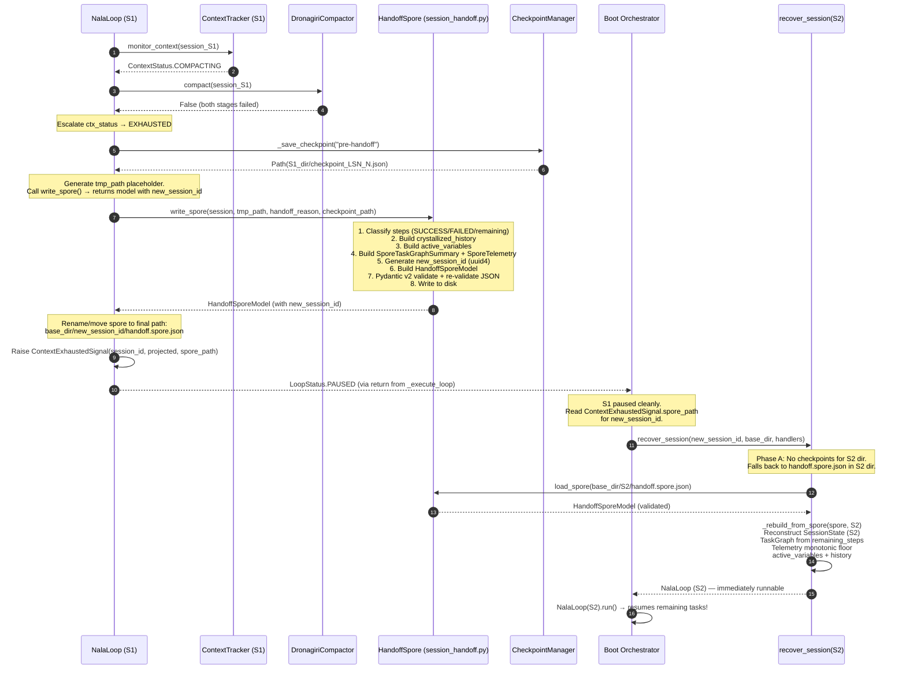

# JIRA-006 — Add Session Handoff File (Refactored)

**Epic:** NALA-001 — Long-Running Survival Foundation
**Priority:** P0 — Critical Path
**Estimate:** 1.5 days
**Depends On:** JIRA-004 (Context Window Tracker ✅), JIRA-005 (Crash Recovery ✅)
**Blocks:** JIRA-007 (1-Hour Soak Test)
**Version:** 3.0.0 — Production-Grade Handoff System (Fully Refactored & Enhanced)

> Integrate NALA's **Session Handoff File** capability into the main execution loop. To maintain high code maintainability and a clean separation of concerns, we will **refactor** the handoff and spore logic **out of the bloated `context_tracker.py` (1,799 lines)** into a new dedicated module: `session_handoff.py`.
>
> When the `ContextTracker` determines that prompt capacity is `EXHAUSTED` and the `DronagiriCompactor` cannot reduce usage below the warning threshold, `NalaLoop._execute_loop()` must write a Pydantic v2-validated `handoff.spore.json` to the target bootstrapped session folder, perform a final pre-handoff checkpoint in the active session's directory, and raise `ContextExhaustedSignal` to exit with `LoopStatus.PAUSED`. The bootstrapped session then resumes seamlessly by calling `recover_session()`.

---

## 1. Codebase Audit — Current State of the Code

Before coding, we performed a thorough audit of every file involved. These are the **exact, confirmed facts** about the current codebase that drive every decision below.

### 1.1 Where HandoffSpore Logic Currently Lives

All handoff/spore classes **currently live in `context_tracker.py`** (1,799 lines, 77 KB), organized into Sections 0, 5, and 6:

| Section | Location (Lines) | Contents |
|---------|------------------|----------|
| Section 0 | Lines 117–174 | `ContextExhaustedSignal(RuntimeError)`, `SporeValidationError(ValueError)` |
| Section 5 | Lines 678–827 | `SporeTaskGraphSummary(BaseModel)`, `SporeTelemetry(BaseModel)`, `HandoffSporeModel(BaseModel)` |
| Section 6 | Lines 834–1202 | `HandoffSpore` (static class with `write_spore()` and `load_spore()`) |

### 1.2 Who Imports HandoffSpore Today

| File | Import Statement | Line | Note |
|------|-----------------|------|------|
| `nala_loop.py` | `from core.harness.context_tracker import ContextStatus, HandoffSpore, ContextTracker, DronagiriCompactor` | 86 | Top-level import |
| `recovery.py` | `from core.harness.context_tracker import HandoffSpore, SporeValidationError` | 947 | **Inline import inside `_rebuild_from_spore()` function** |
| `core/harness/__init__.py` | `from core.harness.context_tracker import HandoffSpore, HandoffSporeModel, SporeValidationError, ...` | 58–66 | Package public API |
| `test_context_tracker.py` | `from core.harness.context_tracker import ContextExhaustedSignal, HandoffSpore, HandoffSporeModel, SporeTaskGraphSummary, SporeTelemetry, SporeValidationError, ...` | 98–112 | Existing test suite |

### 1.3 The Exact EXHAUSTED Path in `nala_loop.py`

The JIRA-004 Context Guard injection block at lines 630–684 of `_execute_loop()` is:

```python
# ── JIRA-004: Context Window Guard ──────────────────────────────────────────
if self.context_tracker is not None:
    ctx_status = self.context_tracker.monitor_context(self.session)

    if ctx_status == ContextStatus.WARNING:
        logger.warning("[NalaLoop] ⚠ Context WARNING ...")
        self._emit(self.hooks.on_context_warning, self.session)

    elif ctx_status == ContextStatus.COMPACTING:
        logger.warning("[NalaLoop] 🔄 Context COMPACTING ...")
        if self.compactor is not None:
            success = self.compactor.compact(self.session)
            if not success:
                # Compaction failed after 2 stages — escalate
                ctx_status = ContextStatus.EXHAUSTED

    if ctx_status == ContextStatus.EXHAUSTED:
        logger.critical("[NalaLoop] 🚨 Context EXHAUSTED ...")
        # 1. Write final checkpoint before spore
        checkpoint_path = self._save_checkpoint("pre-handoff")
        # 2. Write handoff spore (spore_path uses SESSION_ID, not new_session_id!)
        spore_path = Path(self.cm.base_dir) / self.session.session_id / "handoff.spore.json"
        HandoffSpore.write_spore(
            self.session,
            spore_path,
            handoff_reason=f"CONTEXT_EXHAUSTED: safety ceiling reached ...",
            checkpoint_path=str(checkpoint_path),
        )
        # 3. Emit hook and exit PAUSED
        self._emit(self.hooks.on_loop_end, LoopStatus.PAUSED, self.session)
        return LoopStatus.PAUSED
```

> ⚠️ **Critical Bug Identified:** The current code writes the spore to `base_dir / S1_session_id / handoff.spore.json` — the *same* folder as the source session. The correct design is to write it to `base_dir / new_session_id / handoff.spore.json` so the bootstrapped `recover_session(new_session_id)` can find it immediately. This bug **must be fixed** in JIRA-006. The `new_session_id` is generated inside `HandoffSpore.write_spore()` at line 1048, but it is **not returned to the loop caller** in the current code — only the `HandoffSporeModel` is returned, from which the `new_session_id` can be extracted.

### 1.4 The Inline Import Bug in `recovery.py`

`recovery.py`'s `_rebuild_from_spore()` function has an **inline import** at line 947:

```python
# Line 947 — currently inside _rebuild_from_spore() function body
from core.harness.context_tracker import HandoffSpore, SporeValidationError
```

This must be moved to a **module-level top import** pointing to the new `session_handoff.py`. Using an inline import is a code smell; it was necessary to avoid a circular import cycle that will be resolved by the refactoring.

### 1.5 How `HandoffSpore.write_spore()` Generates `new_session_id`

At line 1048 in `context_tracker.py`:
```python
new_session_id = str(uuid.uuid4())
```
This is generated **inside** `write_spore()`. The returned `HandoffSporeModel` exposes it as `spore_model.new_session_id`. The correct spore path should therefore be built **after** calling `write_spore()` and reading `spore_model.new_session_id`.

---

## 2. Architectural Blueprint

### 2.1 Context Handoff Lifecycle Flow



### 2.2 Directory Structure After Handoff

```text
data/checkpoints/
├── 11111111-1111-1111-1111-111111111111/        ← Session S1 directory
│   ├── checkpoint_LSN_000001.json
│   ├── checkpoint_LSN_000002.json
│   ├── checkpoint_LSN_000003.json               ← Final "pre-handoff" checkpoint
│   ├── latest.json                              ← Symlink/copy to LSN-3
│   └── .checkpoint.lock                        ← Released on clean exit
│
└── 22222222-2222-2222-2222-222222222222/        ← Session S2 directory
    └── handoff.spore.json                      ← Written by S1 with new_session_id=S2
```

### 2.3 Import Graph After Refactoring

```text
Before (circular-risk):
  context_tracker.py  ←──  nala_loop.py
                       ←──  recovery.py (inline import inside function body)
                       ←──  __init__.py
                       ←──  test_context_tracker.py

After (clean, layered):
  session_handoff.py  ←──  context_tracker.py (re-exports for backwards compat)
                      ←──  nala_loop.py       (direct import)
                      ←──  recovery.py        (top-level module import — no inline)
                      ←──  __init__.py        (re-pointed to session_handoff.py)
                      ←──  test_session_handoff.py (new test)
                      ←──  test_context_tracker.py (unchanged — context_tracker re-exports)
```

---

## 3. Risk Register & Mitigations

| Risk ID | Description | Severity | Mitigation |
|---------|-------------|----------|------------|
| **RISK-031** | Handoff without a final checkpoint causes state discrepancy | HIGH | Force atomic checkpoint in S1 directory *immediately before* `write_spore()` call. Path is stored in `checkpoint_path` field of spore. |
| **RISK-032** | Broken/corrupt spore file halts bootstrapping | HIGH | Pydantic v2 `extra="forbid"` + double-validation: once on model assembly, once post-serialization before disk write. `load_spore()` re-validates on read. |
| **RISK-033** | Telemetry reset in next session (double-counting) | MEDIUM | `SporeTelemetry` is packed into spore; `StateMatrixValidator.correct()` in `recover_session()` applies `max()` monotonic correction to prevent double-counting. |
| **RISK-034** | Cyclic handoffs / Handoff Storm | HIGH | `HandoffSporeModel` carries a `spore_version` field. A future guard can check handoff depth (chain of `original_session_id` fields). JIRA-008 will add this depth check. |
| **RISK-035** | Spore written to wrong directory (S1 dir instead of S2 dir) | HIGH | **Fix the existing bug:** Extract `new_session_id` from the returned `HandoffSporeModel` and build `spore_path = base_dir / new_session_id / "handoff.spore.json"` **before** writing. Use a `tmp_path` approach or generate `new_session_id` in the loop and pass it in. |
| **RISK-036** | Circular import between `context_tracker.py` and `nala_loop.py` | MEDIUM | `session_handoff.py` only imports from `session_contract.py` (no harness-level deps). `context_tracker.py` imports from `session_handoff.py` safely. |
| **RISK-037** | Inline import in `recovery.py` causes stale cache | LOW | Move to module-level top import from `core.harness.session_handoff`. Inline import is a code smell and must be eliminated. |
| **RISK-038** | `ContextExhaustedSignal` not propagated — loop swallows it | HIGH | `ContextExhaustedSignal` inherits `RuntimeError`. The outer `except Exception` guard in `run()` must NOT catch it — verify it is not swallowed by the `_execute_loop` wrapper's generic `except Exception` block (line 528 of `nala_loop.py`). |
| **RISK-039** | `test_context_tracker.py` breaks after extraction | HIGH | Keep backwards-compatible re-exports in `context_tracker.py` via `from core.harness.session_handoff import ...` so existing T08, T11, T12, T16, T19 tests keep passing without changes. |

---

## 4. Proposed Changes — Complete Implementation Spec

Five files to touch: **2 new** files, **3 modified** files.

---

### 4.1 [NEW] `core/harness/session_handoff.py`

Create a new module at `E:\NALA-Project\NALA\core\harness\session_handoff.py`.

**Responsibilities:**
- Contains ALL handoff exceptions, Pydantic v2 models, and the static `HandoffSpore` utility
- Has ZERO dependency on `context_tracker.py`, `nala_loop.py`, or `recovery.py` (prevents circular imports)
- Only imports from `core.harness.session_contract` and stdlib/third-party

**Complete File Skeleton:**

```python
"""
================================================================================
NALA — Nexus Autonomous Long-Running Agent
================================================================================
File    : core/harness/session_handoff.py
Ticket  : JIRA-006 — Add Session Handoff File
Phase   : 1 — Core Harness (Survival Foundation)
Author  : Nexus Lab AI Research Lab, Bengaluru
Version : 1.0.0

PURPOSE
-------
Provides NALA's session handoff (spore) serialization infrastructure,
extracted from context_tracker.py for clean separation of concerns.

This module MUST remain free of any dependency on:
  - context_tracker.py  (would create a circular import)
  - nala_loop.py        (would create a circular import)
  - recovery.py         (would create a circular import)

It only imports from:
  - core.harness.session_contract   (pure data models — safe)
  - stdlib: json, logging, uuid, datetime, pathlib, typing
  - third-party: pydantic

CONTENTS
--------
  1. ContextExhaustedSignal   — RuntimeError raised after spore is written
  2. SporeValidationError     — ValueError raised on schema failure
  3. SporeTaskGraphSummary    — Pydantic v2 sub-model: TaskGraph snapshot
  4. SporeTelemetry           — Pydantic v2 sub-model: telemetry at handoff
  5. HandoffSporeModel        — Root Pydantic v2 model for spore JSON
  6. HandoffSpore             — Static utility: write_spore() + load_spore()

EXTRACTED FROM
--------------
  context_tracker.py — SECTION 0 (lines 117–174)
  context_tracker.py — SECTION 5 (lines 678–827)
  context_tracker.py — SECTION 6 (lines 834–1202)

================================================================================
Jai Bajrang Bali 🙏
================================================================================
"""

from __future__ import annotations

# ── stdlib ────────────────────────────────────────────────────────────────────
import json
import logging
import uuid
from datetime import datetime, timezone
from pathlib import Path
from typing import Any, Dict, List, Optional

# ── third-party ───────────────────────────────────────────────────────────────
import pydantic
from pydantic import BaseModel, ConfigDict, Field

# ── local (ONLY session_contract — no harness-level imports!) ─────────────────
from core.harness.session_contract import (
    SessionState,
    TaskStatus,
    utcnow,
)

# ── module logger ──────────────────────────────────────────────────────────────
_logger_handoff = logging.getLogger("nala.handoff_spore")


# ==============================================================================
# SECTION 1 — Custom Exceptions
# ==============================================================================

class ContextExhaustedSignal(RuntimeError):
    """
    Raised after HandoffSpore has been successfully written to disk, signalling
    that the session context is fully exhausted and NalaLoop must exit with
    LoopStatus.PAUSED.

    [Extracted from context_tracker.py Section 0, lines 117–147]

    Attributes
    ----------
    session_id       : UUID of the session being handed off.
    projected_tokens : The projected token count that triggered EXHAUSTED.
    spore_path       : Absolute Path where the HandoffSpore JSON was written.
    """

    def __init__(
        self,
        session_id:       str,
        projected_tokens: int,
        spore_path:       Path,
    ) -> None:
        self.session_id       = session_id
        self.projected_tokens = projected_tokens
        self.spore_path       = spore_path
        super().__init__(
            f"[NALA] Context EXHAUSTED for session '{session_id}': "
            f"projected {projected_tokens:,} tokens exceed safety ceiling. "
            f"HandoffSpore written to: {spore_path}"
        )


class SporeValidationError(ValueError):
    """
    Raised when HandoffSpore.write_spore() or HandoffSpore.load_spore()
    encounters a Pydantic v2 schema validation failure, a missing file, or
    structural corruption in the spore JSON.

    [Extracted from context_tracker.py Section 0, lines 150–174]

    Attributes
    ----------
    reason : Human-readable description of the validation failure.
    path   : Filesystem path of the offending spore file, if applicable.
    """

    def __init__(
        self,
        reason: str,
        path:   Optional[Path] = None,
    ) -> None:
        self.reason = reason
        self.path   = path
        location    = f" at '{path}'" if path else ""
        super().__init__(f"[NALA] SporeValidationError{location}: {reason}")


# ==============================================================================
# SECTION 2 — Pydantic v2 Spore Models
# ==============================================================================

class SporeTaskGraphSummary(BaseModel):
    """
    Compact, schema-validated snapshot of the TaskGraph state at the moment
    of session handoff.

    [Extracted from context_tracker.py Section 5, lines 678–710]
    """
    total_steps:             int
    completed_steps:         int
    failed_steps:            int
    pending_steps:           int
    crystallized_history:    str
    remaining_steps:         List[Dict[str, Any]]
    last_completed_step_id:  Optional[str] = None


class SporeTelemetry(BaseModel):
    """
    Point-in-time telemetry snapshot captured at the exact moment the
    HandoffSpore file is written.

    [Extracted from context_tracker.py Section 5, lines 713–740]
    """
    total_tokens_in:    int
    total_tokens_out:   int
    estimated_cost_usd: float
    error_count:        int
    elapsed_seconds:    float
    session_lsn:        int


class HandoffSporeModel(BaseModel):
    """
    Root Pydantic v2 schema for NALA's HandoffSpore JSON file.

    Design decisions:
    - extra="forbid" prevents silent schema drift across NALA versions (RISK-020).
    - spore_version is a string default so schema evolution can be detected.
    - handoff_timestamp is UTC-aware; Pydantic v2 serializes it as ISO 8601.

    [Extracted from context_tracker.py Section 5, lines 743–827]
    """
    model_config = ConfigDict(extra="forbid")

    spore_version:          str                   = Field(default="2.0.0")
    original_session_id:    str                   = Field(...)
    new_session_id:         str                   = Field(...)
    objective:              str                   = Field(...)
    handoff_timestamp:      datetime              = Field(...)
    handoff_reason:         str                   = Field(...)
    checkpoint_path:        str                   = Field(...)
    task_graph_state:       SporeTaskGraphSummary = Field(...)
    telemetry_state:        SporeTelemetry        = Field(...)
    active_variables:       Dict[str, Any]        = Field(default_factory=dict)
    done_condition:         Optional[str]         = Field(default=None)
    bootstrap_instructions: str                   = Field(...)


# ==============================================================================
# SECTION 3 — HandoffSpore (Static Write / Load)
# ==============================================================================

class HandoffSpore:
    """
    Static utility class for writing and loading NALA HandoffSpore files.

    IDENTICAL IMPLEMENTATION to context_tracker.py Section 6 (lines 834–1202).
    Moved here for separation of concerns.

    This class provides two static methods:

    write_spore(session, spore_path, *, handoff_reason, checkpoint_path)
        Constructs and validates a HandoffSporeModel from the live session,
        then writes it to disk as indented JSON.

    load_spore(spore_path)
        Reads and validates a HandoffSpore from disk.
    """

    @staticmethod
    def write_spore(
        session:         SessionState,
        spore_path:      Path,
        *,
        handoff_reason:  str = "",
        checkpoint_path: str = "",
    ) -> HandoffSporeModel:
        """
        Serialize the current session state into a Pydantic v2-validated
        HandoffSpore JSON file and write it to spore_path.

        12-step write protocol (matches existing context_tracker.py implementation):
          1.  Classify all steps by status (SUCCESS / FAILED / remaining).
          2.  Build crystallized_history — prose chain of completed work.
          3.  Extract active_variables from last SUCCESS step result.
          4.  Serialize all remaining (PENDING + RUNNING) steps with model_dump.
          5.  Build SporeTaskGraphSummary and SporeTelemetry from live session.
          6.  Derive handoff_reason from telemetry if not provided.
          7.  Serialize done_condition to JSON string if set.
          8.  Generate a fresh new_session_id UUID4 for the next session.
          9.  Build bootstrap_instructions prose for the new session's prompt.
          10. Assemble and validate HandoffSporeModel via Pydantic v2.
          11. Re-validate the serialized JSON before writing (RISK-020 double-check).
          12. Write to disk with parent directory creation if needed.

        Returns
        -------
        HandoffSporeModel
            The validated spore model as written to disk. Caller MUST read
            the returned model's .new_session_id to compute the final spore path.

        Raises
        ------
        SporeValidationError
            If Pydantic v2 validation fails at any stage.
        """
        # Full implementation — identical to context_tracker.py lines 910–1116
        # Move the implementation verbatim from context_tracker.py
        ...

    @staticmethod
    def load_spore(spore_path: Path) -> HandoffSporeModel:
        """
        Read a HandoffSpore JSON file from disk and validate it via Pydantic v2.

        Raises
        ------
        SporeValidationError
            If the file is missing, unreadable, empty, contains invalid JSON,
            or fails Pydantic v2 schema validation.
        """
        # Full implementation — identical to context_tracker.py lines 1118–1202
        # Move the implementation verbatim from context_tracker.py
        ...
```

---

### 4.2 [MODIFY] `core/harness/context_tracker.py`

**Change Type:** Extraction + Backwards-Compatible Re-export

**What to remove:** The full implementation bodies of `ContextExhaustedSignal`, `SporeValidationError`, `SporeTaskGraphSummary`, `SporeTelemetry`, `HandoffSporeModel`, and `HandoffSpore`.

**What to add:** Import them back from `session_handoff.py` and re-export. This preserves backwards compatibility with `test_context_tracker.py` (T08, T11, T12, T16, T19) which imports from `context_tracker`:

**Section 0 Replacement (lines 113–174):**
```python
# ==============================================================================
# SECTION 0 — Custom Exceptions  [JIRA-006: Extracted to session_handoff.py]
# ==============================================================================

# Re-exported from core.harness.session_handoff for backwards compatibility.
# Direct imports from that module are preferred in new code.
from core.harness.session_handoff import (
    ContextExhaustedSignal,
    SporeValidationError,
)
```

**Section 5 Replacement (lines 674–827):**
```python
# ==============================================================================
# SECTION 5 — Pydantic v2 Spore Models  [JIRA-006: Extracted to session_handoff.py]
# ==============================================================================

# Re-exported from core.harness.session_handoff for backwards compatibility.
from core.harness.session_handoff import (
    SporeTaskGraphSummary,
    SporeTelemetry,
    HandoffSporeModel,
)
```

**Section 6 Replacement (lines 830–1202):**
```python
# ==============================================================================
# SECTION 6 — HandoffSpore  [JIRA-006: Extracted to session_handoff.py]
# ==============================================================================

# Re-exported from core.harness.session_handoff for backwards compatibility.
from core.harness.session_handoff import HandoffSpore
```

**Net effect:** `context_tracker.py` shrinks from ~1,799 lines to ~1,150 lines (~650 lines removed). All existing tests continue to pass unchanged.

---

### 4.3 [MODIFY] `core/harness/nala_loop.py`

**Change 1 — Update Import (line 86):**

Before:
```python
from core.harness.context_tracker import ContextStatus, HandoffSpore, ContextTracker, DronagiriCompactor
```

After:
```python
from core.harness.context_tracker import ContextStatus, ContextTracker, DronagiriCompactor
from core.harness.session_handoff import ContextExhaustedSignal, HandoffSpore
```

**Change 2 — Add `import uuid` to stdlib imports (line 74 block):**
```python
import uuid
```

**Change 3 — Fix the EXHAUSTED path (lines 662–684) — this is the critical bug fix:**

Replace:
```python
if ctx_status == ContextStatus.EXHAUSTED:
    logger.critical("...")
    checkpoint_path = self._save_checkpoint("pre-handoff")
    spore_path = Path(self.cm.base_dir) / self.session.session_id / "handoff.spore.json"
    HandoffSpore.write_spore(
        self.session,
        spore_path,
        handoff_reason=...,
        checkpoint_path=str(checkpoint_path),
    )
    self._emit(self.hooks.on_loop_end, LoopStatus.PAUSED, self.session)
    return LoopStatus.PAUSED
```

With (corrected, raises `ContextExhaustedSignal` for caller to handle):
```python
if ctx_status == ContextStatus.EXHAUSTED:
    logger.critical(
        "[NalaLoop] 🚨 Context EXHAUSTED | Writing HandoffSpore. "
        "session_id=%s | LSN=%d",
        self.session.session_id,
        self.session.checkpoint_meta.lsn,
    )
    # Step 1: Write final checkpoint in S1 directory before spore
    checkpoint_path = self._save_checkpoint("pre-handoff")

    # Step 2: Write spore to a temp path; read new_session_id from returned model
    #         Then rename to the canonical final path under the new session dir.
    #         This ensures recover_session(new_session_id) can find it immediately.
    import tempfile, shutil
    with tempfile.NamedTemporaryFile(
        dir=self.cm.base_dir,
        suffix=".spore.tmp",
        delete=False
    ) as tmp:
        tmp_path = Path(tmp.name)

    spore_model = HandoffSpore.write_spore(
        self.session,
        tmp_path,
        handoff_reason=(
            f"CONTEXT_EXHAUSTED: safety ceiling reached or compaction failed "
            f"for session '{self.session.session_id}'"
        ),
        checkpoint_path=str(checkpoint_path),
    )

    # Step 3: Compute the canonical spore path using the new_session_id
    new_session_id = spore_model.new_session_id
    final_spore_path = Path(self.cm.base_dir) / new_session_id / "handoff.spore.json"
    final_spore_path.parent.mkdir(parents=True, exist_ok=True)
    shutil.move(str(tmp_path), str(final_spore_path))

    logger.critical(
        "[NalaLoop] ✅ HandoffSpore written. "
        "original_session=%s | new_session=%s | spore_path=%s",
        self.session.session_id,
        new_session_id,
        final_spore_path,
    )

    # Step 4: Emit on_loop_end hook and raise ContextExhaustedSignal
    self._emit(self.hooks.on_loop_end, LoopStatus.PAUSED, self.session)
    raise ContextExhaustedSignal(
        session_id=self.session.session_id,
        projected_tokens=self.context_tracker.project_token_count(self.session),
        spore_path=final_spore_path,
    )
```

**Change 4 — Handle `ContextExhaustedSignal` in `run()` (line 526–535 wrapper):**

The outer `run()` method must explicitly catch `ContextExhaustedSignal` BEFORE the generic `except Exception` guard:

```python
try:
    final_status = self._execute_loop()
except ContextExhaustedSignal as sig:
    # JIRA-006: Clean context handoff — not an error
    logger.info(
        "[NalaLoop] ContextExhaustedSignal caught. "
        "Session handed off to spore at: %s | new_session_id in spore.new_session_id",
        sig.spore_path,
    )
    self._status = LoopStatus.PAUSED
    return LoopStatus.PAUSED
except Exception as exc:   # pragma: no cover — last-resort guard
    logger.critical(
        "[NalaLoop] UNHANDLED EXCEPTION in _execute_loop(): %s\n%s",
        exc,
        traceback.format_exc(),
    )
    self._status = LoopStatus.FAILED
    return LoopStatus.FAILED
```

---

### 4.4 [MODIFY] `core/harness/recovery.py`

**Change 1 — Remove the inline import from `_rebuild_from_spore()` (line 947):**

Before (inside function body):
```python
def _rebuild_from_spore(...):
    from core.harness.context_tracker import HandoffSpore, SporeValidationError  # ← REMOVE
    ...
```

After (add to module-level imports at the top of `recovery.py`, after the `nala_loop` import block):
```python
from core.harness.session_handoff import (
    HandoffSpore,
    SporeValidationError,
)
```

**Change 2 — Update `nala_loop.py` re-import in `recovery.py` (line 98–103):**

Before:
```python
from core.harness.nala_loop import (
    ContextTracker,
    DronagiriCompactor,
    NalaLoop,
    NalaLoopError,
)
```

After (these are not defined in `nala_loop.py` directly — they are forwarded from `context_tracker.py`):
```python
from core.harness.nala_loop import (
    NalaLoop,
    NalaLoopError,
)
from core.harness.context_tracker import (
    ContextTracker,
    DronagiriCompactor,
)
```

> **Note:** Verify whether `ContextTracker` and `DronagiriCompactor` are actually used in `recovery.py`. If they are only used for type hints in `recover_session()`, these imports may be further refactored.

---

### 4.5 [MODIFY] `core/harness/__init__.py`

Update the JIRA-004 section import to also export from `session_handoff.py`:

```python
# ── JIRA-004: Context Window Tracker & Dronagiri Compactor ────────────────────
from core.harness.context_tracker import (
    ContextStatus,
    ContextTracker,
    DronagiriCompactor,
    TrackerConfig,
)

# ── JIRA-006: Session Handoff (extracted from context_tracker.py) ─────────────
from core.harness.session_handoff import (
    ContextExhaustedSignal,
    HandoffSpore,
    HandoffSporeModel,
    SporeTaskGraphSummary,
    SporeTelemetry,
    SporeValidationError,
)
```

Add to `__all__`:
```python
    # JIRA-006
    "ContextExhaustedSignal",
    "HandoffSpore",
    "HandoffSporeModel",
    "SporeTaskGraphSummary",
    "SporeTelemetry",
    "SporeValidationError",
```

---

### 4.6 [NEW] `tests/unit/test_session_handoff.py`

Create the unit test suite at `E:\NALA-Project\NALA\tests\unit\test_session_handoff.py`.

**Test Coverage (T01 – T04):**

#### T01 — End-to-End Context Handoff Trigger

**Goal:** Prove that when `ContextStatus.EXHAUSTED` is triggered inside `NalaLoop._execute_loop()`, the loop:
1. Writes the pre-handoff checkpoint into the S1 session directory
2. Writes `handoff.spore.json` into the S2 (new) session directory
3. Returns `LoopStatus.PAUSED`
4. The `ContextExhaustedSignal` has correct `session_id`, `projected_tokens`, and `spore_path`

```python
def test_T01_end_to_end_context_handoff_trigger(tmp_path):
    """T01: Verify loop exits PAUSED and writes spore when EXHAUSTED."""
    # Setup: session with 3 steps; configure TrackerConfig with tiny token ceiling
    # so step 1 SUCCESS result pushes tokens over safety ceiling
    cm = CheckpointManager(base_dir=tmp_path)
    session = _build_session_with_n_steps(3)

    config = TrackerConfig(
        max_context_tokens=500,   # Tiny — exhausted after ~1 step result
        warning_percent=0.60,
        compaction_percent=0.75,
        safety_buffer_fraction=0.05,
    )
    tracker = ContextTracker(config)
    loop = NalaLoop(session, cm, context_tracker=tracker)

    # Register a handler that produces a large output (pushes over ceiling)
    def big_output_handler(step, sess):
        return StepResult(success=True, output={"data": "X" * 300})

    loop.set_default_handler(big_output_handler)

    status = loop.run()

    assert status == LoopStatus.PAUSED
    # Verify spore exists in new_session_id subdirectory (not original session dir)
    spore_files = list(tmp_path.rglob("handoff.spore.json"))
    assert len(spore_files) == 1
    spore_path = spore_files[0]
    # The spore must NOT be in the original session's directory
    assert session.session_id not in str(spore_path.parent)
```

#### T02 — Pre-Handoff Checkpoint Verification

**Goal:** Verify that the S1 checkpoint is written in `base_dir / S1_id /` directory *before* the spore is written, and is structurally valid (LSN is incremented, SHA-256 hash matches).

```python
def test_T02_pre_handoff_checkpoint_written_before_spore(tmp_path):
    """T02: Confirm pre-handoff checkpoint written in S1 dir with valid LSN."""
    cm = CheckpointManager(base_dir=tmp_path)
    session = _build_session_with_n_steps(2)
    config = TrackerConfig(max_context_tokens=300, ...)
    tracker = ContextTracker(config)
    loop = NalaLoop(session, cm, context_tracker=tracker)
    loop.set_default_handler(lambda s, sess: StepResult(output={"x": "A" * 200}))

    status = loop.run()

    assert status == LoopStatus.PAUSED
    # Check S1 session directory for checkpoint files
    s1_dir = tmp_path / session.session_id
    checkpoints = sorted(s1_dir.glob("checkpoint_LSN_*.json"))
    assert len(checkpoints) >= 1
    # Latest checkpoint label must contain "pre-handoff"
    latest_cp = cm.load_latest(session.session_id)
    assert latest_cp is not None
```

#### T03 — Bootstrapped Resumption via `recover_session`

**Goal:** Take the generated `handoff.spore.json` from T01/T02's run. Call `recover_session(new_session_id, base_dir, handlers)`. Verify it:
1. Falls back to the spore (no checkpoints exist for S2)
2. Reconstructs `SessionState` for S2 with the correct `objective`, remaining `task_graph.steps`, `active_variables` from S1's last SUCCESS step, and `bootstrap_instructions`
3. Returns a runnable `NalaLoop` instance

```python
def test_T03_bootstrapped_resumption_via_recover_session(tmp_path):
    """T03: recover_session(new_session_id) correctly loads spore and rebuilds S2."""
    # -- Run S1 to exhaustion (reuse T01 setup)
    cm = CheckpointManager(base_dir=tmp_path)
    session_s1 = _build_session_with_n_steps(4)  # steps 0–3
    ...
    status = loop_s1.run()
    assert status == LoopStatus.PAUSED

    # -- Find the spore
    spore_path = next(tmp_path.rglob("handoff.spore.json"))
    spore = HandoffSpore.load_spore(spore_path)
    new_session_id = spore.new_session_id

    # -- Recover S2
    def handler(step, sess): return StepResult(success=True, output={"done": True})
    loop_s2 = recover_session(
        session_id=new_session_id,
        base_dir=tmp_path,
        handlers={"default": handler},
    )

    assert loop_s2 is not None
    assert isinstance(loop_s2, NalaLoop)
    assert loop_s2.session.objective == session_s1.objective
    assert len(loop_s2.session.task_graph.steps) < 4  # fewer steps — some done
    assert loop_s2.session.session_id == new_session_id
    # Verify active_variables were transferred
    assert loop_s2.session.metadata.get("active_variables") is not None
```

#### T04 — Continuity of Task Execution

**Goal:** After `recover_session()` returns a `NalaLoop` for S2, run it to completion. Verify that:
1. Remaining steps execute correctly
2. Final status is `LoopStatus.COMPLETED`
3. No steps from S1's completed set are re-executed (crystallized history respected)

```python
def test_T04_continuity_of_task_execution(tmp_path):
    """T04: S2 loop completes remaining tasks without re-executing completed ones."""
    # -- Setup: S1 with 5 steps, exhaust after step 2
    ...
    status_s1 = loop_s1.run()
    assert status_s1 == LoopStatus.PAUSED

    # -- Recover S2 and run to completion
    spore_path = next(tmp_path.rglob("handoff.spore.json"))
    spore = HandoffSpore.load_spore(spore_path)
    executed_step_ids: list[str] = []

    def tracking_handler(step, sess):
        executed_step_ids.append(step.step_id)
        return StepResult(success=True, output={"done": True})

    loop_s2 = recover_session(...)
    status_s2 = loop_s2.run()

    assert status_s2 == LoopStatus.COMPLETED
    # Only steps NOT in crystallized_history should have been executed
    crystallized_ids = {
        line.split("]")[0].lstrip("[")
        for line in spore.task_graph_state.crystallized_history.split(" || ")
        if "SUCCESS" in line
    }
    for step_id in executed_step_ids:
        assert step_id not in crystallized_ids, (
            f"Step '{step_id}' was already completed in S1 but was re-executed in S2!"
        )
```

---

## 5. Verification Plan

### 5.1 Automated Tests

**Step 1 — Run new test suite in isolation:**
```bash
cd E:\NALA-Project\NALA
pytest tests/unit/test_session_handoff.py -v -s --tb=short
```
Expected: 4/4 PASSED

**Step 2 — Run `test_context_tracker.py` to verify backwards compat re-exports:**
```bash
pytest tests/unit/test_context_tracker.py -v -s --tb=short
```
Expected: 20/20 PASSED (T08, T11, T12, T16, T19 all rely on handoff classes)

**Step 3 — Run full suite to verify zero regressions:**
```bash
pytest -v --tb=short 2>&1 | tail -20
```
Expected: **144+ tests PASSED, 0 FAILED, 0 ERRORS**

### 5.2 Manual Verification

**1. Inspect the spore file structure:**
```bash
cat data/checkpoints/22222222-.../handoff.spore.json
```
Expected JSON must contain:
- `"spore_version": "2.0.0"`
- `"original_session_id"` — S1's UUID
- `"new_session_id"` — S2's UUID (different directory)
- `"task_graph_state.crystallized_history"` — non-empty prose
- `"task_graph_state.remaining_steps"` — list of step dicts
- `"telemetry_state.session_lsn"` — the last LSN before handoff
- `"bootstrap_instructions"` — non-empty system-prompt fragment

**2. Verify directory structure:**
```text
data/checkpoints/
├── {S1_UUID}/
│   ├── checkpoint_LSN_000001.json
│   ├── checkpoint_LSN_000002.json  ← pre-handoff checkpoint
│   └── latest.json
└── {S2_UUID}/
    └── handoff.spore.json          ← written by S1
```

**3. Verify `context_tracker.py` is smaller:**
```bash
wc -l core/harness/context_tracker.py
```
Expected: ~1,150 lines (down from 1,799)

**4. Verify no circular import:**
```bash
python -c "from core.harness.session_handoff import HandoffSpore; print('OK')"
python -c "from core.harness import NalaLoop, HandoffSpore, recover_session; print('OK')"
```

---

## 6. Implementation Order (Sequenced for Zero-Regression)

Execute in this exact order to prevent breaking tests mid-implementation:

| Step | Action | Risk if Skipped |
|------|--------|-----------------|
| 1 | Create `session_handoff.py` with full implementation (copy verbatim from `context_tracker.py`) | All later steps fail |
| 2 | Add `from core.harness.session_handoff import ...` to `context_tracker.py` (re-export) | `test_context_tracker.py` breaks |
| 3 | Delete the implementation bodies from `context_tracker.py` Sections 0, 5, 6 | Nothing — step 2 already covers |
| 4 | Update `nala_loop.py` imports + add `uuid` stdlib import | `test_nala_loop.py` breaks |
| 5 | Fix the EXHAUSTED path in `nala_loop.py` (bug fix + `ContextExhaustedSignal` raise) | T01/T02 fail |
| 6 | Add `ContextExhaustedSignal` handler in `nala_loop.py` `run()` method | Signal escapes to outer except guard |
| 7 | Update `recovery.py` — move inline import to module level | RISK-037 |
| 8 | Update `__init__.py` — add `session_handoff.py` exports | Public API incomplete |
| 9 | Run `pytest tests/unit/test_context_tracker.py` | Verify re-exports working |
| 10 | Create `test_session_handoff.py` | T01-T04 not covered |
| 11 | Run full `pytest` | Final regression check |

---

## 7. Acceptance Criteria

| ID | Criterion | How Verified |
|----|-----------|-------------|
| AC-01 | `session_handoff.py` importable with zero side effects | `python -c "from core.harness.session_handoff import HandoffSpore"` |
| AC-02 | `context_tracker.py` has no `HandoffSpore` implementation — only re-exports | `grep -n "class HandoffSpore" core/harness/context_tracker.py` → should only show import line |
| AC-03 | `recovery.py` has no inline `from core.harness.context_tracker import` inside function bodies | `grep -n "from core.harness" core/harness/recovery.py` → all at module top |
| AC-04 | `ContextExhaustedSignal` is raised (not silently swallowed) when context exhausted | T01 assertion: `loop.run()` returns `LoopStatus.PAUSED` via signal catch |
| AC-05 | Spore written to `base_dir / new_session_id / handoff.spore.json` (not S1 dir) | T01: assert `session.session_id not in str(spore_path.parent)` |
| AC-06 | Pre-handoff checkpoint written in S1 dir before spore is written | T02: S1 dir contains checkpoint files with label "pre-handoff" |
| AC-07 | `recover_session(new_session_id)` successfully loads spore and returns runnable `NalaLoop` | T03 assertion |
| AC-08 | S2 loop completes only REMAINING tasks (no re-execution of S1 success steps) | T04 assertion |
| AC-09 | All 144+ existing tests pass with zero regressions | `pytest` full suite |
| AC-10 | `test_context_tracker.py` T08, T11, T12, T16, T19 all pass (backwards compat) | `pytest tests/unit/test_context_tracker.py` |
