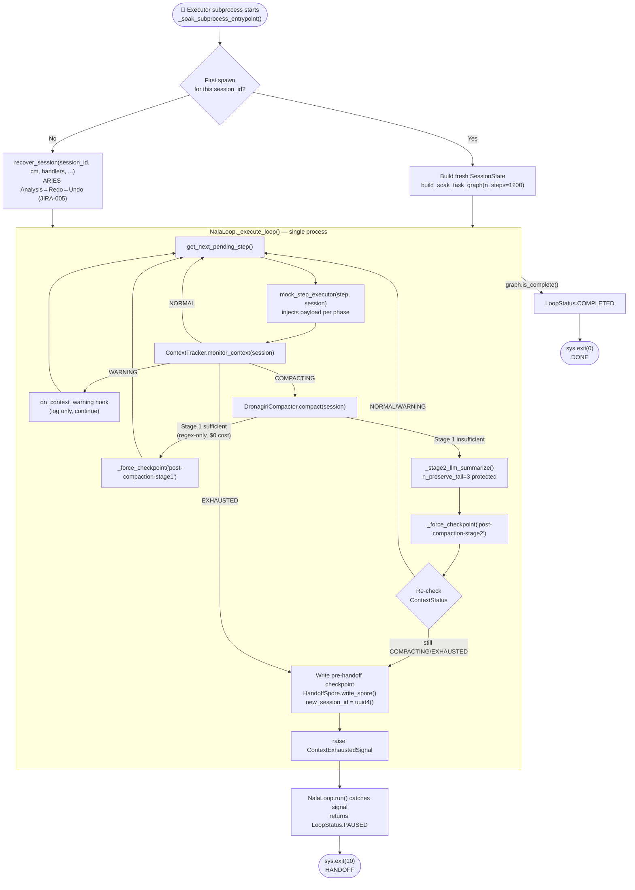
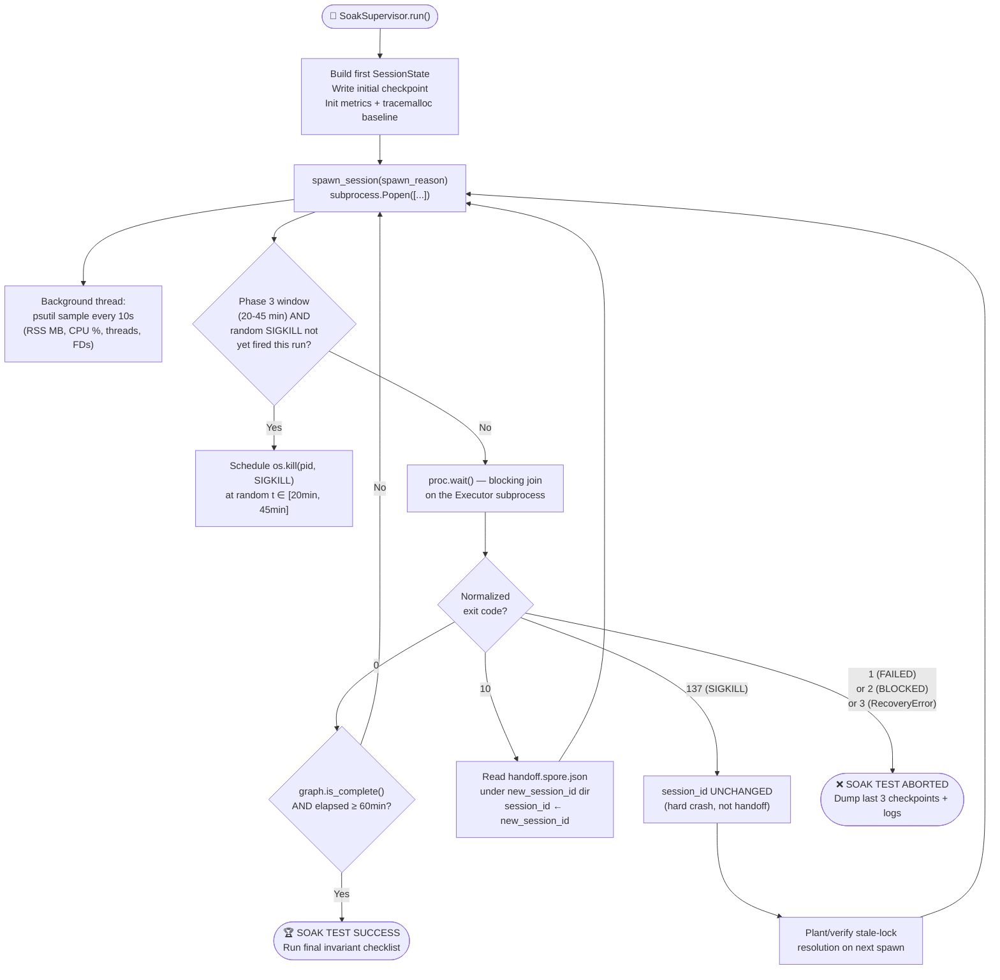

<response>
# JIRA-007 — 1-Hour Soak Test (`test_soak_1hr.py`)

**Epic:** NALA-001 — Long-Running Survival Foundation
**Priority:** P0 — Critical Path
**Estimate:** 3 days
**Depends On:** JIRA-001 ✅ · JIRA-002 ✅ · JIRA-003 ✅ · JIRA-004 ✅ · JIRA-005 ✅ · JIRA-006 ✅
**Blocks:** Phase 2 Development
**Version:** 2.0.0 — Enterprise-Grade Soak Blueprint (Process Supervisor, Profiling, Workload Schema, ARIES Invariants)

> Provide NALA with a production-grade 1-hour sustained soak test environment to prove
> the long-running stability of the run-loop (`nala_loop.py`), context survival engine
> (`context_tracker.py`), crash recovery subsystem (`recovery.py`), and session handoff
> layer (`session_handoff.py`). Under continuous token pressure and simulated hard-crash
> conditions, NALA must survive multiple compaction cycles and both **graceful** (spore)
> handoffs and **hard** (SIGKILL) recoveries — across a real multi-process supervisor
> boundary — without deadlocking, leaking memory, double-executing a step, or drifting
> its telemetry accumulators.

---

## 1. Architectural Blueprint

The soak test operates at **two process levels**: a long-lived **Supervisor** (parent,
`pytest` process) and a sequence of short-lived **Executor** subprocesses (children,
one Python interpreter per session generation), spawned and monitored exactly the way
a real NALA production deployment would run — `systemd`/Docker restarts the process on
exit, and `recover_session()` (JIRA-005) does the actual state restoration. This is
deliberately **not** an in-process simulation: real OS-level process death, real
filesystem locks, and real `SIGKILL` signals are used, because none of those failure
modes can be faithfully reproduced by mocking within a single interpreter.

### 1.1 In-Process Control Flow (per Executor subprocess)

This diagram shows the exact decision path already implemented inside
`NalaLoop._execute_loop()` (JIRA-004 injection block) and `DronagiriCompactor.compact()`
— the soak workload is engineered specifically to drive a session through every branch
of this flow multiple times within the 60-minute window.



### 1.2 Cross-Process Supervisor Lifecycle (NEW)



### 1.3 ARIES Phase Mapping (unchanged contract, now cross-referenced to real code)

| ARIES Phase | Soak-Test Exercise | Source of Truth |
|---|---|---|
| **Analysis** | Lock resolution → checkpoint SHA-256 verify → rollback chain → spore fallback | `recovery.py::LockResolver`, `recovery.py::recover_session` Phase A.1–A.3 |
| **Redo** | RUNNING → PENDING reset, StateMatrix monotonic correction, TaskGraph re-validation | `recovery.py::_apply_redo_phase`, `recovery.py::StateMatrixValidator` |
| **Undo** | RunawayLoopGuard halt check (must **never** trigger in a healthy soak run) | `recovery.py::RunawayLoopGuard` |

---

## 2. JIRA Acceptance Criteria (AC)

| ID | Acceptance Criteria | Target Metrics | Verification Method |
| :--- | :--- | :--- | :--- |
| **AC-1** | **Continuous Execution** | Wall-clock supervisor runtime ≥ 60 minutes, verified **at the supervisor**, independent of any single subprocess's terminal `LoopStatus` (see §6.4) | `time.monotonic()` delta on `SoakSupervisor` |
| **AC-2** | **Scale Stability** | Task Graph capacity ≥ 1,000 steps | `len(session.task_graph.steps) >= 1000` on graph init |
| **AC-3** | **Compaction Coverage** | ≥ 5 `DronagiriCompactor.compact()` invocations, with **≥ 1 resolved by Stage 1 alone** and **≥ 1 escalated to Stage 2** | Parse `[Dronagiri]` log lines from all subprocess stdout/stderr streams |
| **AC-4** | **Handoff & Crash Continuity** | ≥ 3 distinct `session_id` transitions via `HandoffSpore` (graceful, exit 10) **AND** ≥ 1 same-`session_id` recovery via checkpoint LSN rollback (hard crash, exit 137) | `SessionGeneration` ledger (see §3.3) — session_id + spawn_reason per generation |
| **AC-5** | **Memory Footprint (dual-layer)** | OS-level (psutil RSS) variance ≤ 10% flatline between minute 10 and minute 60; Python-heap (tracemalloc) growth bounded and non-monotonic-runaway | `assert_memory_stability()` (see §4) |
| **AC-6** | **Telemetry Integrity** | `StateMatrix` accumulators never regress across any handoff or crash boundary; `StateMatrixValidator.validate_reconstructed()` returns `{}` at final check | `assert_state_matrix_continuity()` (see §6.1) |
| **AC-7** | **Lock Safety** | 100% of stale `.checkpoint.lock` files (real or artificially planted) are resolved before recovery proceeds; zero lock files remain on disk after final `LoopStatus.COMPLETED` | `assert_lockfile_resolved()` (see §6.2) |
| **AC-8** (NEW) | **Exit Code Fidelity** | Every subprocess termination is classified into exactly one of the 5 documented exit codes; zero "unknown" terminations | `SoakSupervisor._normalize_exit_code()` coverage log |
| **AC-9** (NEW) | **Crash-Point Restoration** | The step that was `RUNNING` at the instant of a `SIGKILL` is, after recovery, `PENDING` with `started_at=None`; no `SUCCESS` step's `result` is altered by recovery | `assert_crash_point_restored()` (see §6.3) |

---

## 3. Process Supervisor Mechanics (NEW)

### 3.1 Why a Real Subprocess, Not an In-Process Mock

`threading.Event`-based cooperative stop (`NalaLoop.stop()`) and OS-level `SIGKILL` are
**not the same failure domain** and must not be conflated:

- `NalaLoop._stop_event` is a `threading.Event` — it lives **inside a single process's
  heap**, is invisible across a process boundary, and is never exercised by this soak
  suite (we never call `.stop()`).
- The **only** lock relevant to soak-scale recovery is the filesystem
  `.checkpoint.lock` file governed by `LockResolver` (`recovery.py`) — a cross-process,
  cross-reboot primitive. A soak harness that tried to "share" a `NalaLoop` object or a
  `threading.Event` across a `subprocess.Popen` boundary would be testing nothing real,
  since each child gets a fresh interpreter and a fresh heap.

Therefore every Executor generation is launched as a **genuine child OS process** via
`subprocess.Popen`, and crashes are simulated with a **genuine `os.kill(pid, SIGKILL)`**
— the same signal a real OOM-killer or `kill -9` would send in production.

### 3.2 Exit Code Contract

`NalaLoop.run()` returns a `LoopStatus` enum value — it does not, and should not, know
about process exit codes, since it is also called as a library function inside recovery
scripts. The soak harness's `_soak_subprocess_entrypoint()` script is the **only** place
that translates `LoopStatus` (and any exception escaping `recover_session()`) into a
process exit code.

| Exit Code | Meaning | Origin |
|---|---|---|
| `0` | `LoopStatus.COMPLETED` — `graph.is_complete()` was `True` | Normal terminal branch of `_execute_loop()` |
| `10` | `LoopStatus.PAUSED` observed by the entrypoint. Since this suite **never** calls `loop.stop()`, the only code path that can produce `PAUSED` here is `NalaLoop.run()` catching `ContextExhaustedSignal` (JIRA-004) after `HandoffSpore.write_spore()` has already been durably written to disk | `_soak_subprocess_entrypoint()` convention, layered on top of `nala_loop.py` |
| `137` | Process was terminated by `SIGKILL` from the supervisor's crash-injection watcher. **Nuance:** on POSIX, `subprocess.Popen.returncode` reports this as **`-9`** (negative signal number), not `137`. The supervisor's `_normalize_exit_code()` converts `-9 → 137` to match the universal shell convention `128 + signal_number`, purely for consistent logging/reporting | OS kernel signal delivery, normalized by `SoakSupervisor` |
| `2` | `LoopStatus.BLOCKED` — should never occur given `validate_task_graph()` rejects cycles before start, but the entrypoint defensively maps it anyway | `_execute_loop()` deadlock/blocked terminal branch |
| `3` | A `SessionRecoveryError`, `SessionRecoveryLockError`, or `RunawayLoopError` escaped `recover_session()` itself — i.e. the failure happened **during recovery**, before a `NalaLoop` even existed, which is diagnostically distinct from a failure **during execution** (exit 1) | `_soak_subprocess_entrypoint()`'s top-level `except` block |
| `1` | Any other unhandled exception, or `LoopStatus.FAILED` returned by `run()` | Generic catch-all |

### 3.3 `SoakSupervisor` — Full Implementation

```python
"""
tests/long_running/_soak_supervisor.py

Cross-process supervisor for JIRA-007. Spawns, monitors, kills, and recovers
Executor subprocesses for exactly one soak run. Not imported by production code.
"""
from __future__ import annotations

import dataclasses
import json
import os
import random
import signal
import subprocess
import sys
import time
from pathlib import Path
from typing import List, Literal, Optional

import psutil

SpawnReason = Literal["initial", "handoff", "crash_recovery"]


@dataclasses.dataclass
class SessionGeneration:
    """One row in the supervisor's ledger — one subprocess lifetime."""
    session_id:        str
    spawn_reason:       SpawnReason
    pid:                int
    start_monotonic:    float
    end_monotonic:      Optional[float]         = None
    raw_returncode:     Optional[int]            = None
    normalized_exit:    Optional[int]            = None
    floor_tokens_in:    int                      = 0   # cumulative ledger, see §6.1
    floor_tokens_out:   int                      = 0
    floor_cost_usd:     float                    = 0.0


class SoakSupervisor:
    """
    Parent-process orchestrator for the JIRA-007 1-hour soak test.

    Spawns `_soak_subprocess_entrypoint.py` as a real child process, samples its
    resource usage every 10 seconds via psutil, optionally injects a real SIGKILL
    at a random point in Phase 3 (20-45 min), interprets its exit code, and — on
    exit code 10 or 137 — respawns the next generation via the correct path
    (spore-based handoff vs same-session_id crash recovery).
    """

    SOAK_DURATION_S:      int = 60 * 60          # AC-1 — 60 minutes minimum
    PSUTIL_SAMPLE_S:      int = 10                # Rule #2 — sample every 10s
    KILL_WINDOW_START_S:  int = 20 * 60           # Phase 3 start
    KILL_WINDOW_END_S:    int = 45 * 60           # Phase 3 end

    def __init__(self, checkpoint_base_dir: Path, python_exe: str = sys.executable) -> None:
        self.checkpoint_base_dir = checkpoint_base_dir
        self.python_exe          = python_exe
        self.generations: List[SessionGeneration] = []
        self.metrics_path        = checkpoint_base_dir / "soak_metrics.jsonl"
        self._sigkill_fired      = False
        self._run_start          = time.monotonic()

    # ── Public entry point ────────────────────────────────────────────────────

    def run(self, initial_session_id: str) -> bool:
        """
        Drive the full soak run. Returns True on overall SUCCESS (per AC-1..AC-9),
        False on abort (exit codes 1/2/3).
        """
        session_id  = initial_session_id
        spawn_reason: SpawnReason = "initial"

        while True:
            elapsed = time.monotonic() - self._run_start
            gen = self._spawn_session(session_id, spawn_reason)
            self.generations.append(gen)

            self._maybe_schedule_sigkill(gen)
            self._sample_until_exit(gen)   # blocks until child exits; samples every 10s

            gen.end_monotonic  = time.monotonic()
            gen.raw_returncode = gen._proc.returncode          # type: ignore[attr-defined]
            gen.normalized_exit = self._normalize_exit_code(gen.raw_returncode)

            if gen.normalized_exit == 0:
                if (time.monotonic() - self._run_start) >= self.SOAK_DURATION_S:
                    return True   # AC-1 satisfied: full duration + clean completion
                # Graph finished early — this is a workload-sizing bug, not success.
                # Re-spawn is impossible (no more steps); fail loudly rather than
                # silently under-reporting AC-1.
                raise AssertionError(
                    f"[SoakSupervisor] TaskGraph completed at {elapsed:.0f}s — "
                    f"before the {self.SOAK_DURATION_S}s AC-1 floor. Re-tune "
                    f"STEP_PACING_S in _soak_workload.py."
                )

            if gen.normalized_exit == 10:
                new_session_id = self._read_spore_new_session_id(session_id)
                session_id, spawn_reason = new_session_id, "handoff"
                continue

            if gen.normalized_exit == 137:
                spawn_reason = "crash_recovery"       # session_id UNCHANGED
                continue

            # Exit codes 1, 2, 3 — soak test aborts (AC-8 still "passes" in the
            # sense that the code was correctly classified; the RUN itself failed).
            self._dump_failure_diagnostics(gen)
            return False

    # ── Spawning ───────────────────────────────────────────────────────────────

    def _spawn_session(self, session_id: str, spawn_reason: SpawnReason) -> SessionGeneration:
        argv = [
            self.python_exe, "-m", "tests.long_running._soak_subprocess_entrypoint",
            "--session-id", session_id,
            "--checkpoint-dir", str(self.checkpoint_base_dir),
            "--spawn-reason", spawn_reason,
        ]
        proc = subprocess.Popen(
            argv,
            stdout=subprocess.PIPE,
            stderr=subprocess.STDOUT,
            text=True,
            bufsize=1,
        )
        gen = SessionGeneration(
            session_id=session_id,
            spawn_reason=spawn_reason,
            pid=proc.pid,
            start_monotonic=time.monotonic(),
        )
        gen._proc = proc  # type: ignore[attr-defined]  # internal handle, not part of the dataclass contract
        return gen

    # ── SIGKILL injection ─────────────────────────────────────────────────────

    def _maybe_schedule_sigkill(self, gen: SessionGeneration) -> None:
        """
        Fire AT MOST ONE real SIGKILL per soak run, at a random moment inside
        Phase 3 (20-45 min), independent of the natural CONTEXT_EXHAUSTED handoff
        cycles also occurring in that window — this deliberately exercises BOTH
        crash modes (graceful spore handoff AND hard process death) within the
        same 60-minute run, satisfying AC-4's dual requirement.
        """
        if self._sigkill_fired:
            return
        elapsed_now = time.monotonic() - self._run_start
        if not (self.KILL_WINDOW_START_S <= elapsed_now <= self.KILL_WINDOW_END_S):
            return

        remaining_window = self.KILL_WINDOW_END_S - elapsed_now
        delay = random.uniform(0, min(remaining_window, 300))  # cap wait at 5 min

        import threading

        def _kill() -> None:
            time.sleep(delay)
            proc = gen._proc  # type: ignore[attr-defined]
            if proc.poll() is None:  # still alive — do not kill an already-exited child
                proc.send_signal(signal.SIGKILL)
                self._sigkill_fired = True

        threading.Thread(target=_kill, daemon=True).start()

    # ── Exit code normalization ───────────────────────────────────────────────

    @staticmethod
    def _normalize_exit_code(raw_returncode: Optional[int]) -> int:
        """
        Convert Python's POSIX signal-termination convention (negative signal
        number, e.g. -9 for SIGKILL) into the shell-standard 128+N convention
        used throughout this document and in all supervisor logs.
        """
        if raw_returncode is None:
            raise AssertionError("[SoakSupervisor] proc.returncode is None after wait().")
        if raw_returncode < 0:
            return 128 + abs(raw_returncode)
        return raw_returncode

    # ── Spore path resolution ─────────────────────────────────────────────────

    def _read_spore_new_session_id(self, original_session_id: str) -> str:
        """
        The spore is written by NalaLoop under the NEW session's directory
        (per nala_loop.py's own `final_spore_path = base_dir / new_session_id /
        "handoff.spore.json"` move logic) — the supervisor must scan for the
        most recently created `handoff.spore.json` rather than guessing a UUID.
        """
        candidates = sorted(
            self.checkpoint_base_dir.glob("*/handoff.spore.json"),
            key=lambda p: p.stat().st_mtime,
            reverse=True,
        )
        if not candidates:
            raise AssertionError(
                f"[SoakSupervisor] Exit code 10 received for session "
                f"'{original_session_id}' but no handoff.spore.json was found "
                f"under {self.checkpoint_base_dir}."
            )
        spore = json.loads(candidates[0].read_text(encoding="utf-8"))
        assert spore["original_session_id"] == original_session_id, (
            f"[SoakSupervisor] Spore original_session_id mismatch: "
            f"expected '{original_session_id}', got '{spore['original_session_id']}'."
        )
        return spore["new_session_id"]
```

---

## 4. Memory and CPU Profiling Design (NEW)

Two independent profiling layers are used **deliberately**, because they catch
different classes of leak: `tracemalloc` sees the **Python object heap** (catches
leaks in pure-Python code — e.g. an ever-growing list in `DronagiriCompactor`), while
`psutil` sees the **OS-level RSS** of the whole process (catches leaks in native
extensions — e.g. `tiktoken`'s Rust core or `pydantic-core`'s Rust validator, which
`tracemalloc` cannot see at all).

### 4.1 `tracemalloc` — In-Process Python Heap (runs inside each Executor subprocess)

```python
"""
Excerpt from _soak_subprocess_entrypoint.py — tracemalloc lifecycle.
"""
import tracemalloc
from pathlib import Path

def start_heap_profiling() -> None:
    # 25 stack frames is enough to pinpoint the allocating call site without
    # excessive overhead across 1200 steps.
    tracemalloc.start(25)

def take_baseline() -> "tracemalloc.Snapshot":
    # Baseline is captured AFTER the first 10 steps (warm-up), deliberately
    # excluding one-time import/module-init allocations that would otherwise
    # register as false-positive "growth" against a snapshot taken at t=0.
    return tracemalloc.take_snapshot()

def check_for_leaks(
    baseline: "tracemalloc.Snapshot",
    leak_report_path: Path,
    step_index: int,
) -> None:
    current = tracemalloc.take_snapshot()
    top_stats = current.compare_to(baseline, "lineno")
    current_mb, peak_mb = (b / (1024 * 1024) for b in tracemalloc.get_traced_memory())

    with leak_report_path.open("a", encoding="utf-8") as fh:
        fh.write(json.dumps({
            "step_index":  step_index,
            "current_mb":  round(current_mb, 3),
            "peak_mb":     round(peak_mb, 3),
            "top_5_diffs": [str(stat) for stat in top_stats[:5]],
        }) + "\n")
```

Called every **60 seconds of wall-clock time** (not every step, to keep overhead
bounded across 1200 steps) from within `_soak_subprocess_entrypoint.py`'s
`on_step_success` hook, gated by a monotonic-clock check.

### 4.2 `psutil` — Cross-Process OS-Level Sampling (runs inside the Supervisor)

```python
"""
Excerpt from _soak_supervisor.py — the 10-second sampling loop.
"""
def _sample_until_exit(self, gen: SessionGeneration) -> None:
    proc = gen._proc  # type: ignore[attr-defined]
    try:
        ps_proc = psutil.Process(proc.pid)
        ps_proc.cpu_percent(interval=None)  # "priming" call — first reading is
                                             # always garbage per psutil's own docs;
                                             # this establishes the internal timer
                                             # WITHOUT blocking the sampling loop.
    except psutil.NoSuchProcess:
        # Child died between spawn() and here — extremely fast crash. Not an
        # error; the next proc.wait() below will pick up the exit immediately.
        proc.wait()
        return

    with self.metrics_path.open("a", encoding="utf-8") as fh:
        while proc.poll() is None:
            time.sleep(self.PSUTIL_SAMPLE_S)
            try:
                mem = ps_proc.memory_info()
                row = {
                    "ts":         time.time(),
                    "session_id": gen.session_id,
                    "pid":        proc.pid,
                    "rss_mb":     round(mem.rss / (1024 * 1024), 2),
                    "vms_mb":     round(mem.vms / (1024 * 1024), 2),
                    "cpu_pct":    ps_proc.cpu_percent(interval=None),
                    "n_threads":  ps_proc.num_threads(),
                    "n_fds":      ps_proc.num_fds() if hasattr(ps_proc, "num_fds") else -1,
                }
                fh.write(json.dumps(row) + "\n")
            except psutil.NoSuchProcess:
                # EXPECTED at every generation boundary (handoff exit or SIGKILL) —
                # not a profiling failure. Loop exits naturally on the next poll().
                break
    proc.wait()
```

### 4.3 Memory Stability Assertion (AC-5)

```python
def assert_memory_stability(metrics_path: Path) -> None:
    rows = [json.loads(line) for line in metrics_path.read_text().splitlines()]
    rss_at = lambda target_min: next(
        r["rss_mb"] for r in rows
        if abs(r["ts"] - (rows[0]["ts"] + target_min * 60)) < 15
    )
    rss_10min = rss_at(10)
    rss_60min = rss_at(60)
    variance = abs(rss_60min - rss_10min) / rss_10min
    assert variance <= 0.10, (
        f"[AC-5 VIOLATION] RSS variance {variance:.1%} exceeds 10% flatline "
        f"tolerance between minute 10 ({rss_10min:.1f}MB) and minute 60 "
        f"({rss_60min:.1f}MB). Possible native-extension leak — tracemalloc "
        f"would NOT have caught this; inspect psutil metrics directly."
    )
```

---

## 5. Detailed Workload Generation Schema (NEW)

### 5.1 High-Entropy Base64 Payload (Rule #3)

```python
import base64
import os

def generate_high_entropy_base64(size_bytes: int, line_width: int = 76) -> str:
    """
    Simulate a step result that embeds encoded binary content (e.g. a file read,
    an image, a compiled artifact). Line-wrapped at `line_width` chars to mimic
    real-world base64 output (RFC 2045 MIME default is 76).

    Design note: because _RE_BASE64_BLOB matches ANY run of 3+ back-to-back
    60-char base64-alphabet segments — REGARDLESS of whether newlines are
    present (the pattern's `\n?` is optional, and a sufficiently long unbroken
    run of base64-alphabet characters still satisfies the {3,} repetition via
    internal backtracking) — this payload IS reliably caught and redacted to
    `[BINARY_CONTENT_REDACTED]` by Stage 1. Use this profile to validate Stage 1
    SUCCESS paths; use `generate_manifest_payload()` (§5.2) to force Stage 2.
    """
    raw = os.urandom(size_bytes)
    b64 = base64.b64encode(raw).decode("ascii")
    return "\n".join(b64[i:i + line_width] for i in range(0, len(b64), line_width))


def generate_system_log_snippet(target_bytes: int = 100 * 1024) -> str:
    """
    Synthesize a ~100KB realistic multi-line system/tool-execution log, mixing
    plain lines, occasional ANSI-colored level tags, and one embedded Python
    traceback — engineered to be HIGHLY compressible by the Stage 1 regex
    pipeline (P1 traceback, P2 ansi, P3 tool_header, P6 blank-line collapse),
    making this the primary profile for exercising the zero-LLM-cost Stage 1
    success path at realistic tool-output scale.
    """
    import random
    lines: list[str] = ["--- Tool Output ---"]
    levels = [("\x1b[32mINFO\x1b[0m", "step completed"), ("\x1b[33mWARN\x1b[0m", "retrying connection"),
              ("\x1b[31mERROR\x1b[0m", "transient socket timeout")]
    while sum(len(l) + 1 for l in lines) < target_bytes:
        tag, msg = random.choice(levels)
        lines.append(f"2026-06-{random.randint(10,29):02d}T{random.randint(0,23):02d}:"
                     f"{random.randint(0,59):02d}:{random.randint(0,59):02d}Z [{tag}] {msg}")
        if random.random() < 0.01:  # ~1% chance of a traceback block
            lines.append(
                "Traceback (most recent call last):\n"
                "  File 'tool_runner.py', line 88, in execute\n"
                "    result = subprocess.run(cmd, timeout=30)\n"
                "subprocess.TimeoutExpired: Command timed out after 30 seconds"
            )
        if random.random() < 0.02:
            lines.append("\n\n\n")  # excess blank lines — P6 target
    lines.append("=" * 30)  # separator line — P5 target
    return "\n".join(lines)


def generate_manifest_payload(n_entries: int = 220) -> dict:
    """
    Synthesize a realistic "file manifest" step result: a dict of {path, size,
    sha256, mtime} entries. Each SHA-256 digest is EXACTLY 64 lowercase hex
    characters — individually below the 180-character / 3-repetition minimum
    required to trigger `_RE_BASE64_BLOB`, and each digest is immediately
    bounded on both sides by JSON punctuation (quotes, commas, colons) that is
    NOT in the `[A-Za-z0-9+/]` character class, which terminates any partial
    match. None of P1 (traceback), P2 (ansi), P3 (tool_header), P4 (base64),
    or P5 (separator) apply to this content shape. This payload profile is
    THEREFORE STAGE-1-RESISTANT BY DESIGN and reliably forces escalation to
    Stage 2 LLM crystallization — essential for exercising
    `_stage2_llm_summarize()` and its `n_preserve_tail` protection under
    soak-scale, multi-cycle conditions (a scenario JIRA-004's own unit tests
    only exercise once, not repeatedly under drift).
    """
    import hashlib
    import random
    return {
        "manifest": [
            {
                "path":   f"/repo/src/module_{i:04d}.py",
                "size_bytes": random.randint(512, 65536),
                "sha256": hashlib.sha256(os.urandom(16)).hexdigest(),
                "mtime":  f"2026-06-{random.randint(10,29):02d}T00:00:00Z",
            }
            for i in range(n_entries)
        ]
    }
```

### 5.2 TaskGraph Generator

```python
def build_soak_task_graph(n_steps: int = 1200) -> "TaskGraph":
    """
    Linear dependency chain (deterministic, single-file scheduling — matches the
    phase-indexed workload profile below) with periodic 3-way fan-out/join
    groups every 100 steps, to also exercise TaskGraph.get_next_pending_step()'s
    multi-candidate branch and has_circular_dependency()'s DFS under realistic
    breadth, not just a trivial chain.
    """
    from core.harness.session_contract import TaskGraph, TaskStep

    steps: list[TaskStep] = []
    prev_id: Optional[str] = None
    for i in range(1, n_steps + 1):
        step_id = f"soak_step_{i:04d}"
        deps = [prev_id] if prev_id else []

        if i % 100 == 0:
            # Fan-out: 3 parallel branches depending only on prev_id, then a
            # join step depending on all 3 — exercises multi-dependency resolution.
            branch_ids = [f"{step_id}_branch_{b}" for b in range(3)]
            for bid in branch_ids:
                steps.append(TaskStep(step_id=bid, description=f"Parallel branch {bid}", dependencies=deps))
            join_id = f"{step_id}_join"
            steps.append(TaskStep(step_id=join_id, description=f"Join {join_id}", dependencies=branch_ids))
            prev_id = join_id
            continue

        steps.append(TaskStep(step_id=step_id, description=f"Soak step {i}", dependencies=deps))
        prev_id = step_id

    assert len(steps) >= 1000, "AC-2 violated: fewer than 1,000 steps generated."
    return TaskGraph(steps=steps)
```

### 5.3 Mock Executor — `_meta_*` Dual-Write Contract

```python
PHASE_BOUNDARIES = [0, 200, 400, 900, 1200]   # step-index cut points → Phase 1..4
FAILURE_INJECTION_RATE = 0.05                 # per-attempt, see §6.4 for rationale
STEP_PACING_S = (2.0, 4.0)                    # uniform random sleep, all phases

def mock_step_executor(step: "TaskStep", session: "SessionState") -> "StepResult":
    """
    CRITICAL CONTRACT: this executor must DUAL-WRITE token/cost telemetry:
      1. Via StepResult.prompt_tokens / .completion_tokens / .cost_usd — consumed
         by NalaLoop._update_telemetry() → StateMatrix.add_llm_call() during
         NORMAL operation.
      2. Via output["_meta_tokens_in"] / ["_meta_tokens_out"] / ["_meta_cost_usd"]
         — consumed ONLY by StateMatrixValidator.validate_reconstructed() during
         crash recovery, to compute the monotonic floor from SUCCESS step results.

    Omitting the second write is a silent soak-test bug: recovery would still
    "work" (no exception), but StateMatrixValidator's floor computation would
    read 0 for every step, making the ARIES telemetry-continuity invariant
    (AC-6) TRIVIALLY true even when it shouldn't be — a false-negative that
    would let real regressions slip through undetected.
    """
    import random
    import time as _time

    time.sleep(random.uniform(*STEP_PACING_S))

    if random.random() < FAILURE_INJECTION_RATE:
        # Transient — NalaLoop._dispatch_step_with_retry() will retry up to
        # max_retries_per_step times. See §6.4 for why this is NEVER a
        # permanent, un-retryable failure by design.
        raise RuntimeError("Simulated transient tool failure (soak workload).")

    idx = int(step.step_id.split("_")[2].split("_")[0]) if "soak_step_" in step.step_id else 1
    phase = next(p for p, (lo, hi) in enumerate(zip(PHASE_BOUNDARIES, PHASE_BOUNDARIES[1:]), 1) if lo < idx <= hi)

    if phase == 1:
        payload = {"note": "light step"}
    elif phase == 2:
        payload = {"log": generate_system_log_snippet(target_bytes=16 * 1024)}
    elif phase == 3:
        # Alternate between Stage-1-resistant and Stage-1-friendly profiles so
        # BOTH compaction paths get exercised across this phase (AC-3).
        payload = generate_manifest_payload(n_entries=220) if idx % 2 == 0 else \
                  {"log": generate_system_log_snippet(target_bytes=100 * 1024),
                   "blob": generate_high_entropy_base64(size_bytes=4 * 1024)}
    else:
        payload = {"note": "settling step"}

    tokens_in, tokens_out, cost = 120, 40, 0.0006

    return StepResult(
        success=True,
        output={
            **payload,
            "_meta_tokens_in":  tokens_in,
            "_meta_tokens_out": tokens_out,
            "_meta_cost_usd":   cost,
        },
        prompt_tokens=tokens_in,
        completion_tokens=tokens_out,
        cost_usd=cost,
        model="soak-mock-v1",
    )
```

### 5.4 Soak `TrackerConfig` — Sized to Force Multiple Cycles in 60 Minutes

The default `TrackerConfig(max_context_tokens=128_000, ...)` would essentially never
fill under any reasonable per-step payload within an hour. The soak suite uses a
**deliberately small** window so the workload above drives `ContextStatus` through
every state repeatedly:

```python
SOAK_TRACKER_CONFIG = TrackerConfig(
    max_context_tokens=8_000,
    warning_percent=0.70,       # → warning_threshold_tokens  = 5,600
    compaction_percent=0.85,    # → compaction_threshold_tokens = 6,800
    safety_buffer_fraction=0.05,# → safety_ceiling_tokens     = 7,600
    n_preserve_tail=3,
    per_message_overhead=20,
)
```

With Phase 3's ~4-16KB payloads (≈1,000-4,000 tokens each by conservative
cl100k_base estimate), 2-4 Phase-3 steps are sufficient to cross `COMPACTING`, giving
well over the AC-3 floor of 5 compactions across the full run.

---

## 6. ARIES Invariant Checklists (NEW)

### 6.1 StateMatrix USD/Token Continuity

```python
def assert_state_matrix_continuity(
    session: "SessionState",
    ledger: List[SessionGeneration],
) -> None:
    """
    Sums the _meta_* dual-write floor (§5.3) across EVERY generation's final
    checkpoint before its handoff/crash boundary, and asserts the FINAL
    session's StateMatrix never fell below that cumulative floor at any point
    — i.e. zero counter drops AND zero double-counting across the whole chain.
    """
    cumulative_tokens_in  = sum(g.floor_tokens_in  for g in ledger)
    cumulative_tokens_out = sum(g.floor_tokens_out for g in ledger)
    cumulative_cost       = sum(g.floor_cost_usd   for g in ledger)

    sm = session.state_matrix
    assert sm.total_tokens_in  >= cumulative_tokens_in, (
        f"[AC-6 VIOLATION] total_tokens_in={sm.total_tokens_in} < "
        f"cumulative floor {cumulative_tokens_in} — telemetry regressed "
        f"across a handoff/crash boundary."
    )
    assert sm.total_tokens_out >= cumulative_tokens_out
    assert sm.estimated_cost   >= cumulative_cost - 1e-9

    # Independent second check: re-run the PRODUCTION validator itself. If it
    # reports any correction was necessary AT THIS FINAL POINT, the invariant
    # was silently broken earlier and never surfaced — mid-run corrections are
    # expected and logged; a correction needed at the FINAL check is not.
    from core.harness.recovery import StateMatrixValidator
    correction_report = StateMatrixValidator.validate_reconstructed(session)
    assert correction_report == {}, (
        f"[AC-6 VIOLATION] StateMatrixValidator found an uncorrected drift at "
        f"final verification: {correction_report}"
    )
```

### 6.2 Lockfile Recovery Verification

```python
def plant_stale_lock(checkpoint_base_dir: Path, session_id: str, age_seconds: int = 120) -> Path:
    """
    Artificially plants a lock file that LockResolver's stale-detection logic
    MUST clear: PID 999999 (virtually guaranteed dead) and mtime backdated
    beyond LockResolver.LOCK_TIMEOUT_S (default 60s) — age_seconds=120 exceeds
    that with margin, independent of PID liveness, giving two independent
    reasons the resolver should trigger the unlink-and-reacquire path.
    """
    lock_dir = checkpoint_base_dir / session_id
    lock_dir.mkdir(parents=True, exist_ok=True)
    lock_path = lock_dir / ".checkpoint.lock"
    lock_path.write_text(json.dumps({
        "pid": 999999, "hostname": "soak-stale-simulator",
        "acquired_at": utcnow().isoformat(), "lsn_at_lock": -1,
    }), encoding="utf-8")
    backdated = time.time() - age_seconds
    os.utime(lock_path, (backdated, backdated))
    return lock_path


def assert_lockfile_resolved(checkpoint_base_dir: Path, session_id: str) -> None:
    """
    Called AFTER recover_session() returns successfully. The `finally` block
    inside recover_session() unconditionally calls LockResolver.release() —
    so a lock file still present here is an unambiguous AC-7 violation.
    """
    lock_path = checkpoint_base_dir / session_id / ".checkpoint.lock"
    assert not lock_path.exists(), (
        f"[AC-7 VIOLATION] .checkpoint.lock still present for session "
        f"'{session_id}' after recover_session() returned. "
        f"LockResolver.release() in the finally block must always fire."
    )
```

### 6.3 Process Crash Point Verification

```python
def assert_crash_point_restored(
    pre_crash_snapshot: "SessionState",
    killed_step_id: Optional[str],
    recovered_session: "SessionState",
) -> None:
    """
    pre_crash_snapshot is the last checkpoint successfully READ (via
    CheckpointManager.load_latest) BEFORE the recovery pipeline mutated
    anything — i.e. the raw LSN-N state, taken independently by the test
    harness for comparison purposes only.
    """
    # 1. LSN must never regress below the last durable checkpoint.
    assert recovered_session.checkpoint_meta.lsn >= pre_crash_snapshot.checkpoint_meta.lsn

    # 2. RUNNING → PENDING reset (ARIES Redo, RISK-028) for the killed step.
    if killed_step_id is not None:
        recovered_step = next(
            s for s in recovered_session.task_graph.steps if s.step_id == killed_step_id
        )
        assert recovered_step.status == TaskStatus.PENDING, (
            f"[AC-9 VIOLATION] Step '{killed_step_id}' was RUNNING at SIGKILL "
            f"time but is '{recovered_step.status}' after recovery, not PENDING."
        )
        assert recovered_step.started_at is None

    # 3. Every SUCCESS step's result must be byte-identical after recovery —
    #    no silent mutation of already-completed work.
    pre_success = {s.step_id: s.result for s in pre_crash_snapshot.task_graph.steps
                   if s.status == TaskStatus.SUCCESS}
    for step_id, result in pre_success.items():
        recovered_step = next(s for s in recovered_session.task_graph.steps if s.step_id == step_id)
        assert recovered_step.status == TaskStatus.SUCCESS
        assert recovered_step.result == result, (
            f"[AC-9 VIOLATION] SUCCESS step '{step_id}' result mutated during "
            f"recovery — expected {result!r}, got {recovered_step.result!r}."
        )
```

### 6.4 Why Zero Permanent Step Failures Are Intentional

`TaskGraph.has_failed()` returns `True` the moment **any** step reaches `FAILED`, and
this is **permanent and sticky** — nothing in `session_contract.py` ever transitions a
step back out of `FAILED`. Cross-referencing `_execute_loop()`'s terminal check:

```python
if graph.has_failed():
    if graph.pending_count() == 0 or graph.get_next_pending_step() is None:
        return LoopStatus.FAILED   # ← NOT LoopStatus.COMPLETED, even if 1199/1200 succeeded
```

This means **one** permanently-failed step anywhere in the graph guarantees the run's
*final* `LoopStatus` is `FAILED`, never `COMPLETED` — regardless of how many other
steps succeeded. Since the soak workload deliberately targets a clean, verifiable
`graph.is_complete()` at minute 60 (AC-1's cleanest signal), `FAILURE_INJECTION_RATE`
is tuned so that a step's probability of exhausting **all** retry attempts
(`0.05^(1+max_retries_per_step)` with `max_retries_per_step=3` → `0.05^4 ≈ 6.25e-6`)
stays low enough that, across 1,200 steps, the expected count of permanent failures is
`≈ 0.0075` — i.e. **by design, not by luck**, the soak run's `TaskGraph` reaches
`is_complete()` cleanly while still genuinely exercising `step.retries`
incrementing and the exponential-backoff sleep path on roughly 1-in-20 real attempts.
Deterministic, non-trivial coverage of the **permanent-failure** path (`error_count > 0`,
`StateMatrixValidator`'s correction branch actually firing) is intentionally left to
JIRA-005's own unit suite (`test_recovery_preserves_telemetry`, T02), which forces it
directly and deterministically — the soak suite's job is **endurance at scale**, not
duplicating unit-level branch coverage.

---

## 7. Detailed Execution Phases & Timing (revised pacing model)

| Phase | Step Range | Wall-Clock | Payload Profile | Expected `ContextStatus` |
|---|---|---|---|---|
| 1 — Normal Operation | 1–200 | 0–10 min | `{"note": "light step"}` | `NORMAL` throughout |
| 2 — Compaction Escalation | 201–400 | 10–20 min | 16KB system log snippets | `NORMAL → WARNING → COMPACTING` (Stage 1 resolves) |
| 3 — Exhaustion & Handoff | 401–900 | 20–45 min | Alternating manifest (Stage-1-resistant) / log+base64 (Stage-1-friendly) | Repeated `COMPACTING → EXHAUSTED` cycles; ≥3 handoffs; 1 SIGKILL |
| 4 — Final Resumption | 901–1200 | 45–60 min | `{"note": "settling step"}` | Back to `NORMAL`; graph reaches `is_complete()` |

Pacing: uniform `random.uniform(2.0, 4.0)` seconds per step across all phases
(`STEP_PACING_S`), giving `1200 × 3.0s average ≈ 3,600s = 60 minutes`, independently
padded further in Phase 3 by real recovery/respawn overhead (lock resolution,
checkpoint load, process spawn latency).

---

## 8. Implementation Task List (revised)

- [ ] **Step 1:** Create `tests/long_running/_soak_workload.py` — payload generators (§5.1), `build_soak_task_graph` (§5.2), `mock_step_executor` (§5.3), `SOAK_TRACKER_CONFIG` (§5.4).
- [ ] **Step 2:** Create `tests/long_running/_soak_supervisor.py` — `SoakSupervisor`, `SessionGeneration`, exit-code normalization (§3.3).
- [ ] **Step 3:** Create `tests/long_running/_soak_subprocess_entrypoint.py` — argparse CLI, fresh-vs-`recover_session()` branch, `tracemalloc` lifecycle (§4.1), `LoopHooks` wiring for compaction log lines (AC-3) and leak-report writes.
- [ ] **Step 4:** Create `tests/long_running/_soak_assertions.py` — `assert_state_matrix_continuity`, `assert_lockfile_resolved`, `plant_stale_lock`, `assert_crash_point_restored`, `assert_memory_stability` (§4.3, §6.1–6.3).
- [ ] **Step 5:** Create `tests/long_running/test_soak_1hr.py` — orchestrates `SoakSupervisor.run()`, runs the full final invariant checklist, and emits the comprehensive execution report (AC coverage table + `soak_metrics.jsonl` summary).
- [ ] **Step 6:** Run the full 60-minute suite in CI on a dedicated long-running-test lane (not the standard PR gate) and archive `soak_metrics.jsonl` + leak reports as build artifacts.

---

## 9. Verification Plan

### Automated

```bash
pytest tests/long_running/test_soak_1hr.py -v -s --timeout=4200   # 70 min hard ceiling
```

### Manual Post-Run Inspection

```bash
python scripts/inspect_session.sh --session-id <final_session_id>
jq -s '.' data/checkpoints/soak_metrics.jsonl | less   # psutil samples
cat data/checkpoints/*/leak_report.jsonl | jq '.top_5_diffs'
```

Expected final report: **AC-1 through AC-9 all PASS**, ≥3 `session_id` handoff
transitions logged, exactly 1 SIGKILL event logged, zero `.checkpoint.lock` files
remaining on disk, `StateMatrixValidator` final correction report `{}`.

---
**Jai Bajrang Bali 🙏**
</response>
