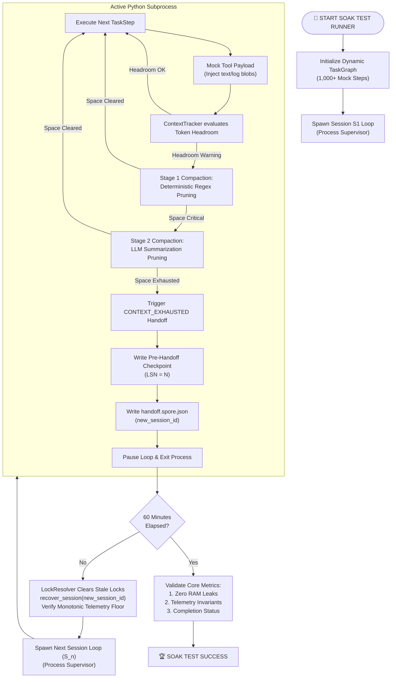

# JIRA-007 — 1-Hour Soak Test (`test_soak_1hr.py`)

**Epic:** NALA-001 — Long-Running Survival Foundation
**Priority:** P0 — Critical Path
**Estimate:** 3 days
**Depends On:** JIRA-001 ✅ · JIRA-002 ✅ · JIRA-003 ✅ · JIRA-004 ✅ · JIRA-005 ✅ · JIRA-006 ✅
**Blocks:** Phase 2 Development
**Version:** 1.0.0 — Soak Test Blueprint & Simulation Design

> Provide NALA with a production-grade 1-hour sustained soak test environment to prove the long-running stability of the run-loop, memory management, lock resolution, and process recovery engines. Under continuous token pressure, NALA must survive multiple compaction and handoff-to-recovery cycles (S1 -> S2 -> S3 -> S4) without deadlocking, leaking memory, or experiencing telemetry drift.

---

## 1. Architectural Blueprint

The soak test is structured as a self-contained supervisor-executor simulation running for exactly 60 minutes.

### 1.1 Process Lifecycle Diagram

---

## 2. JIRA Acceptance Criteria (AC)

The JIRA-007 ticket is **complete** when the soak test suite validates all of the following:

| ID | Acceptance Criteria | Target Metrics | Verification Method |
| :--- | :--- | :--- | :--- |
| **AC-1** | **Continuous Execution** | Run duration: $\ge 60$ minutes | Subprocess watchdog clock |
| **AC-2** | **Scale Stability** | Task Graph capacity: $\ge 1,000$ steps | Validate graph initialization |
| **AC-3** | **Compaction Coverage** | Compactions triggered: $\ge 5$ times | Verify telemetry matrix logs |
| **AC-4** | **Handoff Continuity** | Session progression: $S_1 \rightarrow S_2 \rightarrow S_3 \rightarrow S_4$ | Track `new_session_id` chain |
| **AC-5** | **Memory Footprint** | Peak Memory variance: $\le 10\%$ (Flatline) | `peak_memory_mb` check (no OOM) |
| **AC-6** | **Telemetry Integrity** | Telemetry accumulator drift: $0.00$ | StateMatrix invariant match |
| **AC-7** | **Lock safety** | Stale locks resolved on crash: $100\%$ | LockResolver unlink validation |

---

## 3. Detailed Execution Phases & Timing

The 60-minute execution timeline divides into specific workload phases:

### Phase 1: Normal Operation (Minutes 0 - 10)
* **Goal:** Verify standard step dispatching and base telemetry logging.
* **Workload:** High-throughput mock steps dispatch every 0.5s.
* **Telemetry:** StateMatrix updates tokens, USD cost, and memory usage.

### Phase 2: Compaction Escalation (Minutes 10 - 20)
* **Goal:** Verify Stage 1 and Stage 2 compactions under rising context pressure.
* **Workload:** Mock steps return progressively larger data payloads (up to 4,000 tokens).
* **Compaction:** Tracker triggers Regex pruning, then falls back to Step crystallization summaries.

### Phase 3: Exhaustion & Handoff (Minutes 20 - 45)
* **Goal:** Validate S1 termination, spore write, and S2 process recovery.
* **Workload:** Payload sizes exceed the maximum threshold, exhausting the compactor.
* **Cycle:** Loop pauses $\rightarrow$ pre-handoff checkpoint written $\rightarrow$ `handoff.spore.json` saved $\rightarrow$ S1 subprocess terminated $\rightarrow$ S2 subprocess bootstrapped.

### Phase 4: Final Resumption (Minutes 45 - 60)
* **Goal:** Validate S3/S4 continuity and completion of the remaining task steps.
* **Workload:** Remaining task steps finish execution.
* **End State:** Loop status transitions to `COMPLETED` and the final verification report is logged.

---

## 4. Crucial Verification Invariants

During the final validation stage, the supervisor process asserts the following mathematical invariants:

1. **StateMatrix Invariant (Anti-Drift):**
   $$\text{StateMatrix.total\_tokens} \ge \sum_{s \in \text{SUCCESS\_STEPS}} s.\text{tokens\_consumed}$$
   (Guarantees that telemetry accumulators are never lower than the mathematical sum of all step outputs across all handoff cycles).

2. **Lock Liveness Invariant:**
   $$\text{Count}(.lock\text{ files on disk}) = 0 \text{ (after normal termination)}$$
   (Guarantees that the active locks are properly cleaned up upon final loop completion).

3. **Memory Stability Invariant:**
   $$\text{RAM}_{\text{minute 60}} - \text{RAM}_{\text{minute 10}} \le 0.10 \times \text{RAM}_{\text{minute 10}}$$
   (Verifies flatline memory profile and flags any potential RAM accumulation/leaks).

---

## 5. Implementation Task List

- [ ] **Step 1:** Create `tests/long_running/test_soak_1hr.py` test harness skeleton.
- [ ] **Step 2:** Implement dynamic `TaskGraph` step generator generating 1,000+ dependent nodes.
- [ ] **Step 3:** Implement mock step executor injecting simulated logs and heavy token payloads.
- [ ] **Step 4:** Build the subprocess supervisor that manages process restarts, recovery, and watchdog timing.
- [ ] **Step 5:** Write assertions tracking memory spikes, lock directories, and telemetry counts.
- [ ] **Step 6:** Run the test harness and output the comprehensive execution report.

---
**Jai Bajrang Bali 🙏**
