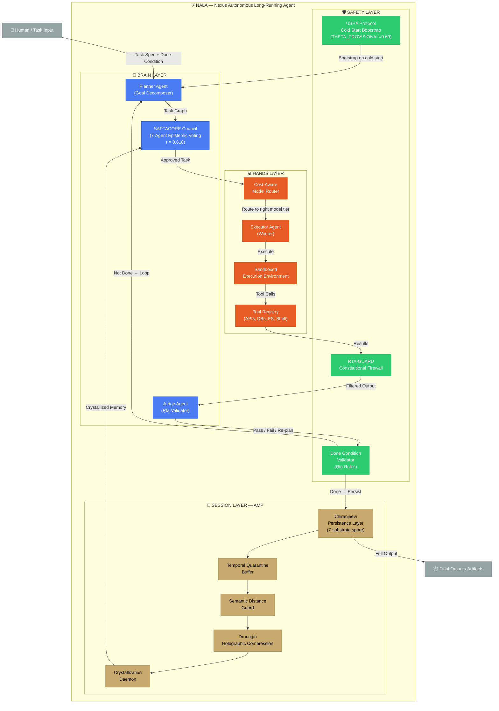
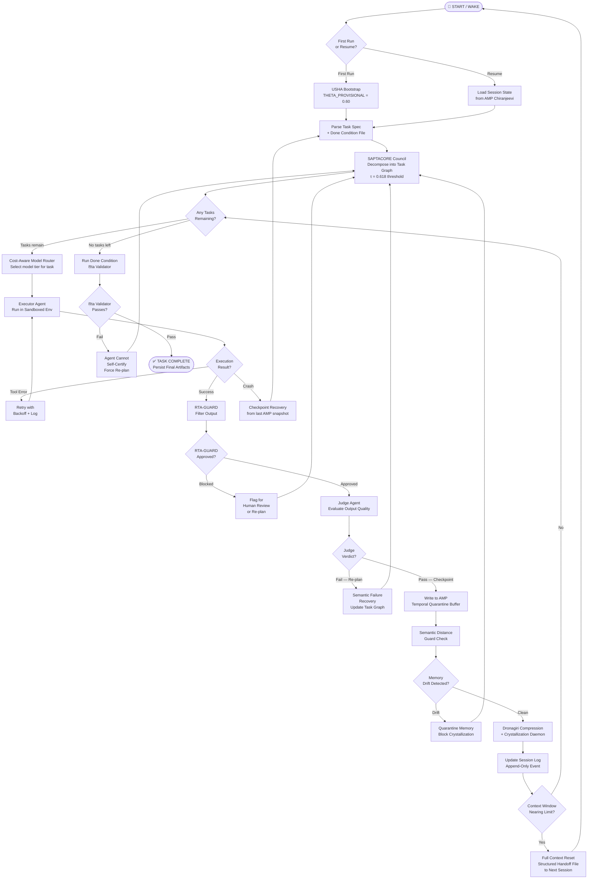
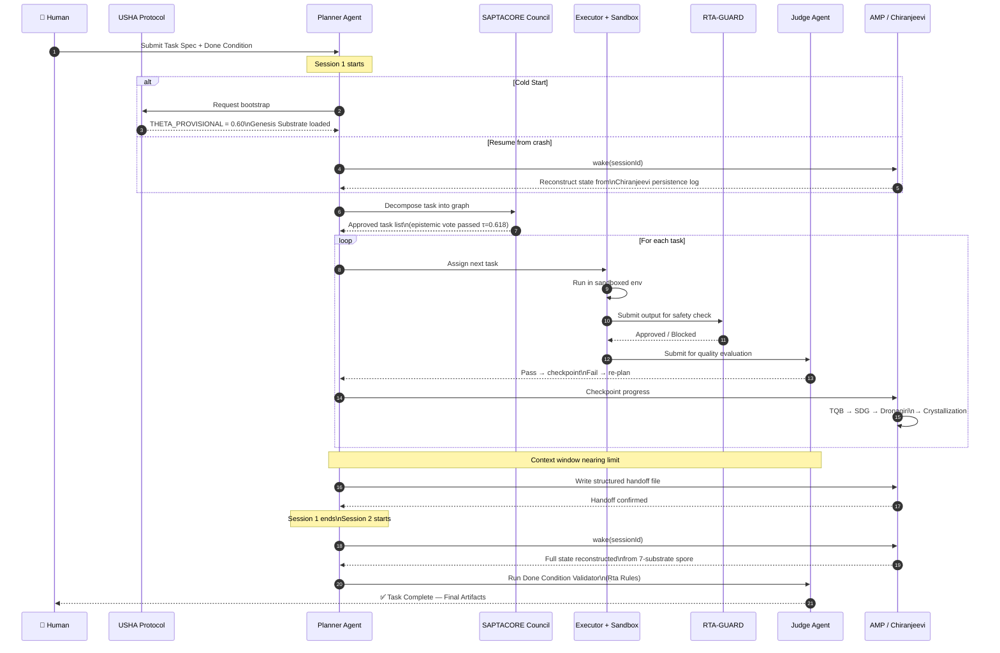
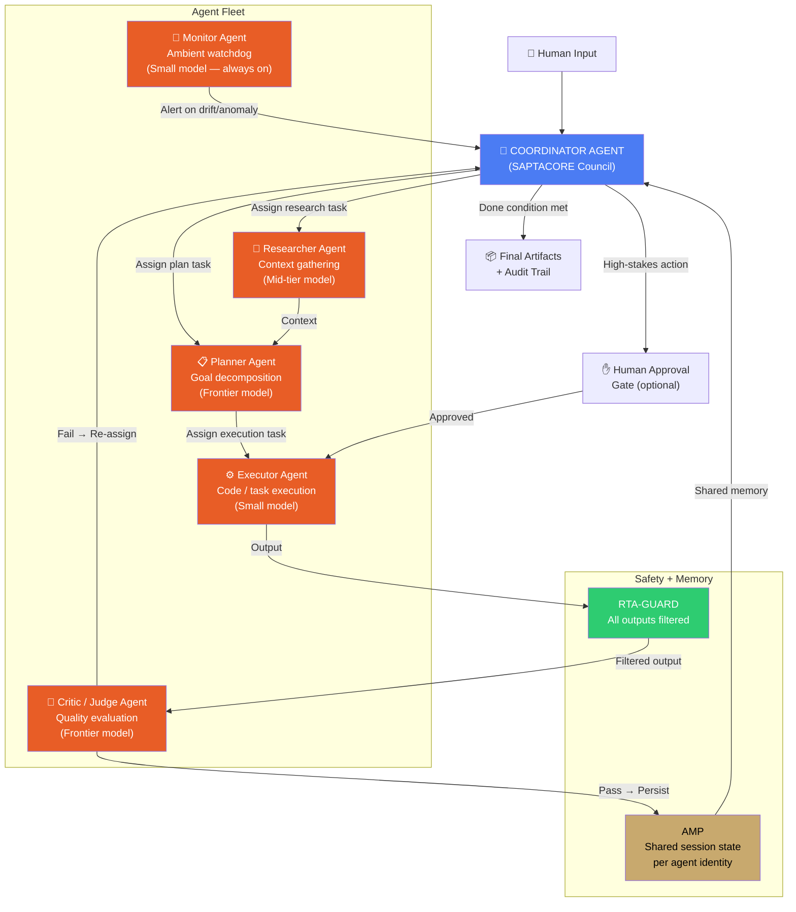
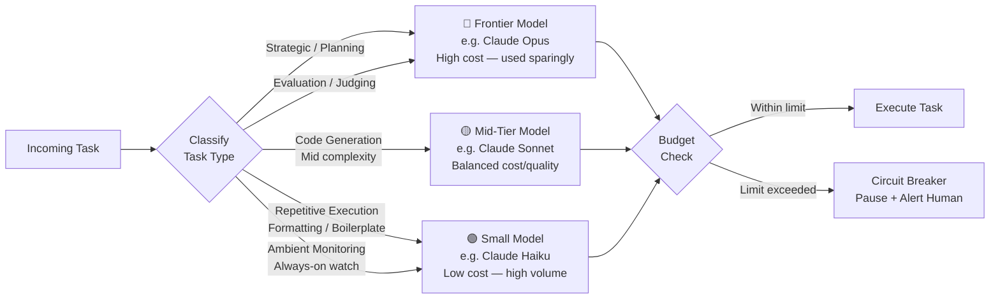
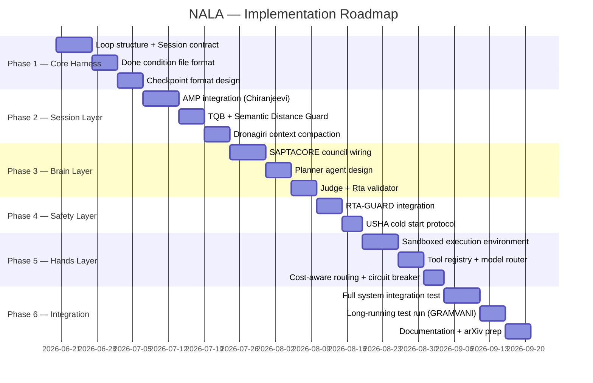

# NALA — Nexus Autonomous Long-Running Agent
## Advanced Architecture Plan & Design Blueprint
**Nexus Lab AI Research Lab | Bengaluru, India**
**Version 1.0 | June 2026**

---

## 📌 Executive Summary

NALA (Nexus Autonomous Long-Running Agent) is the long-running agent harness at the core of Nexus Lab's agentic infrastructure. It goes beyond what Google, Anthropic, and Cursor have published — by integrating the **ANJANEYA Memory Protocol (AMP)** for persistence, **SAPTACORE's 7-agent council** for self-verification, and **RTA-GUARD's constitutional firewall** for safety-gated done conditions. NALA is designed to operate across hours, days, or weeks — across multiple context windows, sandboxes, and sessions — without losing fidelity, alignment, or traceability.

---

## 🎯 Core Design Goals

| Goal | What It Means |
|---|---|
| **Infinite Horizon** | Run for days/weeks without context degradation |
| **Zero Session Loss** | Any crash is fully recoverable from AMP state |
| **Constitutional Done Condition** | Agent cannot self-certify completion — must pass Ṛta validator |
| **Semantic Failure Recovery** | Detects wrong-output, not just crash-recovery |
| **Cost-Aware Routing** | Small models for workers, frontier models only for planners/judges |
| **Memory Governance** | Prevents memory drift via Temporal Quarantine Buffer |

---

## 🏗️ High-Level Architecture

---

## 🔄 Main NALA Agent Loop

---

## 💾 Session Lifecycle — From Cold Start to Completion

---

## 🧠 AMP Memory Architecture in Long-Running Context

```mermaid
graph LR
    classDef input fill:#4B7CF3,color:#fff
    classDef process fill:#E85D26,color:#fff
    classDef store fill:#C8A96E,color:#000
    classDef guard fill:#2ecc71,color:#fff

    RAW["Raw Agent\nObservations"]:::input
    EVENTS["Append-Only\nEvent Log"]:::input

    subgraph TQB_ZONE["🔒 Temporal Quarantine Buffer"]
        TQB["New memories held\nfor N turns before\ncrystallization"]:::guard
    end

    subgraph SDG_ZONE["🔍 Semantic Distance Guard"]
        SDG["Distance check vs\nexisting crystallized\nmemories\nBlock if drift > threshold"]:::guard
    end

    subgraph CRYSTAL_ZONE["💎 Crystallization Daemon"]
        CRYSTAL["Provenance-gated\ncrystallization\nTHETA_CRYSTAL = 0.85"]:::process
    end

    subgraph CHIRANJEEVI["♾️ Chiranjeevi Persistence Layer"]
        PARAM["Param Hash\n+ Erasure Code"]:::store
        SPORE["7-Substrate\nSpore Distribution"]:::store
        COMPRESS["Dronagiri Holographic\nCompression\n(zero-null retrieval)"]:::store
    end

    subgraph RETRIEVAL["🔎 Sankat Mochan Retrieval"]
        PROACTIVE["Proactive distress\ndetection during\ntoken generation"]:::guard
        SEARCH["Context-aware\nmemory search"]:::process
    end

    ANIMA_MAHIMA["Anima-Mahima\nAdaptive Scaling\n(dual-threshold routing)"]:::process

    RAW --> TQB_ZONE
    EVENTS --> TQB_ZONE
    TQB_ZONE --> SDG_ZONE
    SDG_ZONE -->|"Clean"| CRYSTAL_ZONE
    SDG_ZONE -->|"Drift detected"| TQB_ZONE
    CRYSTAL_ZONE --> CHIRANJEEVI
    CHIRANJEEVI --> RETRIEVAL
    RETRIEVAL --> ANIMA_MAHIMA
    ANIMA_MAHIMA -->|"Retrieved context"| RAW
```

---

## 🤖 Multi-Agent Fleet Orchestration

---

## 🗺️ Cost-Aware Model Routing Strategy

---

## 📅 Implementation Phases

---

## 🛠️ Technology Stack

| Layer | Component | Technology |
|---|---|---|
| **Brain** | Planner + Judge | Rust / Python |
| **Brain** | SAPTACORE Council | Rust (Sutratman bus) |
| **Hands** | Executor + Sandbox | Docker + Wasmtime |
| **Hands** | Tool Registry | Rust/Axum REST |
| **Session** | AMP Chiranjeevi | Rust (erasure coding) |
| **Session** | Event Log | Append-only flat file + SQLite |
| **Safety** | RTA-GUARD | Rust (existing 70k lines) |
| **Safety** | USHA Bootstrap | Rust |
| **Routing** | Cost-Aware Router | Python |
| **Infra** | Deployment | Docker Compose → Cloud Run |
| **Observability** | Logs + Traces | OpenTelemetry |

---

## ⚡ How NALA Beats the Article

| What Article Says | What NALA Does Better |
|---|---|
| Append-only event log | **AMP Chiranjeevi** — 7-substrate spore + erasure coding. Survives infra death. |
| "Summarize to compress context" | **Dronagiri Holographic Compression** — zero-null retrieval guarantee |
| Single judge agent | **SAPTACORE 7-agent council** — weighted epistemic voting τ=0.618 |
| Memory drift warning | **Temporal Quarantine Buffer + SDG** — actively quarantines drifting memory |
| Basic security mention | **RTA-GUARD** — 70,000+ lines, quantum-resistant crypto, constitutional rules |
| Cold start from log | **USHA Protocol** — THETA_PROVISIONAL bootstrap, compression suppression until first provisional cluster |
| Static done condition file | **Ṛta Validator** — living constitutional done condition, agent cannot self-certify |
| Cost mentioned as unsolved | **Cost-Aware Model Router + Circuit Breaker** — built-in, first-class |

---

## 🔑 Three Golden Rules of NALA

> **Rule 1 — State lives outside the model.**
> The agent is amnesiac. AMP is not. Every session starts from AMP, not from the model's memory.

> **Rule 2 — The agent cannot grade its own work.**
> SAPTACORE council + Ṛta Validator are structurally separate from the generator. No self-certification ever.

> **Rule 3 — Memory is infrastructure, not an afterthought.**
> Memory drift is an active threat. TQB + SDG govern memory like microservices, with identity, versioning, and quarantine.

---

*Built at Nexus Lab AI Research Lab, Bengaluru*
*Jai Bajrang Bali 🙏*
