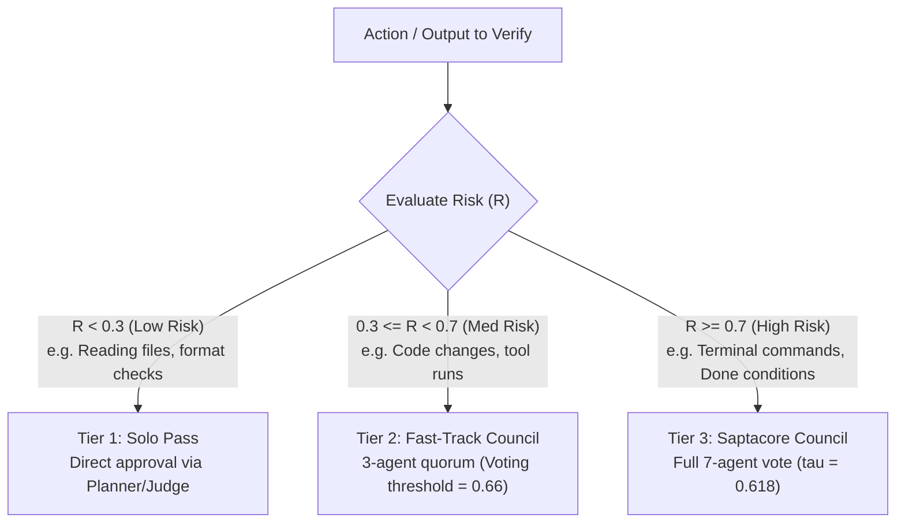
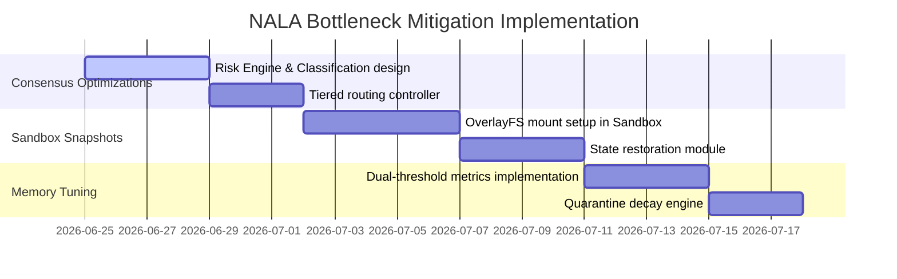

# NALA — Bottleneck Mitigation Plan
## Architectural Optimization & Feasibility Design
**Nexus Lab AI Research Lab | Bengaluru, India**
**Version 1.0 | June 2026**

---

## 📌 Executive Summary

This document proposes architectural solutions and design mitigations for the three critical bottlenecks identified in the core NALA specification:
1. **Consensus Latency & Token Overhead** (Saptacore 7-agent council)
2. **Container State Reconstruction Complexity** (AMP/Chiranjeevi crash recovery)
3. **Semantic Distance Guard (SDG) Sensitivity Tuning** (Memory drift protection)

---

## ⚡ Bottleneck 1: Consensus Latency & Token Overhead

### Proposed Mitigation: Risk-Based Tiered Escalation (Dynamic Consensus)

Instead of routing *every* task graph update and executor output through the full 7-agent Saptacore council, we introduce a **Risk-Based Tiered Escalation (RBTE)** protocol. The Planner Agent computes a **Risk Multiplier ($\mathcal{R}$)** for each operation, routing it to one of three consensus tiers:



### Technical Implementation

1. **Risk Scoring Engine (`core/brain/risk_engine.py`):**
   * Computes risk dynamically based on:
     * **Tool dangerousness:** `shell_tool` = 1.0, `file_tool` (read) = 0.1, `db_tool` (write) = 0.6.
     * **State mutation depth:** Number of files/rows modified.
     * **Task criticality:** Distance to the main done-condition node.

2. **Consensus Configurations (`config/model_routing.yaml`):**
   ```yaml
   consensus_tiers:
     tier_1_solo:
       agent_count: 1
       models: ["claude-3-haiku"]
     tier_2_fast:
       agent_count: 3
       models: ["claude-3-haiku", "claude-3-haiku", "claude-3-5-sonnet"]
       threshold: 0.66
     tier_3_saptacore:
       agent_count: 7
       models: ["claude-3-5-sonnet", "gpt-4o", "claude-3-opus", "gemini-1-5-pro"]
       threshold: 0.618
   ```

---

## 💾 Bottleneck 2: Container State Reconstruction Complexity

### Proposed Mitigation: OverlayFS Snapshotting & Transaction Log Sync

To recover the execution sandbox state exactly as it was at the last memory checkpoint, NALA will pair the AMP event log with a container snapshotting daemon that captures filesystem and database transactions.

```
       Chiranjeevi Log Sequence Number (LSN)
                     │
                     ▼
    [Checkpointed Memory]  ◄───►  [OverlayFS Copy-on-Write Layer]
                     │                     │
                     ▼                     ▼
             AMP SQLite DB           Docker Tarball / Commit
```

### Technical Implementation

1. **OverlayFS Copy-on-Write Mount (`core/hands/sandbox.py`):**
   * The sandbox container workspace is mounted on an OverlayFS mount.
   * Every time a checkpoint is triggered, the system commits only the diff (upperdir) of the filesystem, tagging it with the **Chiranjeevi Log Sequence Number (LSN)**.

2. **Transactional Database Write-Ahead Log (WAL):**
   * Any sandbox databases run in SQLite WAL mode. 
   * When checkpointing, `sqlite3_backup` copies the DB state to the checkpoint directory.

3. **Reconstruction Strategy (`core/session/recovery.py`):**
   ```python
   def reconstruct_state(lsn: int):
       # 1. Roll back memory log to LSN
       amp_client.rollback_to_lsn(lsn)
       # 2. Reset Docker container filesystem to the OverlayFS diff matching the LSN
       sandbox.restore_fs_snapshot(lsn)
       # 3. Restore database file backup matching the LSN
       sandbox.restore_db_snapshot(lsn)
   ```

---

## 🔍 Bottleneck 3: Tuning the Semantic Distance Guard (SDG)

### Proposed Mitigation: Dual-Threshold Memory Clustering & Decay

To solve the "Goldilocks" memory filtering issue, we implement a **Dual-Threshold Guard** combining semantic embedding proximity with metadata classification, alongside a **temporal decay** mechanism.

```
               [ Incoming Agent Observation ]
                             │
                             ▼
              [ Semantic Distance Guard (SDG) ]
                             │
            ┌────────────────┴────────────────┐
            ▼                                 ▼
   Cosine Proximity                  Structural Relevance
   - Is it topically similar?        - Does it relate to the task graph?
            │                                 │
            └────────────────┬────────────────┘
                             ▼
                    [ Combined Score ]
                             │
            ┌────────────────┼────────────────┐
            ▼ (Score > 0.85) ▼ (0.60 - 0.85)  ▼ (Score < 0.60)
     [ Crystallize ]    [ Quarantine ]    [ Discard ]
                             │
                             ▼
                   [ Decay Over N Steps ]
                   (Block or crystal if proven)
```

### Technical Implementation

1. **Dual Metric Calculation (`memory/sdg.py`):**
   * **Semantic Score ($\mathcal{S}_{sem}$):** Cosine similarity between the new observation vector and the centroids of currently crystallized memory clusters.
   * **Task-Graph Score ($\mathcal{S}_{task}$):** Matches keywords/symbols inside the observation against the current active task nodes.
   * **Combined Score:** $\mathcal{S}_{combined} = 0.7 \cdot \mathcal{S}_{sem} + 0.3 \cdot \mathcal{S}_{task}$

2. **Quarantine Retention and Decay (`memory/tqb.py`):**
   * Observations scoring in the gray zone ($0.60 \leq \mathcal{S}_{combined} < 0.85$) are quarantined in the TQB.
   * Quarantined items are held for $N$ (default = 5) execution turns. 
   * If a subsequent successful action references the quarantined observation, it gets upgraded and crystallized. If $N$ turns pass without reference, it decays and is permanently discarded.

---

## 📅 Implementation Schedule for Mitigations



---

*Built at Nexus Lab AI Research Lab, Bengaluru*
*Jai Bajrang Bali 🙏*
