# 01. NALA Server Execution & Lifecycle Evidence Report

**Target Location**: `E:\NALA-Project\NALA\docs\Nexus_LAB_AI\01_NALA_Server_Execution_And_Lifecycle_Evidence.md`  
**Authoritative Source File**: [`nala_server.py`](file:///e:/NALA-Project/NALA/nala_server.py) (78.4 KB, 1890 lines)  
**System Scope**: Complete technical evidence of request ingestion, intent classification, session birth, thread loop execution, interactive approval gates, sandbox execution, telemetry pumping, result aggregation, and crash recovery.

---

## Executive Summary & System Trajectory

In NALA's backend architecture (`nala_server.py`), execution flows through a **7-phase pipeline** spanning Socket.IO transport, intent classification, background worker thread orchestration, cognitive safety validation, Windows Job Object sandbox execution, async event queue pumping, and disk checkpoint persistence.

```mermaid
sequenceDiagram
    autonumber
    actor User as React UI (Browser)
    participant SIO as Socket.IO Server (nala_server.py)
    participant Classifier as classify_intent()
    participant State as ServerState & active_sessions
    participant Engine as process_nala_session()
    participant LoopThread as NalaLoop Worker Thread
    participant Cognitive as Pramāṇa / Viveka / Satya / Ṛta
    participant Sandbox as Windows Job Object Sandbox
    participant EventQueue as server_state.event_queue

    User->>SIO: emit('submit_prompt', {prompt, mode}) [L838]
    SIO->>Classifier: classify_intent(prompt, force_mode) [L854]
    
    alt Intent == "chat"
        Classifier-->>SIO: Chat Intent
        SIO->>State: active_sessions[session_id] = {status: 'chat'} [L868]
        SIO->>User: emit('session_created', mode='chat') [L883]
        SIO->>SIO: asyncio.create_task(handle_chat_message) [L890]
        SIO-->>User: stream ai_response -> session_complete [L936]
    else Intent == "task"
        Classifier-->>SIO: Task Intent
        SIO->>State: server_state.create_session(prompt) [L894]
        State-->>SIO: session_id created + CheckpointManager initialized
        SIO->>User: emit('session_created', mode='task') [L909]
        SIO->>Engine: asyncio.create_task(process_nala_session(session_id)) [L907]
        
        rect rgb(20, 25, 35)
            note over Engine,Sandbox: Background Worker Thread Loop
            Engine->>Cognitive: Subscribe rta_callback & initialize Viveka/Satya [L1062]
            Engine->>LoopThread: threading.Thread(target=run_loop) [L1457]
            
            loop For Each TaskStep (initial_planning -> execution_phase -> reflection_synthesis)
                opt Mode == INTERACTIVE
                    LoopThread->>EventQueue: put('approval_request') [L1124]
                    EventQueue->>User: emit('approval_request') [L1482]
                    User->>SIO: emit('submit_approval', {req_id, approved: true}) [L816]
                    SIO->>LoopThread: approval_events[req_id].set() (Unblocks Thread) [L827]
                end

                LoopThread->>EventQueue: put('step_start') [L1156]
                LoopThread->>Cognitive: Validate state (Pramāṇa / Viveka / Satya) [L1166]
                
                opt Step == execution_phase
                    LoopThread->>Sandbox: execute_in_sandbox("medium", run_tool_logic) [L1254]
                    Sandbox-->>LoopThread: Return tool execution payload
                end
                
                LoopThread->>State: checkpoint_manager.write_checkpoint() [L1412]
                LoopThread->>EventQueue: put('step_complete') [L1327]
            end
        end

        EventQueue->>SIO: stream_events_to_client(session_id, sid) [L1470]
        SIO-->>User: emit('step_update', 'ai_response', 'session_complete') [L1482]
    end
```

---

## Detailed Phase-by-Phase Technical & Line-by-Line Evidence

### Phase 1: Ingestion & Birth (Request → Intent → Session Creation)

1. **Socket.IO Event Entry Point**:
   * Handler: `@sio.event async def submit_prompt(sid, data)` at [`nala_server.py:L838-L916`](file:///e:/NALA-Project/NALA/nala_server.py#L838-L916).
   * Extracts user prompt string and optional operational mode override (`force_mode`).

2. **Intent Classification**:
   * Invokes `classification = classify_intent(prompt, force_mode=force_mode)` at [`nala_server.py:L854`](file:///e:/NALA-Project/NALA/nala_server.py#L854).
   * Returns a `ClassificationResult` containing `intent` (`"chat"` or `"task"`), `confidence` (float score), `tier` (`direct_match`, `pattern_match`, `keyword_match`, or `fallback`), and `reason`.

3. **Branch A — Conversational Chat Path (`intent == "chat"`)**:
   * Generates a session UUID: `session_id = str(uuid.uuid4())` at [`nala_server.py:L867`](file:///e:/NALA-Project/NALA/nala_server.py#L867).
   * Populates `server_state.active_sessions[session_id]` with `'status': 'chat'` and `'message_type': 'chat'` at [`nala_server.py:L868-L881`](file:///e:/NALA-Project/NALA/nala_server.py#L868-L881).
   * Emits `session_created` event to room `sid` at [`nala_server.py:L883`](file:///e:/NALA-Project/NALA/nala_server.py#L883).
   * Spawns `asyncio.create_task(handle_chat_message(sid, session_id, prompt))` at [`nala_server.py:L890`](file:///e:/NALA-Project/NALA/nala_server.py#L890).
   * **Execution Characteristics**: Bypasses `NalaLoop`, `Planner`, `SandboxManager`, and `CheckpointManager`. Checks instant canned replies (`canned_chat_reply()`), selects fast local model (`select_ollama_model()`), streams tokens, and completes.

4. **Branch B — Autonomous Task Path (`intent == "task"`)**:
   * Calls `session_id = server_state.create_session(prompt)` at [`nala_server.py:L894`](file:///e:/NALA-Project/NALA/nala_server.py#L894).
   * Initializes session record in `server_state.active_sessions[session_id]`:
     * `'message_type': 'task'`
     * `'status': 'created'`
     * `'mode': OperationMode.INTERACTIVE` if `force_mode in ('interactive', 'plan')` else `OperationMode.AUTONOMOUS` at [`nala_server.py:L904`](file:///e:/NALA-Project/NALA/nala_server.py#L904).
     * `'checkpoint_manager': CheckpointManager(session_id)`.
   * Emits `session_created` event to room `sid` at [`nala_server.py:L909`](file:///e:/NALA-Project/NALA/nala_server.py#L909).
   * Spawns background worker task `asyncio.create_task(process_nala_session(session_id, sid))` at [`nala_server.py:L907`](file:///e:/NALA-Project/NALA/nala_server.py#L907).

---

### Phase 2: Session Initialization & Cognitive Safety Subscriptions

Inside `process_nala_session(session_id: str, client_sid: str, recover: bool = False)` at [`nala_server.py:L1034-L1468`](file:///e:/NALA-Project/NALA/nala_server.py#L1034-L1468):

1. **Session Status Mutation**:
   * Mutates `session_data['status'] = 'running'` at [`nala_server.py:L1045`](file:///e:/NALA-Project/NALA/nala_server.py#L1045).
2. **Cognitive Component Instantiation**:
   * Instantiates reasoning core components at [`nala_server.py:L1049-L1055`](file:///e:/NALA-Project/NALA/nala_server.py#L1049-L1055): `Planner()`, `SaptacoreCouncil()`, `Judge()`, `RTAValidator()`, `RTAGuard()`, `Usha()`, `CircuitBreaker()`.
3. **Safety Layer Integration & Real-Time Telemetry Subscription**:
   * Retrieves default safety loop: `loop = get_default_rta_loop()` at [`nala_server.py:L1062`](file:///e:/NALA-Project/NALA/nala_server.py#L1062).
   * Obtains `viveka_gate = _LayerHolder.viveka()` and `satya_layer = _LayerHolder.satya()`.
   * Subscribes `rta_callback(score, comps)` at [`nala_server.py:L1070-L1092`](file:///e:/NALA-Project/NALA/nala_server.py#L1070-L1092), streaming live `Viveka` strictness, `Satya` truthfulness, and `Ṛta` coherence scores directly to `server_state.update_safety_metrics()` and `server_state.update_rita_score()`.

---

### Phase 3: Worker Thread Spawning & `NalaLoop` Execution

1. **Construction (Fresh vs. ARIES Checkpoint Recovery)**:
   * **Recovery Path (`recover == True`)**: Invokes `nala_loop = recover_session(...)` at [`nala_server.py:L1396`](file:///e:/NALA-Project/NALA/nala_server.py#L1396), restoring session topology and step history from disk.
   * **Fresh Path (`recover == False`)**: Instantiates `nala_loop = NalaLoop(session=session_state, checkpoint_manager=checkpoint_manager, context_tracker=tracker, compactor=compactor, hooks=loop_hooks)` at [`nala_server.py:L1414-L1420`](file:///e:/NALA-Project/NALA/nala_server.py#L1414-L1420).
   * Registers step handler: `nala_loop.set_default_handler(custom_step_handler)` at [`nala_server.py:L1421`](file:///e:/NALA-Project/NALA/nala_server.py#L1421).
2. **Non-Blocking Thread Spawning**:
   * Defines worker function `def run_loop()` at [`nala_server.py:L1426-L1454`](file:///e:/NALA-Project/NALA/nala_server.py#L1426-L1454).
   * Spawns thread: `loop_thread = threading.Thread(target=run_loop, daemon=True)` and starts execution at [`nala_server.py:L1457-L1458`](file:///e:/NALA-Project/NALA/nala_server.py#L1457-L1458).

---

### Phase 4: Step Execution & Interactive Approval Gates (`custom_step_handler`)

Inside `custom_step_handler(step: TaskStep, session_state: SessionState)` at [`nala_server.py:L1095-L1356`](file:///e:/NALA-Project/NALA/nala_server.py#L1095-L1356):

1. **Interactive Human Approval Gate**:
   * Evaluates `needs_approval = (current_mode == OperationMode.INTERACTIVE)` at [`nala_server.py:L1105`](file:///e:/NALA-Project/NALA/nala_server.py#L1105).
   * Generates `req_id = str(uuid.uuid4())` and instantiates `event = threading.Event()` at [`nala_server.py:L1112-L1113`](file:///e:/NALA-Project/NALA/nala_server.py#L1112-L1113).
   * Registers gate: `server_state.approval_events[req_id] = event`.
   * Enqueues `approval_request` payload into `server_state.event_queue` at [`nala_server.py:L1124`](file:///e:/NALA-Project/NALA/nala_server.py#L1124).
   * Calls `event.wait()` at [`nala_server.py:L1127`](file:///e:/NALA-Project/NALA/nala_server.py#L1127) — **Pauses the worker thread synchronously** until user responds on React UI.
   * **User Response Handler**: `@sio.event async def submit_approval(sid, data)` at [`nala_server.py:L815-L832`](file:///e:/NALA-Project/NALA/nala_server.py#L815-L832) sets `server_state.approval_results[req_id]` and invokes `server_state.approval_events[req_id].set()`, resuming the worker thread.

2. **Step Start Notification**:
   * Mutates step status: `step.status = TaskStatus.RUNNING` and `step.started_at = datetime.now(timezone.utc)` at [`nala_server.py:L1142-L1143`](file:///e:/NALA-Project/NALA/nala_server.py#L1142-L1143).
   * Enqueues `step_start` payload with curated thought titles into `server_state.event_queue` at [`nala_server.py:L1156`](file:///e:/NALA-Project/NALA/nala_server.py#L1156).

3. **Step Dispatch & Cognitive Execution**:
   * **Step 1 (`initial_planning`)**: Creates plan via `planner.create_plan()`, validates truthfulness via `satya_layer`, forces RTA evaluation (`loop.force_evaluation()`), and updates `Pramāṇa` cognitive state (`Pratibha`, `Anumana`, `Buddhi`) at [`nala_server.py:L1161-L1190`](file:///e:/NALA-Project/NALA/nala_server.py#L1161-L1190).
   * **Step 2 (`execution_phase`)**: Validates transition safety via `viveka_gate`, executes tools inside Windows Job Object sandbox via `execute_in_sandbox("medium", run_tool_logic)` at [`nala_server.py:L1254`](file:///e:/NALA-Project/NALA/nala_server.py#L1254).
   * **Step 3 (`reflection_synthesis`)**: Synthesizes output via `synthesize_results()`, validates reflection via `satya_layer`, and updates telemetry.

4. **Step Completion & Telemetry**:
   * Mutates step status: `step.status = TaskStatus.SUCCESS`, attaches `step.result`, and records `step.completed_at` at [`nala_server.py:L1301-L1303`](file:///e:/NALA-Project/NALA/nala_server.py#L1301-L1303).
   * Enqueues `step_complete` event into `server_state.event_queue` at [`nala_server.py:L1327`](file:///e:/NALA-Project/NALA/nala_server.py#L1327).

---

### Phase 5: Event Queue Pumping & Telemetry Streaming

1. **Queue Dequeue Loop**:
   * Handler: `async def stream_events_to_client(session_id: str, client_sid: str)` at [`nala_server.py:L1470-L1518`](file:///e:/NALA-Project/NALA/nala_server.py#L1470-L1518).
   * Non-blocking dequeue: `event_type, event_data, event_session_id = server_state.event_queue.get(timeout=0.1)` at [`nala_server.py:L1478`](file:///e:/NALA-Project/NALA/nala_server.py#L1478).

2. **Socket Emissions**:
   * `step_event` $\rightarrow$ `sio.emit('step_update', event_data, room=client_sid)`
   * `session_complete` $\rightarrow$ `sio.emit('session_complete', event_data, room=client_sid)`
   * Telemetry events $\rightarrow$ `sio.emit(socket_event, event_data, room=client_sid)` (`pramana-update`, `rita-score-update`, `safety-metrics-update`).
   * Heartbeat $\rightarrow$ Sends periodic `heartbeat` event every 5 seconds if queue is empty at [`nala_server.py:L1496`](file:///e:/NALA-Project/NALA/nala_server.py#L1496).

---

### Phase 6: Result Aggregation & Session Completion

1. **Task Loop Completion**:
   * In `run_loop()` at [`nala_server.py:L1428-L1441`](file:///e:/NALA-Project/NALA/nala_server.py#L1428-L1441):
   * Captures loop result status: `status = nala_loop.run()`.
   * Mutates `session_data['status'] = status.value` (`'completed'` or `'error'`).
   * Stores final response string: `session_data['final_ai_response']`.
2. **Terminal Event Emission**:
   * Enqueues `session_complete` event containing `session_id`, `status`, `message_type`, and `ai_response` at [`nala_server.py:L1441`](file:///e:/NALA-Project/NALA/nala_server.py#L1441).
   * `stream_events_to_client()` dequeues event, emits `session_complete` to React UI, and exits streaming loop.

---

### Phase 7: Failure Handling, Security Violations, and Crash Recovery

1. **Sandbox Security Violations**:
   * Catches `SandboxViolationError` in `custom_step_handler` at [`nala_server.py:L1255`](file:///e:/NALA-Project/NALA/nala_server.py#L1255).
   * Immediately drops safety health metrics (`overall_health = 0.1`) and re-raises exception to quarantine execution.
2. **Step Failure & Retries**:
   * Uncaught exceptions trigger `except Exception as e:` at [`nala_server.py:L1335-L1356`](file:///e:/NALA-Project/NALA/nala_server.py#L1335-L1356).
   * Mutates step: `step.status = TaskStatus.FAILED` and records `step.error_message = str(e)`.
   * Enqueues `step_error` payload to notify UI.
3. **ARIES Crash Recovery & Disk Persistence**:
   * Disk checkpoints are written to `sessions/<session_id>/checkpoints/` via `CheckpointManager.write_checkpoint()` at [`nala_server.py:L1412`](file:///e:/NALA-Project/NALA/nala_server.py#L1412).
   * On process restart, setting `recover = True` in `process_nala_session()` invokes `recover_session()` at [`nala_server.py:L1396`](file:///e:/NALA-Project/NALA/nala_server.py#L1396), reconstructing `SessionState`, `TaskGraph`, and context compactor state without re-running completed steps.

---

## Core Data Structures & State Representation Summary

| Lifecycle Phase | State Object / Container | Type | Location |
| :--- | :--- | :--- | :--- |
| **Session Registry** | `server_state.active_sessions` | `Dict[str, Dict[str, Any]]` | `nala_server.py:L210` |
| **Session Document** | `SessionState` | Pydantic `BaseModel` | `core/harness/session_contract.py:L581` |
| **Goal Topology** | `TaskGraph` | Pydantic `BaseModel` | `core/harness/session_contract.py:L219` |
| **Atomic Execution Unit**| `TaskStep` & `TaskStatus` | Pydantic `BaseModel` & `Enum` | `core/harness/session_contract.py:L143` |
| **Approval Lock Gate** | `server_state.approval_events` | `Dict[str, threading.Event]` | `nala_server.py:L1113` |
| **Telemetry Event Queue**| `server_state.event_queue` | `queue.Queue` | `nala_server.py:L230` |
| **Disk Checkpoints** | `sessions/<session_id>/checkpoints/` | JSON Save Files | `core/harness/checkpoint.py:L40` |
